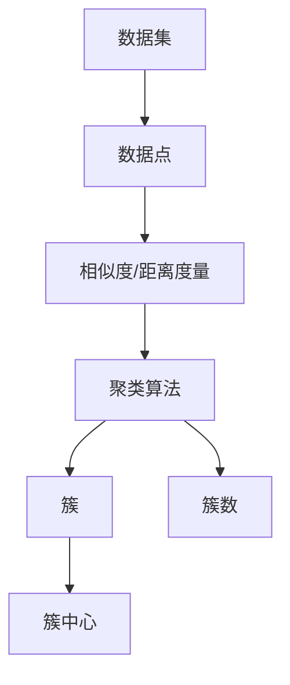

# Mahout聚类算法原理与代码实例讲解

## 1.背景介绍

聚类是一种重要的数据挖掘和机器学习技术,旨在将数据集划分为多个组或簇,使得同一簇内的对象彼此相似,而不同簇之间的对象差异较大。聚类在许多领域都有广泛的应用,如客户细分、社交网络分析、图像分割、异常检测等。

Apache Mahout是一个功能强大、可扩展的机器学习库,提供了多种常用的聚类算法实现。Mahout最初是作为Hadoop的一个子项目开发的,旨在让开发人员能够轻松地在Hadoop集群上运行机器学习任务。随着项目的发展,Mahout已经支持多种分布式后端,如Spark和Flink。

本文将深入探讨Mahout中几种主要的聚类算法的原理,并给出相应的代码实例。通过学习这些算法,读者可以加深对聚类的理解,并能够利用Mahout进行实际的聚类应用开发。

## 2.核心概念与联系

在讨论具体算法之前,我们先来了解一些聚类相关的核心概念:

- 数据点(Data Point):聚类算法处理的基本单元,通常表示为一个特征向量。
- 相似度/距离度量(Similarity/Distance Measure):衡量两个数据点之间相似程度或差异大小的指标,常见的有欧氏距离、余弦相似度等。  
- 簇(Cluster):由相似的数据点组成的集合,簇内相似度高,簇间相似度低。
- 簇中心(Cluster Centroid):代表一个簇的中心点,通常是该簇内所有点的均值向量。
- 簇数(Number of Clusters):聚类算法需要划分的簇的数量,可以预先指定,也可以由算法自动确定。

下图展示了这些概念之间的关系:



## 3.核心算法原理具体操作步骤

### 3.1 K-Means聚类

K-Means是最经典、应用最广泛的聚类算法之一。其基本思想是:首先随机选择K个初始簇中心,然后迭代执行以下两个步骤,直到收敛:

1. 分配步骤:对每个数据点,计算它到各个簇中心的距离,并将其分配到距离最近的簇。
2. 更新步骤:对每个簇,重新计算该簇内所有点的均值向量,并将其更新为新的簇中心。

K-Means的具体操作步骤如下:

1. 确定聚类数K,随机选择K个数据点作为初始簇中心。
2. 重复以下步骤,直到簇中心不再变化或达到最大迭代次数:
   a. 对每个数据点,计算它到各个簇中心的距离(如欧氏距离),并将其分配到距离最近的簇。
   b. 对每个簇,计算该簇内所有点的均值向量,并将其更新为新的簇中心。
3. 输出最终的簇划分结果。

### 3.2 Canopy聚类

Canopy聚类是一种简单、快速的聚类算法,常用于K-Means的预处理步骤,以减少计算复杂度。其基本思想是:使用一个较粗的距离阈值T1和一个较细的距离阈值T2(T1>T2),扫描数据集并构建一组重叠的"帐篷(Canopy)",每个数据点可能属于多个帐篷。然后,选择每个帐篷的中心点作为初始簇中心,再运行K-Means算法。

Canopy聚类的具体操作步骤如下:

1. 设定两个距离阈值T1和T2,其中T1>T2。
2. 随机选择一个数据点作为第一个帐篷的中心。
3. 对每个数据点,计算它到各个帐篷中心的距离:
   a. 如果距离小于T1,将该点加入对应的帐篷。
   b. 如果距离小于T2,从数据集中移除该点。
4. 重复步骤2-3,直到所有点都被移除或分配到帐篷中。
5. 选择每个帐篷的中心点作为初始簇中心,运行K-Means算法进行细化聚类。

### 3.3 Fuzzy K-Means聚类

Fuzzy K-Means(模糊K-Means)是K-Means的一个变种,允许每个数据点以不同的隶属度同时属于多个簇。与传统的硬聚类不同,Fuzzy K-Means进行软聚类,每个点与各个簇之间都有一个隶属度值,表示其属于该簇的程度。

Fuzzy K-Means的具体操作步骤如下:

1. 确定聚类数K和模糊系数m(m>1),随机初始化每个数据点对各个簇的隶属度矩阵U。
2. 重复以下步骤,直到隶属度矩阵U的变化小于给定阈值或达到最大迭代次数:
   a. 根据当前的隶属度矩阵U,计算每个簇的中心向量。
   b. 根据更新后的簇中心,重新计算每个数据点对各个簇的隶属度,更新隶属度矩阵U。
3. 根据最终的隶属度矩阵U,将每个数据点分配到隶属度最高的簇。

## 4.数学模型和公式详细讲解举例说明

### 4.1 K-Means的数学模型

假设我们有一个包含n个数据点的集合 $X=\{x_1,x_2,...,x_n\}$,每个数据点是一个d维特征向量。K-Means的目标是将这n个点划分到K个簇 $C=\{C_1,C_2,...,C_K\}$ 中,使得每个簇内点到簇中心的距离平方和最小。

令 $\mu_k$ 表示第k个簇的中心向量,$r_{nk}$ 表示第n个数据点 $x_n$ 属于第k个簇的指示变量(取值为0或1)。则K-Means的目标函数可以表示为:

$$
J = \sum_{n=1}^N \sum_{k=1}^K r_{nk} ||x_n - \mu_k||^2
$$

其中, $||x_n - \mu_k||$ 表示数据点 $x_n$ 到簇中心 $\mu_k$ 的欧氏距离。K-Means算法通过迭代优化来最小化这个目标函数:

1. 分配步骤:固定簇中心 $\mu_k$,优化指示变量 $r_{nk}$:

$$
r_{nk} = \begin{cases}
1, & \text{if } k = \arg\min_j ||x_n - \mu_j||^2 \\
0, & \text{otherwise}
\end{cases}
$$

2. 更新步骤:固定指示变量 $r_{nk}$,优化簇中心 $\mu_k$:

$$
\mu_k = \frac{\sum_{n=1}^N r_{nk} x_n}{\sum_{n=1}^N r_{nk}}
$$

通过不断重复这两个步骤,K-Means算法收敛到一个局部最优解。

### 4.2 Fuzzy K-Means的数学模型

与K-Means不同,Fuzzy K-Means引入了隶属度概念。令 $u_{nk}$ 表示第n个数据点 $x_n$ 对第k个簇的隶属度,满足以下条件:

$$
\sum_{k=1}^K u_{nk} = 1, \forall n \in \{1,2,...,N\}
$$

$$
0 \leq u_{nk} \leq 1, \forall n \in \{1,2,...,N\}, \forall k \in \{1,2,...,K\}
$$

Fuzzy K-Means的目标函数为:

$$
J_m = \sum_{n=1}^N \sum_{k=1}^K u_{nk}^m ||x_n - \mu_k||^2
$$

其中,m是模糊系数,控制聚类的"软度"。当m趋近于1时,Fuzzy K-Means退化为标准的K-Means。

Fuzzy K-Means通过迭代优化来最小化目标函数:

1. 更新隶属度 $u_{nk}$:

$$
u_{nk} = \frac{1}{\sum_{j=1}^K (\frac{||x_n - \mu_k||}{||x_n - \mu_j||})^{\frac{2}{m-1}}}
$$

2. 更新簇中心 $\mu_k$:

$$
\mu_k = \frac{\sum_{n=1}^N u_{nk}^m x_n}{\sum_{n=1}^N u_{nk}^m}
$$

重复这两个步骤直到收敛或达到最大迭代次数。

## 5.项目实践：代码实例和详细解释说明

下面我们使用Mahout提供的Java API来实现K-Means和Fuzzy K-Means聚类。

### 5.1 K-Means聚类代码实例

```java
import org.apache.mahout.clustering.kmeans.KMeansDriver;
import org.apache.mahout.clustering.kmeans.RandomSeedGenerator;
import org.apache.mahout.common.distance.EuclideanDistanceMeasure;
import org.apache.mahout.math.Vector;

public class KMeansExample {
    public static void main(String[] args) throws Exception {
        // 输入数据路径
        String inputPath = "data/input";
        // 输出路径
        String outputPath = "data/output";
        // 聚类数K
        int numClusters = 3;
        // 最大迭代次数
        int maxIterations = 10;
        
        // 配置K-Means参数
        KMeansDriver.run(
                new Path(inputPath),
                new Path(outputPath),
                new EuclideanDistanceMeasure(),
                numClusters,
                maxIterations,
                true,
                0.01,
                false);
    }
}
```

这个例子中,我们使用了Mahout的`KMeansDriver`类来运行K-Means聚类。主要步骤如下:

1. 指定输入数据路径、输出路径、聚类数K和最大迭代次数。
2. 创建一个`EuclideanDistanceMeasure`对象,表示使用欧氏距离作为距离度量。
3. 调用`KMeansDriver.run()`方法,传入相应的参数,启动K-Means聚类过程。

Mahout会自动读取输入路径下的数据,执行K-Means聚类,并将结果写入输出路径。

### 5.2 Fuzzy K-Means聚类代码实例

```java
import org.apache.mahout.clustering.fuzzykmeans.FuzzyKMeansDriver;
import org.apache.mahout.common.distance.EuclideanDistanceMeasure;
import org.apache.mahout.math.Vector;

public class FuzzyKMeansExample {
    public static void main(String[] args) throws Exception {
        // 输入数据路径
        String inputPath = "data/input";
        // 输出路径 
        String outputPath = "data/output";
        // 聚类数K
        int numClusters = 3;
        // 最大迭代次数
        int maxIterations = 10;
        // 模糊系数m
        float fuzziness = 1.5f;
        
        // 配置Fuzzy K-Means参数
        FuzzyKMeansDriver.run(
                new Path(inputPath),
                new Path(outputPath),
                new EuclideanDistanceMeasure(),
                numClusters,
                fuzziness,
                maxIterations,
                true,
                true,
                0.01,
                false);
    }
}
```

与K-Means类似,我们使用Mahout的`FuzzyKMeansDriver`类来运行Fuzzy K-Means聚类。主要步骤如下:

1. 指定输入数据路径、输出路径、聚类数K、最大迭代次数和模糊系数m。
2. 创建一个`EuclideanDistanceMeasure`对象,表示使用欧氏距离作为距离度量。
3. 调用`FuzzyKMeansDriver.run()`方法,传入相应的参数,启动Fuzzy K-Means聚类过程。

Mahout会读取输入数据,执行Fuzzy K-Means聚类,并将结果写入输出路径。

## 6.实际应用场景

聚类算法在许多领域都有广泛的应用,下面列举几个典型的场景:

1. 客户细分:根据客户的属性(如年龄、收入、购买行为等)对其进行聚类,识别不同的客户群,制定针对性的营销策略。

2. 社交网络分析:对社交网络中的用户进行聚类,发现