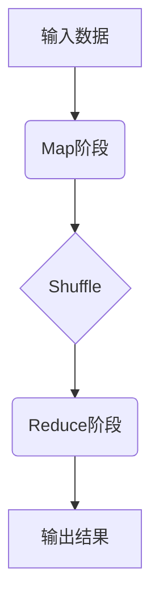

# MapReduce异常处理与故障诊断

## 1.背景介绍

### 1.1 MapReduce简介

MapReduce是一种分布式计算模型,由Google提出,用于在大规模集群上并行处理大数据集。它将计算过程分为两个阶段:Map阶段和Reduce阶段。

在Map阶段,输入数据被分割成多个块,并行地在集群节点上处理。每个Map任务会产生一系列键值对作为中间结果。在Reduce阶段,中间结果会按照键值对的键进行分组,并行地在集群节点上处理,最终生成最终输出结果。

MapReduce模型的优势在于高度的可扩展性和容错性,能够在成千上万台廉价计算机上运行,处理大规模数据集。它已被广泛应用于大数据处理、机器学习、科学计算等领域。

### 1.2 MapReduce故障挑战

尽管MapReduce具有良好的容错能力,但在实际运行过程中,仍然可能会遇到各种异常和故障情况,如:

- 硬件故障(磁盘故障、网络故障等)
- 软件bug
- 数据倾斜
- 资源竞争
- 任务失败和重试

这些异常和故障可能会导致作业执行缓慢、结果不正确或完全失败。因此,有效的异常处理和故障诊断对于确保MapReduce作业的可靠性和高效性至关重要。

## 2.核心概念与联系

### 2.1 MapReduce执行流程

为了更好地理解MapReduce异常处理,我们先来回顾一下MapReduce的执行流程:



1. **输入数据**被切分成多个数据块,并分发到不同的Map任务中进行处理。
2. **Map阶段**并行处理输入数据块,生成键值对作为中间结果。
3. **Shuffle阶段**对Map阶段产生的中间结果进行分组和传输,为Reduce阶段做准备。
4. **Reduce阶段**对Shuffle传输过来的键值对进行合并和处理,生成最终输出结果。

### 2.2 MapReduce容错机制

MapReduce采用了多种容错机制来确保作业的可靠执行:

- **任务重试**:如果某个Map或Reduce任务失败,它会自动重新执行一定次数。
- **数据复制**:输入数据和中间结果会在多个节点上复制,以防止单点故障。
- **工作节点故障转移**:如果某个工作节点发生故障,其任务会自动转移到其他节点上执行。
- **推测执行**:如果某个任务执行缓慢,系统会在其他节点上启动相同任务的备份执行,以加快执行速度。

### 2.3 异常处理和故障诊断的重要性

尽管MapReduce具备上述容错机制,但在实际场景中,仍然可能会遇到各种异常和故障。有效的异常处理和故障诊断对于确保作业的可靠性和高效性至关重要:

- **可靠性**:及时发现和处理异常,避免作业执行失败或结果错误。
- **高效性**:快速诊断和解决故障,减少作业执行时间和资源浪费。
- **可维护性**:提供诊断信息和工具,方便开发人员调试和优化MapReduce应用程序。

因此,我们需要深入了解MapReduce异常处理和故障诊断的原理和最佳实践。

## 3.核心算法原理具体操作步骤

在本节中,我们将介绍MapReduce异常处理和故障诊断的核心算法原理和具体操作步骤。

### 3.1 任务监控和状态跟踪

为了及时发现和处理异常,MapReduce需要对作业执行过程进行全面监控和状态跟踪。主要包括以下步骤:

1. **任务状态跟踪**:跟踪每个Map和Reduce任务的执行状态,包括已完成、运行中、挂起、失败等状态。
2. **进度监控**:监控Map和Reduce任务的执行进度,包括已处理的数据量、剩余数据量等指标。
3. **资源使用情况监控**:监控每个任务所使用的CPU、内存、网络和磁盘等资源。
4. **日志收集**:收集和汇总每个任务的执行日志,用于故障诊断和调试。

这些监控数据会被周期性地上报到MapReduce的主节点(JobTracker或ResourceManager),供异常检测和故障诊断模块使用。

### 3.2 异常检测算法

基于监控数据,MapReduce需要实现高效的异常检测算法,以及时发现潜在的异常情况。常见的异常检测算法包括:

1. **阈值检测**:设置合理的阈值,如任务执行时间、进度、资源使用等,超过阈值则判定为异常。
2. **模式匹配**:通过机器学习等方法,建立正常执行模式,与实际执行情况进行匹配,发现偏离模式的异常情况。
3. **规则引擎**:基于领域知识和历史经验,设计一系列规则,对监控数据进行规则匹配,发现违反规则的异常情况。

这些算法可以单独使用,也可以组合使用,以提高异常检测的准确性和全面性。

### 3.3 故障诊断算法

一旦发现异常情况,MapReduce需要进一步诊断故障原因,以便采取相应的处理措施。常见的故障诊断算法包括:

1. **日志分析**:分析任务执行日志,查找错误信息和异常堆栈,定位故障原因。
2. **数据分析**:分析任务输入数据、中间结果和输出数据,检测数据质量问题或数据倾斜情况。
3. **资源分析**:分析任务所使用的CPU、内存、网络和磁盘等资源,检测资源不足或资源竞争情况。
4. **集群状态分析**:分析集群节点的硬件状态、软件版本、配置参数等,检测潜在的系统级故障。

这些算法通常需要结合领域知识和历史经验,并且可能需要人工介入进行辅助诊断。

### 3.4 异常处理策略

根据异常检测和故障诊断的结果,MapReduce需要采取相应的异常处理策略,以确保作业的可靠执行。常见的异常处理策略包括:

1. **任务重试**:对失败的任务进行重试,直到达到最大重试次数。
2. **数据重分布**:对出现数据倾斜的任务,重新分布输入数据或中间结果,以实现更好的负载均衡。
3. **资源调整**:根据资源使用情况,动态调整任务所分配的资源,避免资源不足或资源浪费。
4. **规避故障节点**:将任务调度到其他健康节点上执行,规避故障节点。
5. **作业终止**:如果异常无法解决,终止当前作业,避免浪费更多资源。

这些策略可以单独使用,也可以组合使用,以提高异常处理的灵活性和有效性。

## 4.数学模型和公式详细讲解举例说明

在MapReduce异常处理和故障诊断中,也涉及一些数学模型和公式,用于量化和优化相关算法。本节将对其进行详细讲解和举例说明。

### 4.1 异常检测阈值计算

异常检测算法中,设置合理的阈值是关键。我们可以基于历史数据,使用统计学方法计算阈值。

假设我们要设置任务执行时间的阈值,记任务执行时间为随机变量$X$,其概率密度函数为$f(x)$,则执行时间的期望值和标准差分别为:

$$\mu = E(X) = \int_{-\infty}^{\infty} x f(x) dx$$

$$\sigma = \sqrt{E[(X-\mu)^2]} = \sqrt{\int_{-\infty}^{\infty} (x-\mu)^2 f(x) dx}$$

根据"三西格玛"原则,我们可以将阈值设置为$\mu + 3\sigma$,这样99.7%的正常执行时间都应该在此阈值之内。

例如,假设任务执行时间服从正态分布$N(100, 20^2)$,则:

$$\mu = 100, \sigma = 20$$
$$\text{阈值} = 100 + 3 \times 20 = 160 \text{(秒)}$$

任何执行时间超过160秒的任务,都可以被判定为异常。

### 4.2 数据倾斜度量

数据倾斜是MapReduce中常见的性能bottleneck,我们需要量化数据倾斜的程度,以便进行优化。

假设有$n$个Reduce任务,第$i$个任务处理的数据量为$d_i$,则数据倾斜度可以定义为:

$$\text{倾斜度} = \sqrt{\frac{1}{n} \sum_{i=1}^{n} \left( \frac{d_i - \overline{d}}{\overline{d}} \right)^2}$$

其中$\overline{d} = \frac{1}{n} \sum_{i=1}^{n} d_i$是平均数据量。

倾斜度越大,说明数据分布越不均匀。当倾斜度为0时,表示数据完全均匀分布。

例如,有4个Reduce任务,处理的数据量分别为100GB、90GB、110GB和100GB,则:

$$\overline{d} = \frac{100 + 90 + 110 + 100}{4} = 100\text{GB}$$
$$\text{倾斜度} = \sqrt{\frac{1}{4} \left[ \left( \frac{100 - 100}{100} \right)^2 + \left( \frac{90 - 100}{100} \right)^2 + \left( \frac{110 - 100}{100} \right)^2 + \left( \frac{100 - 100}{100} \right)^2 \right]} = 0.1$$

这个倾斜度较小,说明数据分布比较均匀。如果倾斜度较大,我们可以考虑优化数据分区策略,以减少数据倾斜。

### 4.3 资源调度优化模型

为了提高资源利用率,我们需要合理调度MapReduce任务所使用的资源。这可以建模为一个优化问题:

假设有$m$个节点,每个节点$i$的可用资源为$r_i$(如CPU、内存等)。有$n$个任务,每个任务$j$的资源需求为$q_j$。我们的目标是最大化资源利用率,同时满足每个任务的资源需求约束。可以构建如下整数线性规划模型:

$$\max \sum_{i=1}^{m} \sum_{j=1}^{n} x_{ij} q_j$$
$$\text{s.t.} \quad \sum_{j=1}^{n} x_{ij} q_j \leq r_i, \quad \forall i \in \{1, 2, \ldots, m\}$$
$$\sum_{i=1}^{m} x_{ij} = 1, \quad \forall j \in \{1, 2, \ldots, n\}$$
$$x_{ij} \in \{0, 1\}, \quad \forall i \in \{1, 2, \ldots, m\}, \forall j \in \{1, 2, \ldots, n\}$$

其中,$x_{ij}$是决策变量,表示任务$j$是否分配到节点$i$上执行。

该模型可以使用整数线性规划求解器求解,得到最优的任务调度方案,从而提高资源利用率。

## 5.项目实践:代码实例和详细解释说明

为了更好地理解MapReduce异常处理和故障诊断,我们将通过一个实际项目案例,展示相关代码实现和详细解释。

### 5.1 项目背景

我们将基于Apache Hadoop生态系统,实现一个简单的MapReduce作业,用于统计文本文件中单词出现的频率。在此基础上,我们将加入异常检测、故障诊断和异常处理的功能。

### 5.2 WordCount MapReduce作业

首先,我们实现一个标准的WordCount MapReduce作业:

```java
// Mapper类
public static class WordCountMapper extends Mapper<LongWritable, Text, Text, IntWritable> {
    private final static IntWritable one = new IntWritable(1);
    private Text word = new Text();

    public void map(LongWritable key, Text value, Context context) throws IOException, InterruptedException {
        String line = value.toString();
        StringTokenizer tokenizer = new StringTokenizer(line);
        while (tokenizer.hasMoreTokens()) {
            