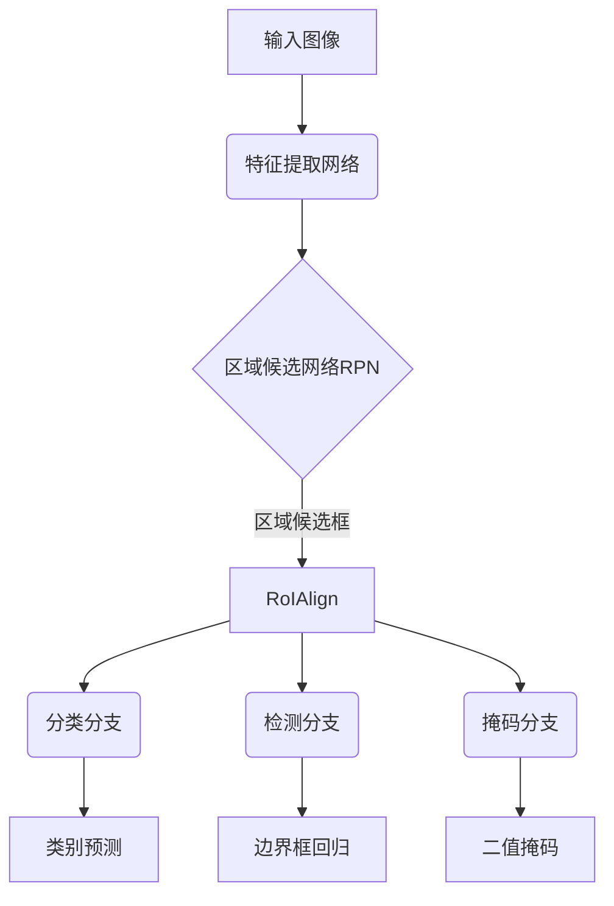

# MaskR-CNN原理与代码实例讲解

## 1.背景介绍

在计算机视觉领域,目标检测和实例分割是两个重要的基础任务。目标检测旨在定位图像中的目标并给出其类别,而实例分割则需要进一步对每个目标的像素进行精确的分割。传统的目标检测算法如Faster R-CNN虽然可以准确定位目标,但无法对目标像素进行分割。而全卷积网络(FCN)等语义分割算法虽然可以对图像像素进行分类,但无法区分不同实例。

MaskR-CNN是Facebook AI研究院在2017年提出的一种基于深度学习的实例分割算法,它扩展了Faster R-CNN,在现有目标检测任务的基础上增加了一个并行的掩码预测分支,可以同时完成目标检测和实例分割任务。MaskR-CNN在多个公开数据集上取得了领先的实例分割精度,成为了目前最流行的实例分割算法之一。

## 2.核心概念与联系

### 2.1 区域候选框(Region Proposal)

MaskR-CNN的目标检测分支继承自Faster R-CNN,使用区域候选网络(RPN)生成区域候选框。RPN是一个全卷积网络,在输入图像的特征图上滑动窗口,对每个窗口预测其是否包含目标及其边界框坐标。

### 2.2 RoIAlign

由于RPN生成的候选框在特征图上的位置是任意的,需要使用RoIAlign层将候选框特征进行对齐和归一化,为后续的分类和检测分支提供固定尺寸的特征输入。

### 2.3 分类和检测分支

分类分支和检测分支与Faster R-CNN相同,前者预测候选框内目标的类别,后者精修候选框的位置和尺寸。

### 2.4 掩码分支

掩码分支是MaskR-CNN的核心创新之处。它在每个候选框内预测一个与输入相同分辨率的二值掩码,用于分割目标实例的像素。掩码分支与分类和检测分支并行,共享骨干网络的特征提取部分。

## 3.核心算法原理具体操作步骤

MaskR-CNN的整体结构如下所示:



MaskR-CNN算法的具体操作步骤如下:

1. 输入一张RGB图像,通过特征提取网络(如ResNet、ResNeXt等)计算出一系列特征图。
2. 在特征图上应用区域候选网络RPN,生成一组区域候选框,每个候选框对应一个可能的目标。
3. 使用RoIAlign层从特征图中提取候选框对应的特征,并对齐和归一化为固定尺寸。
4. 将归一化后的候选框特征分别输入三个并行的分支网络:
    - 分类分支: 预测候选框内目标的类别
    - 检测分支: 精修候选框的位置和尺寸
    - 掩码分支: 预测一个与输入相同分辨率的二值掩码,用于分割目标实例的像素
5. 在非极大值抑制(NMS)后,输出最终的目标检测结果(类别、边界框)和实例分割结果(二值掩码)。

## 4.数学模型和公式详细讲解举例说明

### 4.1 RPN损失函数

RPN的损失函数由两部分组成:

1) 二值交叉熵损失 $L_{rpn\_cls}$,用于区分候选框是否包含目标:

$$L_{rpn\_cls}(p, p^*) = \frac{1}{N_{cls}} \sum_{i} L_{cls}^{(i)}(p_i, p_i^*)$$

其中 $p_i$ 是预测的二值得分, $p_i^*$ 是真实标签(0或1), $L_{cls}$ 是二值交叉熵损失函数, $N_{cls}$ 是正负样本总数的归一化因子。

2) 平滑L1损失 $L_{rpn\_reg}$,用于精修候选框的位置和尺寸:

$$L_{rpn\_reg}(t_u, t_u^*) = \frac{1}{N_{reg}} \sum_{i} p_i^* L_{reg}(t_i, t_i^*)$$

其中 $t_i$ 是预测的边界框回归参数, $t_i^*$ 是与真实边界框的回归目标, $L_{reg}$ 是平滑L1损失函数, $p_i^*$ 是真实标签(0或1), $N_{reg}$ 是正样本总数的归一化因子。

RPN的最终损失是两者之和:

$$L_{rpn}(p, t) = \frac{1}{N_{cls}} \sum_{i} L_{cls}(p_i, p_i^*) + \lambda \frac{1}{N_{reg}} \sum_{i} p_i^* L_{reg}(t_i, t_i^*)$$

其中 $\lambda$ 是平衡两个损失项的权重系数。

### 4.2 掩码分支损失函数

掩码分支的损失函数是二值交叉熵损失,用于像素级的分割:

$$L_{mask}(M, M^*) = -\frac{1}{m^2} \sum_{1\leq i,j\leq m} [M_{ij}^* \log M_{ij} + (1-M_{ij}^*)\log(1-M_{ij})]$$

其中 $M$ 是预测的 $m\times m$ 二值掩码, $M^*$ 是真实的 $m\times m$ 二值掩码, $m\times m$ 是掩码的分辨率。

## 5.项目实践:代码实例和详细解释说明

以下是使用PyTorch实现MaskR-CNN的简化代码示例,仅包含核心部分:

```python
import torch
import torch.nn as nn
import torchvision

# 特征提取网络
backbone = torchvision.models.resnet50(pretrained=True)

# RPN
rpn = RegionProposalNetwork(backbone.out_channels, 256)  

# RoIAlign
roi_align = RoIAlign(7, 7)

# 分类分支
cls_head = ClassificationHead(2048, 81)  

# 检测分支 
bbox_head = BBoxRegressionHead(2048, 81)

# 掩码分支
mask_head = MaskHead(2048, 81, 28)

# 前向传播
def forward(images, targets=None):
    # 特征提取
    features = backbone(images)
    
    # RPN生成候选框
    proposals, rpn_losses = rpn(images, features, targets)
    
    # RoIAlign获取候选框特征
    proposal_features = roi_align(features, proposals)
    
    # 分类分支
    cls_logits, cls_losses = cls_head(proposal_features, proposals, targets)
    
    # 检测分支
    bbox_deltas, bbox_losses = bbox_head(proposal_features, proposals, targets)
    
    # 掩码分支
    masks, mask_losses = mask_head(proposal_features, proposals, targets)
    
    # 返回预测结果和损失
    return (cls_logits, bbox_deltas, masks), (rpn_losses, cls_losses, bbox_losses, mask_losses)
```

上述代码展示了MaskR-CNN的主要组成部分及其前向传播过程:

1. 使用ResNet50作为特征提取网络的骨干。
2. 实例化RPN、RoIAlign、分类分支、检测分支和掩码分支。
3. 在`forward`函数中:
    - 输入图像通过骨干网络获得特征图。
    - 特征图输入RPN生成候选框proposals。
    - 使用RoIAlign从特征图中提取候选框对应的特征。
    - 将候选框特征分别输入三个并行分支进行预测。
    - 返回预测结果(类别、边界框、掩码)和各分支的损失。

## 6.实际应用场景

MaskR-CNN可广泛应用于以下场景:

- **计算机视觉**:实例分割是计算机视觉的基础任务,MaskR-CNN可用于目标检测、语义分割、视频分析等领域。
- **自动驾驶**:准确识别和分割道路上的行人、车辆、障碍物等对自动驾驶系统至关重要。
- **增强现实(AR)**:AR需要精确分割实物边界,才能将虚拟元素自然融入真实环境。
- **机器人视觉**:机器人需要识别和分割目标物体,以便精准操作和抓取。
- **医疗影像分析**:能够分割病灶、器官等医学实体,辅助医生诊断和手术规划。

## 7.工具和资源推荐

- **PyTorch**:本文代码示例基于PyTorch深度学习框架实现。
- **Detectron2**:Facebook AI Research推出的一个全面的目标检测和分割算法库,其中包含MaskR-CNN的官方实现。
- **MMDetection**:OpenMMLab发布的开源目标检测算法库,支持MaskR-CNN及其多种扩展变体。
- **COCO数据集**:一个常用的实例分割数据集,MaskR-CNN在此上公开了最新结果。
- **MaskR-CNN论文**:Kaiming He等人在2017年发表的原始论文《Mask R-CNN》,介绍了算法原理和实验结果。

## 8.总结:未来发展趋势与挑战

MaskR-CNN是目前最流行的实例分割算法之一,但仍有一些需要改进的地方:

- **速度**:MaskR-CNN在分割精度上有优异表现,但推理速度较慢,限制了其在实时应用中的使用。
- **内存占用**:MaskR-CNN需要为每个候选框单独预测掩码,内存开销较大。
- **遮挡和重叠**:当目标发生严重遮挡或重叠时,分割性能会受到影响。

未来,研究人员可能会从以下几个方面持续改进实例分割算法:

- **注意力机制**:引入注意力机制提高模型对目标的关注度。
- **端到端预测**:摆脱分阶段的结构,直接端到端预测掩码。
- **模型压缩**:通过剪枝、量化等技术压缩模型,提高推理速度。
- **数据增强**:设计更有效的数据增强方法,增强模型的泛化能力。
- **多任务学习**:与其他视觉任务(如检测、分类等)进行多任务联合学习。

## 9.附录:常见问题与解答

1. **MaskR-CNN与Faster R-CNN有何区别?**

MaskR-CNN在Faster R-CNN的基础上增加了一个并行的掩码预测分支,用于对目标进行像素级别的实例分割。而Faster R-CNN只能给出目标的类别和边界框,无法分割目标像素。

2. **MaskR-CNN的局限性有哪些?**

MaskR-CNN在处理遮挡和重叠目标时表现较差,另外推理速度和内存占用也是其弱点。此外,它无法很好地分割不规则形状的目标。

3. **MaskR-CNN的掩码分支是如何工作的?**

掩码分支会为每个候选框预测一个与输入相同分辨率的二值掩码,用于分割目标实例的像素。它与分类和检测分支并行,共享骨干网络的特征提取部分。

4. **如何提高MaskR-CNN的推理速度?**

可以尝试模型压缩技术(如剪枝、量化等)来减小模型大小,同时也可以考虑使用更高效的骨干网络或通过NAS架构搜索获得更快的模型。

5. **MaskR-CNN在哪些领域有应用?**

MaskR-CNN可广泛应用于计算机视觉、自动驾驶、增强现实、机器人视觉、医疗影像分析等领域,这些领域都需要对图像中的目标进行精确的实例分割。

作者: 禅与计算机程序设计艺术 / Zen and the Art of Computer Programming