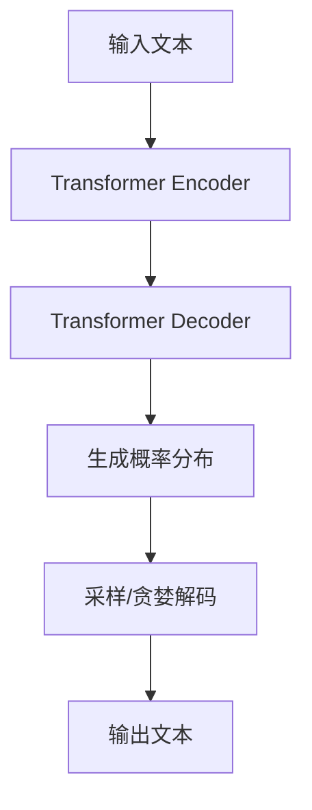
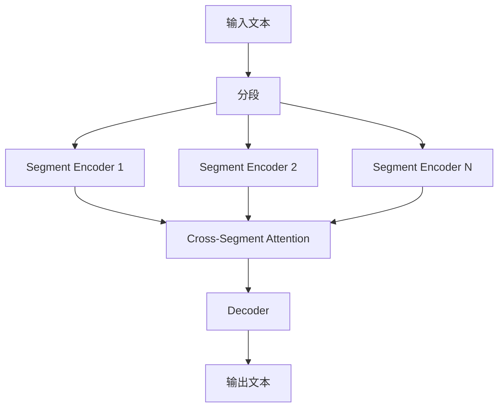
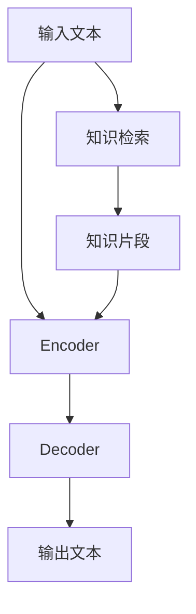

# Megatron-Turing NLG原理与代码实例讲解

## 1.背景介绍

### 1.1 自然语言生成的重要性

在当今的数字时代,自然语言生成(NLG)已成为人工智能领域的一个关键技术。NLG系统能够将结构化数据转换为人类可读的自然语言文本,广泛应用于各种场景,如新闻报道自动生成、对话系统、数据解释和报告撰写等。随着大数据和人工智能技术的不断发展,NLG已成为提高信息获取效率、增强人机交互体验的重要手段。

### 1.2 NLG系统的挑战

尽管NLG技术取得了长足进步,但仍面临诸多挑战:

- **语境一致性**: 生成的文本需要与给定的语境相一致,保持逻辑连贯性。
- **多样性**: 避免生成重复monotonic的文本,需要增加生成的多样性。
- **长期依赖建模**: 捕捉长距离的语义依赖关系,生成连贯的长文本。
- **知识引入**: 融入外部知识,生成更加丰富、信息量更大的文本。

### 1.3 Megatron-Turing NLG

为解决上述挑战,谷歌的Megatron-Turing NLG模型应运而生。它是一种基于大型语言模型的NLG系统,通过预训练-微调的范式,在保留强大的生成能力的同时,引入了显式建模长期依赖、知识增强等创新技术,显著提升了生成质量。本文将深入探讨Megatron-Turing NLG的核心原理及实践应用。

## 2.核心概念与联系

### 2.1 自回归语言模型

Megatron-Turing NLG的核心是一种基于Transformer的大型自回归语言模型。自回归语言模型的基本思想是,基于之前生成的文本片段,预测下一个token的概率分布:

$$P(x) = \prod_{t=1}^{T}P(x_t|x_{<t})$$

其中$x$是目标序列,通过最大化上式的对数似然估计模型参数。



### 2.2 长期依赖建模

传统的Transformer由于有限的上下文窗口长度,难以捕捉长距离的依赖关系。Megatron-Turing采用了一种被称为"Segment级别的重复修复"的技术,将整个输入文本划分为多个片段,对每个片段进行编码,然后利用跨片段注意力机制来捕获长期依赖。



### 2.3 知识增强

为了生成更加丰富、信息量更大的文本,Megatron-Turing NLG融入了外部知识。具体来说,它利用一个检索模块从知识库中查找与输入文本相关的知识片段,然后将这些知识片段与原始输入文本一起送入编码器,让模型同时建模输入文本和外部知识。



## 3.核心算法原理具体操作步骤

### 3.1 预训练

Megatron-Turing NLG模型首先在大规模文本语料上进行预训练,以获取通用的语言理解和生成能力。预训练采用了掩码语言模型(MLM)和下一句预测(NSP)等任务,与BERT类似。具体步骤如下:

1. **数据预处理**: 将原始文本语料进行标记化、构建词表等预处理。
2. **MLM预训练**: 随机掩码输入序列中的部分token,模型需要预测被掩码的token。
3. **NSP预训练**: 给定两个句子,判断第二个句子是否为第一个句子的下一句。
4. **优化训练**: 使用Adam等优化算法,最小化MLM和NSP的损失函数,更新模型参数。

### 3.2 微调

在完成预训练后,Megatron-Turing NLG将在特定的NLG任务上进行微调,以适应特定的生成需求。微调的具体步骤包括:

1. **数据准备**: 根据目标NLG任务构建训练集和开发集。
2. **微调设置**: 设置合适的微调超参数,如学习率、批量大小等。
3. **损失函数**: 使用自回归语言模型的负对数似然损失作为微调目标。
4. **梯度更新**: 在训练集上最小化损失函数,更新模型参数。
5. **生成评估**: 在开发集上评估生成质量,进行模型选择。

### 3.3 生成

经过预训练和微调后,Megatron-Turing NLG就可以用于生成任务了。生成过程包括以下步骤:

1. **输入编码**: 将生成的输入文本(如新闻标题)送入编码器。
2. **上下文编码**: 利用段级编码和跨段注意力捕获长期依赖。
3. **知识融合**: 将检索到的相关知识与原始输入一起编码。
4. **自回归解码**: 基于编码后的表示,自回归地生成输出序列。
5. **结果后处理**: 对生成的原始文本进行后处理,如去重、拼写检查等。

## 4.数学模型和公式详细讲解举例说明

### 4.1 Transformer编码器

Megatron-Turing NLG的编码器基于Transformer的标准编码器结构。给定一个输入序列$\boldsymbol{x}=\left(x_{1}, x_{2}, \ldots, x_{n}\right)$,首先将每个token $x_i$映射为词嵌入向量$\boldsymbol{e}_{x_{i}}$,然后输入到编码器中。

Transformer编码器的核心是多头自注意力(Multi-Head Self-Attention)和前馈网络(Feed-Forward Network)。多头自注意力用于捕获输入序列中token之间的依赖关系,前馈网络则对每个token的表示进行非线性转换。编码器堆叠了N个这样的编码器层。

对于第$i$个编码器层,其输出$\boldsymbol{H}^{(i)}$计算如下:

$$\begin{aligned}
\boldsymbol{H}^{(i)} &=\operatorname{FFN}\left(\operatorname{MultiHeadAttn}\left(\boldsymbol{H}^{(i-1)}\right)+\boldsymbol{H}^{(i-1)}\right) \\
\operatorname{MultiHeadAttn}(\boldsymbol{Q}, \boldsymbol{K}, \boldsymbol{V}) &=\operatorname{Concat}\left(\operatorname{head}_{1}, \ldots, \operatorname{head}_{h}\right) \boldsymbol{W}^{O}
\end{aligned}$$

其中$\operatorname{head}_i=\operatorname{Attention}\left(\boldsymbol{Q} \boldsymbol{W}_{i}^{Q}, \boldsymbol{K} \boldsymbol{W}_{i}^{K}, \boldsymbol{V} \boldsymbol{W}_{i}^{V}\right)$是第$i$个注意力头,通过对$\boldsymbol{Q}$、$\boldsymbol{K}$、$\boldsymbol{V}$进行线性变换后计算注意力权重。

### 4.2 段级编码和跨段注意力

为了捕获长期依赖,Megatron-Turing NLG将整个输入序列划分为多个段(Segment),对每个段进行独立编码,然后利用跨段注意力(Cross-Segment Attention)建模段与段之间的依赖关系。

具体来说,假设将输入序列$\boldsymbol{x}$划分为$m$个段$\boldsymbol{x}^{(1)}, \boldsymbol{x}^{(2)}, \ldots, \boldsymbol{x}^{(m)}$,对每个段使用标准的Transformer编码器进行编码:

$$\boldsymbol{H}^{(j)}=\operatorname{TransformerEncoder}\left(\boldsymbol{x}^{(j)}\right), \quad j=1, \ldots, m$$

然后将所有段的编码表示$\boldsymbol{H}^{(1)}, \ldots, \boldsymbol{H}^{(m)}$拼接为一个矩阵$\boldsymbol{H}$,并使用跨段注意力机制捕获段与段之间的依赖关系:

$$\widetilde{\boldsymbol{H}}=\operatorname{CrossSegmentAttn}(\boldsymbol{H}, \boldsymbol{H}, \boldsymbol{H})$$

其中$\operatorname{CrossSegmentAttn}$与标准的多头注意力类似,只是在计算注意力权重时,允许每个Query向量与所有Key向量进行注意力计算,而不受段的限制。这样,模型就能够学习到跨越多个段的长期依赖关系。

最终,将跨段注意力的输出$\widetilde{\boldsymbol{H}}$送入Transformer的解码器,进行自回归生成。

### 4.3 知识增强注意力

为了融合外部知识,Megatron-Turing NLG采用了一种知识增强注意力(Knowledge-Augmented Attention)机制。假设通过知识检索模块获得了与输入文本相关的$k$个知识片段$\boldsymbol{z}^{(1)}, \ldots, \boldsymbol{z}^{(k)}$,将它们与原始输入$\boldsymbol{x}$拼接为一个扩展的输入序列:

$$\widetilde{\boldsymbol{x}}=\left[\boldsymbol{x} ; \boldsymbol{z}^{(1)} ; \ldots ; \boldsymbol{z}^{(k)}\right]$$

在编码器的自注意力计算中,允许每个Query向量不仅与输入文本$\boldsymbol{x}$的Key向量计算注意力,还可以与知识片段$\boldsymbol{z}^{(i)}$的Key向量计算注意力。这样,模型就能够学习到如何选择性地融合输入文本和外部知识。

具体地,知识增强注意力的计算公式如下:

$$\begin{aligned}
\operatorname{KnowledgeAttn}(\boldsymbol{Q}, \boldsymbol{K}, \boldsymbol{V}) &=\operatorname{Concat}\left(\operatorname{head}_{1}, \ldots, \operatorname{head}_{h}\right) \boldsymbol{W}^{O} \\
\operatorname{head}_{i} &=\operatorname{Attention}\left(\boldsymbol{Q} \boldsymbol{W}_{i}^{Q},\left[\boldsymbol{K}_{\text {input}} ; \boldsymbol{K}_{\text {knowledge}}\right] \boldsymbol{W}_{i}^{K},\left[\boldsymbol{V}_{\text {input}} ; \boldsymbol{V}_{\text {knowledge}}\right] \boldsymbol{W}_{i}^{V}\right)
\end{aligned}$$

其中$\boldsymbol{K}_{\text {input}}$和$\boldsymbol{V}_{\text {input}}$分别是输入文本的Key和Value向量,而$\boldsymbol{K}_{\text {knowledge}}$和$\boldsymbol{V}_{\text {knowledge}}$则是知识片段的Key和Value向量。通过允许Query向量与两者计算注意力,模型能够同时关注输入文本和外部知识。

## 5.项目实践:代码实例和详细解释说明

为了更好地理解Megatron-Turing NLG的原理和实现细节,下面将给出一个基于PyTorch的代码示例,实现一个简化版本的Megatron-Turing NLG模型。

### 5.1 数据预处理

首先,我们需要对输入数据进行预处理,包括标记化、构建词表、数值化等步骤。这里使用Python的`torchtext`库:

```python
import torchtext

# 构建词表
src_tokenizer = lambda x: x.split()
src_vocab = torchtext.vocab.build_vocab_from_iterator(src_tokenizer(src_text), specials=['<unk>', '<pad>'])
src_vocab.set_default_index(src_vocab['<unk>'])

# 数值化
src_text_pipeline = lambda x: src_vocab(src_tokenizer(x))
src_data = [src_text_pipeline(line) for line in src_text]
```

### 5.2 模型实现

接