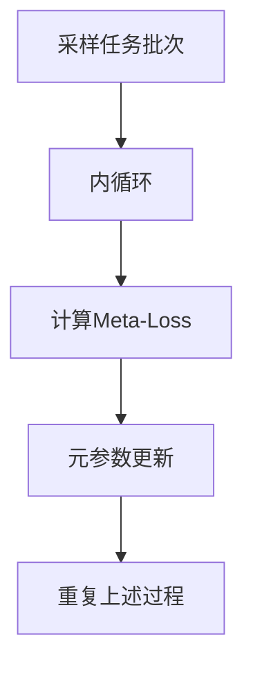
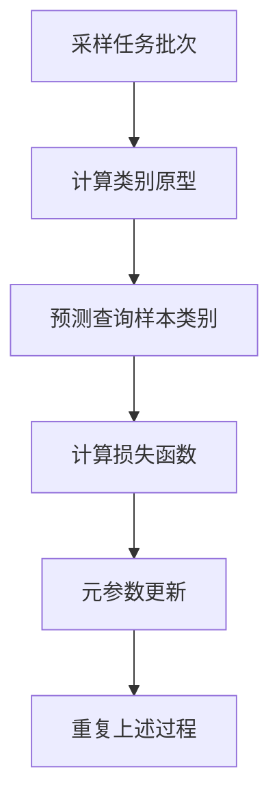

# Meta-Learning原理与代码实例讲解

## 1.背景介绍

在传统的机器学习中,我们通常需要为每个新任务重新训练一个模型。这种方法存在一些缺陷,例如需要大量的标记数据、计算资源,并且无法从先前任务中获得经验。Meta-Learning(元学习)旨在解决这些问题,它使模型能够从过去的经验中学习,并将获得的知识迁移到新任务上,从而加快新任务的学习速度。

Meta-Learning的核心思想是构建一个能够快速学习新任务的模型,而不是为每个新任务重新训练一个模型。这种方法通过学习任务之间的共性,从而提高了模型的泛化能力。Meta-Learning已被广泛应用于计算机视觉、自然语言处理、强化学习等多个领域。

## 2.核心概念与联系

Meta-Learning包含以下几个核心概念:

1. **Meta-Learner(元学习器)**: 指能够从多个任务中学习的模型。元学习器的目标是学习一个有效的初始化策略或学习算法,使得在新任务上只需要少量数据和计算资源即可快速收敛。

2. **Task(任务)**: 在Meta-Learning中,每个任务都是一个独立的学习问题,具有自己的数据集、目标函数等。元学习器需要在多个任务上进行学习,以获取任务之间的共性知识。

3. **Meta-Training(元训练)**: 指在多个任务上训练元学习器的过程。在这个阶段,元学习器从多个任务中学习一个有效的初始化策略或学习算法。

4. **Meta-Testing(元测试)**: 指在新任务上评估元学习器性能的过程。在这个阶段,元学习器需要利用从元训练阶段获得的知识快速适应新任务。

5. **Inner Loop(内循环)**: 指在单个任务上进行模型更新的过程,通常使用梯度下降等优化算法。

6. **Outer Loop(外循环)**: 指跨多个任务进行元学习器参数更新的过程,目标是使元学习器能够在内循环中快速适应新任务。

这些概念相互关联,共同构建了Meta-Learning的理论框架。Meta-Learner通过在多个Task上进行Meta-Training,学习一个有效的初始化策略或学习算法,从而在Meta-Testing阶段能够快速适应新的Task。Inner Loop和Outer Loop分别负责单个任务和多个任务之间的优化过程。

## 3.核心算法原理具体操作步骤

Meta-Learning算法可以分为三大类:基于优化的方法、基于度量学习的方法和基于生成模型的方法。下面将详细介绍其中的两种典型算法:MAML(Model-Agnostic Meta-Learning)和Prototypical Networks。

### 3.1 MAML算法

MAML(Model-Agnostic Meta-Learning)是一种基于优化的Meta-Learning算法,它旨在学习一个良好的初始化参数,使得在新任务上只需要少量梯度步骤即可快速收敛。MAML算法的具体步骤如下:

1. **采样任务批次**: 从任务分布$p(\mathcal{T})$中采样一批任务$\mathcal{T}_i$。对于每个任务$\mathcal{T}_i$,将其数据集$\mathcal{D}_i$分为支持集(Support Set)$\mathcal{D}_i^{tr}$和查询集(Query Set)$\mathcal{D}_i^{val}$。

2. **内循环**: 对于每个任务$\mathcal{T}_i$,使用支持集$\mathcal{D}_i^{tr}$进行模型更新:
   - 初始化模型参数为$\theta$
   - 计算损失函数$\mathcal{L}_{\mathcal{T}_i}(\theta)$在支持集$\mathcal{D}_i^{tr}$上的值
   - 使用梯度下降法更新模型参数:$\theta_i' = \theta - \alpha\nabla_\theta\mathcal{L}_{\mathcal{T}_i}(\theta)$,其中$\alpha$是学习率

3. **外循环**: 使用查询集$\mathcal{D}_i^{val}$计算每个任务的损失,并对所有任务的损失求和作为Meta-Loss:

$$\min_\theta\sum_{\mathcal{T}_i\sim p(\mathcal{T})}\mathcal{L}_{\mathcal{T}_i}(f_{\theta_i'})$$

其中$f_{\theta_i'}$是在内循环中更新后的模型。

4. **元参数更新**: 使用优化算法(如梯度下降)更新元参数$\theta$,以最小化Meta-Loss。

5. **重复上述过程**: 重复步骤1-4,直到模型收敛。

MAML算法的关键在于通过元参数$\theta$编码一个好的初始化策略,使得在新任务上只需要少量梯度步骤即可快速收敛。这种方法能够有效地提高模型在新任务上的泛化能力。

### 3.2 Prototypical Networks

Prototypical Networks是一种基于度量学习的Meta-Learning算法,它通过学习一个好的嵌入空间,使得同一类别的数据点聚集在一起,不同类别的数据点分开。在新任务上,该算法通过计算查询样本与各个类别原型之间的距离,来预测查询样本的类别。具体步骤如下:

1. **采样任务批次**: 从任务分布$p(\mathcal{T})$中采样一批任务$\mathcal{T}_i$。对于每个任务$\mathcal{T}_i$,将其数据集$\mathcal{D}_i$分为支持集(Support Set)$\mathcal{D}_i^{tr}$和查询集(Query Set)$\mathcal{D}_i^{val}$。

2. **计算类别原型**: 对于每个任务$\mathcal{T}_i$,使用嵌入函数$f_\phi$将支持集$\mathcal{D}_i^{tr}$中的样本映射到嵌入空间,并计算每个类别的原型(Prototype)$c_k$,即该类别所有嵌入向量的均值:

$$c_k = \frac{1}{|S_k|}\sum_{(x,y)\in S_k}f_\phi(x)$$

其中$S_k$是支持集中属于第$k$类的样本集合。

3. **预测查询样本类别**: 对于每个查询样本$x^{val}\in\mathcal{D}_i^{val}$,计算其嵌入向量$f_\phi(x^{val})$与每个类别原型$c_k$之间的距离,并将其分配到距离最近的类别:

$$\hat{y} = \arg\min_k d(f_\phi(x^{val}), c_k)$$

其中$d(\cdot,\cdot)$是距离度量函数,通常使用欧几里得距离或余弦相似度。

4. **计算损失函数**: 使用交叉熵损失函数或其他合适的损失函数,计算支持集$\mathcal{D}_i^{tr}$和查询集$\mathcal{D}_i^{val}$上的损失,并对所有任务的损失求和作为Meta-Loss。

5. **元参数更新**: 使用优化算法(如梯度下降)更新嵌入函数$f_\phi$的参数$\phi$,以最小化Meta-Loss。

6. **重复上述过程**: 重复步骤1-5,直到模型收敛。

Prototypical Networks的关键在于学习一个好的嵌入空间,使得同一类别的数据点聚集在一起,不同类别的数据点分开。在新任务上,该算法通过计算查询样本与各个类别原型之间的距离,来预测查询样本的类别,从而实现快速适应新任务的目标。

## 4.数学模型和公式详细讲解举例说明

在Meta-Learning中,常用的数学模型和公式包括:

1. **任务分布**:

在Meta-Learning中,我们假设存在一个任务分布$p(\mathcal{T})$,每个任务$\mathcal{T}_i$都是从这个分布中独立同分布采样得到的。任务分布描述了我们期望模型能够适应的任务类型。

2. **损失函数**:

对于每个任务$\mathcal{T}_i$,我们定义了一个损失函数$\mathcal{L}_{\mathcal{T}_i}(\theta)$,用于评估模型参数$\theta$在该任务上的性能。常用的损失函数包括交叉熵损失、均方误差等。

3. **Meta-Loss**:

Meta-Loss是所有任务损失函数的加权和,它反映了模型在所有任务上的整体性能:

$$\mathcal{L}_{meta}(\theta) = \sum_{\mathcal{T}_i\sim p(\mathcal{T})}w_i\mathcal{L}_{\mathcal{T}_i}(\theta)$$

其中$w_i$是每个任务的权重。在MAML算法中,Meta-Loss的具体形式为:

$$\min_\theta\sum_{\mathcal{T}_i\sim p(\mathcal{T})}\mathcal{L}_{\mathcal{T}_i}(f_{\theta_i'})$$

4. **梯度更新**:

在MAML算法的内循环中,我们使用梯度下降法更新模型参数:

$$\theta_i' = \theta - \alpha\nabla_\theta\mathcal{L}_{\mathcal{T}_i}(\theta)$$

其中$\alpha$是学习率。

5. **类别原型**:

在Prototypical Networks算法中,我们计算每个类别的原型(Prototype)$c_k$,即该类别所有嵌入向量的均值:

$$c_k = \frac{1}{|S_k|}\sum_{(x,y)\in S_k}f_\phi(x)$$

其中$S_k$是支持集中属于第$k$类的样本集合,$f_\phi$是嵌入函数。

6. **距离度量**:

在Prototypical Networks算法中,我们使用距离度量函数$d(\cdot,\cdot)$来计算查询样本与每个类别原型之间的距离,通常使用欧几里得距离或余弦相似度。

下面通过一个简单的例子,说明如何使用上述公式计算Meta-Loss和类别原型。

**例子**:假设我们有一个二分类问题,支持集$\mathcal{D}^{tr}$包含4个样本,查询集$\mathcal{D}^{val}$包含2个样本,样本的特征向量和标签如下:

- 支持集:
  - $(x_1, y_1) = ([1, 2], 0)$
  - $(x_2, y_2) = ([3, 4], 0)$
  - $(x_3, y_3) = ([5, 6], 1)$
  - $(x_4, y_4) = ([7, 8], 1)$
- 查询集:
  - $(x_5, y_5) = ([2, 3], 0)$
  - $(x_6, y_6) = ([6, 7], 1)$

我们使用Prototypical Networks算法,嵌入函数$f_\phi$为线性变换,损失函数为交叉熵损失。

1. 计算类别原型:

$$c_0 = \frac{1}{2}([1, 2] + [3, 4]) = [2, 3]$$
$$c_1 = \frac{1}{2}([5, 6] + [7, 8]) = [6, 7]$$

2. 预测查询样本类别:

$$d(f_\phi(x_5), c_0) = \|(x_5 - c_0)\| = \|([2, 3] - [2, 3])\| = 0$$
$$d(f_\phi(x_5), c_1) = \|(x_5 - c_1)\| = \|([2, 3] - [6, 7])\| = \sqrt{16 + 16} = 8$$

因此,查询样本$x_5$被预测为类别0。

$$d(f_\phi(x_6), c_0) = \|(x_6 - c_0)\| = \|([6, 7] - [2, 3])\| = \sqrt{16 + 16} = 8$$
$$d(f_\phi(x_6), c_1) = \|(x_6 - c_1)\| = \|([6, 7] - [6, 7])\| = 0$$

因此,查询样本$x_6$被预测为类别1。

3. 计算损失函数:

假设查询集$\mathcal{D}^{val}$上的真实标签为$y_5 = 0,