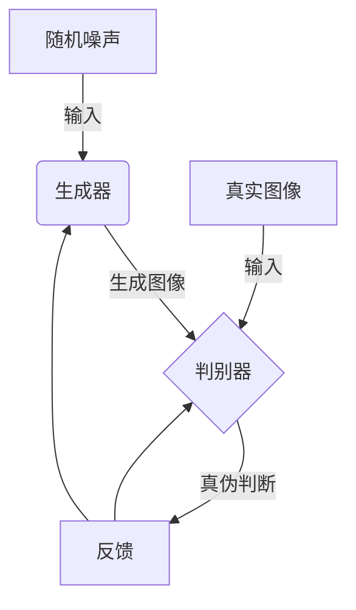
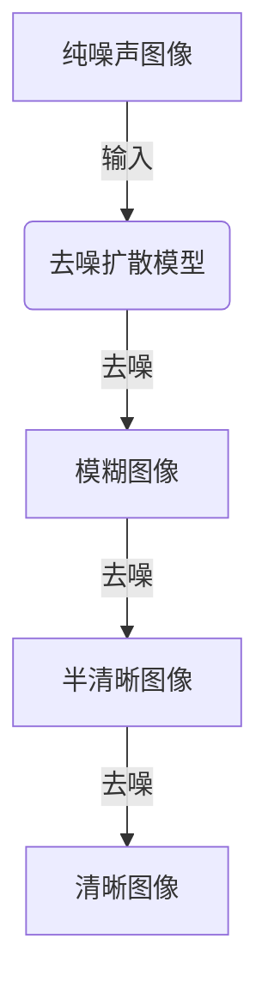
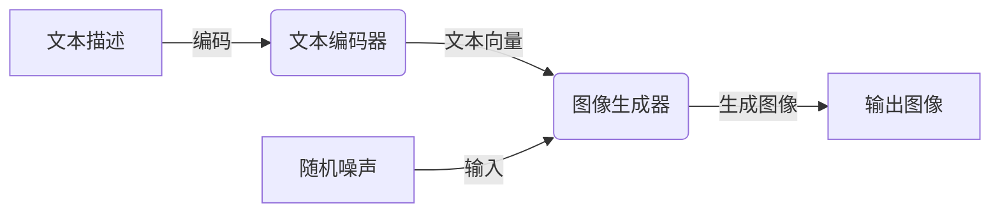

# Midjourney原理与代码实例讲解

## 1.背景介绍

### 1.1 什么是Midjourney?

Midjourney是一款基于人工智能的文本到图像生成工具,由一家独立的研究实验室开发。它利用先进的人工智能模型,能够根据用户输入的文本描述生成相应的图像。Midjourney在2022年7月首次向公众开放,迅速引起了广泛关注,被誉为"AI艺术革命"的先驱。

### 1.2 Midjourney的重要意义

Midjourney的出现标志着生成式人工智能技术达到了一个新的里程碑。它展示了人工智能在创作和艺术领域的巨大潜力,为人类开辟了一个全新的创作方式。通过Midjourney,用户无需掌握专业的绘画技能,只需使用自然语言描述,就能创作出令人惊艳的图像作品。

此外,Midjourney也为各行各业提供了新的可能性。设计师可以使用它快速创建原型和概念图;营销人员可以生成吸引眼球的视觉内容;教育工作者可以制作生动有趣的教学资源,等等。Midjourney为人工智能的商业应用开辟了广阔的前景。

## 2.核心概念与联系

### 2.1 生成式对抗网络(GAN)

Midjourney的核心技术是生成式对抗网络(Generative Adversarial Networks, GAN)。GAN是一种由两个神经网络组成的架构,包括一个生成器(Generator)和一个判别器(Discriminator)。

生成器的任务是从随机噪声中生成逼真的图像数据,而判别器则需要区分生成器生成的图像和真实图像。两个网络相互对抗,生成器努力生成足以欺骗判别器的图像,而判别器则努力区分真伪。通过这种对抗训练,生成器逐步提高生成逼真图像的能力。

### 2.2 扩散模型(Diffusion Model)

除了GAN,Midjourney还采用了另一种生成式模型——扩散模型(Diffusion Model)。扩散模型的工作原理是首先将图像数据添加噪声,使其变得模糊不清,然后训练一个神经网络从噪声中重建原始图像。

在推理阶段,扩散模型从纯噪声开始,并逐步去噪,最终生成所需的图像输出。与GAN相比,扩散模型在生成高质量图像方面表现更加出色,但训练和推理过程也更加计算密集。

### 2.3 文本到图像生成

Midjourney的核心功能是将自然语言描述转换为图像。这一过程包括两个主要步骤:

1. **文本编码**: 将用户输入的文本描述转换为向量表示,以便被神经网络处理。这通常是使用预训练的自然语言处理模型(如BERT或GPT)完成的。

2. **图像生成**: 将文本向量作为条件输入,通过生成式模型(如GAN或扩散模型)生成相应的图像输出。

通过将自然语言和生成式模型相结合,Midjourney实现了人机交互式的图像创作,极大地扩展了人类的创造力边界。

## 3.核心算法原理具体操作步骤

### 3.1 数据预处理

在训练Midjourney的生成式模型之前,需要对图像和文本数据进行预处理。这通常包括以下步骤:

1. **图像预处理**:
   - 调整图像大小至统一分辨率
   - 转换为模型所需的数据格式(如PNG或JPG)
   - 归一化像素值至0-1范围
   - 数据增强(如随机裁剪、翻转、旋转等)

2. **文本预处理**:
   - 分词(将句子分割为单词序列)
   - 去除标点符号和特殊字符
   - 转换为模型所需的数字表示(如词汇表索引或词向量)
   - 截断或填充至固定长度序列

经过预处理后,图像和文本数据就可以输入到神经网络模型中进行训练了。

### 3.2 模型训练

Midjourney使用生成式对抗网络(GAN)和扩散模型(Diffusion Model)等生成式模型来学习图像和文本之间的映射关系。以GAN为例,训练过程可分为以下步骤:

1. **初始化生成器和判别器**:使用随机权重初始化两个神经网络。

2. **生成器生成图像**:从随机噪声开始,生成器生成一批假图像。

3. **判别器判别真伪**:判别器接收真实图像和生成器生成的假图像,并对它们进行真伪判别。

4. **计算损失函数**:根据判别器的输出,计算生成器和判别器各自的损失函数。

5. **反向传播和优化**:使用优化算法(如Adam或RMSProp)更新生成器和判别器的权重,最小化它们各自的损失函数。

6. **重复训练**:重复步骤2-5,直到模型收敛或达到预设的训练轮次。

在训练过程中,生成器和判别器相互对抗,生成器努力生成越来越逼真的图像来欺骗判别器,而判别器则努力提高区分真伪的能力。这种对抗关系促使两个模型相互驱动,最终实现高质量的图像生成能力。

对于扩散模型,训练过程类似,但需要学习从噪声图像中重建原始图像的映射关系。

### 3.3 文本到图像生成

在推理阶段,Midjourney将用户输入的文本描述转换为图像输出。这个过程可分为以下步骤:

1. **文本编码**:使用预训练的自然语言处理模型(如BERT或GPT)将文本描述编码为向量表示。

2. **随机噪声采样**:从高斯分布或均匀分布中采样一批随机噪声作为生成器的初始输入。

3. **条件图像生成**:将文本向量作为条件输入,通过训练好的生成式模型(如GAN或扩散模型)生成相应的图像输出。

4. **后处理和输出**:对生成的图像进行必要的后处理(如调整大小、格式转换等),并将最终结果输出给用户。

通过将自然语言描述与生成式模型相结合,Midjourney实现了直观且高效的图像创作过程,极大地扩展了人类的创造力边界。

## 4.数学模型和公式详细讲解举例说明

### 4.1 生成式对抗网络(GAN)

生成式对抗网络(GAN)由生成器(Generator)和判别器(Discriminator)两个神经网络组成。生成器的目标是从随机噪声中生成逼真的图像数据,而判别器则需要区分生成器生成的图像和真实图像。两个网络相互对抗,生成器努力生成足以欺骗判别器的图像,而判别器则努力区分真伪。

#### 4.1.1 生成器损失函数

生成器的目标是生成足以欺骗判别器的图像,因此它的损失函数可以定义为:

$$\underset{G}{\mathrm{min}}\,\underset{D}{\mathrm{max}}\,V(D,G) = \mathbb{E}_{x\sim p_{\text{data}}(x)}\left[\log D(x)\right] + \mathbb{E}_{z\sim p_z(z)}\left[\log(1-D(G(z)))\right]$$

其中:
- $G$是生成器模型
- $D$是判别器模型
- $x$是真实数据样本
- $z$是随机噪声向量
- $p_{\text{data}}(x)$是真实数据分布
- $p_z(z)$是随机噪声分布(通常是高斯分布或均匀分布)

生成器的目标是最小化这个损失函数,即最大化判别器被欺骗的概率。

#### 4.1.2 判别器损失函数

判别器的目标是正确区分真实图像和生成器生成的假图像,因此它的损失函数可以定义为:

$$\underset{D}{\mathrm{max}}\,V(D,G) = \mathbb{E}_{x\sim p_{\text{data}}(x)}\left[\log D(x)\right] + \mathbb{E}_{z\sim p_z(z)}\left[\log(1-D(G(z)))\right]$$

这与生成器的损失函数相同,但目标是最大化这个函数值。判别器通过最大化真实图像的对数似然和最小化生成图像的对数似然来实现这一目标。

在训练过程中,生成器和判别器相互对抗,生成器努力最小化损失函数,而判别器则努力最大化损失函数。这种对抗关系促使两个模型相互驱动,最终实现高质量的图像生成能力。

### 4.2 扩散模型(Diffusion Model)

扩散模型是另一种用于图像生成的模型,它的工作原理是首先将图像数据添加噪声,使其变得模糊不清,然后训练一个神经网络从噪声中重建原始图像。

#### 4.2.1 扩散过程

扩散过程可以用一个马尔可夫链来描述,它将一个清晰的图像$x_0$逐步添加高斯噪声,得到一系列噪声图像$\{x_t\}_{t=1}^T$,其中$T$是扩散步数。每一步的转移概率密度为:

$$q(x_t|x_{t-1}) = \mathcal{N}(x_t;\sqrt{1-\beta_t}x_{t-1},\beta_tI)$$

其中$\beta_t$是一个预定义的方差系数,控制每一步添加的噪声量。最终,我们得到一个纯噪声图像$x_T$,它与原始图像$x_0$完全无关。

#### 4.2.2 反向过程

反向过程的目标是从纯噪声图像$x_T$出发,逐步去噪,重建原始图像$x_0$。这可以通过训练一个神经网络$p_\theta(x_{t-1}|x_t)$来实现,它能够根据当前的噪声图像$x_t$预测上一步的图像$x_{t-1}$。

具体来说,我们希望最小化以下损失函数:

$$\mathbb{E}_{x_0,\epsilon}\left[\left\|x_0 - x_T\right\|^2\right] = \mathbb{E}_{x_0,\epsilon}\left[\sum_{t=1}^T\left\|\sqrt{\alpha_t}(x_t-\epsilon_\theta(x_t,t))\right\|^2\right]$$

其中:
- $x_0$是原始图像
- $\epsilon$是一个标准高斯噪声序列
- $\alpha_t = 1 - \beta_t$
- $\epsilon_\theta(x_t,t)$是神经网络的预测值,即给定$x_t$和时间步$t$,预测$x_{t-1}$

通过最小化这个损失函数,神经网络可以学习到从噪声图像中恢复清晰图像的映射关系。

在推理阶段,我们从纯噪声图像$x_T$开始,逐步应用训练好的神经网络$p_\theta(x_{t-1}|x_t)$进行去噪,最终得到清晰的图像输出$x_0$。

## 5.项目实践:代码实例和详细解释说明

在这一部分,我们将提供一些Midjourney的代码实例,并对其进行详细解释。请注意,由于Midjourney的核心模型是封闭源代码,我们无法直接访问其内部实现细节。因此,这里提供的代码示例主要侧重于Midjourney的使用方法和一些周边功能的实现。

### 5.1 文本到图像生成

以下是一个使用Mi