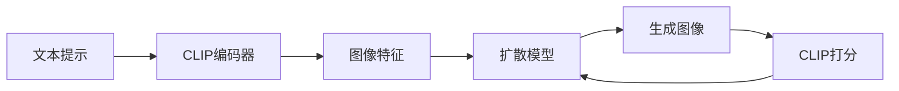

# Midjourney原理与代码实例讲解

## 1.背景介绍

### 1.1 人工智能与计算机视觉的发展历程

人工智能(Artificial Intelligence, AI)和计算机视觉(Computer Vision, CV)是当前科技领域最热门的研究方向之一。自20世纪50年代以来，AI和CV经历了从理论探索到实际应用的发展历程。近年来，随着深度学习技术的突破，尤其是卷积神经网络(Convolutional Neural Network, CNN)的广泛应用，CV取得了长足的进步，在图像分类、目标检测、语义分割等任务上达到甚至超越人类的水平。

### 1.2 文本到图像生成的兴起

在CV快速发展的同时，另一个备受关注的研究方向是文本到图像生成(Text-to-Image Generation)。该任务旨在根据给定的文本描述，自动生成与之匹配的逼真图像。这一任务的实现将极大拓展人工智能的应用场景，如辅助设计、智能绘画、虚拟场景生成等。近年来，得益于生成对抗网络(Generative Adversarial Network, GAN)等生成模型的发展，文本到图像生成取得了可喜的进展。

### 1.3 Midjourney的诞生

Midjourney是由Midjourney公司开发的一款文本到图像生成工具，于2022年发布并迅速引起广泛关注。它以强大的图像生成能力和艺术创造力著称，用户只需输入简单的文本提示，即可生成风格多样、细节丰富的图像。Midjourney采用了先进的扩散模型(Diffusion Model)和CLIP模型，在图像质量和文本相关性上达到了业界领先水平。

## 2.核心概念与联系

### 2.1 扩散模型(Diffusion Model)

扩散模型是一类生成模型，通过对噪声图像进行逐步去噪来生成目标图像。其基本思想是将图像生成过程建模为马尔可夫链，每一步都在原图像上叠加高斯噪声并逐步去除，最终得到干净的生成图像。扩散模型具有训练稳定、样本多样、生成质量高等优点，已成为图像生成领域的主流模型之一。

### 2.2 CLIP模型

CLIP(Contrastive Language-Image Pre-training)是一种将图像和文本映射到同一特征空间的多模态模型。它通过对大规模图文对数据进行对比学习，使得图像特征和文本特征在同一空间中紧密对齐。CLIP模型可以根据文本描述准确检索相关图像，或根据图像生成匹配的文本描述，在跨模态理解和生成任务中表现出色。

### 2.3 Midjourney架构

Midjourney采用了扩散模型和CLIP模型的组合，形成了一套高效的文本到图像生成架构。首先，使用CLIP模型将输入的文本提示映射到图像特征空间。然后，以该特征为条件，使用扩散模型生成与文本匹配的图像。在生成过程中，扩散模型不断迭代优化，使生成图像在保真度和多样性之间取得平衡。同时，CLIP模型对生成图像进行打分，引导扩散模型朝着文本相关性更强的方向优化。

下面是Midjourney的核心架构示意图：



## 3.核心算法原理具体操作步骤

### 3.1 数据准备

- 收集大规模高质量的图文对数据，涵盖多个领域和风格。
- 对图像进行预处理，如缩放、裁剪、归一化等。
- 对文本进行清洗和标准化，如去除特殊字符、转小写、分词等。

### 3.2 CLIP模型训练

- 使用预处理后的图文对数据训练CLIP模型。
- 对每个图文对，将图像通过CNN编码为图像特征，将文本通过Transformer编码为文本特征。
- 对图像特征和文本特征进行对比学习，最小化正样本对的距离，最大化负样本对的距离。
- 重复训练直到模型收敛，得到最终的CLIP模型。

### 3.3 扩散模型训练

- 使用高质量的图像数据训练扩散模型。
- 对每张图像，通过逐步添加高斯噪声生成一系列噪声图像。
- 训练去噪自编码器，学习将噪声图像还原为原始图像的映射。
- 重复训练直到模型收敛，得到最终的扩散模型。

### 3.4 图像生成流程

- 给定文本提示，使用CLIP编码器将其映射到图像特征空间。
- 以图像特征为条件，使用扩散模型生成初始噪声图像。
- 对噪声图像进行逐步去噪，得到一系列中间图像。
- 使用CLIP模型对中间图像进行打分，选择文本相关性最强的图像作为生成结果。
- 不断重复生成和优化，直到得到满意的图像为止。

## 4.数学模型和公式详细讲解举例说明

### 4.1 扩散模型

扩散模型的核心思想是通过马尔可夫链对图像生成过程进行建模。设原始图像为$x_0$，噪声图像为$x_1, x_2, ..., x_T$，其中$T$为扩散步数。正向扩散过程可表示为：

$$q(x_t|x_{t-1}) = \mathcal{N}(x_t; \sqrt{1-\beta_t} x_{t-1}, \beta_t \mathbf{I})$$

其中，$\beta_t$为噪声系数，控制每步添加的噪声强度。反向去噪过程可表示为：

$$p_\theta(x_{t-1}|x_t) = \mathcal{N}(x_{t-1}; \mu_\theta(x_t, t), \sigma_\theta(x_t, t))$$

其中，$\mu_\theta$和$\sigma_\theta$为去噪自编码器的均值和方差，$\theta$为模型参数。扩散模型的训练目标是最大化反向去噪过程的似然概率：

$$\mathcal{L} = \mathbb{E}_{q(x_0)}\mathbb{E}_{q(x_1,...,x_T|x_0)}[\log p_\theta(x_0|x_1) + \sum_{t=2}^T \log p_\theta(x_{t-1}|x_t)]$$

通过最小化上述损失函数，扩散模型可以学习到高质量的图像生成映射。

### 4.2 CLIP模型

CLIP模型通过对比学习将图像和文本映射到同一特征空间。设图像编码器为$f_i$，文本编码器为$f_t$，对于一个图文对$(i, t)$，其对比损失可表示为：

$$\mathcal{L}(i, t) = -\log \frac{\exp(\mathrm{sim}(f_i(i), f_t(t))/\tau)}{\sum_{t'} \exp(\mathrm{sim}(f_i(i), f_t(t'))/\tau)}$$

其中，$\mathrm{sim}$为余弦相似度，$\tau$为温度系数。通过最小化上述损失函数，CLIP模型可以学习到对齐的图文特征表示。

在Midjourney中，CLIP模型用于引导扩散模型生成与文本提示相关的图像。设生成图像为$\hat{x}$，文本提示为$t$，CLIP打分函数为$s$，则Midjourney的生成目标可表示为：

$$\hat{x} = \arg\max_x s(x, t)$$

即选择CLIP打分最高的生成图像作为最终输出。

## 5.项目实践：代码实例和详细解释说明

下面是一个简化版的Midjourney实现，使用PyTorch和Hugging Face的Diffusers库。

```python
import torch
from diffusers import DiffusionPipeline, DPMSolverMultistepScheduler

# 加载预训练的扩散模型和CLIP模型
model_id = "stabilityai/stable-diffusion-2"
pipe = DiffusionPipeline.from_pretrained(model_id, torch_dtype=torch.float16)
pipe.scheduler = DPMSolverMultistepScheduler.from_config(pipe.scheduler.config)
pipe = pipe.to("cuda")

# 设置生成参数
prompt = "a photo of an astronaut riding a horse on mars"
num_images = 4
num_inference_steps = 25

# 文本到图像生成
images = pipe(
    prompt,
    num_images_per_prompt=num_images,
    num_inference_steps=num_inference_steps,
).images

# 保存生成图像
for i, image in enumerate(images):
    image.save(f"astronaut_rides_horse_{i}.png")
```

代码解释：

1. 首先加载预训练的扩散模型和CLIP模型，这里使用了Stability AI的Stable Diffusion 2模型。
2. 设置生成参数，包括文本提示、生成图像数量和推理步数。
3. 调用扩散模型的管道函数，传入文本提示和生成参数，生成指定数量的图像。
4. 最后将生成的图像保存到本地文件。

运行该代码，即可根据给定的文本提示生成相应的图像。生成过程中，扩散模型会不断迭代优化，同时CLIP模型对生成图像进行打分，最终得到与文本提示相关性最强的图像。

## 6.实际应用场景

Midjourney作为一款强大的文本到图像生成工具，在诸多领域都有广泛的应用前景，例如：

### 6.1 艺术创作

Midjourney可以根据用户输入的文本提示，自动生成风格多样、富有创意的艺术图像。这为艺术家提供了全新的创作灵感和辅助工具，有助于拓展艺术表现的边界。

### 6.2 设计辅助

在平面设计、产品设计、UI设计等领域，Midjourney可以根据设计需求快速生成多种设计方案，为设计师提供参考和灵感。这大大提高了设计效率，降低了设计成本。

### 6.3 虚拟场景生成

Midjourney可以根据文本描述生成逼真的虚拟场景，如虚拟城市、虚拟自然景观等。这在游戏、电影、VR等领域有广泛应用，可用于快速构建丰富多彩的虚拟世界。

### 6.4 教育与科普

Midjourney可以将抽象的文字概念转化为直观的图像，有助于提高学习和理解效果。在教育和科普领域，Midjourney可用于生成教学插图、科普图解等，让知识更加生动有趣。

### 6.5 辅助创作

在文学、剧本创作等领域，Midjourney可以根据文字描述生成相应的场景插图，为创作者提供视觉参考和想象空间。这有助于丰富创作内容，提升创作效率。

## 7.工具和资源推荐

以下是一些与Midjourney相关的实用工具和资源：

- [Midjourney官网](https://www.midjourney.com/)：Midjourney的官方网站，提供在线图像生成服务和社区交流。
- [Hugging Face Diffusers库](https://github.com/huggingface/diffusers)：包含各种预训练扩散模型的Python库，可用于图像生成任务。
- [Stable Diffusion模型](https://huggingface.co/stabilityai)：Stability AI开源的强大扩散模型，可用于高质量图像生成。
- [DALL·E 2](https://openai.com/dall-e-2/)：OpenAI开发的另一款优秀的文本到图像生成工具，与Midjourney齐名。
- [Prompt Engineering指南](https://github.com/dair-ai/Prompt-Engineering-Guide)：提示工程指南，教你如何设计优质的文本提示以获得更好的生成效果。

## 8.总结：未来发展趋势与挑战

文本到图像生成是人工智能领域的重要研究方向，Midjourney等工具的出现标志着该技术正在走向成熟和实用化。未来，文本到图像生成技术有望在更广泛的领域得到应用，极大地提升人们的创作和想象力。

然而，该领域仍面临诸多挑战，例如：

- 提高图像生成的质量和一致性，减少噪点和失真。
- 增强图像的语义理解和编辑能力，实现更精细的控制。
- 扩大生成图像的内容领域和风格多样性。
- 