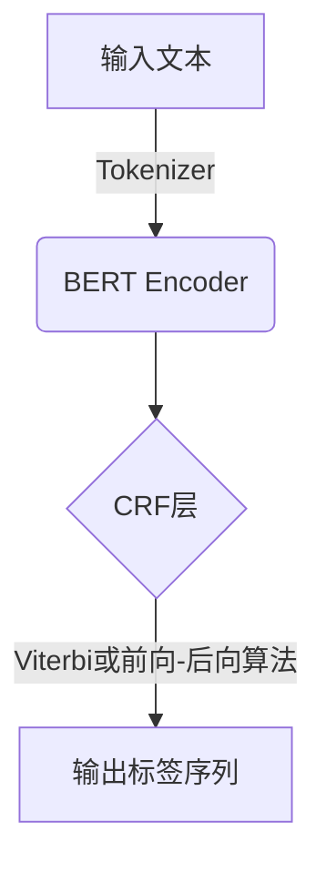

# Named Entity Recognition (NER)原理与代码实例讲解

## 1.背景介绍

在自然语言处理(NLP)领域中,命名实体识别(Named Entity Recognition,NER)是一项关键技术。它旨在从非结构化的自然语言文本中识别出命名实体,如人名、地名、组织机构名、时间表达式等,并对它们进行分类。NER广泛应用于信息提取、问答系统、知识图谱构建等场景。

随着深度学习技术的快速发展,基于神经网络的NER模型取得了令人瞩目的成就,显著提高了识别准确率。但传统的基于规则或统计模型的NER方法仍然在某些特定场景下保持优势,如处理领域特定语言或识别罕见实体等。

## 2.核心概念与联系

### 2.1 命名实体及其类型

命名实体通常指特定的人名、地名、组织机构名、时间表达式等实体。常见的命名实体类型包括:

- 人名(PER):如张三、李四等
- 地名(LOC):如北京、上海等 
- 组织机构名(ORG):如腾讯公司、中国人民银行等
- 时间(TIME):如2023年5月1日、下周三等

不同的应用场景可能需要识别其他特定类型的命名实体。

### 2.2 NER与序列标注

NER可以看作一个序列标注问题,即为输入文本序列中的每个单词赋予一个标记,表示它是否属于命名实体及其类型。常用的标注格式有BIO和BIOES等。

例如:

```
张三/B-PER 是/O 一位/O 优秀/O 的/O 程序员/O ,/O 他/B-PER 在/O 腾讯/B-ORG 公司/I-ORG 工作/O 。/O
```

这里B-PER表示人名的开始,I-ORG表示组织机构名的中间部分。

### 2.3 NER与其他NLP任务的关系

NER是NLP领域的基础技术,与其他任务密切相关:

- 信息抽取:NER是信息抽取的第一步
- 知识图谱构建:从文本中抽取实体及其关系构建知识图谱
- 问答系统:识别问题中的实体有助于理解问题意图
- 等等

## 3.核心算法原理具体操作步骤  

### 3.1 基于规则的NER

基于规则的NER是最早期的方法,通过手工定义一系列规则来识别命名实体。这种方法的优点是对特定领域的命名实体识别效果较好,但缺点是规则的构建成本高、缺乏通用性。

常用的规则包括:

- 词典匹配:使用预先构建的人名、地名等词典
- 规则模式匹配:如"X市"、"X公司"等模式匹配地名、机构名
- 上下文规则:利用上下文线索判断实体类型

### 3.2 基于统计模型的NER 

基于统计模型的NER方法通过机器学习从大量标注数据中自动学习特征模型,常用的有隐马尔可夫模型(HMM)、条件随机场(CRF)等。这种方法相比基于规则的方法具有更好的通用性,但需要大量高质量的标注语料。

以CRF为例,算法步骤如下:

1. 文本预处理:分词、词性标注等
2. 特征工程:构建单词、词性、上下文等特征
3. 训练CRF模型:给定标注语料,学习特征权重
4. 解码:对新输入序列,使用维特比算法等求解最优路径

### 3.3 基于深度学习的NER

近年来,基于深度学习的NER模型取得了卓越的成绩,如LSTM-CRF、BERT等。这些模型能够自动学习文本的深层语义特征,降低了特征工程的工作量。

以BERT为例,算法步骤如下:

1. 预训练:在大规模语料上预训练BERT模型,获取通用语义表示
2. 微调:在标注语料上微调BERT,学习NER特定的模型参数
3. 预测:对新输入序列,BERT编码后通过CRF层输出标签序列



## 4.数学模型和公式详细讲解举例说明

### 4.1 条件随机场(CRF)

CRF是一种常用的序列标注模型,能够有效利用输入序列的上下文信息。给定输入序列$X=(x_1,x_2,...,x_n)$和标签序列$Y=(y_1,y_2,...,y_n)$,CRF模型定义了联合概率:

$$P(Y|X)=\frac{1}{Z(X)}\exp\left(\sum_{i=1}^n\sum_k\lambda_kt_k(y_{i-1},y_i,X,i)\right)$$

其中:

- $Z(X)$是归一化因子
- $t_k$是特征函数,描述了标签序列与输入序列的某些特征
- $\lambda_k$是对应的权重参数

在训练阶段,通过最大化训练数据的对数似然函数来学习权重参数$\lambda$:

$$L(\lambda)=\sum_j\log P(Y^{(j)}|X^{(j)};\lambda)$$

在预测阶段,使用维特比算法或前向-后向算法求解最优标签序列:

$$Y^*=\arg\max_YP(Y|X)$$

### 4.2 LSTM-CRF

LSTM-CRF是一种常见的基于深度学习的NER模型,它结合了长短期记忆网络(LSTM)和CRF的优点。

LSTM能够捕获长距离的上下文依赖关系,为每个单词生成一个编码向量$h_i$:

$$h_i=\text{LSTM}(x_i,h_{i-1})$$

然后将LSTM的输出$h_i$作为CRF的输入特征,CRF负责计算标签序列的概率并解码。

在训练阶段,LSTM和CRF的参数通过反向传播算法联合优化。

### 4.3 BERT for NER

BERT(Bidirectional Encoder Representations from Transformers)是一种基于Transformer的预训练语言模型,在NER任务中表现出色。

BERT的编码器将输入序列映射为上下文敏感的词向量表示:

$$\boldsymbol{H}=\text{BERT}_\text{Encoder}(X)$$

然后将BERT的输出$\boldsymbol{H}$作为CRF层的输入特征,CRF层预测标签序列。

在预训练阶段,BERT在大规模语料上训练以获得通用语义表示能力。在微调阶段,BERT的参数在特定的NER任务数据上进行微调,使模型适应该任务。

## 5.项目实践:代码实例和详细解释说明

以下是一个使用BERT+CRF进行中文NER的PyTorch代码示例:

```python
import torch
import torch.nn as nn
from transformers import BertModel, BertTokenizer

# BERT模型和Tokenizer
bert_model = BertModel.from_pretrained('bert-base-chinese')
tokenizer = BertTokenizer.from_pretrained('bert-base-chinese')

# 标签映射
tag2idx = {"O": 0, "B-PER": 1, "I-PER": 2, "B-ORG": 3, "I-ORG": 4, "B-LOC": 5, "I-LOC": 6}

# BERT+CRF模型
class BertCRF(nn.Module):
    def __init__(self, bert_model, num_tags):
        super(BertCRF, self).__init__()
        self.bert = bert_model
        self.dropout = nn.Dropout(0.1)
        self.classifier = nn.Linear(768, num_tags)
        self.crf = CRF(num_tags)

    def forward(self, input_ids, token_type_ids=None, attention_mask=None, labels=None):
        outputs = self.bert(input_ids, token_type_ids=token_type_ids, attention_mask=attention_mask)
        sequence_output = outputs[0]
        sequence_output = self.dropout(sequence_output)
        emissions = self.classifier(sequence_output)
        return self.crf(emissions, labels)

# 训练代码
model = BertCRF(bert_model, len(tag2idx))
optimizer = torch.optim.Adam(model.parameters(), lr=2e-5)

for epoch in range(num_epochs):
    for batch in train_dataloader:
        # 准备输入
        input_ids = batch['input_ids'].to(device)
        attention_mask = batch['attention_mask'].to(device)
        labels = batch['labels'].to(device)

        # 前向传播
        loss = model(input_ids, attention_mask=attention_mask, labels=labels)[0]

        # 反向传播
        loss.backward()
        optimizer.step()
        optimizer.zero_grad()

# 预测代码 
with torch.no_grad():
    input_ids = tokenizer.encode("张三是一位优秀的程序员,他在腾讯公司工作。")
    emissions = model(torch.tensor([input_ids]).to(device))[0]
    tags = model.crf.decode(emissions)[0]
    entities = extract_entities(input_ids, tags, tag2idx)
    print(entities)
```

代码解释:

1. 导入BERT模型和Tokenizer,定义标签映射
2. 定义BERT+CRF模型,包括BERT编码器、线性分类层和CRF层
3. 训练阶段:
    - 准备输入数据(input_ids, attention_mask, labels)
    - 前向传播计算损失
    - 反向传播更新参数
4. 预测阶段:
    - 对新输入进行Tokenization
    - 通过BERT+CRF模型获取发射分数矩阵
    - 使用CRF层的decode函数求解最优标签序列
    - 从标签序列提取命名实体

## 6.实际应用场景

NER技术在许多实际应用场景中发挥着重要作用:

1. **信息抽取**: 从非结构化文本中抽取关键信息,如人物关系、事件等,构建知识库。
2. **问答系统**: 识别问题中的实体,有助于理解问题意图并给出准确答复。
3. **知识图谱构建**: 从大规模文本语料中抽取实体及其关系,构建知识图谱。
4. **生物医学领域**: 识别疾病名称、基因、蛋白质等实体,用于医学文献挖掘。
5. **舆情监控**: 从社交媒体等渠道识别相关实体,跟踪热点事件和舆论走向。
6. **个性化推荐**: 通过识别用户查询中的实体,为其推荐相关内容。

## 7.工具和资源推荐

以下是一些流行的NER工具和资源:

- **开源工具**:
    - SpaCy: 提供快速的NER模型,支持多种语言
    - Stanford NER: 斯坦福开发的基于CRF的NER工具
    - NLTK: Python的NLP工具包,包含一些基础的NER功能
- **深度学习框架**:
    - PyTorch/TensorFlow: 流行的深度学习框架,可用于构建NER模型
    - Transformers(Hugging Face): 提供BERT等预训练语言模型,适用于NER任务
- **预训练模型**:
    - BERT/RoBERTa/ALBERT等Transformer模型
    - ELMo/GPT等预训练语言模型
- **数据集**:
    - CoNLL 2003: 常用的英文NER数据集
    - OntoNotes 5.0: 大规模多语言NER数据集
    - MSRA: 常用的中文NER数据集
    - 领域特定数据集:如生物医学、法律等领域的NER数据集

## 8.总结:未来发展趋势与挑战

NER技术在过去几年取得了长足进步,但仍面临一些挑战和发展方向:

1. **Few-shot和Zero-shot学习**: 减少对大规模标注数据的依赖,提高模型的泛化能力。
2. **跨领域和多语言NER**: 提高模型在不同领域和语言上的适用性和鲁棒性。
3. **实体链接和关系抽取**: 将NER与实体链接和关系抽取相结合,构建更完整的知识图谱。
4. **上下文感知和推理能力**: 赋予模型更强的上下文理解和推理能力,提高识别复杂实体的准确性。
5. **可解释性和可控性**: 提高NER模型的可解释性和可控性,确保其公平性和透明度。
6. **模型压缩和加速**: 在保证性能的前提下,降低模型的计算和存储开销,适应移动和边缘设备的需求。

未来,