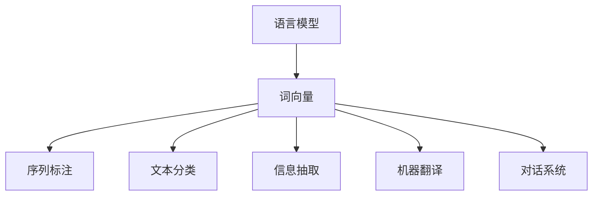

# Natural Language Processing (NLP)原理与代码实例讲解

## 1.背景介绍

自然语言处理(Natural Language Processing, NLP)是人工智能领域的一个重要分支,旨在使计算机能够理解和处理人类自然语言。随着大数据时代的到来,海量的自然语言数据不断涌现,对NLP技术的需求与日俱增。NLP已广泛应用于机器翻译、问答系统、信息检索、情感分析等诸多领域。

## 2.核心概念与联系

NLP的核心概念包括:

### 2.1 语言模型(Language Model)

语言模型用于估计一个句子或序列的概率,是NLP的基础模块。常见的语言模型包括N-gram模型、神经网络语言模型等。

### 2.2 词向量(Word Embedding)

词向量是将词映射到连续的向量空间中的技术,能够捕捉词与词之间的语义关系。常见的词向量模型有Word2Vec、GloVe等。

### 2.3 序列标注(Sequence Labeling)

序列标注任务旨在为输入序列中的每个元素贴上标签,如命名实体识别、词性标注等。

### 2.4 文本分类(Text Classification)

文本分类是将文本数据划分到预定义类别的任务,如情感分析、垃圾邮件过滤等。

### 2.5 信息抽取(Information Extraction)

信息抽取旨在从非结构化文本中提取出结构化信息,如关系抽取、事件抽取等。

### 2.6 机器翻译(Machine Translation)

机器翻译是将一种自然语言转换为另一种自然语言的任务。

### 2.7 对话系统(Dialogue System)

对话系统能够与人类进行自然语言对话交互,如问答系统、聊天机器人等。

这些核心概念相互关联,构成了NLP的基本框架。

## 3.核心算法原理具体操作步骤

### 3.1 语言模型

#### 3.1.1 N-gram模型

N-gram模型是基于统计学习的语言模型,根据历史n-1个词来预测当前词的概率。具体步骤如下:

1. 构建语料库,统计n-gram及其出现次数
2. 使用加平滑技术(如Laplace平滑)估计n-gram概率
3. 给定历史词序列,根据链式法则计算整个句子概率

$$P(w_1,w_2,...,w_n) = \prod_{i=1}^n P(w_i|w_1,...,w_{i-1})$$

其中,$ P(w_i|w_1,...,w_{i-1}) $可由n-gram模型估计得到。

#### 3.1.2 神经网络语言模型

神经网络语言模型使用神经网络来建模语言,通常包含以下步骤:

1. 将词映射为词向量
2. 使用循环神经网络(如LSTM)对历史词序列建模
3. 输出层给出当前词的概率分布

$$y = \text{softmax}(W_o h_t + b_o)$$

其中$h_t$是LSTM在时间步t的隐藏状态,$W_o$和$b_o$是输出层权重和偏置。

### 3.2 词向量

#### 3.2.1 Word2Vec

Word2Vec包含两种模型:Skip-gram和CBOW(Continuous Bag-of-Words)。以Skip-gram为例,具体步骤如下:

1. 对每个中心词,抽取上下文窗口内的上下文词
2. 使用softmax计算中心词预测每个上下文词的概率
3. 反向传播调整词向量和神经网络权重,最大化上下文词的预测概率

$$P(w_c|w_o) = \frac{e^{v_{w_o}^{\top}v'_{w_c}}}{\sum_{w=1}^{V}e^{v_{w}^{\top}v'_{w_c}}}$$

其中$v_w$和$v'_w$分别是输入和输出词向量。

#### 3.2.2 GloVe

GloVe(Global Vectors for Word Representation)基于词共现统计信息构建词向量。具体步骤:

1. 构建共现矩阵$X$,其中$X_{ij}$表示词i和词j的共现次数
2. 构造代价函数,使词向量内积接近对数共现概率
3. 采用梯度下降等优化算法最小化代价函数,得到词向量

$$J = \sum_{i,j=1}^{V}f(X_{ij})(w_i^{\top}\tilde{w}_j + b_i + \tilde{b}_j - \log X_{ij})^2$$

其中$w_i$和$\tilde{w}_j$是词向量,$b_i$和$\tilde{b}_j$是偏置项,$f(x)$是权重函数。

### 3.3 序列标注

#### 3.3.1 隐马尔可夫模型(HMM)

HMM是一种常用的序列标注模型,包含以下步骤:

1. 定义观测序列$O$和隐藏状态序列$Q$
2. 定义初始概率$\pi$、转移概率$A$和发射概率$B$
3. 使用前向算法计算观测序列概率:$P(O|\lambda) = \sum_Q \pi(q_1)b_{q_1}(o_1)\prod_{t=2}^T a_{q_{t-1}q_t}b_{q_t}(o_t)$
4. 使用维特比算法求解最优隐藏状态序列:$Q^* = \arg\max_Q P(Q|O,\lambda)$

#### 3.3.2 条件随机场(CRF)

CRF是一种判别式序列标注模型,具体步骤如下:

1. 定义特征函数$f_k(y_t,y_{t-1},X)$,表示当前和前一标签及观测序列的特征
2. 定义模型参数$\lambda_k$,对应每个特征函数的权重
3. 计算条件概率:$P(Y|X) = \frac{1}{Z(X)}\exp\left(\sum_{t=1}^T\sum_k\lambda_kf_k(y_t,y_{t-1},X)\right)$
4. 使用算法(如LBFGS)最大化对数似然,求解参数$\lambda$
5. 对新序列,使用维特比算法求解最优标签序列$Y^*$

### 3.4 文本分类

#### 3.4.1 朴素贝叶斯

朴素贝叶斯是一种简单而有效的文本分类模型,基于贝叶斯定理和特征条件独立假设。具体步骤:

1. 计算先验概率$P(c)$和条件概率$P(x|c)$
2. 对新文本$X$,使用贝叶斯定理计算后验概率:$P(c|X) = \frac{P(X|c)P(c)}{P(X)}$
3. 选择最大后验概率对应的类别作为预测结果:$c^* = \arg\max_c P(c|X)$

其中,条件概率$P(x|c)$通常使用多项式模型或高斯模型估计。

#### 3.4.2 神经网络模型

近年来,神经网络在文本分类任务上表现优异,常用模型有:

- **CNN**: 使用卷积神经网络提取文本的局部特征
- **RNN(LSTM/GRU)**: 使用循环神经网络捕捉文本的长程依赖
- **Attention**: 通过注意力机制聚焦文本中的关键信息
- **Transformer**: 基于自注意力机制的Transformer模型

通常将上述模型的输出传递给全连接层,使用softmax获得各类别的概率分布。

### 3.5 信息抽取

#### 3.5.1 命名实体识别(NER)

NER旨在从文本中识别出命名实体(如人名、地名、组织机构名等),常用的模型有:

- **HMM/CRF**: 将NER问题建模为序列标注任务
- **BiLSTM/BiLSTM-CRF**: 使用双向LSTM捕捉上下文信息
- **BERT/BERT+CRF**: 利用预训练语言模型BERT的强大表示能力

#### 3.5.2 关系抽取

关系抽取是从文本中识别出实体对之间的语义关系,主要分为以下步骤:

1. 命名实体识别: 识别出文本中的实体
2. 构建实体对: 枚举所有实体对
3. 关系分类: 对每个实体对,判断它们之间是否存在特定关系

常用的关系分类模型包括基于特征工程的统计模型、基于神经网络的模型等。

### 3.6 机器翻译

机器翻译的核心是将源语言序列映射到目标语言序列,主要有以下几种模型:

#### 3.6.1 统计机器翻译(SMT)

SMT基于源语言和目标语言的对偶语料,使用统计学习方法建模翻译过程。主要步骤包括:

1. 单词对齐: 从对偶语料中学习源语言和目标语言单词之间的对应关系
2. 翻译模型: 估计目标语言序列给定源语言序列的概率
3. 语言模型: 估计目标语言序列的概率,确保其通顺
4. 解码: 给定源语言序列,搜索概率最大的目标语言序列作为翻译结果

#### 3.6.2 神经机器翻译(NMT)

NMT使用序列到序列(Seq2Seq)模型,通过编码器捕获源语言序列的特征表示,解码器生成目标语言序列。主要步骤包括:

1. 编码器(如LSTM)读取源语言序列,得到上下文向量$c$
2. 解码器初始化为开始符`<start>`
3. 每个时间步,解码器根据$c$和前一隐藏状态,生成当前目标词的概率分布
4. 贪婪搜索或beam search得到最终序列作为翻译结果

Transformer是一种流行的NMT模型,使用自注意力机制替代RNN,提高了并行能力。

### 3.7 对话系统

对话系统通常包含自然语言理解(NLU)和自然语言生成(NLG)两个模块。

#### 3.7.1 自然语言理解

NLU的目标是从用户输入中提取出语义表示,主要包括以下任务:

- 意图识别: 判断用户的对话意图(如查询天气、订购机票等)
- 槽填充: 从用户输入中抽取出对话所需的信息(如出发地、目的地等)

常用的NLU模型有基于机器学习的分类模型、基于序列标注的模型等。

#### 3.7.2 自然语言生成

NLG的目标是根据对话状态生成自然语言响应,主要有两种方式:

- 基于模板: 预定义一些模板,将槽位信息填入模板生成响应
- 基于模型: 使用Seq2Seq等生成式模型,直接从对话状态生成响应

此外,还需要考虑对话管理模块,维护对话状态并决策下一步动作。

## 4.数学模型和公式详细讲解举例说明

### 4.1 语言模型

N-gram模型的核心是估计n-gram的概率,常用的平滑技术有:

- 加法平滑(Laplace平滑): $P(w_i|w_1,...,w_{i-1}) = \frac{C(w_1,...,w_i)+\alpha}{C(w_1,...,w_{i-1})+\alpha V}$
- 回退平滑(Katz平滑): $P(w_i|w_1,...,w_{i-1}) = \begin{cases} \frac{C(w_1,...,w_i)}{C(w_1,...,w_{i-1})} & \text{if }C(w_1,...,w_i)>0\\ \alpha(w_{i-n+1},...,w_{i-1})P_n(w_i) & \text{otherwise}\end{cases}$

其中,$C$表示计数,$V$是词汇量,$\alpha$是平滑参数,$P_n$是回退到较低阶n-gram模型。

神经网络语言模型使用softmax层输出词的概率分布,对于大词汇量,需要采用一些技巧(如分级softmax、自注意力等)来降低计算复杂度。

### 4.2 词向量

Word2Vec的目标是最大化目标函数:

$$\max_{\theta}\frac{1}{T}\sum_{t=1}^T\sum_{-c\leq j\leq c,j\neq 0}\log P(w_{