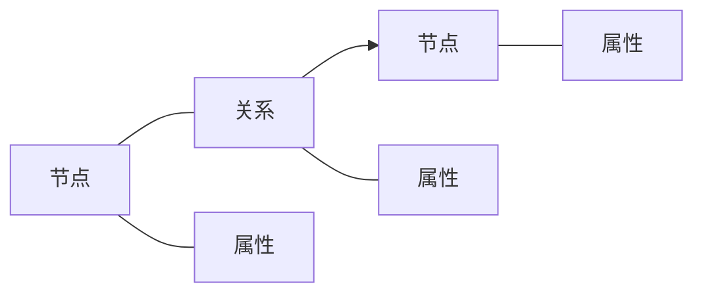

# Neo4j原理与代码实例讲解

## 1.背景介绍

### 1.1 图数据库的兴起
随着大数据时代的到来,传统的关系型数据库在处理高度关联的复杂数据时遇到了瓶颈。图数据库作为一种新兴的NoSQL数据库,其天然的图结构和灵活的数据模型,使其在处理高度关联数据时具有独特的优势。

### 1.2 Neo4j的崛起 
Neo4j作为目前最成熟和广泛使用的图数据库之一,自2007年诞生以来,凭借其出色的性能、灵活性和可扩展性,在众多图数据库中脱颖而出。越来越多的企业和组织开始使用Neo4j来存储和分析复杂的关联数据。

### 1.3 Neo4j的应用场景
Neo4j在社交网络、推荐系统、欺诈检测、知识图谱、网络与IT运维等领域得到了广泛应用。这些场景都涉及到高度关联的数据,需要快速的图遍历和复杂的图形匹配,这正是Neo4j的强项。

## 2.核心概念与联系

### 2.1 图的基本概念
在讨论Neo4j之前,我们需要先了解一些图论的基本概念:
- 节点(Node):图中的基本单元,代表实体对象
- 关系(Relationship):连接节点的有向边,表示节点之间的关联
- 属性(Property):节点和关系都可以包含属性,是键值对形式的数据

### 2.2 Neo4j的数据模型  
Neo4j采用属性图模型(Property Graph Model)来表示和存储数据。属性图由节点和关系构成,节点和关系都可以包含属性。这种灵活的数据模型能够直观地表达现实世界中的复杂关系。

### 2.3 Cypher查询语言
Cypher是Neo4j的声明式查询语言,它专门为图数据库设计,语法简洁直观。Cypher支持模式匹配、图遍历、聚合、排序、条件过滤等常见操作,功能非常强大。



## 3.核心算法原理具体操作步骤

### 3.1 图遍历算法
图遍历是图数据库的核心操作之一,常见的图遍历算法有:
- 深度优先搜索(DFS):沿着一条路径向前探索,直到无法继续,然后回溯到最近的岔路口,选择另一条路径继续遍历。
- 广度优先搜索(BFS):从起始节点开始,先遍历所有邻接节点,然后再遍历邻接节点的邻接节点,依次类推。

### 3.2 最短路径算法
在图中寻找两个节点之间的最短路径是一个常见的问题,常用的最短路径算法有:
- Dijkstra算法:适用于边权重非负的加权图,时间复杂度为O((V+E)logV)。
- A*算法:在Dijkstra算法的基础上引入启发函数,可以更快地找到最短路径。

### 3.3 社区发现算法
社区发现旨在找出图中紧密相连的节点群组,常用算法有:
- Louvain算法:基于模块度优化的贪心算法,可以快速发现层次化的社区结构。
- LPA(Label Propagation Algorithm):通过标签传播的方式进行社区划分,简单高效。

### 3.4 中心性分析
中心性分析用于衡量节点在图中的重要程度,常见的中心性指标有:  
- 度中心性(Degree Centrality):与节点直接相连的边数。
- 介数中心性(Betweenness Centrality):节点出现在其他节点之间最短路径上的频次。
- 接近中心性(Closeness Centrality):节点到其他所有节点的平均最短距离的倒数。

## 4.数学模型和公式详细讲解举例说明

### 4.1 图的数学表示
图可以用邻接矩阵或邻接表来表示。设图G=(V,E),V为节点集合,E为边集合。

邻接矩阵A是一个n×n的方阵(n为节点数),当节点i和j之间有边相连时,$A_{ij}=1$,否则$A_{ij}=0$。

邻接表是一个长度为n的数组,每个元素都是一个链表,存储与该节点相连的节点。

### 4.2 最短路径算法
以Dijkstra算法为例,设起点为s,距离为dist[],初始化dist[s]=0,其余dist[i]=∞。

每次从未确定最短路径的节点中选择dist最小的节点u,然后更新u的邻居v的dist:

$$
dist[v]=min(dist[v], dist[u]+w(u,v))
$$

其中w(u,v)为边(u,v)的权重。重复上述过程直到所有节点都确定了最短路径。

### 4.3 PageRank算法
PageRank是一种用于评估节点重要性的算法,最初用于网页排名。

设图有n个节点,PageRank值为PR,初始化所有PR值为1/n。每次迭代更新PR值:

$$
PR(i)=\frac{1-d}{n}+d\sum_{j\in B(i)}\frac{PR(j)}{L(j)}
$$

其中d为阻尼系数(一般取0.85),B(i)为指向节点i的节点集合,L(j)为节点j的出度。

不断迭代直到PR值收敛。

## 5.项目实践：代码实例和详细解释说明

下面我们通过一个简单的电影图谱示例来演示Neo4j的使用。

### 5.1 数据建模
我们的电影图谱包含以下实体和关系:
- 电影(Movie):属性有名称、发行年份、类型
- 人物(Person):属性有姓名、性别、出生日期
- 电影和人物之间的关系:ACTED_IN(出演)、DIRECTED(导演)

### 5.2 数据导入
首先我们需要将数据导入到Neo4j数据库中,可以使用Cypher语句批量创建节点和关系:

```cypher
// 创建电影节点
CREATE (m1:Movie {title: 'The Matrix', released: 1999, genre: 'Sci-Fi'})
CREATE (m2:Movie {title: 'The Matrix Reloaded', released: 2003, genre: 'Sci-Fi'})
CREATE (m3:Movie {title: 'The Matrix Revolutions', released: 2003, genre: 'Sci-Fi'})

// 创建人物节点
CREATE (p1:Person {name: 'Keanu Reeves', born: 1964})  
CREATE (p2:Person {name: 'Laurence Fishburne', born: 1961})
CREATE (p3:Person {name: 'Carrie-Anne Moss', born: 1967})
CREATE (p4:Person {name: 'Hugo Weaving', born: 1960})
CREATE (p5:Person {name: 'Lilly Wachowski', born: 1967})
CREATE (p6:Person {name: 'Lana Wachowski', born: 1965})

// 创建关系
CREATE (p1)-[:ACTED_IN {role: 'Neo'}]->(m1) 
CREATE (p1)-[:ACTED_IN {role: 'Neo'}]->(m2)
CREATE (p1)-[:ACTED_IN {role: 'Neo'}]->(m3)
CREATE (p2)-[:ACTED_IN {role: 'Morpheus'}]->(m1)
CREATE (p2)-[:ACTED_IN {role: 'Morpheus'}]->(m2)
CREATE (p2)-[:ACTED_IN {role: 'Morpheus'}]->(m3)
CREATE (p3)-[:ACTED_IN {role: 'Trinity'}]->(m1)  
CREATE (p3)-[:ACTED_IN {role: 'Trinity'}]->(m2)
CREATE (p3)-[:ACTED_IN {role: 'Trinity'}]->(m3)
CREATE (p4)-[:ACTED_IN {role: 'Agent Smith'}]->(m1)
CREATE (p4)-[:ACTED_IN {role: 'Agent Smith'}]->(m2)
CREATE (p4)-[:ACTED_IN {role: 'Agent Smith'}]->(m3)
CREATE (p5)-[:DIRECTED]->(m1)
CREATE (p6)-[:DIRECTED]->(m1) 
CREATE (p5)-[:DIRECTED]->(m2)
CREATE (p6)-[:DIRECTED]->(m2)
CREATE (p5)-[:DIRECTED]->(m3)
CREATE (p6)-[:DIRECTED]->(m3)
```

### 5.3 数据查询
导入数据后,我们可以使用Cypher语句进行各种查询和分析。

#### 5.3.1 查询电影的基本信息
```cypher
MATCH (m:Movie)
RETURN m.title, m.released, m.genre
```

#### 5.3.2 查询电影的演员
```cypher
MATCH (m:Movie {title: 'The Matrix'})<-[:ACTED_IN]-(p:Person)
RETURN p.name, p.born
```

#### 5.3.3 查询演员出演的电影
```cypher
MATCH (p:Person {name: 'Keanu Reeves'})-[:ACTED_IN]->(m:Movie)
RETURN m.title, m.released
```

#### 5.3.4 查询电影的导演
```cypher
MATCH (m:Movie {title: 'The Matrix'})<-[:DIRECTED]-(d:Person) 
RETURN d.name, d.born
```

#### 5.3.5 查询演员合作过的导演
```cypher
MATCH (a:Person {name: 'Keanu Reeves'})-[:ACTED_IN]->(:Movie)<-[:DIRECTED]-(d:Person)
RETURN DISTINCT d.name, d.born
```

#### 5.3.6 查询演员的共同合作者
```cypher  
MATCH (a1:Person {name: 'Keanu Reeves'})-[:ACTED_IN]->(:Movie)<-[:ACTED_IN]-(a2:Person)
WHERE a1 <> a2
RETURN DISTINCT a2.name, a2.born
```

### 5.4 图算法应用
除了基本的查询和分析,我们还可以在Neo4j中应用图算法来挖掘更深层次的见解。

#### 5.4.1 PageRank算法
使用PageRank算法评估演员的重要性:

```cypher
CALL gds.pageRank.stream('Person', 'ACTED_IN', {maxIterations: 20, dampingFactor: 0.85})
YIELD nodeId, score
RETURN gds.util.asNode(nodeId).name AS name, score
ORDER BY score DESC
```

#### 5.4.2 社区发现
使用Louvain算法发现演员社区:

```cypher
CALL gds.louvain.stream('Person', 'ACTED_IN', {})
YIELD nodeId, communityId, intermediateCommunityIds
RETURN gds.util.asNode(nodeId).name AS name, communityId
ORDER BY communityId ASC
```

## 6.实际应用场景

Neo4j在很多领域都有广泛应用,下面列举几个典型场景:

### 6.1 社交网络分析
利用Neo4j可以存储和分析社交网络数据,例如:
- 好友推荐:通过分析用户的共同好友、兴趣爱好等,给用户推荐潜在的好友
- 社区发现:挖掘社交网络中的紧密社区,分析社区的特征和演化
- 影响力分析:评估用户在社交网络中的影响力,发现关键意见领袖

### 6.2 知识图谱
Neo4j是构建知识图谱的理想工具。知识图谱通过实体及其关系来表示领域知识,常见应用有:  
- 语义搜索:利用知识图谱实现更智能的语义搜索,理解用户的查询意图
- 问答系统:基于知识图谱构建自动问答系统,回答用户的自然语言问题
- 推荐系统:利用知识图谱中的关联信息,给用户提供个性化推荐

### 6.3 欺诈检测
Neo4j在欺诈检测领域大显身手。通过图数据库,可以揭示数据中隐藏的欺诈模式,例如:
- 金融诈骗:分析资金流动图,发现异常的环形交易、频繁转账等欺诈行为
- 保险欺诈:挖掘投保人、受益人、理赔等数据之间的可疑关联,识别欺诈风险
- 身份欺诈:通过关联分析,发现虚假身份、身份盗用等欺诈行为

### 6.4 网络与IT运维
Neo4j可以用于存储和管理IT基础设施数据,例如:
- 网络拓扑管理:存储网络设备及其连接关系,实现网络拓扑的可视化和分析
- 应用依赖分析:分析应用系统的组件依赖关系,评估变更影响范围
- 故障诊断:通过图数据库,快速定位故障根源,缩短故障恢复时间

## 7.工具和资源推荐

### 7.1 Neo4