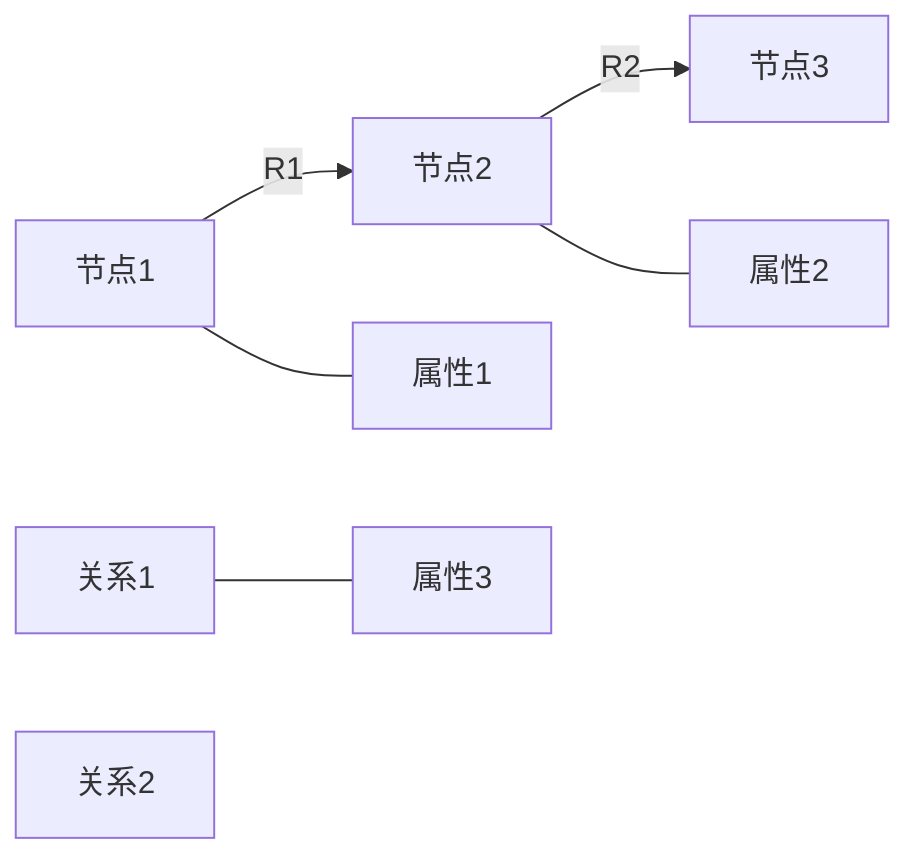
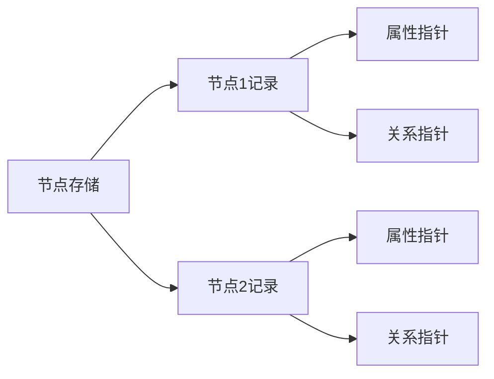
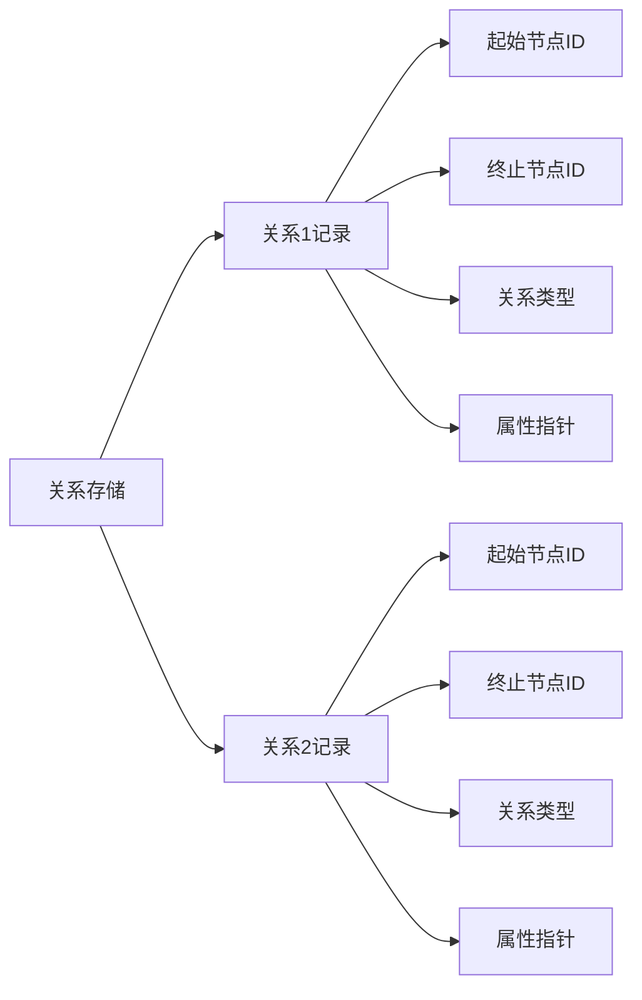
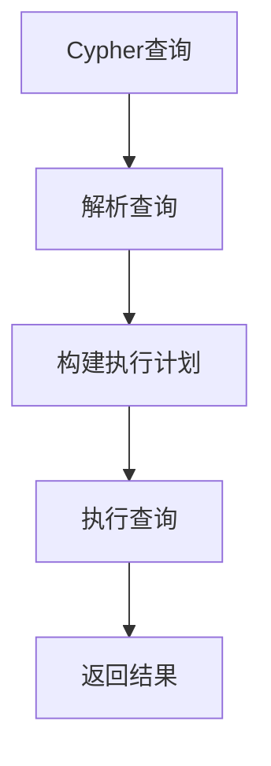
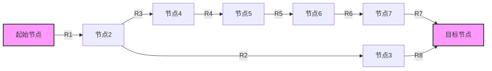
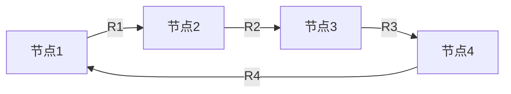

# Neo4j图数据库原理与Cypher代码实例讲解

## 1.背景介绍

### 1.1 数据库发展简史

在当今数据主导的世界中,数据库扮演着至关重要的角色。早期的数据库系统采用层级模型和网状模型,但由于其复杂性和局限性,很快被关系模型所取代。关系模型的出现极大地简化了数据的存储和管理,成为主流数据库的基础。

然而,随着数据量和复杂性的不断增加,关系模型也暴露出了一些缺陷。特别是在处理高度连接的数据时,关系模型的查询效率较低,导致性能下降。这促使了NoSQL(Not Only SQL)数据库的兴起,其中包括键值存储、文档存储、列族存储和图数据库等。

### 1.2 图数据库的兴起

图数据库是NoSQL数据库中的一种,它使用图形结构高效地存储和查询高度连接的数据。与关系数据库将数据存储在表格中不同,图数据库将数据存储为节点(nodes)和关系(relationships),能够自然地表示任何类型的数据。

图数据库擅长处理复杂的数据模型,例如社交网络、推荐系统、欺诈检测和知识图谱等。它们提供了高效的本地查询能力,可以快速遍历图形数据,执行复杂的图形查询和分析。

Neo4j是当前最流行和最成熟的图数据库之一,它提供了一种声明式的查询语言Cypher,使得查询图形数据变得简单直观。

## 2.核心概念与联系

### 2.1 图数据库的核心概念

图数据库的核心概念包括节点(Node)、关系(Relationship)和属性(Property)。

- 节点(Node)用于表示实体,如人、地点、事物等。
- 关系(Relationship)用于连接节点,描述它们之间的关联。
- 属性(Property)是附加在节点和关系上的键值对,用于存储相关信息。



### 2.2 Neo4j和Cypher简介

Neo4j是一个高性能的本地图数据库,完全用Java编写,支持ACID(原子性、一致性、隔离性和持久性)事务。它提供了一种声明式的查询语言Cypher,使得查询图形数据变得简单直观。

Cypher是Neo4j的查询语言,它采用了类SQL的语法,但专门针对图形数据进行了优化。Cypher查询通过模式匹配来遍历图形数据,可以执行插入、更新、删除和读取操作。

## 3.核心算法原理具体操作步骤

### 3.1 Neo4j的存储引擎

Neo4j采用本地存储引擎,将数据存储在磁盘上的文件中。它使用两种不同的存储布局:节点存储(Node Store)和关系存储(Relationship Store)。

#### 3.1.1 节点存储

节点存储是一个文件,其中每个记录对应一个节点。每个节点记录包含以下信息:

- 节点ID:唯一标识该节点
- 属性指针:指向该节点的属性存储位置
- 关系指针:指向该节点的关系存储位置



#### 3.1.2 关系存储

关系存储也是一个文件,其中每个记录对应一个关系。每个关系记录包含以下信息:

- 关系ID:唯一标识该关系
- 起始节点ID:该关系的起始节点ID
- 终止节点ID:该关系的终止节点ID
- 关系类型:描述该关系的类型
- 属性指针:指向该关系的属性存储位置



### 3.2 Neo4j的查询执行流程

当执行一个Cypher查询时,Neo4j会遵循以下步骤:

1. **解析查询**:将Cypher查询语句解析为查询计划。
2. **构建执行计划**:根据查询计划构建执行计划,包括选择合适的索引和执行顺序。
3. **执行查询**:遍历图形数据,执行查询操作。
4. **返回结果**:将查询结果返回给客户端。



#### 3.2.1 查询优化

Neo4j采用了多种查询优化技术,以提高查询性能:

- **索引**:Neo4j支持多种索引,如标签扫描索引、属性索引和全文索引,用于加速查询。
- **查询重写**:Neo4j会自动重写查询,以利用可用的索引和优化查询执行计划。
- **查询缓存**:Neo4j会缓存执行计划和查询结果,以加速重复查询。

#### 3.2.2 遍历算法

Neo4j采用多种图形遍历算法,用于高效地查询图形数据:

- **深度优先搜索(DFS)**:从起始节点开始,沿着关系深入遍历,直到找到目标节点或达到最大深度。
- **广度优先搜索(BFS)**:从起始节点开始,逐层遍历相邻节点,直到找到目标节点或达到最大层数。
- **最短路径算法**:计算起始节点和目标节点之间的最短路径,如Dijkstra算法和A*算法。



## 4.数学模型和公式详细讲解举例说明

### 4.1 图形表示

图形可以用数学模型表示为$G=(V,E)$,其中$V$是节点集合,而$E$是关系集合。每个关系$e\in E$连接两个节点$u,v\in V$,表示为$e=(u,v)$。

$$
V = \{v_1, v_2, \ldots, v_n\} \\
E = \{e_1, e_2, \ldots, e_m\} \\
e_i = (u, v), u, v \in V
$$

### 4.2 邻接矩阵

邻接矩阵是一种常用的图形表示方法。对于一个有$n$个节点的图$G$,其邻接矩阵$A$是一个$n\times n$的矩阵,其中$A_{ij}$表示节点$i$和节点$j$之间是否有关系。

$$
A_{ij} = \begin{cases}
1, & \text{if } (v_i, v_j) \in E \\
0, & \text{otherwise}
\end{cases}
$$

例如,对于下图:



其邻接矩阵为:

$$
A = \begin{bmatrix}
0 & 1 & 0 & 1 \\
1 & 0 & 1 & 0 \\
0 & 1 & 0 & 1 \\
1 & 0 & 1 & 0
\end{bmatrix}
$$

### 4.3 最短路径算法

最短路径算法是图论中一个重要的问题,用于计算两个节点之间的最短路径。常见的算法包括Dijkstra算法和A*算法。

#### 4.3.1 Dijkstra算法

Dijkstra算法是一种计算单源最短路径的贪心算法。给定一个加权图$G=(V,E)$和源节点$s\in V$,Dijkstra算法可以计算出$s$到其他所有节点的最短路径。

算法的基本思想是从源节点$s$开始,不断扩展到邻居节点,并更新到达每个节点的最短距离。算法维护一个优先队列,按照距离从小到大排序,每次从队列中取出距离最小的节点,并更新其邻居节点的距离。

设$dist(u)$表示从$s$到$u$的最短距离,算法的时间复杂度为$O((|V|+|E|)\log|V|)$。

```python
def dijkstra(graph, source):
    dist = {node: float('inf') for node in graph}
    dist[source] = 0
    pq = [(0, source)]
    while pq:
        cur_dist, cur_node = heapq.heappop(pq)
        if cur_dist > dist[cur_node]:
            continue
        for neighbor, weight in graph[cur_node].items():
            new_dist = cur_dist + weight
            if new_dist < dist[neighbor]:
                dist[neighbor] = new_dist
                heapq.heappush(pq, (new_dist, neighbor))
    return dist
```

#### 4.3.2 A*算法

A*算法是一种启发式搜索算法,常用于计算两个节点之间的最短路径。它结合了Dijkstra算法的最短路径思想和启发式函数,以更高的效率寻找最短路径。

A*算法使用一个评估函数$f(n)=g(n)+h(n)$,其中$g(n)$是从起始节点到当前节点$n$的实际距离,而$h(n)$是一个启发式函数,估计从当前节点$n$到目标节点的距离。算法维护一个优先队列,按照$f(n)$的值从小到大排序,每次从队列中取出$f(n)$最小的节点进行扩展。

A*算法的时间复杂度取决于启发式函数的质量。如果启发式函数是准确的,则时间复杂度为$O(|V|+|E|)$,否则会增加。

```python
def heuristic(node, goal):
    # 计算当前节点到目标节点的估计距离
    return abs(node[0] - goal[0]) + abs(node[1] - goal[1])

def a_star(graph, start, goal):
    frontier = PriorityQueue()
    frontier.put(start, 0)
    came_from = {}
    cost_so_far = {}
    came_from[start] = None
    cost_so_far[start] = 0

    while not frontier.empty():
        current = frontier.get()

        if current == goal:
            break

        for next in graph.neighbors(current):
            new_cost = cost_so_far[current] + graph.cost(current, next)
            if next not in cost_so_far or new_cost < cost_so_far[next]:
                cost_so_far[next] = new_cost
                priority = new_cost + heuristic(next, goal)
                frontier.put(next, priority)
                came_from[next] = current

    return came_from, cost_so_far
```

## 5.项目实践：代码实例和详细解释说明

在本节中,我们将通过一个实际的项目示例来演示如何使用Neo4j和Cypher查询语言。我们将构建一个简单的社交网络应用程序,并展示如何执行各种查询操作。

### 5.1 数据模型

我们的社交网络应用程序包含以下实体:

- `Person`节点:表示用户
- `Post`节点:表示用户发布的帖子
- `FRIEND`关系:连接两个`Person`节点,表示他们是朋友
- `AUTHORED`关系:连接`Person`节点和`Post`节点,表示该用户发