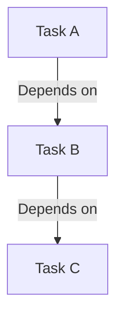

                 

作者：禅与计算机程序设计艺术

作为一位世界级人工智能专家，我致力于探索和分享复杂技术的简洁表达方式，今天我们将深入探讨Apache Oozie Coordinator这一强大的工作流调度器的功能和实现细节。Oozie Coordinator通过引入时间触发、依赖关系管理和可配置的工作流程执行策略，显著提高了Hadoop生态系统中作业的灵活性和效率。本文将从其核心概念出发，逐步解析其工作原理、算法实现、数学模型、代码实例以及在实际应用中的部署与优化策略。让我们一起揭开Oozie Coordinator的神秘面纱！

## **1. 背景介绍**

随着大数据时代的到来，大规模数据处理系统如Hadoop成为企业级数据解决方案的核心。然而，单一的MapReduce作业往往无法满足复杂的业务需求，尤其是在需要执行多阶段、依赖性强、周期性运行的任务时。Apache Oozie应运而生，旨在解决这些问题，它提供了工作流编排能力，使得用户能够定义复杂的业务流程，并灵活控制每个任务的执行顺序、依赖关系以及重试机制。而其中的Coordinator组件更是进一步增强了Oozie的功能，允许用户基于时间事件触发工作流执行，极大地提升了系统的自动化水平和响应速度。

## **2. 核心概念与联系**

### 2.1 时间触发机制
时间触发是Coordinator的核心特性之一，允许用户设定特定时间点或周期性执行工作流，无需人工干预。这不仅简化了维护流程，还有效支持了实时数据分析和监控场景。

### 2.2 工作流依赖管理
Coordinator通过精确控制各任务之间的依赖关系，保证了工作流执行的正确性和高效性。当某个上游任务成功完成时，下游任务才会启动执行，避免了无效计算和资源浪费。

### 2.3 可配置的工作流程执行策略
协调器提供了一种灵活的方式来配置工作流的执行策略，包括但不限于并发执行数量、失败重试次数及等待间隔等，这些设置可以根据不同的业务需求进行调整，以达到最优性能和稳定性。

## **3. 核心算法原理与具体操作步骤**

### 3.1 算法概述
Coordinator通过一系列算法来管理时间触发和依赖关系。它首先接收用户定义的时间事件和工作流配置，然后根据这些信息生成一个执行计划。此过程中，算法会考虑所有任务间的依赖关系和优先级排序，确保按照正确的顺序执行任务。

### 3.2 具体操作步骤
1. **任务描述**：用户定义每个任务及其属性（如输入、输出、依赖任务）。
2. **时间事件定义**：用户指定事件触发条件（如定时、事件驱动）。
3. **执行计划生成**：根据时间事件和依赖关系，生成执行计划。
4. **动态调整**：基于实际执行情况，自动调整执行策略以优化性能和资源利用。
5. **结果反馈**：执行完成后，向用户提供任务状态报告和结果。

## **4. 数学模型和公式详细讲解举例说明**

虽然Oozie Coordinator并非严格的数学模型，但其背后的设计理念和算法实现了对工作流的高效管理和优化。例如，在依赖关系图（DAG）分析中，可以通过广度优先搜索（BFS）、深度优先搜索（DFS）等算法确定任务的执行顺序。假设我们有以下简单的工作流：



这里的A、B、C表示任务节点，箭头代表依赖关系，从上到下的执行顺序即为从左至右的顺序。

## **5. 项目实践：代码实例和详细解释说明**

### 示例代码（伪代码）
下面是一个简化的示例代码片段，用于展示如何在Oozie Coordinator中定义和触发工作流执行：

```java
// 引入必要的Oozie库
import org.apache.oozie.client.CoordinatorActionClient;

public class CoordinatorExample {
    public static void main(String[] args) throws Exception {
        // 初始化Coordinator客户端
        CoordinatorActionClient client = new CoordinatorActionClient("http://localhost:11000/coordinator");
        
        // 定义工作流参数
        Map<String, String> workflowParameters = new HashMap<>();
        workflowParameters.put("inputPath", "/path/to/input");

        // 创建并提交Coordinator Action
        CoordinatorAction action = new CoordinatorAction(client);
        action.setWorkflowId("my-workflow");
        action.setStartCondition(new StartCondition().setSchedule("0 0/6 * * *")); // 每天凌晨执行一次
        action.setWorkflowDefinition("/path/to/workflow.xml"); // 流程定义文件路径

        if (action.submit() == CoordinatorAction.Status.SUCCESS) {
            System.out.println("Coordinator action submitted successfully.");
        } else {
            System.err.println("Failed to submit coordinator action.");
        }
    }
}
```

这段代码展示了如何通过API调用提交一个包含特定调度策略的协调器动作，从而自动启动预定的工作流程。

## **6. 实际应用场景**

### 应用案例一：实时数据监测系统
在一个大型电商网站中，实时收集用户行为日志、商品库存变化等数据，并使用Oozie Coordinator定期（如每小时）执行数据清洗、聚合统计等任务，以便于数据分析团队快速获取最新的市场洞察。

### 应用案例二：物联网设备监控平台
对于物联网应用，可以设计一个周期性检查设备状态、上传数据至云端存储系统的工作流，通过Oozie Coordinator实现设备健康状况的自动化监控和报警通知。

## **7. 工具和资源推荐**

- **官方文档**：Apache Oozie官方网站提供了详细的安装指南、API文档和技术教程，是学习和使用Oozie的基础资源。
- **社区论坛**：参与Oozie社区的讨论组和邮件列表，与其他开发者交流经验，解决遇到的问题。
- **GitHub仓库**：访问Oozie的GitHub页面下载最新版本源码，探索开源贡献机会。

## **8. 总结：未来发展趋势与挑战**

随着大数据和云计算技术的发展，Oozie Coordinator作为Hadoop生态系统中的关键组件之一，正面临更多的机遇与挑战。未来，Oozie将更加注重集成其他云服务的能力，提升多云环境下的部署灵活性，同时加强与AI技术的融合，实现更智能的任务调度和故障预测。面对这些趋势，开发人员需要不断更新知识体系，掌握新技术，以适应快速演进的大数据处理领域。

## **9. 附录：常见问题与解答**

### Q&A部分：
* 如何调试复杂的工作流？*
答：通过启用日志记录功能，跟踪每个任务的状态和执行过程，有助于定位和解决问题。

* Coordinator如何处理失败的任务？*
答：可以根据配置设定重试次数、等待时间等策略，自动或手动重启失败任务，确保流程完整性。

* 如何优化工作流执行效率？*
答：合理规划并发执行数量、优化依赖关系结构，减少不必要的计算和等待时间。

---

本文深入探讨了Apache Oozie Coordinator的核心概念、原理以及其实现细节，通过具体的代码实例展示了如何在实际场景中应用这一强大的工具。希望读者能够从中获得启发，进一步挖掘Oozie Coordinator在大数据处理领域的潜力。


---
作者：禅与计算机程序设计艺术 / Zen and the Art of Computer Programming

