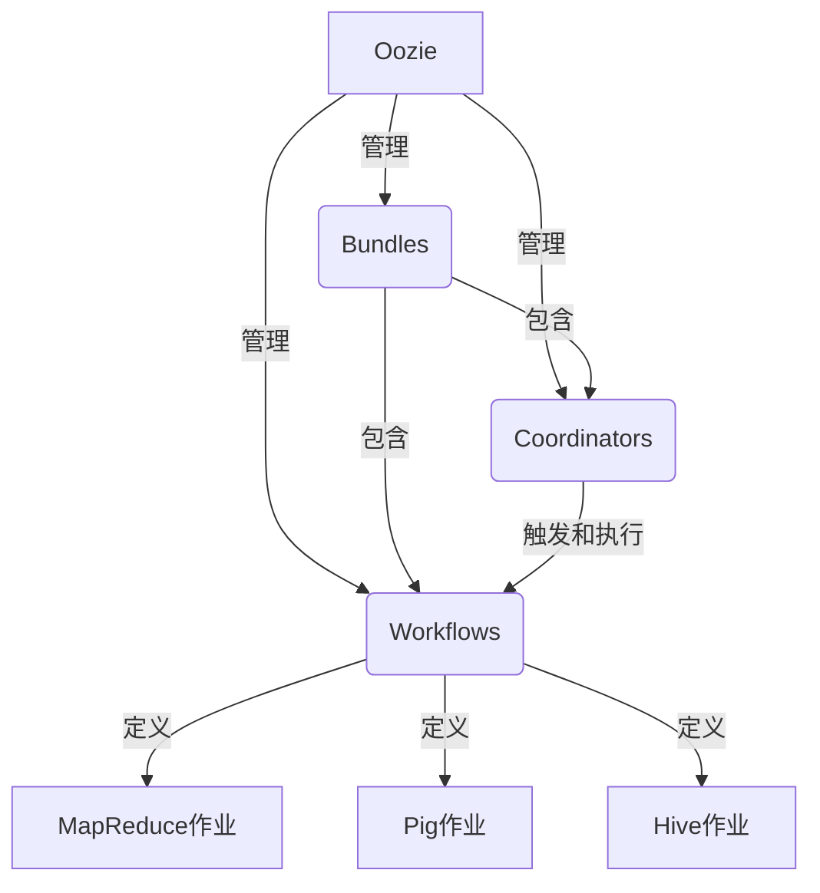
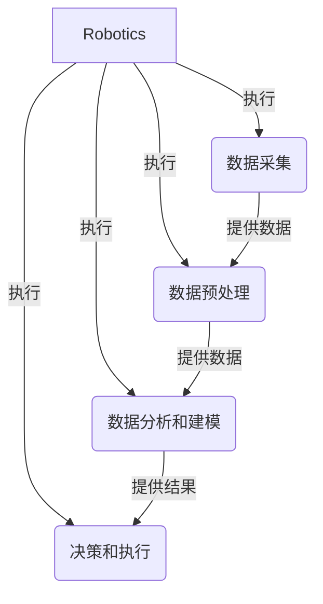

# Oozie与Robotics集成

## 1.背景介绍

在当今数字时代,数据无处不在,数据处理和分析成为了企业和组织的核心竞争力。Apache Hadoop作为一个分布式系统框架,已经成为大数据处理的事实标准。然而,仅依赖Hadoop本身是远远不够的,我们还需要一个强大的工作流调度器来协调和管理这些分布式数据处理任务。这就是Apache Oozie的用武之地。

Oozie是Apache Hadoop生态系统中的一个关键组件,用于管理Hadoop作业(如MapReduce、Spark、Hive等)的工作流调度。它支持设置复杂的依赖关系,可以有效协调各种作业在集群上的执行。Oozie的出现大大简化了大数据处理过程,使得数据工作流可以被有效地编排和监控。

与此同时,机器人技术(Robotics)的快速发展也给数据处理带来了新的机遇和挑战。机器人可以执行各种复杂的任务,从简单的重复性劳动到高度智能化的决策过程。将机器人技术与大数据处理相结合,可以极大地提高数据处理的效率和准确性。

本文将探讨如何将Apache Oozie与Robotics技术相结合,构建一个强大的数据处理和决策系统。我们将介绍Oozie和Robotics的核心概念,讨论它们如何协同工作,并提供具体的实施步骤和最佳实践。

## 2.核心概念与联系  

### 2.1 Apache Oozie

Apache Oozie是一个用于管理Hadoop作业的工作流调度系统,它支持以下几种类型的工作流:

- **Bundles**: 用于管理多个协调器和工作流作业的集合。
- **Coordinators**: 用于触发和执行工作流作业,可以基于时间或数据可用性来调度。
- **Workflows**: 定义了一系列需要执行的动作(如MapReduce、Pig、Hive等)。

Oozie使用XML文件来定义工作流,这些文件描述了作业之间的依赖关系、执行顺序、输入输出数据等。Oozie还提供了一个Web UI,用于监控和管理工作流的执行状态。



### 2.2 Robotics

机器人技术(Robotics)是一个跨学科领域,涉及机械工程、电子工程、计算机科学、人工智能等多个领域。机器人可以执行各种复杂的任务,从简单的重复性劳动到高度智能化的决策过程。

在数据处理领域,机器人技术可以用于以下几个方面:

1. **数据采集**: 机器人可以被用于自动化数据采集过程,如从各种传感器、设备或环境中收集数据。

2. **数据预处理**: 机器人可以对原始数据进行清洗、转换和规范化等预处理操作,为后续的数据分析和建模做好准备。

3. **数据分析和建模**: 机器人可以利用各种机器学习和人工智能算法对数据进行分析和建模,从而发现隐藏的模式和洞察。

4. **决策和执行**: 根据数据分析和建模的结果,机器人可以做出智能化的决策,并执行相应的行动,如控制生产线、调度资源等。



### 2.3 Oozie与Robotics集成

将Apache Oozie与Robotics技术相结合,可以构建一个强大的数据处理和决策系统。Oozie可以用于协调和管理整个数据处理流程,而机器人则可以执行具体的数据采集、预处理、分析和决策任务。

在这种集成系统中,Oozie充当了流程编排者的角色,它定义了数据处理流程中各个步骤的执行顺序和依赖关系。而机器人则扮演了执行者的角色,它们负责实际执行各个数据处理任务。

Oozie和机器人之间可以通过多种方式进行交互和协作,例如:

1. Oozie可以触发机器人执行数据采集任务,并将采集到的数据作为输入传递给后续的数据预处理任务。

2. 数据预处理任务可以由专门的机器人来执行,它们对原始数据进行清洗、转换和规范化等操作。

3. 经过预处理后的数据可以被传递给数据分析和建模任务,这些任务也可以由机器人来执行,利用各种机器学习和人工智能算法对数据进行分析和建模。

4. 分析和建模的结果可以被传递给决策和执行任务,这些任务由具有决策能力的机器人来执行,它们根据分析结果做出智能化的决策,并执行相应的行动。

5. 整个流程中,Oozie负责监控和管理每个步骤的执行状态,并根据需要重新调度或重试失败的任务。

通过这种集成,我们可以充分利用Oozie强大的工作流管理能力和机器人在数据处理和决策方面的专长,构建一个高效、智能化的数据处理系统。

## 3.核心算法原理具体操作步骤

在Oozie与Robotics集成系统中,核心算法主要包括以下几个方面:

### 3.1 Oozie工作流定义

Oozie使用XML文件来定义工作流,这些文件描述了各个作业之间的依赖关系、执行顺序、输入输出数据等。以下是一个简单的Oozie工作流定义示例:

```xml
<workflow-app xmlns="uri:oozie:workflow:0.5" name="robot-data-processing">
  <start to="data-collection"/>

  <action name="data-collection">
    <robot xmlns="uri:oozie:robot-action:0.1">
      <job-tracker>${jobTracker}</job-tracker>
      <name-node>${nameNode}</name-node>
      <robot-script>data_collection.py</robot-script>
    </robot>
    <ok to="data-preprocessing"/>
    <error to="kill"/>
  </action>

  <action name="data-preprocessing">
    <robot xmlns="uri:oozie:robot-action:0.1">
      <job-tracker>${jobTracker}</job-tracker>
      <name-node>${nameNode}</name-node>
      <robot-script>data_preprocessing.py</robot-script>
    </robot>
    <ok to="data-analysis"/>
    <error to="kill"/>
  </action>

  <!-- 其他数据处理步骤 -->

  <kill name="kill">
    <message>Error occurred, workflow failed.</message>
  </kill>

  <end name="end"/>
</workflow-app>
```

在这个示例中,工作流定义了四个步骤:数据采集、数据预处理、数据分析和决策执行。每个步骤都由一个机器人脚本来执行,脚本的具体实现由相应的Python文件提供。Oozie根据定义的依赖关系来协调各个步骤的执行顺序。

### 3.2 机器人脚本实现

机器人脚本是实际执行数据处理任务的核心部分。以下是一个简单的数据采集脚本示例:

```python
import robot_utils

def main():
    # 从传感器采集原始数据
    raw_data = robot_utils.collect_sensor_data()

    # 将原始数据存储到HDFS
    hdfs_path = "/user/robot/raw_data"
    robot_utils.write_to_hdfs(raw_data, hdfs_path)

if __name__ == "__main__":
    main()
```

这个脚本使用`robot_utils`模块中的函数从传感器采集原始数据,然后将这些数据写入HDFS。其他数据处理步骤的脚本实现也类似,只是具体的算法和操作不同。

### 3.3 机器学习和人工智能算法

在数据分析和建模步骤中,机器人可以利用各种机器学习和人工智能算法对数据进行分析和建模。以下是一些常用算法的示例:

- **监督学习算法**:线性回归、逻辑回归、决策树、随机森林、支持向量机等。
- **无监督学习算法**:聚类算法(如K-Means、层次聚类)、降维算法(如PCA、t-SNE)、关联规则挖掘等。
- **深度学习算法**:卷积神经网络(CNN)、递归神经网络(RNN)、长短期记忆网络(LSTM)等。
- **强化学习算法**:Q-Learning、深度Q网络(DQN)、策略梯度等。

这些算法可以根据具体的数据特征和任务需求进行选择和组合使用。以下是一个使用scikit-learn库进行线性回归的示例:

```python
from sklearn.linear_model import LinearRegression

# 加载数据
X, y = load_data()

# 创建线性回归模型
model = LinearRegression()

# 训练模型
model.fit(X, y)

# 进行预测
y_pred = model.predict(X_test)
```

### 3.4 决策和执行

在数据分析和建模之后,机器人需要根据分析结果做出智能化的决策,并执行相应的行动。决策过程可以采用各种人工智能技术,如规则引擎、决策树、强化学习等。

以下是一个简单的基于规则引擎的决策示例:

```python
import production_line

def make_decision(analysis_result):
    if analysis_result["defect_rate"] > 0.1:
        # 如果缺陷率超过10%,则停止生产线
        action = "stop_production_line"
    elif analysis_result["inventory_level"] < 500:
        # 如果库存水平低于500,则增加生产
        action = "increase_production"
    else:
        # 否则维持当前生产水平
        action = "maintain_production"

    return action

def main():
    # 获取数据分析结果
    analysis_result = get_analysis_result()

    # 根据分析结果做出决策
    action = make_decision(analysis_result)

    # 执行相应的行动
    if action == "stop_production_line":
        production_line.stop()
    elif action == "increase_production":
        production_line.increase_output()
    else:
        production_line.maintain_output()

if __name__ == "__main__":
    main()
```

在这个示例中,`make_decision`函数根据数据分析结果(如缺陷率、库存水平等)做出相应的决策,然后在`main`函数中执行相应的行动(如停止生产线、增加生产等)。

## 4.数学模型和公式详细讲解举例说明

在数据处理和分析过程中,我们经常需要使用各种数学模型和公式。以下是一些常见的数学模型和公式,以及它们在Oozie与Robotics集成系统中的应用示例。

### 4.1 线性回归

线性回归是一种常用的监督学习算法,用于建立自变量和因变量之间的线性关系模型。线性回归模型的数学表达式如下:

$$y = \theta_0 + \theta_1x_1 + \theta_2x_2 + \cdots + \theta_nx_n$$

其中,$y$是因变量,$$x_1, x_2, \cdots, x_n$$是自变量,$$\theta_0, \theta_1, \cdots, \theta_n$$是模型参数。

在机器人系统中,线性回归可以用于预测各种连续值的目标变量,如产品质量指标、能源消耗等。以下是一个使用scikit-learn库进行线性回归的示例:

```python
from sklearn.linear_model import LinearRegression

# 加载数据
X, y = load_data()

# 创建线性回归模型
model = LinearRegression()

# 训练模型
model.fit(X, y)

# 进行预测
y_pred = model.predict(X_test)
```

### 4.2 逻辑回归

逻辑回归是一种用于分类问题的监督学习算法。它通过建立自变量和因变量之间的对数几率(log odds)关系,来预测因变量属于某个类别的概率。逻辑回归模型的数学表达式如下:

$$\log\left(\frac{p}{1-p}\right) = \theta_0 + \theta_1x_1 + \theta_2x_2 + \cdots + \theta_nx_n