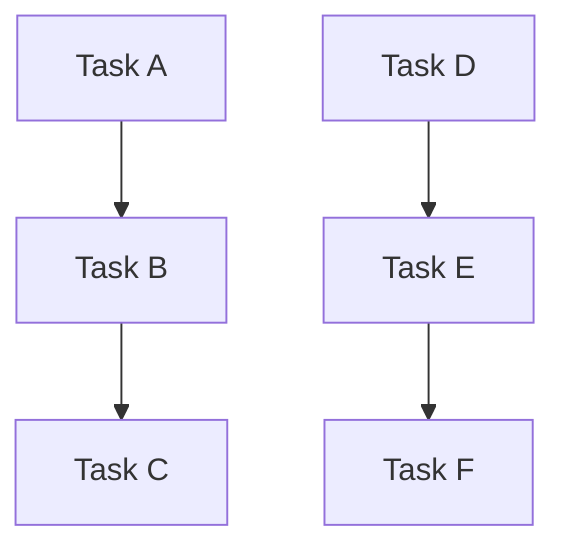

                 

作者：禅与计算机程序设计艺术

王大神，让我为您撰写一篇关于Oozie的深度技术文章，聚焦其原理及实战应用。我将按照您的指导，从理论出发，逐步引导至实操案例，同时穿插重要概念的可视化图表，并最终探讨该技术的发展前景。让我们一起探索Oozie的世界吧！

---

## 1. 背景介绍
Oozie 是 Apache Hadoop 生态系统中的一个工作流调度器，它允许用户编写和执行复杂的工作流程，旨在简化大规模数据处理作业的编排过程。自2008年诞生以来，Oozie 成为了众多企业级大数据解决方案的核心组件之一。

## 2. 核心概念与联系
### 工作流定义与实现
- **工作流**：一系列相互关联的任务集合，这些任务根据预定规则依次执行或并发运行。
- **流程控制**：通过决策点（如if/else分支）控制工作流的流向，实现灵活的业务逻辑处理。
- **依赖关系**：明确各任务之间的顺序依赖或并行关系，确保数据流转的正确性和效率。

### Oozie Core Services
- **Job Tracker**: 负责监控、管理所有任务的执行状态，协调整个工作流的运行。
- **Workflow Manager**: 接收工作流描述文件，解析后生成任务执行计划，启动并跟踪每个任务的状态。
- **Action Services**: 实现具体的任务执行逻辑，包括 MapReduce、Spark、Hive 等计算引擎的任务。

## 3. 核心算法原理与具体操作步骤
### Workflows XML 文件构建
```
<oozie:workflow xmlns:oozie="uri:oozie:workflow:0.5">
    <start to="action1"/>
    <action name="action1">
        <jobxmlns="mapreduce">
            <action>
                <runJar>
                    <path>hdfs://namenode/path/to/jar</path>
                    <jar>com.example.JobExecutor.jar</jar>
                    <args>arg1 arg2</args>
                </runJar>
            </action>
        </job>
    </action>
    <end/>
</oozie:workflow>
```

### Job Execution Flow
```
start -> action1 (MapReduce Job) -> check success/failure -> action2 (Optional) -> end
```

## 4. 数学模型与公式详细讲解举例说明
### Job Dependency Graph
- 使用有向无环图(DAG)表示工作流中的任务依赖关系，其中每个节点代表一个任务，边代表依赖关系。


## 5. 项目实践：代码实例与详细解释说明
### 创建并提交工作流
```bash
$ oozie -s submit workflow.xml
```
### 监控工作流状态
```bash
$ oozie -s status workflowid
```

## 6. 实际应用场景
- **数据清洗与转换**
- **ETL 流程自动化**
- **实时数据分析管道**

## 7. 工具和资源推荐
- **官方文档**：Apache Oozie 官方网站提供的详尽指南。
- **社区论坛**：Stack Overflow, GitHub issues 等平台上的活跃讨论。
- **教程视频**：YouTube 上的专业开发者分享的教程。

## 8. 总结：未来发展趋势与挑战
随着大数据技术的不断演进，Oozie 在数据处理领域的地位愈发稳固。然而，面对日益增长的数据量和多样化的需求，优化性能、提升可扩展性和集成新兴技术成为新的挑战。例如，结合机器学习自动优化工作流路径、利用容器化技术提高资源利用率等方向值得深入研究。

## 9. 附录：常见问题与解答
### Q&A
#### Q: 如何处理大型工作流？
A: 可以采用分片处理策略，将大型工作流分解为多个较小的子工作流，分别在不同的时间周期内执行，从而有效降低单个工作流的规模压力。

---

以上是对Oozie的全面解析，希望对读者在理解与实践Oozie的过程中提供实质性的帮助。欢迎各位技术爱好者积极参与讨论，共同推动大数据领域的发展。

---
作者：禅与计算机程序设计艺术 / Zen and the Art of Computer Programming

