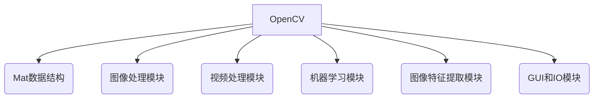

# OpenCV 原理与代码实战案例讲解

## 1.背景介绍

OpenCV(Open Source Computer Vision Library)是一个跨平台的计算机视觉库,最初由英特尔公司发起,后来被Willow Garage支持并由Itseez公司开发。它是一个免费开源的计算机视觉和机器学习软件库,可以运行在Linux、Windows、Android和Mac OS操作系统上。OpenCV提供了一个强大的基础架构,用于图像和视频处理,并且还包含了机器学习算法。它广泛应用于人脸检测、物体识别、运动跟踪、机器人视觉、运动捕捉等领域。

## 2.核心概念与联系

OpenCV库包含了几个核心概念和模块,这些概念和模块相互关联,构成了OpenCV的整体框架。

1. **Mat数据结构**:Mat是OpenCV中最重要的数据结构,用于存储和处理图像数据。它支持多种数据类型,如8位无符号整数(uchar)、16位无符号整数(ushort)、32位浮点数(float)等。Mat可以是单通道或多通道的,并且可以动态调整大小。

2. **图像处理模块**:OpenCV提供了丰富的图像处理函数,包括图像滤波、几何变换、直方图处理、边缘检测等。这些函数可用于图像增强、去噪、分割和特征提取等操作。

3. **视频处理模块**:OpenCV支持视频捕获和处理,可以从摄像头或视频文件读取视频帧,并对视频帧进行处理。视频处理模块还包括运动估计、背景建模和目标跟踪等功能。

4. **机器学习模块**:OpenCV集成了许多机器学习算法,如支持向量机(SVM)、决策树、随机森林等。这些算法可用于图像分类、对象检测和识别等任务。

5. **图像特征提取模块**:OpenCV提供了多种图像特征提取算法,如SIFT、SURF、ORB等。这些算法可用于提取图像的关键点和描述符,用于图像匹配、拼接和三维重建等应用。

6. **GUI和I/O模块**:OpenCV支持多种图形用户界面(GUI)工具包,如Qt、GTK+和Win32 GUI。它还提供了文件I/O、视频I/O和相机捕获等功能。

这些核心概念和模块相互协作,为计算机视觉任务提供了强大的支持。



## 3.核心算法原理具体操作步骤

OpenCV提供了许多核心算法,涵盖了图像处理、视频处理、机器学习和计算机视觉等多个领域。以下是一些核心算法的原理和操作步骤:

### 3.1 图像滤波

图像滤波是图像处理中最基本和最常用的操作之一。它通过对图像进行卷积运算来实现图像平滑、锐化、边缘检测等功能。OpenCV提供了多种滤波算法,如高斯滤波、中值滤波、双边滤波等。

以高斯滤波为例,其操作步骤如下:

1. 定义高斯核(Gaussian Kernel),它是一个二维高斯分布函数。
2. 将高斯核与图像进行卷积运算。
3. 对卷积结果进行归一化处理,得到平滑后的图像。

代码示例:

```python
import cv2 as cv
import numpy as np

# 加载图像
img = cv.imread('image.jpg')

# 高斯滤波
kernel_size = 5  # 核大小
sigma = 0  # 标准差,0表示自动计算
blurred = cv.GaussianBlur(img, (kernel_size, kernel_size), sigma)

# 显示结果
cv.imshow('Original', img)
cv.imshow('Gaussian Blur', blurred)
cv.waitKey(0)
cv.destroyAllWindows()
```

### 3.2 边缘检测

边缘检测是计算机视觉中一个重要的基础操作,它用于检测图像中的边缘,这些边缘通常对应于物体的轮廓或表面的变化。OpenCV提供了多种边缘检测算法,如Canny、Sobel、Laplacian等。

以Canny边缘检测为例,其操作步骤如下:

1. 使用高斯滤波器对图像进行平滑处理,以减少噪声。
2. 计算图像的梯度强度和方向。
3. 应用非极大值抑制,仅保留边缘像素。
4. 使用双阈值进行滞后边缘跟踪。

代码示例:

```python
import cv2 as cv

# 加载图像
img = cv.imread('image.jpg', 0)  # 转换为灰度图像

# Canny边缘检测
edges = cv.Canny(img, 100, 200)  # 阈值1, 阈值2

# 显示结果
cv.imshow('Original', img)
cv.imshow('Canny Edges', edges)
cv.waitKey(0)
cv.destroyAllWindows()
```

### 3.3 特征检测和描述

特征检测和描述是计算机视觉中的一个关键步骤,它用于提取图像中的关键点和描述符,这些信息可用于图像匹配、拼接和三维重建等应用。OpenCV提供了多种特征检测和描述算法,如SIFT、SURF、ORB等。

以SIFT(尺度不变特征变换)算法为例,其操作步骤如下:

1. 构建尺度空间,通过高斯卷积和下采样生成不同尺度的图像金字塔。
2. 在每个尺度空间中检测极值点,作为潜在的关键点。
3. 对关键点进行精确定位和去除边缘响应,提高稳定性。
4. 为每个关键点计算方向直方图,确定主方向。
5. 构建关键点描述符,描述关键点周围的梯度信息。

代码示例:

```python
import cv2 as cv

# 加载图像
img = cv.imread('image.jpg')

# 初始化SIFT检测器
sift = cv.SIFT_create()

# 检测关键点和计算描述符
keypoints, descriptors = sift.detectAndCompute(img, None)

# 绘制关键点
img_keypoints = cv.drawKeypoints(img, keypoints, None)

# 显示结果
cv.imshow('SIFT Keypoints', img_keypoints)
cv.waitKey(0)
cv.destroyAllWindows()
```

## 4.数学模型和公式详细讲解举例说明

OpenCV中的许多算法都基于数学模型和公式。以下是一些常见的数学模型和公式,以及它们在OpenCV中的应用。

### 4.1 图像卷积

图像卷积是图像处理中的一个基本操作,它通过将图像与一个卷积核(kernel)进行卷积运算来实现各种效果,如平滑、锐化、边缘检测等。

卷积的数学表达式为:

$$
g(x, y) = \sum_{i=-a}^{a} \sum_{j=-b}^{b} f(x+i, y+j) \cdot h(i, j)
$$

其中:
- $f(x, y)$是输入图像
- $h(x, y)$是卷积核
- $g(x, y)$是输出图像
- $a$和$b$分别表示卷积核在水平和垂直方向上的半径

在OpenCV中,可以使用`cv.filter2D()`函数进行卷积操作。例如,对图像进行高斯平滑:

```python
import cv2 as cv
import numpy as np

# 加载图像
img = cv.imread('image.jpg')

# 定义高斯卷积核
kernel_size = 5
sigma = 1.0
kernel = cv.getGaussianKernel(kernel_size, sigma) ** 2

# 卷积操作
blurred = cv.filter2D(img, -1, kernel)

# 显示结果
cv.imshow('Original', img)
cv.imshow('Gaussian Blur', blurred)
cv.waitKey(0)
cv.destroyAllWindows()
```

### 4.2 图像梯度

图像梯度是图像处理中另一个重要的概念,它描述了图像亮度或颜色在空间上的变化率。图像梯度广泛应用于边缘检测、特征提取和图像分割等任务。

梯度的数学表达式为:

$$
\nabla f = \begin{bmatrix}
\frac{\partial f}{\partial x} \\
\frac{\partial f}{\partial y}
\end{bmatrix}
$$

其中:
- $\nabla f$是梯度向量
- $\frac{\partial f}{\partial x}$和$\frac{\partial f}{\partial y}$分别表示图像在水平和垂直方向上的偏导数

在OpenCV中,可以使用`cv.Sobel()`或`cv.Scharr()`函数计算图像梯度。例如,使用Sobel算子计算梯度:

```python
import cv2 as cv

# 加载图像
img = cv.imread('image.jpg', 0)  # 转换为灰度图像

# 计算梯度
sobelx = cv.Sobel(img, cv.CV_64F, 1, 0, ksize=3)  # 水平梯度
sobely = cv.Sobel(img, cv.CV_64F, 0, 1, ksize=3)  # 垂直梯度

# 计算梯度幅值和方向
mag, angle = cv.cartToPolar(sobelx, sobely, angleInDegrees=True)

# 显示结果
cv.imshow('Original', img)
cv.imshow('Gradient Magnitude', mag)
cv.imshow('Gradient Angle', angle)
cv.waitKey(0)
cv.destroyAllWindows()
```

### 4.3 图像直方图

图像直方图是一种统计图像像素值分布的工具,它对于图像增强、阈值分割和特征提取等任务非常有用。

直方图的数学表达式为:

$$
h(r_k) = \sum_{x=0}^{M-1} \sum_{y=0}^{N-1} \begin{cases}
1, & \text{if } f(x, y) = r_k \\
0, & \text{otherwise}
\end{cases}
$$

其中:
- $h(r_k)$是直方图,表示像素值为$r_k$的像素个数
- $f(x, y)$是图像的像素值
- $M$和$N$分别是图像的宽度和高度

在OpenCV中,可以使用`cv.calcHist()`函数计算图像直方图。例如,计算灰度图像的直方图:

```python
import cv2 as cv
import numpy as np
import matplotlib.pyplot as plt

# 加载图像
img = cv.imread('image.jpg', 0)

# 计算直方图
hist = cv.calcHist([img], [0], None, [256], [0, 256])

# 绘制直方图
plt.figure()
plt.title("Grayscale Histogram")
plt.xlabel("Bins")
plt.ylabel("# of Pixels")
plt.plot(hist)
plt.xlim([0, 256])
plt.show()
```

## 5.项目实践：代码实例和详细解释说明

在这一部分,我们将通过一个实际项目来演示OpenCV的使用。我们将构建一个简单的人脸检测和识别系统,涵盖图像预处理、特征提取、训练分类器和实时检测等步骤。

### 5.1 项目概述

人脸检测和识别是计算机视觉中一个经典的应用场景。我们将使用OpenCV和Python实现以下功能:

1. 从图像或视频中检测人脸。
2. 提取人脸特征,并将其与预先训练的人脸数据进行比较。
3. 识别并标记出图像或视频中的人物身份。

### 5.2 项目步骤

#### 步骤1: 导入必要的库

```python
import cv2 as cv
import os
import numpy as np
```

#### 步骤2: 准备训练数据

我们将使用OpenCV内置的人脸检测器和人脸识别器。首先,我们需要准备一些人脸图像作为训练数据。

```python
# 创建人脸数据列表
face_data = []
labels = []

# 遍历人物文件夹
for person_name in os.listdir('people/'):
    person_dir = os.path.join('people/', person_name)
    if not os.path.isdir(person_dir):
        continue

    # 遍历每个人物的图像文件
    label = len(face_data)
    for img_name in os.listdir(person_dir):
        img_path = os.path.join(person_dir, img_name)
        img = cv.imread(img_path)
        face_data.append(img)
        labels.append(label)

# 创建LBPH人脸识别器
face_recognizer = cv.face.LBPHFaceRecognizer_create()

# 训练人脸识