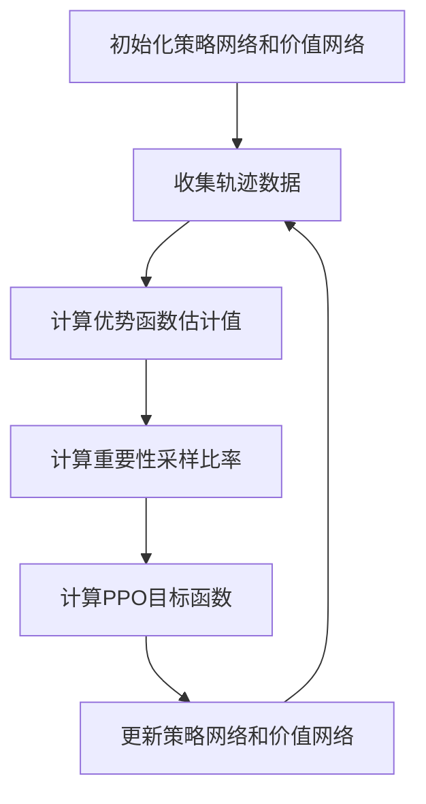

# PPO(Proximal Policy Optimization) - 原理与代码实例讲解

## 1. 背景介绍

强化学习(Reinforcement Learning)是机器学习的一个重要分支,旨在训练智能体(Agent)通过与环境(Environment)的交互来学习最优策略(Policy),以最大化预期的累积奖励。策略梯度(Policy Gradient)方法是强化学习中一种常用的方法,它通过直接优化策略函数来寻找最优策略。然而,传统的策略梯度方法存在一些问题,如高方差、样本效率低等。为了解决这些问题,Proximal Policy Optimization(PPO)算法应运而生。

PPO是一种基于策略梯度的强化学习算法,由OpenAI在2017年提出。它通过限制新旧策略之间的差异,实现了更稳定和更高效的策略优化。PPO算法已被广泛应用于各种强化学习任务中,如机器人控制、游戏AI、自动驾驶等领域,并取得了卓越的成果。

## 2. 核心概念与联系

### 2.1 策略梯度(Policy Gradient)

策略梯度方法是强化学习中一种基于参数化策略的方法。它直接优化策略函数的参数,使得在给定状态下采取特定动作的概率最大化预期的累积奖励。策略梯度的目标是找到一个最优策略$\pi_\theta$,使得在环境中采取该策略可以获得最大的期望回报。

策略梯度的核心思想是通过计算梯度$\nabla_\theta J(\theta)$,并沿着梯度方向更新策略参数$\theta$,从而不断优化策略函数。其中,目标函数$J(\theta)$表示在策略$\pi_\theta$下的期望回报。

$$J(\theta) = \mathbb{E}_{\tau \sim \pi_\theta}[R(\tau)]$$

其中,$\tau$表示一个轨迹(trajectory),即一系列状态-动作对;$R(\tau)$表示该轨迹的累积奖励。

### 2.2 PPO算法

PPO算法的核心思想是在每一步策略更新时,限制新旧策略之间的差异,从而实现更稳定和更高效的策略优化。具体来说,PPO算法引入了一个约束条件,要求新策略$\pi_{\theta_{new}}$与旧策略$\pi_{\theta_{old}}$之间的比值落在一个合理的范围内。这个约束条件可以用下面的公式表示:

$$r_t(\theta) = \frac{\pi_\theta(a_t|s_t)}{\pi_{\theta_{old}}(a_t|s_t)}$$

其中,$r_t(\theta)$被称为重要性采样比率(Importance Sampling Ratio),用于衡量新旧策略之间的差异。PPO算法的目标是最大化一个修剪后的目标函数,该目标函数考虑了重要性采样比率的约束:

$$J^{CLIP}(\theta) = \mathbb{E}_t[min(r_t(\theta)\hat{A}_t, clip(r_t(\theta), 1-\epsilon, 1+\epsilon)\hat{A}_t)]$$

其中,$\hat{A}_t$是一个估计的优势函数(Advantage Function),用于衡量采取某个动作相对于当前策略的优势;$clip$函数用于限制重要性采样比率在$(1-\epsilon, 1+\epsilon)$范围内,从而控制新旧策略之间的差异。

通过优化修剪后的目标函数$J^{CLIP}(\theta)$,PPO算法可以在保证策略更新的稳定性的同时,还能提高样本的利用效率,从而实现更快的收敛和更好的性能。

### 2.3 Actor-Critic架构

PPO算法通常采用Actor-Critic架构来实现。Actor部分负责根据当前状态输出动作概率分布,即策略$\pi_\theta(a|s)$;Critic部分则负责评估当前状态的价值函数$V(s)$,用于估计优势函数$\hat{A}_t$。

Actor和Critic通常由神经网络来表示,并通过共享网络参数的方式进行联合训练。在训练过程中,Actor根据Critic提供的优势函数估计值,更新策略参数;而Critic则根据实际获得的奖励,更新价值函数参数。这种紧密结合的方式可以提高训练的稳定性和效率。

## 3. 核心算法原理具体操作步骤

PPO算法的核心操作步骤如下:

1. **初始化策略网络和价值网络**:初始化Actor网络(策略网络)和Critic网络(价值网络),通常采用神经网络结构。

2. **收集轨迹数据**:让智能体与环境交互,根据当前策略采取动作,收集一批轨迹数据,包括状态、动作、奖励等信息。

3. **计算优势函数估计值**:利用收集到的轨迹数据,基于Critic网络计算每一个时间步的优势函数估计值$\hat{A}_t$。

4. **计算重要性采样比率**:对于每一个时间步,计算新旧策略之间的重要性采样比率$r_t(\theta)$。

5. **计算PPO目标函数**:根据优势函数估计值$\hat{A}_t$和重要性采样比率$r_t(\theta)$,计算PPO的修剪目标函数$J^{CLIP}(\theta)$。

6. **更新策略网络和价值网络**:通过优化修剪目标函数$J^{CLIP}(\theta)$,更新Actor网络(策略网络)和Critic网络(价值网络)的参数。

7. **重复步骤2-6**:重复执行步骤2-6,不断收集新的轨迹数据,优化策略网络和价值网络,直到达到预期的性能或者达到最大训练步数。

PPO算法的核心操作步骤可以用以下Mermaid流程图表示:

## 4. 数学模型和公式详细讲解举例说明

### 4.1 策略梯度公式

在PPO算法中,我们需要优化策略函数$\pi_\theta(a|s)$,使得在给定状态下采取特定动作的概率最大化预期的累积奖励。策略梯度的目标函数可以表示为:

$$J(\theta) = \mathbb{E}_{\tau \sim \pi_\theta}[R(\tau)]$$

其中,$\tau$表示一个轨迹(trajectory),即一系列状态-动作对;$R(\tau)$表示该轨迹的累积奖励。

为了优化目标函数$J(\theta)$,我们需要计算其关于策略参数$\theta$的梯度$\nabla_\theta J(\theta)$。根据策略梯度定理,我们可以得到:

$$\nabla_\theta J(\theta) = \mathbb{E}_{\tau \sim \pi_\theta}\left[\sum_{t=0}^{T}\nabla_\theta\log\pi_\theta(a_t|s_t)Q^{\pi}(s_t,a_t)\right]$$

其中,$Q^{\pi}(s_t,a_t)$表示在状态$s_t$下采取动作$a_t$的期望回报,也被称为状态-动作值函数(State-Action Value Function)。

在实际计算中,我们通常使用优势函数$A^{\pi}(s_t,a_t)$代替$Q^{\pi}(s_t,a_t)$,其定义为:

$$A^{\pi}(s_t,a_t) = Q^{\pi}(s_t,a_t) - V^{\pi}(s_t)$$

其中,$V^{\pi}(s_t)$表示在状态$s_t$下的状态值函数(State Value Function)。

使用优势函数后,策略梯度公式可以写成:

$$\nabla_\theta J(\theta) = \mathbb{E}_{\tau \sim \pi_\theta}\left[\sum_{t=0}^{T}\nabla_\theta\log\pi_\theta(a_t|s_t)A^{\pi}(s_t,a_t)\right]$$

这个公式告诉我们,我们应该在采取的动作比当前策略更好时(即$A^{\pi}(s_t,a_t)>0$)增加该动作的概率,反之则减小该动作的概率。

### 4.2 PPO目标函数

PPO算法的核心思想是在每一步策略更新时,限制新旧策略之间的差异,从而实现更稳定和更高效的策略优化。具体来说,PPO算法引入了一个约束条件,要求新策略$\pi_{\theta_{new}}$与旧策略$\pi_{\theta_{old}}$之间的比值落在一个合理的范围内。这个约束条件可以用下面的公式表示:

$$r_t(\theta) = \frac{\pi_\theta(a_t|s_t)}{\pi_{\theta_{old}}(a_t|s_t)}$$

其中,$r_t(\theta)$被称为重要性采样比率(Importance Sampling Ratio),用于衡量新旧策略之间的差异。

PPO算法的目标是最大化一个修剪后的目标函数,该目标函数考虑了重要性采样比率的约束:

$$J^{CLIP}(\theta) = \mathbb{E}_t[min(r_t(\theta)\hat{A}_t, clip(r_t(\theta), 1-\epsilon, 1+\epsilon)\hat{A}_t)]$$

其中,$\hat{A}_t$是一个估计的优势函数(Advantage Function),用于衡量采取某个动作相对于当前策略的优势;$clip$函数用于限制重要性采样比率在$(1-\epsilon, 1+\epsilon)$范围内,从而控制新旧策略之间的差异。

通过优化修剪后的目标函数$J^{CLIP}(\theta)$,PPO算法可以在保证策略更新的稳定性的同时,还能提高样本的利用效率,从而实现更快的收敛和更好的性能。

### 4.3 优势函数估计

在PPO算法中,我们需要估计优势函数$\hat{A}_t$,以便计算目标函数$J^{CLIP}(\theta)$。优势函数$A^{\pi}(s_t,a_t)$定义为:

$$A^{\pi}(s_t,a_t) = Q^{\pi}(s_t,a_t) - V^{\pi}(s_t)$$

其中,$Q^{\pi}(s_t,a_t)$表示在状态$s_t$下采取动作$a_t$的期望回报,也被称为状态-动作值函数(State-Action Value Function);$V^{\pi}(s_t)$表示在状态$s_t$下的状态值函数(State Value Function)。

在实践中,我们通常使用一个神经网络来近似估计状态值函数$V^{\pi}(s_t)$,然后根据实际获得的奖励$r_t$和下一个状态的估计值$V^{\pi}(s_{t+1})$,计算出$Q^{\pi}(s_t,a_t)$的估计值,进而得到优势函数$\hat{A}_t$的估计值。

具体来说,我们可以使用以下公式计算$\hat{A}_t$:

$$\hat{A}_t = r_t + \gamma V^{\pi}(s_{t+1}) - V^{\pi}(s_t)$$

其中,$\gamma$是折现因子(Discount Factor),用于控制未来奖励的衰减程度。

通过估计优势函数$\hat{A}_t$,我们可以更好地评估采取某个动作相对于当前策略的优势,从而更有效地优化PPO算法的目标函数。

### 4.4 示例:CartPole环境

让我们以经典的CartPole环境为例,来更好地理解PPO算法的数学模型和公式。

在CartPole环境中,我们需要控制一个小车,使其平衡一根立在小车上的杆子。环境的状态包括小车的位置和速度,以及杆子的角度和角速度。我们的目标是通过向左或向右施加力,使杆子保持直立,并尽可能长时间地保持平衡。

假设我们使用一个神经网络来表示策略函数$\pi_\theta(a|s)$和状态值函数$V^{\pi}(s)$。在每一个时间步,我们根据当前状态$s_t$,通过策略网络输出一个动作概率分布$\pi_\theta(a|s_t)$,并从中采样一个动作$a_t$。然后,我们将这个动作$a_t$应用到环境中,获得下一个状态$s_{t+1}$和奖励$r_t$。

接下来,我们需要计算优势函数估计值$\hat{A}_t$,以便优化PPO算法的目标函数。我们首先通过价值