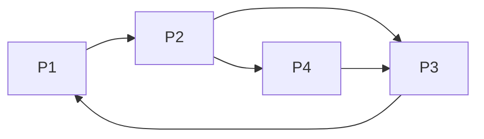

# PageRank原理与代码实例讲解

## 1.背景介绍

### 1.1 互联网的发展与信息爆炸

随着互联网的迅速发展,信息量呈现出爆炸式增长。海量的网页信息使得人们很难从中找到真正有价值和需要的内容。传统的搜索引擎往往只能根据网页中的关键词进行匹配,查找结果经常不尽如人意。为了解决这一问题,谷歌公司于1998年提出了革命性的PageRank算法,从根本上改变了搜索引擎的运作方式。

### 1.2 PageRank算法的重要性

PageRank算法是谷歌公司创始人拉里·佩奇(Larry Page)和谢尔盖·布林(Sergey Brin)在斯坦福大学读研究生时提出的。该算法通过对网页之间的超链接关系进行分析,计算出每个网页的重要性权重分数,从而有效地评估网页的质量和相关性。PageRank算法的出现,使得搜索引擎能够更好地满足用户的需求,为互联网信息的高效检索和利用提供了有力支持。

## 2.核心概念与联系

### 2.1 网页重要性评估

PageRank算法的核心思想是,一个高质量的网页往往会受到其他重要网页的多次链接,而低质量的网页则较少被高质量网页所链接。基于这一思路,PageRank算法将每个网页视为一个节点,网页之间的超链接则构成了节点之间的有向边。通过分析这个庞大的网络结构,算法能够评估出每个网页的重要性分数。

### 2.2 网页排名机制

PageRank算法将网页的重要性分数作为排名的主要依据。当用户在搜索引擎中输入查询关键词时,算法会首先根据关键词匹配相关网页,然后按照这些网页的PageRank值从高到低进行排序,最终将排名靠前的结果呈现给用户。这种基于链接分析的排名机制,能够有效地提高搜索结果的质量和相关性,为用户带来更好的搜索体验。

### 2.3 迭代计算与稳定性

PageRank算法采用了一种迭代计算的方式来确定每个网页的最终权重分数。在迭代过程中,每个网页的PageRank值会不断收敛,直到整个网络达到一个稳定的平衡状态。这种迭代计算方法虽然计算量较大,但能够保证算法的收敛性和稳定性,从而得到更加准确的网页重要性评估结果。

## 3.核心算法原理具体操作步骤

PageRank算法的核心思想是通过网页之间的链接关系来评估网页的重要性。算法的具体操作步骤如下:

1. **构建网页链接矩阵**

首先,我们需要将互联网上的所有网页及其链接关系抽象成一个有向图$G(V,E)$,其中$V$表示网页集合,即有向图的节点集;$E$表示链接集合,即有向图的边集。如果网页$P_j$存在一条指向网页$P_i$的链接,则在有向图中存在一条有向边$(j,i)$。

2. **计算网页出链数量**

对于每个网页$P_i$,我们计算它的出链数量$L(P_i)$,即指向其他网页的链接数。如果$L(P_i)=0$,说明该网页是一个陷阱,我们需要进行特殊处理。

3. **初始化网页权重**

我们给所有网页赋予一个初始的PageRank值,通常设置为$\frac{1}{N}$,其中$N$为网页总数。

4. **迭代计算网页权重**

PageRank算法通过迭代的方式不断更新每个网页的权重值,直到达到收敛。在每一轮迭代中,网页$P_i$的新PageRank值计算公式如下:

$$PR(P_i) = (1-d) + d\sum_{P_j\in B_i}\frac{PR(P_j)}{L(P_j)}$$

其中:
- $PR(P_i)$表示网页$P_i$的PageRank值
- $B_i$是一个集合,包含所有存在链接指向$P_i$的网页
- $PR(P_j)$表示网页$P_j$的PageRank值
- $L(P_j)$表示网页$P_j$的出链数量
- $d$是一个阻尼系数(damping factor),常取值0.85,用于调节网页之间PageRank值的传递比例

这个公式体现了两个重要因素:
- 存在越多高质量网页(具有高PageRank值)链接到$P_i$,则$P_i$的PageRank值就越高
- 如果一个高质量网页$P_j$的出链数量$L(P_j)$较多,则从$P_j$传递到$P_i$的PageRank值就越小

5. **收敛条件与结果输出**

当网页的PageRank值在连续几轮迭代后的变化足够小时,我们就认为算法已经收敛,此时可以输出每个网页的最终PageRank值。

通过上述步骤,PageRank算法能够有效地评估出每个网页的重要性权重,为搜索引擎的网页排名提供了科学的依据。

## 4.数学模型和公式详细讲解举例说明

### 4.1 PageRank算法的数学模型

为了更好地理解PageRank算法的原理,我们可以构建一个简化的数学模型。假设网络中共有$N$个网页,用$1,2,\cdots,N$来表示每个网页。我们用$PR(i)$表示第$i$个网页的PageRank值,用$L(i)$表示第$i$个网页的出链数量。

根据PageRank算法的计算公式,我们可以得到如下等式组:

$$
\begin{aligned}
PR(1) &= (1-d) + d\left(\frac{PR(2)}{L(2)} + \frac{PR(3)}{L(3)} + \cdots + \frac{PR(N)}{L(N)}\right) \\
PR(2) &= (1-d) + d\left(\frac{PR(1)}{L(1)} + \frac{PR(3)}{L(3)} + \cdots + \frac{PR(N)}{L(N)}\right) \\
&\vdots \\
PR(N) &= (1-d) + d\left(\frac{PR(1)}{L(1)} + \frac{PR(2)}{L(2)} + \cdots + \frac{PR(N-1)}{L(N-1)}\right)
\end{aligned}
$$

其中$d$是阻尼系数,通常取值0.85。这个等式组可以用矩阵形式更加紧凑地表示为:

$$PR = (1-d)\vec{1} + dM^TPR$$

这里$PR$是一个$N\times 1$的列向量,表示所有网页的PageRank值;$\vec{1}$是一个$N\times 1$的列向量,所有元素均为1;$M$是一个$N\times N$的列随机矩阵(column stochastic matrix),其中$M_{ij} = \frac{1}{L(j)}$如果存在一条从$j$指向$i$的链接,否则$M_{ij} = 0$。

通过对这个矩阵方程进行迭代计算,就可以得到网页的最终PageRank值。算法的收敛性已被数学证明,即存在一个唯一的稳定解$PR^*$,使得$PR^* = (1-d)\vec{1} + dM^TPR^*$。

### 4.2 PageRank算法的收敛性证明

我们可以利用马尔可夫链的理论来证明PageRank算法的收敛性。将上面的矩阵方程改写为:

$$PR = dM^TPR + (1-d)\vec{1}$$

令$\vec{v} = (1-d)\vec{1}$,则上式可以简化为:

$$PR = dM^TPR + \vec{v}$$

这个方程描述了一个马尔可夫过程,其状态转移矩阵为$M^T$,状态空间为所有网页的PageRank值向量$PR$。根据马尔可夫链的理论,如果转移矩阵$M^T$是一个列随机矩阵且是无周期的、不可约的(irreducible),则该马尔可夫过程存在一个唯一的稳定分布$\pi^*$,使得对任意初始分布$\pi_0$,都有$\lim_{n\rightarrow\infty}(M^T)^n\pi_0 = \pi^*$。

在PageRank算法中,由于每个网页都至少存在一条出链(否则就是陷阱,需要特殊处理),因此矩阵$M^T$是一个列随机矩阵。同时,由于互联网上的网页是高度连通的,因此$M^T$也是无周期的、不可约的。所以根据马尔可夫链的理论,PageRank算法一定会收敛到一个唯一的稳定解$PR^*$,即$\lim_{n\rightarrow\infty}(dM^T)^nPR_0 = PR^*$。

### 4.3 PageRank算法的示例计算

为了更好地理解PageRank算法的计算过程,我们给出一个简单的示例。假设有4个网页,它们之间的链接关系如下图所示:



根据PageRank算法的计算公式,我们可以得到如下等式组:

$$
\begin{aligned}
PR(P_1) &= (1-0.85) + 0.85\left(\frac{PR(P_3)}{1}\right) \\
PR(P_2) &= (1-0.85) + 0.85\left(\frac{PR(P_1)}{1}\right) \\
PR(P_3) &= (1-0.85) + 0.85\left(\frac{PR(P_2)}{2} + \frac{PR(P_4)}{1}\right) \\
PR(P_4) &= (1-0.85) + 0.85\left(\frac{PR(P_2)}{2}\right)
\end{aligned}
$$

假设初始时所有网页的PageRank值均为0.25,我们可以通过迭代的方式计算每个网页的新PageRank值,直到算法收敛。经过几轮迭代后,最终的PageRank值分别为:

- $PR(P_1) = 0.2275$
- $PR(P_2) = 0.3425$
- $PR(P_3) = 0.3425$
- $PR(P_4) = 0.0875$

从结果可以看出,网页$P_2$和$P_3$由于受到多个其他网页的链接,因此具有较高的PageRank值;而网页$P_4$只有一个入链接,所以PageRank值较低。这与我们的直观认知是一致的。

## 5.项目实践:代码实例和详细解释说明

为了更好地理解PageRank算法的实现,我们给出了一个Python代码示例。该示例使用了NumPy库来进行矩阵运算,并模拟了一个简单的网页链接结构。

```python
import numpy as np

# 定义网页链接矩阵
link_matrix = np.array([[0, 0, 1, 0],
                        [1, 0, 1, 0],
                        [1, 0, 0, 1],
                        [0, 1, 1, 0]])

# 定义阻尼系数
damping_factor = 0.85

# 初始化网页的PageRank值
n = link_matrix.shape[0]
page_rank = np.ones(n) / n

# 迭代计算PageRank值
for i in range(100):
    new_page_rank = (1 - damping_factor) / n + damping_factor * np.sum(link_matrix / np.sum(link_matrix, axis=0), axis=1) * page_rank
    if np.sum(np.abs(new_page_rank - page_rank)) < 1e-8:
        break
    page_rank = new_page_rank

# 输出最终的PageRank值
print("Final PageRank values:")
for i in range(n):
    print(f"Page {i+1}: {page_rank[i]:.4f}")
```

代码解释:

1. 首先,我们定义了一个4x4的矩阵`link_matrix`,用于表示网页之间的链接关系。矩阵中的元素`link_matrix[i][j]`等于1表示存在一条从网页j指向网页i的链接,等于0表示不存在该链接。

2. 接下来,我们设置了阻尼系数`damping_factor`为0.85,这是PageRank算法中常用的值。

3. 然后,我们初始化了一个长度为4的向量`page_rank`,表示每个网页的初始PageRank值,均设置为1/4。

4. 进入迭代循环,我们根据