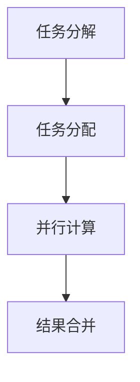

# Parti在物联网领域的应用

## 1.背景介绍

物联网（IoT，Internet of Things）是指通过各种信息传感设备，如传感器、射频识别（RFID）技术、全球定位系统（GPS）、激光扫描器等，按照约定的协议，把任何物品与互联网连接起来，进行信息交换和通信，以实现智能化识别、定位、跟踪、监控和管理的一种网络。随着物联网技术的不断发展，数据量和复杂度也在不断增加，如何高效地处理和分析这些数据成为了一个重要的课题。

Parti（Partitioned Inference）是一种新兴的技术，它通过将复杂的计算任务分解成多个子任务，并行处理，从而大大提高了计算效率。本文将深入探讨Parti在物联网领域的应用，分析其核心概念、算法原理、数学模型、实际应用场景等，帮助读者更好地理解和应用这项技术。

## 2.核心概念与联系

### 2.1 Parti的基本概念

Parti，即Partitioned Inference，是一种将复杂计算任务分解为多个子任务并行处理的技术。其核心思想是通过任务分解和并行计算，提高计算效率和处理速度。Parti在大数据处理、机器学习、物联网等领域有着广泛的应用。

### 2.2 物联网的基本概念

物联网是指通过各种信息传感设备，将物品与互联网连接起来，实现信息交换和通信的网络。物联网的核心在于数据的采集、传输、处理和分析，通过这些过程实现智能化的管理和控制。

### 2.3 Parti与物联网的联系

在物联网中，数据量巨大且复杂，传统的单一计算模式难以高效处理这些数据。Parti通过将计算任务分解为多个子任务并行处理，可以大大提高数据处理的效率和速度。因此，Parti在物联网数据处理和分析中具有重要的应用价值。

## 3.核心算法原理具体操作步骤

### 3.1 Parti的核心算法原理

Parti的核心算法原理是任务分解和并行计算。具体来说，Parti将一个复杂的计算任务分解为多个子任务，每个子任务可以独立计算。然后，通过并行计算的方式，同时处理这些子任务，最后将各个子任务的结果合并，得到最终的计算结果。

### 3.2 具体操作步骤

1. **任务分解**：将复杂的计算任务分解为多个子任务。任务分解的方式可以根据具体的应用场景和数据特点来确定。
2. **任务分配**：将分解后的子任务分配给不同的计算节点。计算节点可以是物理服务器、虚拟机、容器等。
3. **并行计算**：各个计算节点同时处理分配到的子任务。并行计算的方式可以是多线程、多进程、分布式计算等。
4. **结果合并**：将各个子任务的计算结果合并，得到最终的计算结果。

以下是一个简单的Mermaid流程图，展示了Parti的核心算法流程：



## 4.数学模型和公式详细讲解举例说明

### 4.1 数学模型

Parti的数学模型可以用图论中的图分割问题来描述。假设有一个图 $G = (V, E)$，其中 $V$ 是顶点集合，$E$ 是边集合。图分割问题是将图 $G$ 分割成若干个子图，使得每个子图的顶点数尽可能均匀，且子图之间的边数尽可能少。

### 4.2 公式讲解

假设有一个计算任务 $T$，可以分解为 $n$ 个子任务 $T_1, T_2, \ldots, T_n$。每个子任务的计算时间为 $t_i$，总计算时间 $T_{total}$ 为：

$$
T_{total} = \max(t_1, t_2, \ldots, t_n)
$$

通过并行计算，可以将总计算时间 $T_{total}$ 降低到单个子任务的最大计算时间，从而提高计算效率。

### 4.3 举例说明

假设有一个数据处理任务，需要处理1000个数据点。传统的单一计算模式需要100秒才能完成任务。通过Parti技术，将任务分解为10个子任务，每个子任务处理100个数据点，每个子任务的计算时间为10秒。通过并行计算，总计算时间可以降低到10秒，大大提高了计算效率。

## 5.项目实践：代码实例和详细解释说明

### 5.1 项目背景

假设我们有一个物联网项目，需要实时处理大量传感器数据。我们可以使用Parti技术，将数据处理任务分解为多个子任务，并行处理，提高数据处理的效率。

### 5.2 代码实例

以下是一个简单的Python代码示例，展示了如何使用Parti技术进行并行数据处理：

```python
import concurrent.futures
import time

# 模拟数据处理任务
def process_data(data):
    time.sleep(1)  # 模拟数据处理时间
    return sum(data)

# 分解任务
def partition_data(data, num_partitions):
    partition_size = len(data) // num_partitions
    partitions = [data[i * partition_size:(i + 1) * partition_size] for i in range(num_partitions)]
    return partitions

# 并行处理
def parallel_process(data, num_partitions):
    partitions = partition_data(data, num_partitions)
    with concurrent.futures.ThreadPoolExecutor() as executor:
        results = list(executor.map(process_data, partitions))
    return sum(results)

# 示例数据
data = list(range(1000))

# 使用Parti技术进行并行数据处理
start_time = time.time()
result = parallel_process(data, 10)
end_time = time.time()

print(f"Result: {result}")
print(f"Time taken: {end_time - start_time} seconds")
```

### 5.3 详细解释说明

1. **数据处理任务**：`process_data` 函数模拟了一个数据处理任务，处理时间为1秒。
2. **任务分解**：`partition_data` 函数将数据分解为多个子任务，每个子任务处理一部分数据。
3. **并行处理**：`parallel_process` 函数使用 `concurrent.futures.ThreadPoolExecutor` 进行并行处理，将分解后的子任务分配给不同的线程，同时处理，最后将结果合并。

通过这个示例，我们可以看到，使用Parti技术可以大大提高数据处理的效率。

## 6.实际应用场景

### 6.1 智能家居

在智能家居中，传感器数据量巨大且复杂，需要实时处理和分析。使用Parti技术，可以将数据处理任务分解为多个子任务，并行处理，提高数据处理的效率，实现智能化的家居管理。

### 6.2 智能交通

在智能交通系统中，需要实时处理大量的交通数据，如车辆位置、速度、交通流量等。使用Parti技术，可以将数据处理任务分解为多个子任务，并行处理，提高数据处理的效率，实现智能化的交通管理。

### 6.3 智能医疗

在智能医疗系统中，需要实时处理大量的医疗数据，如病人的生理参数、医疗记录等。使用Parti技术，可以将数据处理任务分解为多个子任务，并行处理，提高数据处理的效率，实现智能化的医疗管理。

## 7.工具和资源推荐

### 7.1 并行计算工具

1. **Apache Spark**：一个开源的分布式计算框架，支持大规模数据处理和并行计算。
2. **Dask**：一个并行计算库，支持大规模数据处理和并行计算，适用于Python。
3. **Ray**：一个开源的分布式计算框架，支持大规模数据处理和并行计算，适用于Python。

### 7.2 数据处理工具

1. **Pandas**：一个数据处理和分析库，适用于Python。
2. **NumPy**：一个科学计算库，适用于Python。
3. **SciPy**：一个科学计算库，适用于Python。

### 7.3 学习资源

1. **《并行计算导论》**：一本介绍并行计算基本概念和技术的书籍。
2. **《大数据处理技术》**：一本介绍大数据处理技术和应用的书籍。
3. **Coursera上的并行计算课程**：一个在线学习平台，提供并行计算相关的课程。

## 8.总结：未来发展趋势与挑战

### 8.1 未来发展趋势

1. **智能化**：随着人工智能技术的发展，物联网将更加智能化，实现更高效的管理和控制。
2. **边缘计算**：边缘计算将成为物联网数据处理的重要技术，通过在数据源头进行计算，减少数据传输的延迟和带宽占用。
3. **5G技术**：5G技术的普及将大大提高物联网设备的连接速度和数据传输效率，推动物联网的发展。

### 8.2 挑战

1. **数据安全**：物联网设备数量众多，数据量巨大，如何保证数据的安全性和隐私性是一个重要的挑战。
2. **标准化**：物联网设备和技术种类繁多，缺乏统一的标准，如何实现设备和技术的互联互通是一个重要的挑战。
3. **计算资源**：物联网数据处理需要大量的计算资源，如何高效利用计算资源，提高计算效率是一个重要的挑战。

## 9.附录：常见问题与解答

### 9.1 Parti技术适用于哪些场景？

Parti技术适用于需要处理大量数据和复杂计算任务的场景，如大数据处理、机器学习、物联网等。

### 9.2 如何选择合适的任务分解方式？

任务分解的方式可以根据具体的应用场景和数据特点来确定。一般来说，可以根据数据的大小、计算任务的复杂度、计算资源的分布等因素来选择合适的任务分解方式。

### 9.3 并行计算的性能如何评估？

并行计算的性能可以通过计算时间、计算效率、资源利用率等指标来评估。一般来说，可以通过实验和测试来评估并行计算的性能。

### 9.4 如何保证并行计算的正确性？

并行计算的正确性可以通过任务分解、任务分配、结果合并等步骤的正确性来保证。一般来说，可以通过测试和验证来保证并行计算的正确性。

### 9.5 Parti技术的未来发展方向是什么？

Parti技术的未来发展方向包括智能化、边缘计算、5G技术等。随着这些技术的发展，Parti技术将在物联网、大数据处理、机器学习等领域有更广泛的应用。

---

作者：禅与计算机程序设计艺术 / Zen and the Art of Computer Programming