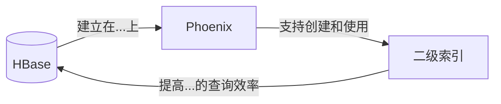
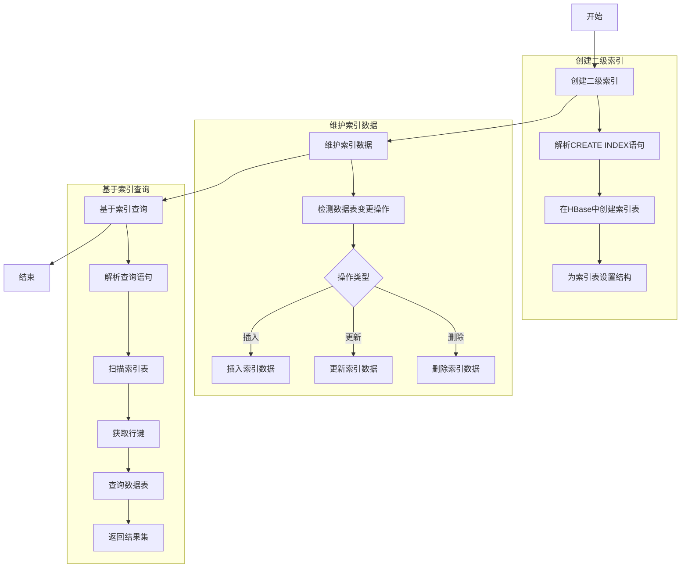

# Phoenix二级索引原理与代码实例讲解

## 1.背景介绍

在现代数据密集型应用程序中，数据库扮演着至关重要的角色。随着数据量的不断增长和查询需求的复杂化,传统的单一索引结构已经无法满足高效查询的需求。这就催生了二级索引(Secondary Index)的出现,它为数据库提供了更加灵活和高效的查询能力。

Phoenix是一个建立在HBase之上的开源SQL层,它支持二级索引的创建和使用。通过二级索引,开发人员可以基于非主键列创建索引,从而加速查询性能,满足复杂查询场景的需求。

### 1.1 什么是二级索引?

二级索引是一种数据库索引技术,它允许我们在非主键列上创建索引,从而加速基于这些列的查询操作。与主索引(主键索引)不同,二级索引是一种辅助索引,它维护着一个独立的数据结构,将非主键列的值与对应的行主键建立映射关系。

在查询时,数据库可以先在二级索引中查找符合条件的非主键值,然后根据索引中存储的主键快速定位并返回对应的数据行。这种索引方式大大提高了非主键列查询的效率。

### 1.2 为什么需要二级索引?

在关系数据库中,我们通常会在查询条件中使用的列上创建索引,以提高查询性能。然而,在某些情况下,查询条件可能涉及多个列或者是非主键列,这时单靠主键索引就无法满足高效查询的需求。

例如,在一个用户信息表中,我们可能需要根据用户的姓名、地址或其他属性来查询用户记录。如果没有在这些列上创建索引,数据库就需要进行全表扫描,效率会非常低下。通过创建二级索引,我们可以极大地优化这种情况下的查询性能。

另外,在某些分布式数据库系统中(如HBase),只能在行键(主键)上创建索引。如果需要基于其他列进行高效查询,二级索引就变得尤为重要。

## 2.核心概念与联系

在深入探讨Phoenix二级索引的原理之前,我们需要先了解几个核心概念及它们之间的关系。

### 2.1 HBase

Apache HBase是一个分布式、可伸缩的大数据存储系统,它建立在Hadoop文件系统(HDFS)之上,提供了类似于Google BigTable的数据模型和功能。HBase被广泛应用于需要实时读写访问海量数据的场景,如Facebook的消息系统、Yahoo的行为数据等。

在HBase中,数据被组织成一个个表(Table),每个表由多个行(Row)组成。每一行都由一个行键(Row Key)唯一标识,并包含了多个列族(Column Family)。列族中又包含了多个列(Column),每个列都有一个列名和对应的值。值与列的时间戳(Timestamp)关联,以支持数据的版本控制。

HBase的设计理念是面向列的存储,这意味着数据是按列族存储的,而不是按行存储。同一列族中的数据会存储在同一个文件中,这样可以最小化读取单个列族所需的I/O操作。

### 2.2 Phoenix

Apache Phoenix是一个建立在HBase之上的开源SQL层,它使得开发人员可以使用标准的JDBC API来查询和管理HBase数据。Phoenix将SQL查询转换为一个或多个HBase扫描,并将结果集返回给客户端。

借助Phoenix,开发人员无需直接使用HBase的低级API,就可以像使用传统关系数据库一样,使用SQL语句来操作HBase数据。这大大降低了HBase的使用门槛,提高了开发效率。

Phoenix还支持二级索引、视图、共享的系统统计信息等高级功能,使得HBase在处理分析型工作负载时更加高效。

### 2.3 Phoenix二级索引

在HBase中,我们只能在行键上创建索引,这对于需要基于其他列进行查询的场景带来了一定的限制。为了解决这个问题,Phoenix引入了二级索引的概念。

Phoenix二级索引是一种数据结构,它将非主键列的值与对应的行键建立了映射关系。在创建二级索引时,Phoenix会在HBase中额外创建一个索引表,用于存储这种映射关系。

当我们基于非主键列进行查询时,Phoenix会先在索引表中查找符合条件的非主键值,获取对应的行键,然后根据行键快速定位并返回数据行。这种索引方式极大地提高了非主键列查询的效率。

Phoenix支持多种类型的二级索引,包括覆盖索引、全局索引、局部索引等,可以根据不同的场景选择合适的索引类型。

### 2.4 核心概念关系

上述三个核心概念之间的关系可以用下图来表示:



HBase是一个分布式的大数据存储系统,提供了类似于Google BigTable的数据模型。Phoenix是建立在HBase之上的一个SQL层,它支持使用SQL语句来操作HBase数据,并且支持创建和使用二级索引。二级索引可以极大地提高基于非主键列查询HBase数据的效率。

三者的关系就像一个生态系统,相互依赖、相互促进。HBase提供了数据存储的基础,Phoenix提供了更友好的查询接口,而二级索引则为查询性能的优化提供了重要手段。

## 3.核心算法原理具体操作步骤

现在,我们来深入探讨一下Phoenix二级索引的核心算法原理及其具体的操作步骤。

### 3.1 二级索引的创建

要在Phoenix中创建二级索引,我们可以使用`CREATE INDEX`语句。以下是一个示例:

```sql
CREATE INDEX my_index ON my_table (col1, col2) INCLUDE (col3, col4);
```

这条语句在表`my_table`上创建了一个名为`my_index`的二级索引,索引涵盖了`col1`和`col2`两个列。`INCLUDE`子句指定了需要包含在索引中的其他列,这里是`col3`和`col4`。

创建索引后,Phoenix会在HBase中额外创建一个索引表,用于存储索引数据。索引表的结构如下:

```
RowKey = <col1_value> + <col2_value> + <row_key_from_data_table>
Column Family = Indexed columns (col1, col2) and included columns (col3, col4)
```

索引表的行键由被索引列的值和原表的行键拼接而成。列族则包含了被索引列和包含列的数据。这种设计使得Phoenix可以通过扫描索引表,快速定位到原表中符合条件的行。

### 3.2 索引维护

在数据表中进行插入、更新或删除操作时,Phoenix会自动维护相关的二级索引。具体来说:

1. **插入操作**:当向数据表插入一行数据时,Phoenix会根据被索引列的值,在索引表中插入一行索引数据。

2. **更新操作**:当更新数据表中某一行的被索引列时,Phoenix会先删除旧的索引数据,然后插入新的索引数据。

3. **删除操作**:当从数据表中删除一行数据时,Phoenix会删除对应的索引数据。

通过这种自动维护机制,Phoenix确保了索引表中的数据与原表保持同步,从而保证了查询结果的正确性和完整性。

### 3.3 查询执行

当我们基于被索引列进行查询时,Phoenix会执行以下步骤:

1. **索引扫描**:Phoenix会先在索引表中扫描,查找符合查询条件的索引数据。

2. **获取行键**:从索引数据中提取出对应的原表行键。

3. **数据查询**:根据获取到的行键,在原表中查找并返回完整的数据行。

这种查询方式相比全表扫描,效率要高出许多。因为索引表中只存储了被索引列和行键的映射关系,数据量相对较小,扫描速度更快。而且,通过索引表可以直接定位到原表中符合条件的行,无需进行昂贵的全表扫描操作。

### 3.4 算法流程图

为了更清晰地展示Phoenix二级索引的核心算法流程,我们使用Mermaid绘制了一个流程图:



上图详细展示了Phoenix二级索引的三个核心步骤:创建索引、维护索引数据和基于索引进行查询。每个步骤都包含了多个子步骤,形成了一个完整的流程。

通过这个流程图,我们可以更直观地理解Phoenix二级索引的工作原理,为后续的代码实现和性能优化奠定基础。

## 4.数学模型和公式详细讲解举例说明

在探讨Phoenix二级索引的数学模型和公式之前,我们先来看一个简单的例子。

假设我们有一个名为`user_info`的表,用于存储用户信息。表结构如下:

```sql
CREATE TABLE user_info (
    user_id CHAR(4) NOT NULL PRIMARY KEY,
    name VARCHAR,
    age INTEGER,
    city VARCHAR
);
```

现在,我们需要频繁地根据用户的`city`列来查询用户记录。由于`city`不是主键,如果不创建索引,每次查询都需要进行全表扫描,效率会非常低下。

为了优化查询性能,我们可以在`city`列上创建一个二级索引:

```sql
CREATE INDEX city_idx ON user_info (city);
```

创建索引后,Phoenix会在HBase中额外创建一个索引表,用于存储`city`列值与对应行键的映射关系。索引表的结构如下:

```
RowKey = <city_value> + <row_key_from_data_table>
Column Family = 0
```

假设我们有以下数据:

```
user_id | name  | age | city
--------+-------+-----+-------
  0001  | Alice |  25 | Beijing
  0002  | Bob   |  30 | Shanghai
  0003  | Carol |  28 | Beijing
  0004  | David |  35 | Guangzhou
```

那么,索引表中的数据将是:

```
RowKey                         | Column Family
--------------------------------+---------------
Beijing\x00\x00\x00\x010001     | 0:
Beijing\x00\x00\x00\x010003     | 0:
Guangzhou\x00\x00\x00\x010004   | 0:
Shanghai\x00\x00\x00\x010002    | 0:
```

其中,`\x00\x00\x00\x01`是一个分隔符,用于将`city`值与行键分开。索引表的行键由`city`值和原表行键拼接而成,这样可以保证行键的唯一性。

现在,当我们执行查询`SELECT * FROM user_info WHERE city = 'Beijing'`时,Phoenix会先在索引表中扫描,查找所有行键以`Beijing`开头的行。从上面的索引数据可以看出,符合条件的行键是`Beijing\x00\x00\x00\x010001`和`Beijing\x00\x00\x00\x010003`。

Phoenix会提取出这两个行键中的`0001`和`0003`,然后到原表`user_info`中查找并返回完整的数据行。这种查询方式比全表扫描要高效得多,因为索引表的数据量相对较小,而且可以直接定位到符合条件的行。

### 4.1 数学模型

为了更好地理解Phoenix二级索引的工作原理,我们可以构建一个