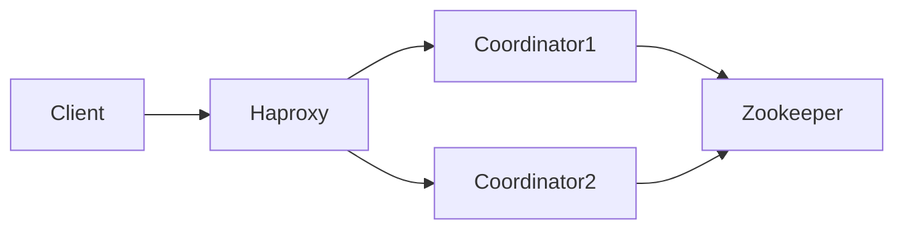
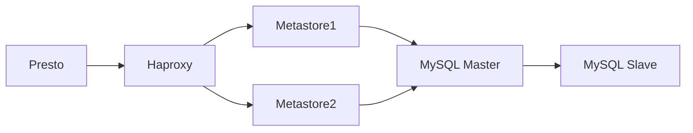

# Presto-Hive高可用性架构设计

## 1. 背景介绍

随着大数据时代的到来,企业需要处理和分析海量数据,对数据查询和分析的实时性、并发性和可靠性提出了更高的要求。Presto作为一个开源的分布式SQL查询引擎,具有查询速度快、可扩展性好、部署灵活等优点,被越来越多的企业用于交互式数据分析。而Hive作为Hadoop生态圈的重要组件,提供了类SQL的查询语言HiveQL,可以很好地衔接HDFS等存储引擎。将Presto和Hive结合使用,可以实现对Hive数据的快速交互式查询分析。

但是,在生产环境中,如何保证Presto-Hive系统的高可用性,避免因为某个组件的故障导致整个系统不可用,成为了一个亟待解决的问题。本文将详细介绍Presto-Hive高可用性架构设计的思路和实践。

### 1.1 高可用性的重要性

在大数据时代,数据分析系统的高可用性至关重要,主要体现在以下几个方面:

1. 避免数据丢失和不一致:系统故障可能导致正在处理的数据丢失或不一致,给业务带来损失。
2. 保证业务连续性:很多业务系统依赖数据分析的结果,分析系统的不可用会影响业务运转。  
3. 提高用户满意度:频繁的系统故障会影响用户体验,降低用户粘性。

因此,设计一个高可用的Presto-Hive架构非常必要。

### 1.2 高可用性的挑战

实现一个高可用的分布式系统并非易事,主要面临以下挑战:

1. 复杂的系统依赖:Presto-Hive依赖Hadoop、Zookeeper等多个组件,每个组件都有可能出现故障。
2. 组件的部署方式:不同组件有不同的部署方式,如何协调不同组件的高可用性。
3. 故障的检测和恢复:如何快速检测到故障,并在尽可能短的时间内恢复系统。
4. 数据一致性:在发生故障时,如何保证数据的一致性,避免数据丢失和错乱。

本文提出的高可用性架构,将针对这些挑战给出解决方案。

## 2. 核心概念与联系

在介绍Presto-Hive高可用性架构之前,我们先来了解一下几个核心概念。

### 2.1 Presto架构

Presto是一个开源的分布式SQL查询引擎,主要由以下几个组件构成:

- Coordinator:负责接收客户端的查询请求,生成查询计划,协调Worker执行。
- Worker:负责实际执行查询任务,从数据源获取数据并处理。  
- Connector:连接器,用于连接不同的数据源,如Hive、Kafka、MySQL等。
- Discovery Server:配合Coordinator实现Worker的服务发现。

多个Coordinator、Worker构成一个Presto集群,可以线性扩展以支持更大的并发和数据量。

### 2.2 Hive架构

Hive是构建在Hadoop之上的数据仓库工具,可以将结构化的数据文件映射为一张数据库表,并提供HiveQL查询功能。Hive的主要组件包括:

- Metastore:元数据服务,存储Hive的元数据,如数据库、表、字段等信息。
- HiveServer2:Hive的服务端,提供Thrift接口,供客户端连接。
- Beeline:Hive的命令行客户端。

Hive依赖HDFS存储数据,依赖Yarn调度任务执行。

### 2.3 Presto与Hive的关系

Presto通过Hive Connector与Hive集成,可以直接查询Hive中的数据。具体来说:

1. Presto通过Hive Metastore获取Hive的元数据。
2. Presto根据元数据生成查询计划,将查询任务下发给Worker。
3. Worker通过HDFS读取Hive的数据文件,执行查询任务。

可以看出,Presto与Hive的耦合主要在元数据层面,Presto只是把Hive作为一种数据源。二者在部署和运行时是解耦的。

## 3. 高可用性架构设计

基于上述对Presto和Hive的理解,我们提出以下高可用性架构设计:

### 3.1 Presto高可用性

Presto的高可用性主要体现在以下几个方面:

#### 3.1.1 Coordinator高可用

由于所有的查询请求都要经过Coordinator,所以Coordinator是整个Presto集群的单点。为了实现Coordinator的高可用,我们使用多个Coordinator节点组成一个集群,在前端使用Haproxy等负载均衡工具进行流量分发。同时,使用Zookeeper进行Coordinator的Leader选举,保证同一时刻只有一个Coordinator在处理请求。



#### 3.1.2 Worker高可用

Worker的高可用相对简单,我们只需要部署多个Worker节点,当某个Worker故障时,Coordinator会自动将任务调度到其他Worker上执行。

#### 3.1.3 Connector高可用

Connector的高可用取决于数据源本身的高可用性。对于Hive而言,需要保证HDFS和Metastore的高可用性,这部分将在下文介绍。

### 3.2 Hive高可用性

#### 3.2.1 Metastore高可用

Hive Metastore是Hive的核心组件,也是Presto访问Hive数据的入口。Metastore以关系型数据库(如MySQL)为后端存储,可以通过主从复制实现高可用。同时,我们在多个节点部署Metastore服务,使用Haproxy进行负载均衡。



#### 3.2.2 HDFS高可用

HDFS的高可用可以通过以下措施实现:

1. NameNode HA:部署两个NameNode,一个Active,一个Standby,使用Zookeeper进行故障切换。
2. DataNode多副本:为每个数据块保存多个副本(默认3个),分布在不同的DataNode上。
3. 容错和自动恢复:当某个DataNode故障时,HDFS会自动将其上的数据块复制到其他DataNode上,保证数据的可用性。

### 3.3 故障恢复流程

当系统的某个组件发生故障时,我们需要尽快检测到故障,并自动进行恢复,以保证系统的连续可用。下面以Coordinator故障为例,介绍故障恢复的流程:

1. 客户端发送查询请求到Haproxy。
2. Haproxy将请求转发到当前的Active Coordinator。
3. 如果Active Coordinator没有响应,Haproxy将请求转发到其他Coordinator。
4. Zookeeper检测到Active Coordinator故障,从其他Coordinator中选举出新的Active。
5. 新的Active Coordinator接管查询请求,从上次的查询状态恢复,继续执行查询。
6. 查询结果返回给客户端。

整个故障切换过程对客户端是透明的,可以做到服务的无缝连续。

## 4. 数学模型与公式

在Presto的查询优化器中,使用了一些数学模型和公式,主要有:

### 4.1 代价模型

Presto使用代价模型(Cost Model)来评估不同查询计划的代价,选择代价最小的计划执行。代价模型考虑了CPU、内存、网络等资源的使用情况,其中最核心的是数据读取和传输的代价。假设一个查询需要读取的数据量为 $D$,网络传输速率为 $B$,则数据传输的时间代价为:

$$
T_{\text{transfer}} = \frac{D}{B}
$$

### 4.2 数据分布模型

Presto的查询优化器需要了解数据在不同Worker之间的分布情况,以便生成最优的查询计划。Presto使用一个简化的数据分布模型,假设数据在Worker之间是均匀分布的。假设有 $N$ 个Worker,每个Worker上的数据量为 $D_i$,则总的数据量为:

$$
D = \sum_{i=1}^N D_i
$$

平均每个Worker上的数据量为:

$$
\overline{D} = \frac{D}{N}
$$

### 4.3 查询代价估计

有了代价模型和数据分布模型,Presto就可以估计一个查询的总代价了。假设一个查询需要 $M$ 个Worker参与,每个Worker需要读取和传输的数据量为 $\overline{D}$,则查询的总时间代价为:

$$
T_{\text{query}} = \frac{M \cdot \overline{D}}{B}
$$

Presto的查询优化器会枚举所有可能的查询计划,计算每个计划的代价,选择代价最小的那个执行。

## 5. 项目实践

下面我们通过一个具体的项目实践,来说明如何使用Presto和Hive构建一个高可用的数据分析平台。

### 5.1 环境准备

首先我们需要准备以下软件环境:

- Hadoop集群:部署了HDFS和Yarn,实现了NameNode和ResourceManager的高可用。
- Hive:部署了Metastore和HiveServer2,实现了Metastore的高可用。
- Presto:部署了Coordinator和Worker,实现了Coordinator的高可用。
- Haproxy:用于Coordinator和Metastore的负载均衡。
- Zookeeper:用于Coordinator和NameNode的高可用。

### 5.2 Hive数据准备

我们在Hive中创建一个测试表,并导入一些测试数据:

```sql
CREATE TABLE test_table (
  id INT,
  name STRING,
  age INT
)
ROW FORMAT DELIMITED FIELDS TERMINATED BY ',';

LOAD DATA LOCAL INPATH '/path/to/data.txt' INTO TABLE test_table;
```

### 5.3 Presto查询测试

在Presto中,我们可以直接查询Hive中的表:

```sql
SELECT * FROM hive.default.test_table LIMIT 10;
```

Presto会自动从Hive的Metastore获取表的元数据,生成查询计划,并调度Worker执行。

### 5.4 故障模拟与恢复

我们可以模拟一些故障场景,测试系统的高可用性,例如:

1. 停止一个Coordinator节点,观察Haproxy和Zookeeper如何进行故障切换。
2. 停止一个Worker节点,观察查询是否能够正常执行。
3. 停止一个Metastore节点,观察Presto是否能够正常获取元数据。
4. 停止一个DataNode节点,观察HDFS是否能够自动恢复数据。

通过这些测试,我们可以验证系统的高可用性设计是否有效。

## 6. 实际应用场景

Presto和Hive的组合在很多实际场景中都有应用,例如:

1. 数据仓库:将原始数据导入Hive,使用Presto进行联机分析查询。
2. 日志分析:将应用程序的日志数据实时导入Hive,使用Presto进行实时分析。
3. 用户行为分析:将用户的行为数据(如点击、购买等)导入Hive,使用Presto进行用户画像和个性化推荐。
4. 数据挖掘:将各种数据源的数据汇总到Hive中,使用Presto进行数据挖掘和机器学习。

## 7. 工具和资源推荐

如果你想进一步学习和实践Presto和Hive,以下是一些有用的工具和资源:

1. Presto官方文档:https://prestodb.io/docs/current/
2. Hive官方文档:https://cwiki.apache.org/confluence/display/Hive/
3. Hadoop官方文档:https://hadoop.apache.org/docs/stable/
4. 《Presto: The Definitive Guide》:Presto权威指南,O'Reilly出版。
5. 《Programming Hive》:Hive编程指南,O'Reilly出版。
6. Presto社区:https://prestodb.io/community.html
7. Hive社区:https://hive.apache.org/community.html

## 8. 总结与展望

本文介绍了Presto-Hive高可用性架构设计的思路和实践。我们首先分析了Presto和Hive的基本架构,然后针对Coordinator、Worker、Metastore等组件提出了高可用性方