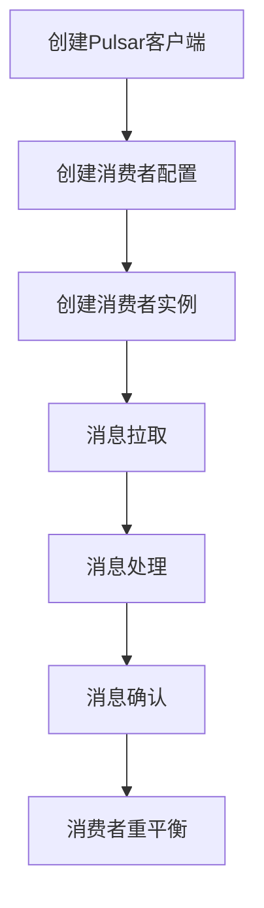

# Pulsar Consumer原理与代码实例讲解

## 1.背景介绍

Apache Pulsar 是一个开源的分布式消息传递系统，具有高吞吐量、低延迟和多租户等特性。它由 Yahoo 开发，并于 2016 年开源。Pulsar 的设计目标是解决大规模数据流处理中的各种挑战，如数据丢失、延迟和扩展性问题。Pulsar Consumer 是 Pulsar 系统中的一个重要组件，负责从 Pulsar 主题（Topic）中消费消息。

在这篇文章中，我们将深入探讨 Pulsar Consumer 的原理和实现，并通过代码实例来展示如何使用 Pulsar Consumer 进行消息消费。我们将从核心概念、算法原理、数学模型、项目实践、实际应用场景、工具和资源推荐等多个方面进行详细讲解。

## 2.核心概念与联系

### 2.1 Pulsar 主题（Topic）

Pulsar 主题是消息的逻辑通道，生产者将消息发送到主题，消费者从主题中消费消息。每个主题可以有多个分区（Partition），以提高并行处理能力。

### 2.2 Pulsar 消费者（Consumer）

Pulsar 消费者是从主题中消费消息的实体。消费者可以分为独占（Exclusive）、共享（Shared）和失败后重试（Failover）三种模式。

### 2.3 消费者组（Consumer Group）

消费者组是多个消费者的集合，这些消费者共同消费一个或多个主题中的消息。消费者组可以实现消息的负载均衡和高可用性。

### 2.4 消费者偏移量（Consumer Offset）

消费者偏移量是消费者在主题中的消费位置。Pulsar 通过偏移量来跟踪每个消费者的消费进度。

### 2.5 消息确认（Acknowledgement）

消息确认是消费者向 Pulsar 确认已成功处理消息的机制。Pulsar 支持同步确认和异步确认两种方式。

## 3.核心算法原理具体操作步骤

### 3.1 消费者注册

消费者注册是指消费者向 Pulsar 注册自己，以便从指定的主题中消费消息。注册过程包括以下步骤：

1. 创建 Pulsar 客户端。
2. 创建消费者配置。
3. 创建消费者实例。

### 3.2 消息拉取

消息拉取是指消费者从主题中拉取消息的过程。Pulsar 支持两种消息拉取方式：推模式（Push）和拉模式（Pull）。

### 3.3 消息处理

消息处理是指消费者对拉取到的消息进行业务处理的过程。处理过程可以是同步的，也可以是异步的。

### 3.4 消息确认

消息确认是指消费者向 Pulsar 确认已成功处理消息的过程。确认过程可以是同步的，也可以是异步的。

### 3.5 消费者重平衡

消费者重平衡是指在消费者组中，消费者数量发生变化时，Pulsar 自动调整消息分配的过程。重平衡过程包括以下步骤：

1. 检测消费者数量变化。
2. 重新分配消息分区。
3. 更新消费者偏移量。

以下是 Pulsar 消费者工作流程的 Mermaid 流程图：



## 4.数学模型和公式详细讲解举例说明

### 4.1 消费者偏移量模型

消费者偏移量可以用一个简单的数学模型来表示。假设主题 $T$ 有 $N$ 个分区，每个分区有 $M$ 条消息。消费者 $C$ 的偏移量可以表示为一个二维数组 $O$，其中 $O[i][j]$ 表示消费者 $C$ 在分区 $i$ 中消费到的第 $j$ 条消息。

$$
O = \begin{bmatrix}
o_{11} & o_{12} & \cdots & o_{1M} \\
o_{21} & o_{22} & \cdots & o_{2M} \\
\vdots & \vdots & \ddots & \vdots \\
o_{N1} & o_{N2} & \cdots & o_{NM}
\end{bmatrix}
$$

### 4.2 消息确认模型

消息确认可以用一个布尔矩阵 $A$ 来表示，其中 $A[i][j]$ 表示消费者 $C$ 是否确认了分区 $i$ 中的第 $j$ 条消息。

$$
A = \begin{bmatrix}
a_{11} & a_{12} & \cdots & a_{1M} \\
a_{21} & a_{22} & \cdots & a_{2M} \\
\vdots & \vdots & \ddots & \vdots \\
a_{N1} & a_{N2} & \cdots & a_{NM}
\end{bmatrix}
$$

### 4.3 消费者重平衡模型

消费者重平衡可以用一个分配矩阵 $D$ 来表示，其中 $D[i][j]$ 表示分区 $i$ 中的第 $j$ 条消息被分配给了哪个消费者。

$$
D = \begin{bmatrix}
d_{11} & d_{12} & \cdots & d_{1M} \\
d_{21} & d_{22} & \cdots & d_{2M} \\
\vdots & \vdots & \ddots & \vdots \\
d_{N1} & d_{N2} & \cdots & d_{NM}
\end{bmatrix}
$$

## 5.项目实践：代码实例和详细解释说明

### 5.1 环境准备

在开始代码实例之前，我们需要准备好开发环境。以下是所需的工具和依赖：

- Java 8 或更高版本
- Apache Pulsar 客户端库
- Maven 或 Gradle 构建工具

### 5.2 创建 Pulsar 客户端

首先，我们需要创建一个 Pulsar 客户端实例。以下是 Java 代码示例：

```java
import org.apache.pulsar.client.api.PulsarClient;

public class PulsarConsumerExample {
    public static void main(String[] args) throws Exception {
        PulsarClient client = PulsarClient.builder()
                .serviceUrl("pulsar://localhost:6650")
                .build();
    }
}
```

### 5.3 创建消费者配置

接下来，我们需要创建消费者配置。以下是 Java 代码示例：

```java
import org.apache.pulsar.client.api.Consumer;
import org.apache.pulsar.client.api.ConsumerBuilder;
import org.apache.pulsar.client.api.PulsarClient;

public class PulsarConsumerExample {
    public static void main(String[] args) throws Exception {
        PulsarClient client = PulsarClient.builder()
                .serviceUrl("pulsar://localhost:6650")
                .build();

        ConsumerBuilder<byte[]> consumerBuilder = client.newConsumer()
                .topic("my-topic")
                .subscriptionName("my-subscription")
                .subscriptionType(SubscriptionType.Exclusive);
    }
}
```

### 5.4 创建消费者实例

然后，我们需要创建消费者实例。以下是 Java 代码示例：

```java
import org.apache.pulsar.client.api.Consumer;
import org.apache.pulsar.client.api.ConsumerBuilder;
import org.apache.pulsar.client.api.PulsarClient;
import org.apache.pulsar.client.api.SubscriptionType;

public class PulsarConsumerExample {
    public static void main(String[] args) throws Exception {
        PulsarClient client = PulsarClient.builder()
                .serviceUrl("pulsar://localhost:6650")
                .build();

        Consumer<byte[]> consumer = client.newConsumer()
                .topic("my-topic")
                .subscriptionName("my-subscription")
                .subscriptionType(SubscriptionType.Exclusive)
                .subscribe();
    }
}
```

### 5.5 消息拉取和处理

接下来，我们需要实现消息拉取和处理。以下是 Java 代码示例：

```java
import org.apache.pulsar.client.api.Consumer;
import org.apache.pulsar.client.api.Message;
import org.apache.pulsar.client.api.PulsarClient;
import org.apache.pulsar.client.api.SubscriptionType;

public class PulsarConsumerExample {
    public static void main(String[] args) throws Exception {
        PulsarClient client = PulsarClient.builder()
                .serviceUrl("pulsar://localhost:6650")
                .build();

        Consumer<byte[]> consumer = client.newConsumer()
                .topic("my-topic")
                .subscriptionName("my-subscription")
                .subscriptionType(SubscriptionType.Exclusive)
                .subscribe();

        while (true) {
            Message<byte[]> msg = consumer.receive();
            System.out.printf("Message received: %s", new String(msg.getData()));
            consumer.acknowledge(msg);
        }
    }
}
```

### 5.6 消息确认

在消息处理完成后，我们需要确认消息。以下是 Java 代码示例：

```java
import org.apache.pulsar.client.api.Consumer;
import org.apache.pulsar.client.api.Message;
import org.apache.pulsar.client.api.PulsarClient;
import org.apache.pulsar.client.api.SubscriptionType;

public class PulsarConsumerExample {
    public static void main(String[] args) throws Exception {
        PulsarClient client = PulsarClient.builder()
                .serviceUrl("pulsar://localhost:6650")
                .build();

        Consumer<byte[]> consumer = client.newConsumer()
                .topic("my-topic")
                .subscriptionName("my-subscription")
                .subscriptionType(SubscriptionType.Exclusive)
                .subscribe();

        while (true) {
            Message<byte[]> msg = consumer.receive();
            System.out.printf("Message received: %s", new String(msg.getData()));
            consumer.acknowledge(msg);
        }
    }
}
```

## 6.实际应用场景

### 6.1 实时数据处理

Pulsar Consumer 可以用于实时数据处理场景，如实时日志分析、实时监控和实时推荐系统。通过消费实时数据流，进行数据清洗、聚合和分析，提供实时的业务洞察。

### 6.2 分布式系统中的消息传递

在分布式系统中，Pulsar Consumer 可以用于消息传递和事件驱动架构。通过消费消息队列中的事件，触发相应的业务逻辑，实现系统间的解耦和异步通信。

### 6.3 数据管道和 ETL

Pulsar Consumer 可以用于数据管道和 ETL（Extract, Transform, Load）场景。通过消费数据源中的数据，进行数据转换和加载，构建高效的数据管道。

## 7.工具和资源推荐

### 7.1 开发工具

- IntelliJ IDEA：一款功能强大的 Java 开发工具，支持 Pulsar 客户端开发。
- Visual Studio Code：一款轻量级的代码编辑器，支持多种编程语言和插件。

### 7.2 资源推荐

- [Apache Pulsar 官方文档](https://pulsar.apache.org/docs/): 提供了 Pulsar 的详细文档和使用指南。
- [Pulsar GitHub 仓库](https://github.com/apache/pulsar): 提供了 Pulsar 的源代码和示例项目。
- [Pulsar 社区](https://pulsar.apache.org/community/): 提供了 Pulsar 的社区支持和讨论平台。

## 8.总结：未来发展趋势与挑战

Pulsar 作为一个高性能的分布式消息传递系统，在大规模数据流处理和实时数据处理领域具有广泛的应用前景。未来，Pulsar 的发展趋势主要包括以下几个方面：

### 8.1 性能优化

随着数据量的不断增长，Pulsar 需要不断优化性能，以满足更高的吞吐量和更低的延迟要求。这包括改进存储引擎、优化网络传输和提高消息处理效率。

### 8.2 多租户支持

Pulsar 的多租户支持是其重要特性之一。未来，Pulsar 需要进一步增强多租户支持，包括更细粒度的权限控制、更灵活的资源隔离和更高效的租户管理。

### 8.3 云原生支持

随着云计算的普及，Pulsar 需要更好地支持云原生架构。这包括支持 Kubernetes 部署、提供云原生的监控和管理工具，以及优化云环境下的性能和成本。

### 8.4 安全性和可靠性

在数据安全和可靠性方面，Pulsar 需要不断提升。这包括增强数据加密、改进故障恢复机制和提供更完善的安全审计功能。

## 9.附录：常见问题与解答

### 9.1 如何处理消息重复消费问题？

消息重复消费是分布式消息系统中的常见问题。可以通过以下几种方式来处理：

1. 使用幂等性操作：确保消息处理逻辑是幂等的，即多次处理同一条消息不会产生副作用。
2. 使用唯一标识：为每条消息分配唯一标识，并在处理前检查是否已处理过该消息。
3. 使用事务：通过事务机制确保消息处理的原子性和一致性。

### 9.2 如何处理消息丢失问题？

消息丢失是分布式消息系统中的另一个常见问题。可以通过以下几种方式来处理：

1. 使用持久化存储：将消息持久化到可靠的存储介质，如磁盘或数据库，确保消息不会丢失。
2. 使用消息确认：通过消息确认机制，确保消息已被成功处理。
3. 使用重试机制：在消息处理失败时，进行重试，确保消息最终被成功处理。

### 9.3 如何优化消息消费性能？

可以通过以下几种方式来优化消息消费性能：

1. 增加消费者数量：通过增加消费者数量，提高并行处理能力。
2. 优化消息处理逻辑：通过优化消息处理逻辑，减少处理时间和资源消耗。
3. 使用批量消费：通过批量消费消息，减少网络传输和处理开销。

### 9.4 如何监控和管理 Pulsar 消费者？

可以通过以下几种方式来监控和管理 Pulsar 消费者：

1. 使用 Pulsar 管理工具：如 Pulsar Manager，提供了图形化的管理界面，可以方便地监控和管理消费者。
2. 使用监控工具：如 Prometheus 和 Grafana，提供了丰富的监控指标和可视化图表，可以实时监控消费者的状态和性能。
3. 使用日志和告警：通过日志和告警机制，及时发现和处理消费者的异常情况。

作者：禅与计算机程序设计艺术 / Zen and the Art of Computer Programming