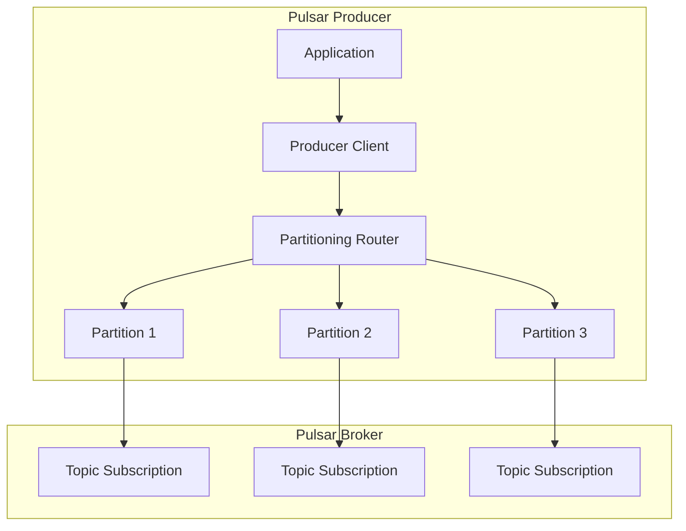

# Pulsar Producer原理与代码实例讲解

## 1.背景介绍

Apache Pulsar 是一个云原生、分布式的消息流处理平台,旨在提供高度可扩展、高性能和低延迟的消息传递能力。在 Pulsar 中,Producer 是负责向 Topic 发送消息的客户端,它是整个消息系统的入口点。本文将深入探讨 Pulsar Producer 的工作原理,并通过代码示例帮助读者更好地理解其使用方式。

## 2.核心概念与联系

在了解 Pulsar Producer 之前,我们需要先掌握一些核心概念:

1. **Topic**: 消息的逻辑命名空间,用于对消息进行分类和路由。
2. **Partition**: Topic 可以被分割成多个 Partition,每个 Partition 是一个单独的消息队列,用于提高并行度和吞吐量。
3. **Message Batch**: Pulsar 会将多条消息打包成一个 Batch,以减少网络开销和提高吞吐量。
4. **Sequence ID**: 每条消息都会被分配一个单调递增的 Sequence ID,用于确保消息的有序性。
5. **Send Timeout**: Producer 发送消息的超时时间,超时后会触发重试或失败处理。
6. **Send Async**: 异步发送模式,Producer 不需要等待消息被确认就可以继续发送下一条消息。

### Mermaid 流程图:



## 3.核心算法原理具体操作步骤

Pulsar Producer 的核心算法原理可以概括为以下几个步骤:

1. **初始化 Producer**: 应用程序首先需要创建一个 Producer 实例,并指定 Topic 名称、发送配置等参数。

2. **选择 Partition**: Producer 会根据消息的 Key 或 Round-Robin 算法选择一个 Partition 作为目标。

3. **构建 Message Batch**: Producer 会将多条消息打包成一个 Batch,以提高吞吐量和减少网络开销。

4. **发送 Message Batch**: Producer 会将 Message Batch 发送到对应的 Partition。

5. **处理发送结果**: Producer 会等待 Broker 的确认响应,如果发送成功,则继续发送下一个 Batch;如果发送失败,则根据重试策略进行重试或报错处理。

6. **维护 Send Queue**: Producer 会维护一个 Send Queue,用于缓存待发送的消息,以防止发送过快导致 Broker 过载。

7. **流控与背压**: Producer 会根据 Broker 的反馈信息进行流控和背压,以避免过多的消息堆积在 Broker 端。

## 4.数学模型和公式详细讲解举例说明

在 Pulsar Producer 中,有一些重要的数学模型和公式需要了解:

1. **Batch Size 计算**:

Pulsar 会根据配置的 `batchingMaxMessages` 和 `batchingMaxBytes` 来决定何时构建一个新的 Batch。具体计算公式如下:

$$
batchSize = min(batchingMaxMessages, \sum_{i=1}^{n} messageSize_i \le batchingMaxBytes)
$$

其中 $n$ 表示当前 Batch 中的消息数量,`messageSize` 表示每条消息的大小。

2. **Send Timeout 计算**:

Producer 发送消息的超时时间由以下公式决定:

$$
sendTimeout = operationTimeoutMs + max(sendTimeoutInternalMs, sendTimeoutInternalMs \times (retryCount + 1))
$$

其中 `operationTimeoutMs` 是整个操作的超时时间,`sendTimeoutInternalMs` 是单次发送的超时时间,`retryCount` 是当前重试次数。

3. **流控与背压**:

Pulsar 采用基于令牌桶算法的流控机制,Producer 的发送速率由以下公式决定:

$$
sendRate = \frac{bucketData}{bucketDataRefreshIntervalInMs}
$$

其中 `bucketData` 表示令牌桶的大小,`bucketDataRefreshIntervalInMs` 表示令牌桶的刷新间隔。

如果 Producer 的发送速率超过了上述速率,则会触发背压机制,Producer 会暂时阻塞发送,直到令牌桶中有足够的令牌。

## 5.项目实践:代码实例和详细解释说明

下面是一个使用 Java 客户端库创建 Pulsar Producer 的示例代码:

```java
import org.apache.pulsar.client.api.Producer;
import org.apache.pulsar.client.api.PulsarClient;
import org.apache.pulsar.client.api.PulsarClientException;

public class PulsarProducerExample {
    public static void main(String[] args) throws PulsarClientException {
        // 创建 Pulsar 客户端实例
        PulsarClient client = PulsarClient.builder()
                .serviceUrl("pulsar://localhost:6650")
                .build();

        // 创建 Producer 实例
        Producer<byte[]> producer = client.newProducer()
                .topic("my-topic")
                .create();

        // 发送消息
        producer.sendAsync("Hello Pulsar!".getBytes())
                .thenAccept(msgId -> {
                    System.out.printf("Message sent successfully: %s%n", msgId);
                })
                .exceptionally(ex -> {
                    System.err.println("Failed to send message");
                    ex.printStackTrace();
                    return null;
                });

        // 关闭 Producer 和客户端
        producer.close();
        client.close();
    }
}
```

代码解释:

1. 首先,我们创建了一个 `PulsarClient` 实例,并指定了 Pulsar 集群的服务地址。

2. 然后,我们使用 `PulsarClient` 创建了一个 `Producer` 实例,并指定了目标 Topic 名称 `my-topic`。

3. 接下来,我们使用 `producer.sendAsync()` 方法异步发送一条消息 `"Hello Pulsar!"`。发送成功后,我们会打印出消息的 ID;发送失败时,会打印出错误信息。

4. 最后,我们关闭了 `Producer` 实例和 `PulsarClient` 实例。

上述示例代码展示了如何创建 Pulsar Producer 并发送消息的基本流程。在实际应用中,我们还需要根据具体需求配置 Producer 的各种参数,如批量发送、压缩、重试策略等。

## 6.实际应用场景

Pulsar Producer 在以下场景中得到了广泛应用:

1. **物联网数据采集**: 在物联网系统中,大量的传感器设备需要将数据实时发送到消息队列中,Pulsar Producer 可以高效地处理这些数据流。

2. **日志收集和处理**: Pulsar 可以作为日志收集系统的后端,应用程序使用 Producer 将日志数据发送到 Pulsar,再由其他组件进行日志处理和分析。

3. **实时数据管道**: Pulsar 可以构建实时数据管道,Producer 将数据源头的数据发送到 Pulsar,再由下游的消费者进行实时处理和分析。

4. **事件驱动架构**: 在事件驱动架构中,各个微服务使用 Producer 发布事件消息,其他服务订阅这些事件进行响应和处理。

5. **流处理系统**: Pulsar 可以与流处理框架(如 Apache Flink、Apache Spark Streaming 等)集成,Producer 将数据发送到 Pulsar,再由流处理框架进行实时计算和分析。

## 7.工具和资源推荐

1. **Pulsar 官方文档**: https://pulsar.apache.org/docs/en/next/client-libraries-java/
2. **Pulsar 客户端库**: https://github.com/apache/pulsar/tree/master/pulsar-client
3. **Pulsar 性能测试工具**: https://github.com/apache/pulsar/tree/master/tests/pulsar-perf
4. **Pulsar 监控工具**: https://github.com/apache/pulsar/tree/master/monitoring-tools
5. **Pulsar 社区**: https://lists.apache.org/list.html?user@pulsar.apache.org

## 8.总结:未来发展趋势与挑战

Pulsar 作为一个新兴的云原生消息队列系统,具有高度可扩展性、高性能和低延迟等优势,在实时数据处理领域有着广阔的应用前景。未来,Pulsar 将继续优化其核心功能,提高可靠性和安全性,并加强与其他大数据生态系统的集成。

同时,Pulsar 也面临着一些挑战,例如:

1. **大规模集群管理**: 随着 Pulsar 集群规模的扩大,如何高效管理和监控成千上万个 Topic 和 Partition 将是一个巨大的挑战。

2. **多租户隔离**: 在多租户场景下,如何实现不同租户之间的资源隔离和安全隔离是一个需要解决的问题。

3. **流控优化**: 虽然 Pulsar 已经采用了令牌桶算法进行流控,但在极端场景下仍可能出现背压问题,需要进一步优化流控机制。

4. **事务支持**: 目前 Pulsar 还不支持跨 Topic 的事务,未来可能需要引入事务机制以满足更复杂的业务需求。

5. **生态系统建设**: 虽然 Pulsar 已经与一些大数据框架集成,但与主流的云原生生态系统(如 Kubernetes、Istio 等)的集成还需要进一步加强。

总的来说,Pulsar 作为一个活跃的开源项目,其发展前景广阔,也将面临诸多挑战。我们有理由相信,在社区的共同努力下,Pulsar 将成为云原生时代的主流消息队列系统。

## 9.附录:常见问题与解答

1. **什么是 Pulsar 的 Partitioned Topic?**

Partitioned Topic 是 Pulsar 中的一种特殊 Topic 类型,它可以被分割成多个 Partition,每个 Partition 是一个单独的消息队列。这种设计可以提高 Topic 的并行度和吞吐量,同时也便于消息的有序性保证和负载均衡。

2. **Pulsar Producer 是否支持批量发送消息?**

是的,Pulsar Producer 支持批量发送消息。Producer 会根据配置的 `batchingMaxMessages` 和 `batchingMaxBytes` 参数,将多条消息打包成一个 Batch 进行发送,以减少网络开销和提高吞吐量。

3. **如何配置 Pulsar Producer 的重试策略?**

Pulsar Producer 提供了多种重试策略,可以通过 `sendTimeout` 和 `retryMessages` 等参数进行配置。例如,我们可以设置 `sendTimeout` 为一个较大的值,并启用 `retryMessages` 选项,这样 Producer 在发送失败时会自动重试一定次数。

4. **Pulsar Producer 是否支持压缩?**

是的,Pulsar Producer 支持对消息进行压缩,可以通过设置 `compressionType` 参数来指定压缩算法,如 `LZ4`、`ZLIB` 等。压缩可以减小消息的网络传输开销,但也会增加 CPU 开销。

5. **如何监控 Pulsar Producer 的性能指标?**

Pulsar 提供了一些内置的监控指标,可以通过 Prometheus、Grafana 等工具进行可视化展示。常见的 Producer 性能指标包括:发送消息速率、发送消息延迟、发送失败率、重试次数等。此外,我们也可以使用 Pulsar 提供的性能测试工具 `pulsar-perf` 来测试和评估 Producer 的性能表现。

6. **Pulsar Producer 是否支持消息顺序性保证?**

是的,Pulsar Producer 可以保证消息的顺序性。对于同一个 Key(或者相同的 Routing Key),Producer 会将消息路由到同一个 Partition,从而保证了消息的有序性。如果不需要顺序性保证,也可以通过 Round-Robin 算法将消息均匀分布到不同的 Partition 中。

7. **Pulsar Producer 是否支持事务?**

目前 Pulsar Producer 还不支持跨 Topic 的事务,但可以通过手动控制 Ack 来实现单 Topic 内的事务语义。未来 Pulsar 可能会引入完整的事务支持。

8. **Pulsar Producer 如何处理消息堆积和背压?**

Pulsar Producer 会维护一个 Send Queue,用于缓存待发送的消息。当 Broker 端出现消息堆积时,Producer 会根据 Broker 的反馈信息进行流控和背压,暂时阻