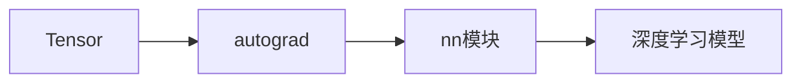

# PyTorch 原理与代码实战案例讲解

## 1. 背景介绍
### 1.1 深度学习的兴起与发展
### 1.2 PyTorch的诞生与特点
### 1.3 PyTorch在学术界和工业界的应用现状

## 2. 核心概念与联系
### 2.1 Tensor张量
#### 2.1.1 Tensor的定义与性质
#### 2.1.2 Tensor与Numpy数组的区别
#### 2.1.3 Tensor的创建与操作
### 2.2 autograd自动微分
#### 2.2.1 autograd的工作原理
#### 2.2.2 计算图与动态图机制
#### 2.2.3 autograd的应用场景
### 2.3 nn模块
#### 2.3.1 nn模块概述
#### 2.3.2 Module类与层的构建
#### 2.3.3 损失函数与优化器
### 2.4 核心概念之间的联系

## 3. 核心算法原理具体操作步骤
### 3.1 前向传播
#### 3.1.1 线性层与激活函数
#### 3.1.2 卷积层与池化层  
#### 3.1.3 循环神经网络层
### 3.2 反向传播
#### 3.2.1 损失函数求导
#### 3.2.2 梯度下降法
#### 3.2.3 优化器更新参数
### 3.3 模型的保存与加载
#### 3.3.1 state_dict的概念
#### 3.3.2 保存模型参数
#### 3.3.3 加载预训练模型

## 4. 数学模型和公式详细讲解举例说明
### 4.1 线性回归
#### 4.1.1 数学模型
$$\hat{y} = w^Tx + b$$
#### 4.1.2 损失函数 
$$\mathcal{L}(\hat{y},y) = \frac{1}{2}(\hat{y}-y)^2$$
#### 4.1.3 梯度下降法
$$w \leftarrow w - \alpha\frac{\partial \mathcal{L}}{\partial w}$$
$$b \leftarrow b - \alpha\frac{\partial \mathcal{L}}{\partial b}$$
### 4.2 逻辑回归
#### 4.2.1 Sigmoid函数
$$\sigma(x) = \frac{1}{1+e^{-x}}$$
#### 4.2.2 交叉熵损失
$$\mathcal{L}(\hat{y},y) = -[y\log\hat{y}+(1-y)\log(1-\hat{y})]$$
### 4.3 卷积神经网络
#### 4.3.1 卷积操作
$$\mathbf{Y} = \mathbf{W} * \mathbf{X} + \mathbf{b}$$
#### 4.3.2 池化操作
$$y_{i,j} = \max_{(m,n)\in R_{ij}} x_{m,n}$$

## 5. 项目实践：代码实例和详细解释说明
### 5.1 图像分类
#### 5.1.1 数据集准备
#### 5.1.2 模型构建
#### 5.1.3 训练与评估
#### 5.1.4 模型微调
### 5.2 自然语言处理
#### 5.2.1 词嵌入
#### 5.2.2 循环神经网络
#### 5.2.3 注意力机制
#### 5.2.4 Transformer模型
### 5.3 生成对抗网络
#### 5.3.1 生成器与判别器
#### 5.3.2 对抗损失函数
#### 5.3.3 图像生成实例

## 6. 实际应用场景
### 6.1 计算机视觉
#### 6.1.1 目标检测
#### 6.1.2 语义分割
#### 6.1.3 人脸识别
### 6.2 自然语言处理
#### 6.2.1 情感分析
#### 6.2.2 机器翻译
#### 6.2.3 文本摘要
### 6.3 推荐系统
#### 6.3.1 协同过滤
#### 6.3.2 深度学习推荐模型

## 7. 工具和资源推荐
### 7.1 PyTorch官方文档
### 7.2 PyTorch社区资源
### 7.3 相关书籍推荐
### 7.4 开源项目与预训练模型

## 8. 总结：未来发展趋势与挑战
### 8.1 PyTorch的优势与局限性
### 8.2 深度学习的发展趋势
### 8.3 PyTorch面临的挑战与机遇

## 9. 附录：常见问题与解答
### 9.1 如何在GPU上训练模型？ 
### 9.2 如何调试PyTorch代码？
### 9.3 如何处理过拟合问题？
### 9.4 如何选择合适的学习率？
### 9.5 如何进行数据增强？

PyTorch是当前深度学习领域最为流行和强大的框架之一。自2016年Facebook开源PyTorch以来，它凭借其简洁的接口设计、动态计算图机制以及强大的社区支持，迅速成为学术界和工业界广泛采用的深度学习工具。

PyTorch的核心概念包括Tensor张量、autograd自动微分和nn模块。Tensor是PyTorch中的基本数据结构，类似于Numpy中的ndarray，但可以在GPU上运行以加速计算。autograd为Tensor提供了自动微分的功能，可以根据计算图自动计算梯度，使得反向传播变得十分简单。nn模块则提供了常用的神经网络层，如全连接层、卷积层、池化层、循环神经网络层等，同时还包括了各种损失函数和优化器，使得构建和训练神经网络模型变得非常方便。

在实际应用中，利用PyTorch可以轻松实现各种经典的深度学习模型，如卷积神经网络（CNN）、循环神经网络（RNN）、生成对抗网络（GAN）等。以图像分类任务为例，我们首先需要准备好数据集，然后利用nn模块构建CNN模型，定义损失函数和优化器，接着进行训练和评估。为了进一步提高模型性能，我们还可以使用预训练模型进行微调。

PyTorch在计算机视觉、自然语言处理、推荐系统等领域都有广泛的应用。在计算机视觉领域，利用PyTorch可以实现目标检测、语义分割、人脸识别等任务。在自然语言处理领域，PyTorch被用于情感分析、机器翻译、文本摘要等任务。在推荐系统领域，PyTorch可以用于构建协同过滤和深度学习推荐模型。

PyTorch拥有活跃的社区和丰富的资源。官方文档提供了详尽的API参考和教程，社区中也有许多优秀的开源项目和预训练模型可供参考和使用。此外，还有一些优秀的书籍可以帮助深入理解PyTorch的原理和实践。

尽管PyTorch具有诸多优势，但它也存在一些局限性，如对分布式训练的支持不如TensorFlow完善，部署到移动端和嵌入式设备的支持也有待加强。未来，PyTorch需要在这些方面进一步改进，同时顺应深度学习技术的发展趋势，如图神经网络、元学习、联邦学习等。

总之，PyTorch是一个强大而灵活的深度学习框架，适合学术研究和工业应用。通过学习PyTorch的原理和实践，我们可以更好地理解和应用深度学习技术，为人工智能的发展贡献自己的力量。

作者：禅与计算机程序设计艺术 / Zen and the Art of Computer Programming