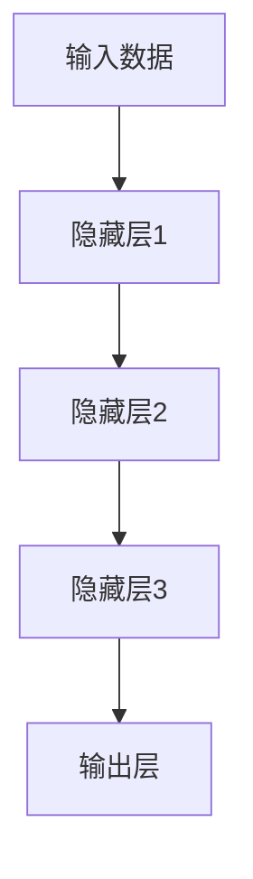
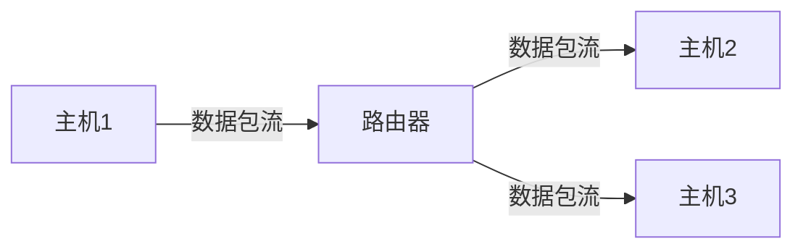
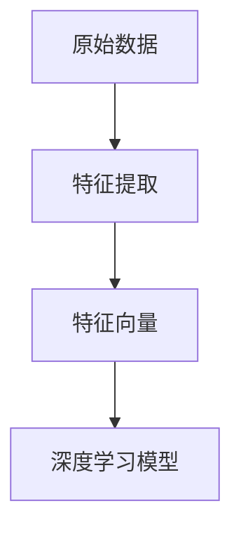
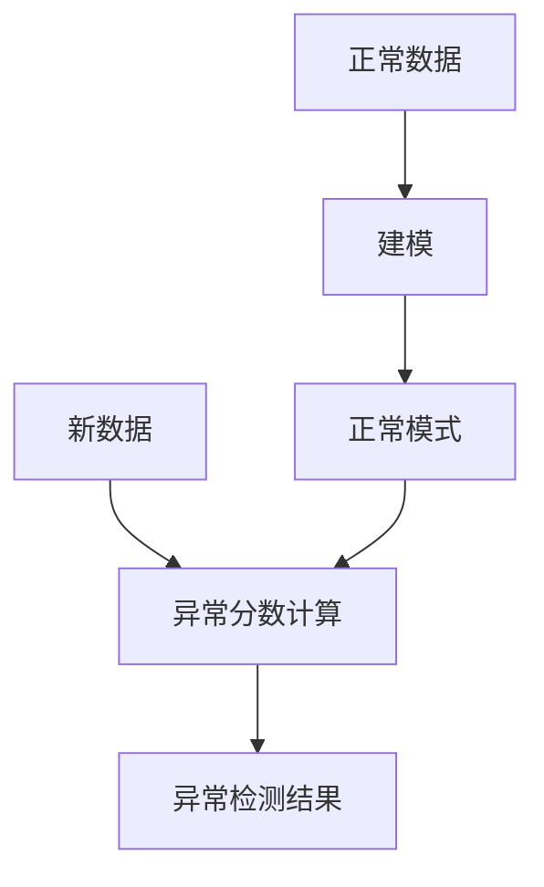

# Python深度学习实践：如何使用深度学习抵御网络攻击

## 1.背景介绍

随着网络技术的快速发展,网络攻击也变得越来越频繁和复杂。传统的防御措施如防火墙、入侵检测系统等已经难以完全应对各种新型网络攻击。深度学习作为一种强大的人工智能技术,在图像识别、自然语言处理等领域取得了巨大成功,近年来也开始被应用于网络安全领域。深度学习模型具有自动提取高维特征、发现复杂模式的能力,在检测和防御网络攻击方面展现出巨大潜力。

### 1.1 网络攻击概述

网络攻击是指黑客或恶意用户试图通过各种手段获取、破坏或渗透计算机系统和网络资源的行为。常见的网络攻击类型包括但不限于:

- 拒绝服务攻击 (DoS/DDoS)
- 网络钓鱼攻击
- 恶意软件 (病毒、蠕虫、木马等)
- SQL注入攻击
- 跨站脚本攻击 (XSS)

这些攻击会对系统和网络造成各种危害,如系统瘫痪、数据泄露、财产损失等。因此,有效的网络攻击检测和防御对于保护关键基础设施和个人隐私安全至关重要。

### 1.2 深度学习在网络安全中的应用

深度学习在网络安全领域的应用主要集中在以下几个方面:

- 入侵检测系统 (IDS)
- 恶意软件检测
- 网络流量分析
- Web应用程序防火墙 (WAF)
- 网络取证分析

利用深度学习模型可以自动从大量网络数据中提取特征,并对异常行为进行检测和分类,从而发现潜在的网络攻击。与传统的基于规则或签名的方法相比,深度学习模型能够更好地应对未知威胁,提高检测的准确性和及时性。

## 2.核心概念与联系

在应用深度学习防御网络攻击之前,我们需要了解几个核心概念及其内在联系。

### 2.1 深度神经网络

深度神经网络 (Deep Neural Network, DNN) 是一种人工神经网络,它由多个隐藏层组成,每层由大量的人工神经元互连。深度学习模型通过对大量训练数据的学习,自动获取输入数据的高维抽象特征表示,从而完成各种任务,如分类、回归、聚类等。常用的深度学习模型包括卷积神经网络 (CNN)、递归神经网络 (RNN)、生成对抗网络 (GAN) 等。



### 2.2 网络流量数据

网络流量数据是指在网络中传输的数据包的统计信息,包括源IP、目的IP、源端口、目的端口、协议类型等字段。通过分析网络流量数据,可以发现异常的网络连接行为,从而检测潜在的网络攻击。



### 2.3 特征工程

特征工程是将原始数据转换为适合机器学习模型的特征向量的过程。在网络安全领域,常用的特征包括流量统计特征 (如数据包长度、时间戳等)、连接特征 (如连接持续时间等)、内容特征 (如数据包有效载荷) 等。高质量的特征对于深度学习模型的性能至关重要。



### 2.4 异常检测

异常检测是通过学习正常数据的模式,发现与正常模式显著不同的数据点或事件。在网络安全中,异常检测可用于发现异常的网络流量或系统行为,从而检测潜在的网络攻击。常用的异常检测算法包括基于统计的方法、基于聚类的方法、基于深度学习的方法等。



## 3.核心算法原理具体操作步骤

在使用深度学习防御网络攻击时,通常需要经历以下几个主要步骤:

1. **数据收集和预处理**
   - 收集网络流量数据、系统日志等原始数据
   - 对原始数据进行清洗、标注、切分等预处理操作

2. **特征工程**
   - 从原始数据中提取有价值的特征,如流量统计特征、连接特征等
   - 对特征进行标准化、编码等转换,构建特征向量

3. **模型选择和训练**
   - 选择合适的深度学习模型,如CNN、RNN、自编码器等
   - 将特征向量输入模型,对模型进行训练,学习正常数据的模式

4. **模型评估和调优**
   - 在测试集上评估模型的性能,计算指标如准确率、召回率等
   - 根据评估结果,调整模型参数、特征选择等,提高模型性能

5. **模型部署和在线检测**
   - 将训练好的模型部署到实际的网络环境中
   - 对实时的网络流量数据进行在线检测,发现异常行为

6. **持续优化和更新**
   - 持续收集新的攻击数据,更新训练集
   - 定期重新训练模型,提高检测效果

在整个过程中,特征工程和模型选择是两个关键环节,直接影响了最终的检测性能。此外,大量的训练数据对于构建有效的深度学习模型也至关重要。

## 4.数学模型和公式详细讲解举例说明

在深度学习模型中,通常使用一些数学模型和公式来描述神经网络的结构和运算过程。下面我们详细介绍几个常用的数学模型和公式。

### 4.1 前馈神经网络

前馈神经网络 (Feedforward Neural Network, FNN) 是最基本的一种人工神经网络,它由输入层、隐藏层和输出层组成。在前向传播过程中,每一层的神经元会接收上一层所有神经元的加权输入,并通过激活函数计算输出,传递到下一层。

设第 $l$ 层有 $n_l$ 个神经元,第 $l-1$ 层有 $n_{l-1}$ 个神经元,则第 $l$ 层第 $j$ 个神经元的输出可表示为:

$$
a_j^{(l)} = g\left(\sum_{i=1}^{n_{l-1}} w_{ij}^{(l)}a_i^{(l-1)} + b_j^{(l)}\right)
$$

其中 $w_{ij}^{(l)}$ 是第 $l$ 层第 $j$ 个神经元与第 $l-1$ 层第 $i$ 个神经元之间的权重, $b_j^{(l)}$ 是第 $l$ 层第 $j$ 个神经元的偏置项, $g(\cdot)$ 是激活函数。

常用的激活函数包括 Sigmoid 函数、ReLU 函数等:

$$
\text{Sigmoid}(x) = \frac{1}{1 + e^{-x}}
$$

$$
\text{ReLU}(x) = \max(0, x)
$$

通过反向传播算法,可以对神经网络的权重和偏置进行优化,使其能够很好地拟合训练数据。

### 4.2 卷积神经网络

卷积神经网络 (Convolutional Neural Network, CNN) 是一种常用于处理图像、视频等高维数据的深度神经网络。CNN 由卷积层、池化层和全连接层组成,能够自动学习输入数据的空间特征。

在卷积层中,卷积核 (也称滤波器) 会在输入数据上滑动,计算局部区域的加权和,生成一个特征映射。设输入数据为 $X$,卷积核的权重为 $W$,偏置为 $b$,则卷积运算可表示为:

$$
(X * W)_{x, y} = \sum_{i, j} X_{x+i, y+j} \cdot W_{i, j} + b
$$

其中 $*$ 表示卷积操作。通过多个卷积层和非线性激活函数,CNN 可以逐层提取输入数据的高级语义特征。

池化层用于降低特征维度,提高模型的鲁棒性。常用的池化操作包括最大池化和平均池化。

### 4.3 自编码器

自编码器 (Autoencoder) 是一种无监督学习的神经网络模型,常用于特征提取和降维。自编码器由编码器 (Encoder) 和解码器 (Decoder) 两部分组成,其目标是使输出值尽可能接近输入值。

设输入数据为 $x$,编码器将其映射为隐藏表示 $h = f(x)$,解码器则将隐藏表示重构为输出 $r = g(h)$。自编码器的目标是最小化输入 $x$ 与输出 $r$ 之间的重构误差 $L(x, r)$,常用的损失函数包括均方误差、交叉熵等。

通过训练自编码器,我们可以获得输入数据的紧凑表示 $h$,并将其作为特征输入到其他机器学习模型中。自编码器在网络入侵检测中常用于无监督特征学习。

### 4.4 异常分数计算

在异常检测任务中,我们需要为每个样本计算一个异常分数,用于判断其是否为异常。常用的异常分数计算方法包括:

1. **重构误差**
   对于自编码器模型,我们可以使用输入数据与重构输出之间的误差作为异常分数,即:
   $$
   \text{异常分数} = L(x, r)
   $$
   其中 $L(\cdot)$ 是损失函数,如均方误差或交叉熵。异常数据通常会有较大的重构误差。

2. **概率密度估计**
   对于基于统计的异常检测方法,我们可以估计正常数据的概率密度函数 $p(x)$,将样本 $x$ 在该密度函数下的概率作为异常分数:
   $$
   \text{异常分数} = -\log p(x)
   $$
   正常数据通常会有较高的概率密度,异常数据则概率较低。

3. **判别式方法**
   对于基于判别模型的方法 (如单类支持向量机、隔离森林等),我们可以直接使用模型的判别函数输出作为异常分数。

通过设置合适的异常分数阈值,我们可以将样本划分为正常或异常两类,从而实现异常检测。

## 5.项目实践:代码实例和详细解释说明

为了更好地理解如何使用深度学习进行网络攻击检测,我们提供一个基于 PyTorch 的代码示例,使用自编码器模型对 NSL-KDD 数据集中的网络流量数据进行异常检测。

### 5.1 数据准备

NSL-KDD 数据集是一个常用的网络入侵检测数据集,包含了各种正常连接和攻击连接的网络流量特征。我们首先导入相关的库并加载数据集:

```python
import torch
import torch.nn as nn
import pandas as pd
from sklearn.preprocessing import StandardScaler

# 加载数据集
data = pd.read_csv('KDDTrain+.txt', header=None)
X = data.iloc[:, :-1].values
y = data.iloc[:, -1].values

# 特征标准化
scaler = StandardScaler()
X = scaler.fit_transform(X)
```

### 5.2 自编码器模型

我们定义一个简单的自编码器模型,由一个编码器和一个解码器组成:

```python
class Autoencoder(nn.Module):
    def __init__(self, input_dim, hidden_dim):
        super(Autoencoder, self).__init__()
        self.encoder = nn.Sequential(
            nn.Linear(input_dim, hidden_dim),
            nn.ReLU()
        )
        self.decoder = nn.Sequential(
            nn.Linear(hidden_dim, input_dim),
            nn.Sigmoid()
        )

    