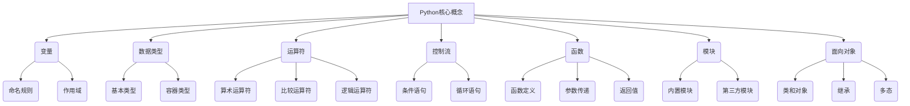

# Python语言基础原理与代码实战案例讲解

## 1.背景介绍

Python是一种广泛使用的高级编程语言,它的设计理念强调代码可读性和简洁性。Python由荷兰人Guido van Rossum于1991年发明,目前由Python软件基金会负责维护和发展。

Python语言的主要特点包括:

- **简单易学**: Python语法简单直观,阅读和编写Python代码就像写伪代码一样自然。这使得Python成为初学者友好的编程语言。

- **开源免费**: Python是开源和免费使用的,可以在多种平台上运行,包括Windows、Linux和macOS。

- **动态类型**: Python是动态类型语言,变量可以在运行时赋予不同类型的值,无需预先声明变量类型。

- **可扩展性**: Python可以通过导入模块和库来扩展其功能,涵盖了各种领域,如Web开发、数据分析、机器学习等。

- **面向对象**: Python支持面向对象编程范式,提供了类、继承和多态等概念。

- **解释型语言**: Python是一种解释型语言,代码在运行时被解释器逐行执行,无需预先编译。

- **广泛应用**: Python在Web开发、数据科学、自动化脚本、系统管理等领域都有广泛的应用。

随着Python生态系统的不断发展,越来越多的开发者选择Python作为他们的首选语言。Python的简单性和可读性使其成为初学者友好的语言,同时其强大的功能也使其适用于各种复杂的应用程序开发。

## 2.核心概念与联系

Python语言的核心概念包括变量、数据类型、运算符、控制流、函数、模块、面向对象编程等。这些概念相互关联,构成了Python语言的基础框架。



1. **变量**: 变量是用于存储数据值的命名存储空间。Python中的变量无需预先声明类型,可以在运行时动态赋值。变量遵循一定的命名规则,并具有作用域的概念。

2. **数据类型**: Python支持多种数据类型,包括基本类型(如整数、浮点数、布尔值、字符串)和容器类型(如列表、元组、字典、集合)。

3. **运算符**: Python提供了各种运算符,如算术运算符(+、-、*、/等)、比较运算符(>、<、==等)和逻辑运算符(and、or、not等),用于执行不同的操作。

4. **控制流**: 控制流语句用于控制程序的执行流程,包括条件语句(如if、elif、else)和循环语句(如for、while)。

5. **函数**: 函数是可重用的代码块,可以接受参数并返回值。函数使代码模块化,提高了代码的可读性和可维护性。

6. **模块**: 模块是Python中的代码组织单位,可以将相关的函数、类和变量组织在一起。Python提供了丰富的内置模块和第三方模块,扩展了语言的功能。

7. **面向对象编程**: Python支持面向对象编程范式,包括类和对象的概念、继承和多态等特性。面向对象编程有助于代码的可重用性和可维护性。

这些核心概念相互关联,构成了Python语言的基础框架。掌握这些概念对于编写高质量的Python代码至关重要。

## 3.核心算法原理具体操作步骤

Python作为一种通用编程语言,提供了多种核心算法和数据结构,用于解决各种问题。以下是一些常见的算法原理和具体操作步骤:

### 3.1 排序算法

排序算法用于将元素按照特定顺序排列。常见的排序算法包括:

1. **冒泡排序**:

   - 比较相邻元素,如果顺序错误则交换
   - 对每对相邻元素重复上述步骤,直到没有需要交换的元素

2. **插入排序**:

   - 将数组分为已排序和未排序两部分
   - 从未排序部分取出第一个元素,插入到已排序部分的正确位置

3. **快速排序**:

   - 选择一个基准元素
   - 将数组划分为两部分,小于基准元素的放在左边,大于基准元素的放在右边
   - 递归地对左右两部分进行快速排序

4. **归并排序**:

   - 将数组分成两半
   - 递归地对两半进行归并排序
   - 合并两个有序数组

### 3.2 搜索算法

搜索算法用于在数据集合中查找特定元素。常见的搜索算法包括:

1. **线性搜索**:

   - 从数组的第一个元素开始,依次比较每个元素
   - 如果找到目标元素,返回其索引;否则返回-1

2. **二分搜索**:

   - 要求数组是有序的
   - 取中间元素,比较目标元素与中间元素的大小
   - 根据比较结果,缩小搜索范围,继续在剩余部分进行二分搜索

### 3.3 递归算法

递归是一种解决问题的方法,通过将问题分解为更小的子问题,直到子问题足够简单可以直接解决。常见的递归算法包括:

1. **阶乘计算**:

   - 基础情况:0的阶乘为1
   - 递归情况:n的阶乘为n乘以(n-1)的阶乘

2. **斐波那契数列**:

   - 基础情况:前两个斐波那契数为0和1
   - 递归情况:第n个斐波那契数等于前两个数之和

3. **汉诺塔问题**:

   - 基础情况:只有一个盘子,直接移动到目标柱
   - 递归情况:将n-1个盘子移动到辅助柱,将最后一个盘子移动到目标柱,再将辅助柱上的n-1个盘子移动到目标柱

### 3.4 动态规划算法

动态规划是一种解决复杂问题的方法,通过将问题分解为相互重叠的子问题,并存储子问题的解,避免重复计算。常见的动态规划算法包括:

1. **斐波那契数列**:

   - 创建一个数组存储已计算的斐波那契数
   - 从前往后计算每个斐波那契数,并存储在数组中
   - 后续计算时,直接查询数组中的值

2. **背包问题**:

   - 定义dp[i][j]表示前i个物品,背包容量为j时的最大价值
   - 对于每个物品,有两种选择:放入或不放入背包
   - 根据选择更新dp[i][j]的值

3. **最长公共子序列**:

   - 定义dp[i][j]表示字符串1前i个字符和字符串2前j个字符的最长公共子序列长度
   - 如果字符相等,dp[i][j] = dp[i-1][j-1] + 1
   - 如果字符不等,dp[i][j] = max(dp[i-1][j], dp[i][j-1])

动态规划算法通过存储子问题的解,避免了重复计算,提高了算法的效率。

## 4.数学模型和公式详细讲解举例说明

在Python中,我们可以使用内置的math模块和NumPy库来进行数学计算和建模。以下是一些常见的数学模型和公式,以及如何在Python中实现。

### 4.1 线性代数

线性代数是数学的一个重要分支,在机器学习、图像处理等领域有广泛应用。Python中的NumPy库提供了强大的线性代数功能。

1. **矩阵乘法**:

   $$
   C = AB
   $$

   其中A是m×n矩阵,B是n×p矩阵,C是m×p矩阵。

   在Python中,可以使用NumPy的`np.matmul()`函数进行矩阵乘法:

   ```python
   import numpy as np

   A = np.array([[1, 2], [3, 4]])
   B = np.array([[5, 6], [7, 8]])
   C = np.matmul(A, B)
   print(C)  # [[19, 22], [43, 50]]
   ```

2. **矩阵求逆**:

   $$
   A^{-1}A = I
   $$

   其中A是可逆矩阵,A^-1是A的逆矩阵,I是单位矩阵。

   在Python中,可以使用NumPy的`np.linalg.inv()`函数计算矩阵的逆:

   ```python
   import numpy as np

   A = np.array([[1, 2], [3, 4]])
   A_inv = np.linalg.inv(A)
   print(A_inv)  # [[-2.   1. ], [ 1.5 -0.5]]
   ```

### 4.2 统计学

统计学是数据分析和机器学习的基础。Python中的NumPy和SciPy库提供了丰富的统计函数。

1. **均值和标准差**:

   均值(μ)和标准差(σ)是描述数据集中心位置和离散程度的重要指标。

   $$
   \mu = \frac{1}{n}\sum_{i=1}^{n}x_i
   $$

   $$
   \sigma = \sqrt{\frac{1}{n}\sum_{i=1}^{n}(x_i - \mu)^2}
   $$

   在Python中,可以使用NumPy的`np.mean()`和`np.std()`函数计算均值和标准差:

   ```python
   import numpy as np

   data = np.array([1, 2, 3, 4, 5])
   mean = np.mean(data)
   std = np.std(data)
   print(f"Mean: {mean}, Standard Deviation: {std}")  # Mean: 3.0, Standard Deviation: 1.4142135623730951
   ```

2. **线性回归**:

   线性回归是一种常见的监督学习算法,用于建立自变量和因变量之间的线性关系。

   $$
   y = \beta_0 + \beta_1x + \epsilon
   $$

   其中y是因变量,x是自变量,β0和β1是回归系数,ε是误差项。

   在Python中,可以使用SciPy的`linregress()`函数进行线性回归:

   ```python
   import numpy as np
   from scipy.stats import linregress

   x = np.array([1, 2, 3, 4, 5])
   y = np.array([2, 4, 6, 8, 10])
   slope, intercept, r_value, p_value, std_err = linregress(x, y)
   print(f"Slope: {slope}, Intercept: {intercept}")  # Slope: 2.0, Intercept: 0.0
   ```

### 4.3 微积分

微积分是数学分析的核心内容,在物理、工程等领域有广泛应用。Python中的SymPy库提供了符号计算功能,可以方便地进行微分和积分运算。

1. **导数**:

   导数是函数在某一点的瞬时变化率。

   $$
   f'(x) = \lim_{\Delta x \to 0} \frac{f(x + \Delta x) - f(x)}{\Delta x}
   $$

   在Python中,可以使用SymPy的`diff()`函数计算导数:

   ```python
   import sympy as sp

   x = sp.symbols('x')
   f = x**2 + 2*x + 1
   derivative = sp.diff(f, x)
   print(derivative)  # 2*x + 2
   ```

2. **不定积分**:

   不定积分是求函数的原函数。

   $$
   \int f(x)dx = F(x) + C
   $$

   其中F(x)是f(x)的一个原函数,C是任意常数。

   在Python中,可以使用SymPy的`integrate()`函数进行不定积分:

   ```python
   import sympy as sp

   x = sp.symbols('x')
   f = x**2 + 2*x + 1
   integral = sp.integrate(f, x)
   print(integral