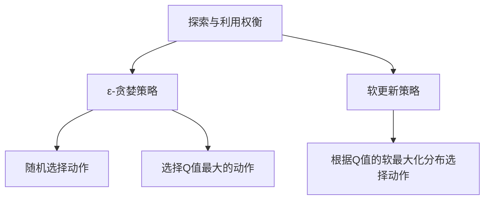

# Q-Learning - 原理与代码实例讲解

## 1.背景介绍

强化学习(Reinforcement Learning)是机器学习的一个重要分支,它关注智能体(Agent)如何通过与环境(Environment)的交互来学习,并在未来做出更好的决策。Q-Learning是强化学习中最成功和最广泛使用的算法之一。

Q-Learning算法最初由计算机科学家克里斯托弗·沃特金斯(Christopher Watkins)于1989年提出,它为解决马尔可夫决策过程(Markov Decision Processes,MDPs)提供了一种模型自由的方法。与需要建模环境转移概率和奖励函数的其他强化学习算法不同,Q-Learning可以直接从与环境的交互中学习最优策略,无需了解环境的内部细节。

## 2.核心概念与联系

### 2.1 马尔可夫决策过程(MDP)

马尔可夫决策过程是Q-Learning算法所基于的数学框架。MDP由以下几个要素组成:

- 状态集合(State Space) $\mathcal{S}$
- 动作集合(Action Space) $\mathcal{A}$
- 转移概率(Transition Probability) $\mathcal{P}_{ss'}^a = \mathcal{P}(s' \mid s, a)$
- 奖励函数(Reward Function) $\mathcal{R}_s^a$
- 折扣因子(Discount Factor) $\gamma \in [0, 1)$

在MDP中,智能体处于某个状态$s \in \mathcal{S}$,并选择一个动作$a \in \mathcal{A}$。环境根据转移概率$\mathcal{P}_{ss'}^a$将智能体转移到新的状态$s'$,并给出相应的奖励$\mathcal{R}_s^a$。折扣因子$\gamma$用于权衡即时奖励和长期累积奖励的重要性。

### 2.2 Q函数和最优策略

Q-Learning算法的目标是找到一个最优的行为策略$\pi^*$,使得在该策略下,智能体可以获得最大化的预期累积奖励。这个最大化的预期累积奖励被称为最优Q函数(Optimal Q-Function),定义如下:

$$Q^*(s, a) = \max_\pi \mathbb{E}_\pi \left[ \sum_{t=0}^\infty \gamma^t r_{t+1} \mid s_0 = s, a_0 = a \right]$$

其中,$\pi$是智能体的行为策略,$r_t$是在时间步$t$获得的奖励,$\gamma$是折扣因子。最优Q函数$Q^*(s, a)$表示在状态$s$下选择动作$a$,并之后按照最优策略$\pi^*$行动时,可以获得的最大化预期累积奖励。

最优策略$\pi^*$可以通过最优Q函数得到:

$$\pi^*(s) = \arg\max_a Q^*(s, a)$$

也就是说,在任意状态$s$下,最优策略$\pi^*$是选择能够使Q函数最大化的动作。

## 3.核心算法原理具体操作步骤

Q-Learning算法的核心思想是通过不断与环境交互,逐步更新Q函数的估计值,使其逼近真实的最优Q函数。算法的具体步骤如下:

1. 初始化Q函数的估计值$Q(s, a)$,通常将所有状态动作对的值初始化为0或一个较小的常数。
2. 对于每一个Episode(即一个完整的交互序列):
    1) 初始化智能体的状态$s_0$
    2) 对于每个时间步$t$:
        1) 根据当前的Q函数估计值,选择一个动作$a_t$(探索策略将在后面介绍)
        2) 执行选择的动作$a_t$,观察到新的状态$s_{t+1}$和获得的即时奖励$r_{t+1}$
        3) 更新Q函数的估计值:
            $$Q(s_t, a_t) \leftarrow Q(s_t, a_t) + \alpha \left[ r_{t+1} + \gamma \max_{a'} Q(s_{t+1}, a') - Q(s_t, a_t) \right]$$
            其中,$\alpha$是学习率,控制着新信息对Q函数估计值的影响程度。
        4) 将$s_t$更新为$s_{t+1}$
3. 重复步骤2,直到Q函数收敛或达到停止条件。

上述算法的关键步骤是Q函数的更新规则。该更新规则包含两个部分:

1. $r_{t+1}$,即智能体在执行动作$a_t$后获得的即时奖励。
2. $\gamma \max_{a'} Q(s_{t+1}, a')$,即在下一个状态$s_{t+1}$下,按照当前的Q函数估计值选择的最优动作所能获得的预期累积奖励的折现值。

通过不断更新Q函数的估计值,使其逼近真实的最优Q函数$Q^*$,从而找到最优策略$\pi^*$。

### 3.1 探索与利用权衡(Exploration vs Exploitation Trade-off)

在Q-Learning算法中,智能体需要在探索(Exploration)和利用(Exploitation)之间进行权衡。探索意味着尝试新的动作,以发现潜在的更优策略;而利用则是利用目前已知的最优策略来获取最大化的即时奖励。

一种常见的探索策略是$\epsilon$-贪婪(epsilon-greedy)策略。在该策略下,智能体有$\epsilon$的概率随机选择一个动作(探索),有$1-\epsilon$的概率选择当前Q函数估计值最大的动作(利用)。$\epsilon$的值通常会随着时间的推移而逐渐降低,以确保算法最终收敛到一个确定的策略。

另一种探索策略是软更新(Softmax)策略。在该策略下,智能体根据Q函数估计值的软最大化分布来选择动作,较高的Q值对应的动作被选择的概率就越大。该策略避免了$\epsilon$-贪婪策略中硬切换的问题,但计算开销较大。



## 4.数学模型和公式详细讲解举例说明

### 4.1 Q-Learning更新规则的数学推导

我们可以将Q-Learning的更新规则推广到一种更一般的形式,即时间差分(Temporal Difference,TD)学习。TD学习的核心思想是通过估计当前状态的值函数(Value Function)与下一状态的值函数之间的差异,来更新当前状态的值函数估计。

对于Q-Learning算法,我们定义TD误差(TD Error)为:

$$\delta_t = r_{t+1} + \gamma \max_{a'} Q(s_{t+1}, a') - Q(s_t, a_t)$$

TD误差表示了当前Q函数估计值与其应有的"真实"值之间的差异。我们的目标是最小化TD误差的平方,即:

$$\min_Q \mathbb{E}\left[ \delta_t^2 \right] = \min_Q \mathbb{E}\left[ \left( r_{t+1} + \gamma \max_{a'} Q(s_{t+1}, a') - Q(s_t, a_t) \right)^2 \right]$$

通过梯度下降法,我们可以得到Q函数的更新规则:

$$Q(s_t, a_t) \leftarrow Q(s_t, a_t) + \alpha \delta_t$$

其中,$\alpha$是学习率,控制着更新的步长。将TD误差$\delta_t$代入,我们就得到了Q-Learning算法的经典更新规则:

$$Q(s_t, a_t) \leftarrow Q(s_t, a_t) + \alpha \left[ r_{t+1} + \gamma \max_{a'} Q(s_{t+1}, a') - Q(s_t, a_t) \right]$$

### 4.2 Q-Learning收敛性证明

我们可以证明,在满足以下条件时,Q-Learning算法将收敛到最优Q函数$Q^*$:

1. 每个状态动作对被探索无限次(持续探索条件)
2. 学习率$\alpha$满足:
    - $\sum_{t=0}^\infty \alpha_t = \infty$ (确保持续学习)
    - $\sum_{t=0}^\infty \alpha_t^2 < \infty$ (确保收敛)

证明的关键思路是利用随机近似过程(Stochastic Approximation Process)的理论,将Q-Learning算法看作是在估计一个期望值。具体的证明过程较为复杂,感兴趣的读者可以参考相关论文和教材。

## 5.项目实践:代码实例和详细解释说明

下面是一个简单的Q-Learning算法实现示例,用于解决经典的"冰淇淋销售问题"(Ice Cream Seller Problem)。在这个问题中,一个冰淇淋销售商需要根据当天的天气情况(晴天或阴天)决定是否应该去公园销售冰淇淋。如果当天是晴天,去公园销售可以获得正的奖励;如果是阴天,去公园销售将获得负的奖励。销售商的目标是找到一个策略,使得长期的累积奖励最大化。

```python
import numpy as np

# 定义状态空间和动作空间
STATES = ['sunny', 'cloudy']
ACTIONS = ['go', 'stay']

# 定义奖励函数
REWARDS = {
    'sunny': {'go': 1, 'stay': 0},
    'cloudy': {'go': -1, 'stay': 0}
}

# 定义状态转移概率
TRANSITION_PROBS = {
    'sunny': {'sunny': 0.8, 'cloudy': 0.2},
    'cloudy': {'sunny': 0.2, 'cloudy': 0.8}
}

# 初始化Q函数
Q = np.zeros((len(STATES), len(ACTIONS)))

# 设置超参数
GAMMA = 0.9  # 折扣因子
ALPHA = 0.1  # 学习率
EPSILON = 0.1  # 探索概率
NUM_EPISODES = 10000  # 训练回合数

# 定义epsilon-greedy策略
def choose_action(state, epsilon):
    if np.random.uniform() < epsilon:
        return np.random.choice(ACTIONS)  # 探索
    else:
        return ACTIONS[np.argmax(Q[STATES.index(state)])]  # 利用

# 训练Q-Learning算法
for episode in range(NUM_EPISODES):
    state = np.random.choice(STATES)  # 初始化状态
    done = False
    while not done:
        action = choose_action(state, EPSILON)
        next_state = np.random.choice(STATES, p=TRANSITION_PROBS[state])
        reward = REWARDS[state][action]
        Q[STATES.index(state)][ACTIONS.index(action)] += ALPHA * (
            reward + GAMMA * np.max(Q[STATES.index(next_state)]) - Q[STATES.index(state)][ACTIONS.index(action)]
        )
        state = next_state
        if np.random.uniform() < 0.1:  # 10%的概率结束回合
            done = True

# 输出最优策略
for state in STATES:
    print(f"In state '{state}', the optimal action is '{ACTIONS[np.argmax(Q[STATES.index(state)])]}'")
```

上述代码首先定义了状态空间、动作空间、奖励函数和状态转移概率。然后初始化Q函数,并设置相关超参数。

在训练过程中,我们使用epsilon-greedy策略选择动作。对于每一个时间步,我们根据当前状态和选择的动作,观察到下一个状态和获得的即时奖励,并更新Q函数的估计值。

最后,我们输出每个状态下的最优动作,即Q函数估计值最大的动作。

通过运行上述代码,我们可以看到Q-Learning算法成功地找到了最优策略:在晴天时去公园销售冰淇淋,在阴天时待在家里。

## 6.实际应用场景

Q-Learning算法由于其简单性和有效性,在许多实际应用场景中发挥着重要作用。以下是一些典型的应用示例:

### 6.1 机器人控制

在机器人控制领域,Q-Learning算法可以用于训练机器人完成各种任务,如导航、物体抓取、操作等。机器人的状态可以由其位置、姿态和周围环境等因素组成,而动作则对应于机器人的运动指令。通过与环境的交互,Q-Learning算法可以学习到最优的控制策略,使机器人能够高效地完成任务。

### 6.2 游戏AI

Q-Learning算法在游戏AI领域也有广泛的应用。许多经典游戏,如国际象棋、围棋、雅达