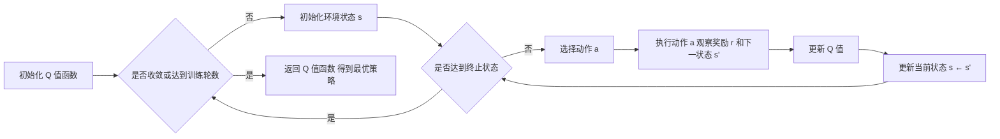

# Q-Learning原理与代码实例讲解

## 1.背景介绍

### 1.1 强化学习概述
强化学习(Reinforcement Learning, RL)是机器学习的一个重要分支,它研究如何让智能体(agent)通过与环境的交互来学习最优策略,以获得最大的累积奖励。与监督学习和非监督学习不同,强化学习并没有预先给定的训练数据,而是通过探索和利用(exploration and exploitation)的方式来学习。

### 1.2 Q-Learning的起源与发展
Q-Learning是强化学习中一种非常经典和有效的无模型(model-free)算法,由Watkins在1989年首次提出。它可以在没有环境模型的情况下,通过不断与环境交互来学习最优策略。Q-Learning在诸多领域都取得了很好的效果,如游戏、机器人控制、自然语言处理等。近年来,随着深度学习的兴起,Q-Learning也被与深度神经网络相结合,形成了 DQN、Double DQN 等算法,进一步提升了性能。

### 1.3 Q-Learning的应用价值
Q-Learning 作为强化学习的代表算法之一,具有广泛的应用前景:

1. 游戏智能体:通过 Q-Learning,可以训练出在游戏中表现出色的智能体,如 DeepMind 的 DQN 在 Atari 游戏中达到了超人的水平。
2. 机器人控制:Q-Learning 可应用于机器人的运动规划与控制,让机器人学会在复杂环境中执行任务。  
3. 推荐系统:将推荐问题建模为马尔可夫决策过程,使用 Q-Learning 优化推荐策略。
4. 智能交通:利用 Q-Learning 优化交通信号灯的控制,缓解交通拥堵问题。
5. 资源管理:在云计算、网络等领域,Q-Learning 可用于优化资源的动态分配。

总之,Q-Learning 是一种应用广泛、实用性很强的强化学习算法。接下来,我们将深入探讨它的原理和代码实现。

## 2.核心概念与联系

### 2.1 马尔可夫决策过程(MDP)
马尔可夫决策过程是理解 Q-Learning 的基础。MDP 由以下元素构成:

- 状态集合 $\mathcal{S}$:智能体所处的环境状态的集合。
- 动作集合 $\mathcal{A}$:智能体在每个状态下可执行的动作的集合。
- 转移概率 $\mathcal{P}$:状态之间转移的概率,即在状态 $s$ 下执行动作 $a$ 后转移到状态 $s'$ 的概率 $P(s'|s,a)$。 
- 奖励函数 $\mathcal{R}$:智能体执行动作后获得的即时奖励,即在状态 $s$ 下执行动作 $a$ 后获得的奖励 $R(s,a)$。
- 折扣因子 $\gamma$:用于平衡即时奖励和未来奖励的权重,取值范围为 $[0,1]$。

MDP 的目标是寻找一个最优策略 $\pi^*$,使得智能体能够获得最大的期望累积奖励。

### 2.2 Q 值函数
Q 值函数 $Q(s,a)$ 表示在状态 $s$ 下执行动作 $a$ 的价值,即执行动作 $a$ 后的期望累积奖励:

$$Q(s,a)=\mathbb{E}\left[\sum_{t=0}^{\infty} \gamma^t R(s_t,a_t)|s_0=s,a_0=a\right]$$

其中,$s_t$ 和 $a_t$ 分别表示 $t$ 时刻的状态和动作。

### 2.3 贝尔曼方程
Q 值函数满足贝尔曼方程(Bellman Equation):

$$Q(s,a)=R(s,a)+\gamma \sum_{s'\in \mathcal{S}} P(s'|s,a) \max_{a'\in \mathcal{A}} Q(s',a')$$

该方程表明,状态-动作对 $(s,a)$ 的 Q 值等于即时奖励 $R(s,a)$ 加上下一状态 $s'$ 的最大 Q 值的期望,即未来奖励的折现值。

### 2.4 探索与利用
在强化学习中,智能体需要在探索(exploration)和利用(exploitation)之间权衡:

- 探索:尝试新的动作,收集环境信息,发现可能更优的策略。
- 利用:执行当前已知的最优动作,最大化累积奖励。

常见的探索策略有 $\epsilon$-greedy 和 Boltzmann 探索等。

## 3.核心算法原理具体操作步骤

Q-Learning 的核心思想是通过不断更新 Q 值函数来逼近最优 Q 值函数 $Q^*$,进而得到最优策略 $\pi^*$。算法的具体步骤如下:

1. 初始化 Q 值函数 $Q(s,a)$,对于所有的状态-动作对 $(s,a)$,令 $Q(s,a)=0$。

2. 重复以下步骤,直到 Q 值函数收敛或达到预设的训练轮数:
   
   (1) 初始化环境状态 $s$。
   
   (2) 重复以下步骤,直到达到终止状态:
      
      - 根据当前的 Q 值函数和探索策略(如 $\epsilon$-greedy),选择一个动作 $a$。
      - 执行动作 $a$,观察奖励 $r$ 和下一状态 $s'$。
      - 根据观察到的信息,更新 Q 值:
        $$Q(s,a) \leftarrow Q(s,a) + \alpha \left[r + \gamma \max_{a'} Q(s',a') - Q(s,a)\right]$$
        其中,$\alpha \in (0,1]$ 为学习率。
      - 将当前状态更新为下一状态,即 $s \leftarrow s'$。

3. 返回 Q 值函数 $Q(s,a)$,得到最优策略 $\pi^*(s)=\arg\max_a Q(s,a)$。

下图展示了 Q-Learning 算法的流程:



## 4.数学模型和公式详细讲解举例说明

### 4.1 Q 值更新公式推导
Q-Learning 的核心是 Q 值更新公式:

$$Q(s,a) \leftarrow Q(s,a) + \alpha \left[r + \gamma \max_{a'} Q(s',a') - Q(s,a)\right]$$

这个公式可以这样理解:新的 Q 值是旧的 Q 值 $Q(s,a)$ 加上一个修正项,修正项由即时奖励 $r$ 和下一状态的最大 Q 值 $\max_{a'} Q(s',a')$ 组成,表示了执行动作 $a$ 后的实际价值。两者的差值乘以学习率 $\alpha$,作为 Q 值的增量。

我们可以将 Q 值更新公式进一步变形:

$$\begin{aligned}
Q(s,a) & \leftarrow Q(s,a) + \alpha \left[r + \gamma \max_{a'} Q(s',a') - Q(s,a)\right] \\
& = (1-\alpha)Q(s,a) + \alpha \left[r + \gamma \max_{a'} Q(s',a')\right] \\
& = (1-\alpha)Q(s,a) + \alpha \left[R(s,a) + \gamma \max_{a'} Q(s',a')\right]
\end{aligned}$$

可以看出,新的 Q 值是旧 Q 值和贝尔曼方程右端的加权平均,权重由学习率 $\alpha$ 决定。当 $\alpha=1$ 时,新 Q 值完全等于贝尔曼方程右端;当 $\alpha=0$ 时,Q 值不发生更新。

### 4.2 Q-Learning 收敛性证明
Q-Learning 算法的一个重要性质是,在适当的条件下,它能够收敛到最优 Q 值函数 $Q^*$。这里给出一个简要的证明思路。

假设学习率 $\alpha$ 满足以下条件:

$$\sum_{t=0}^{\infty} \alpha_t(s,a) = \infty, \quad \sum_{t=0}^{\infty} \alpha_t^2(s,a) < \infty$$

其中,$\alpha_t(s,a)$ 表示状态-动作对 $(s,a)$ 在 $t$ 时刻的学习率。这个条件保证了每个状态-动作对能够被无限次地更新,且学习率逐渐减小。

令 $Q_t(s,a)$ 表示 $t$ 时刻的 Q 值函数,则有:

$$\begin{aligned}
Q_{t+1}(s,a) &= Q_t(s,a) + \alpha_t(s,a) \left[r + \gamma \max_{a'} Q_t(s',a') - Q_t(s,a)\right] \\
&= (1-\alpha_t(s,a))Q_t(s,a) + \alpha_t(s,a) \left[r + \gamma \max_{a'} Q_t(s',a')\right]
\end{aligned}$$

可以证明,当 $t \to \infty$ 时,对于所有的状态-动作对 $(s,a)$,有:

$$Q_t(s,a) \to Q^*(s,a)$$

即 Q 值函数收敛到最优 Q 值函数。

直观地理解,Q-Learning 通过不断地执行贪心策略和更新 Q 值,使得 Q 值函数逐渐逼近贝尔曼方程的不动点,最终收敛到最优 Q 值函数。

## 5.项目实践：代码实例和详细解释说明

下面我们通过一个简单的网格世界环境来演示 Q-Learning 算法的实现。环境由 4×4 的网格组成,智能体的目标是从起点出发,尽快到达终点。

### 5.1 环境设置
我们首先定义环境类 `GridWorld`,包含以下主要成员:

- `grid`:网格地图,用二维列表表示。
- `agent_pos`:智能体当前位置。
- `actions`:智能体可执行的动作集合。
- `reward`:奖励函数,定义了每个状态-动作对的即时奖励。

```python
class GridWorld:
    def __init__(self):
        self.grid = [
            [0, 0, 0, 0],
            [0, -1, 0, 0],
            [0, 0, 0, 0],
            [0, 0, 0, 1]
        ]
        self.agent_pos = (0, 0)
        self.actions = ['up', 'down', 'left', 'right']
        self.reward = {
            (0, 0): 0,
            (1, 1): -10,
            (3, 3): 10
        }
```

其中,`grid` 中的元素含义如下:

- 0:普通格子,可自由通行。
- -1:障碍物,无法通行。
- 1:终点,到达后获得正奖励并结束游戏。

`reward` 字典定义了特殊位置的即时奖励,其他位置的奖励默认为 0。

接下来,我们实现环境的重置、状态转移和渲染等方法:

```python
def reset(self):
    self.agent_pos = (0, 0)
    return self.agent_pos

def step(self, action):
    i, j = self.agent_pos
    if action == 'up':
        i = max(i - 1, 0)
    elif action == 'down':
        i = min(i + 1, 3)
    elif action == 'left':
        j = max(j - 1, 0)
    elif action == 'right':
        j = min(j + 1, 3)
    self.agent_pos = (i, j)
    reward = self.reward.get(self.agent_pos, 0)
    done = (self.agent_pos == (3, 3))
    return self.agent_pos, reward, done

def render(self):
    for i in range(4):
        for j in range(4):
            if (i, j) == self.agent_pos:
                print('A', end=' ')
            else:
                print(self.grid[i][j], end=' ')
        print()
```

- `reset()`:重置环境,将智能体位置初始化为起点 (0, 0)。
- `step(action)`:根