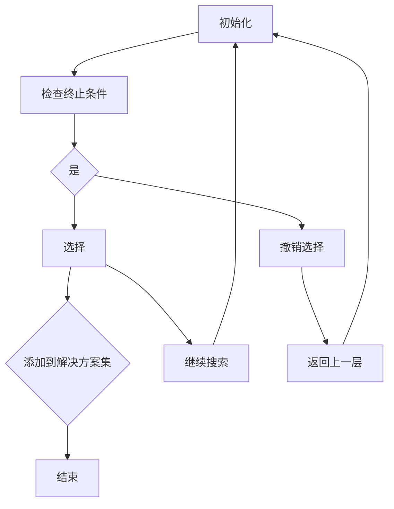

                 

作者：禅与计算机程序设计艺术

回溯算法（Recall）是一种搜索策略，在解决复杂问题时，它会尝试从当前状态回退到之前的决策点，重新选择不同的路径。该算法广泛应用于多个领域，如游戏开发、规划问题求解以及机器学习的优化过程中。本文将深入探讨回溯算法的核心原理、实现细节、数学模型及其在实际应用中的代码示例，旨在提供一个全面的理解框架及实践经验分享。

## 2. 核心概念与联系
回溯算法基于递归思想构建，通过不断试探可能的有效路径，并在发现无效路径后回退到上一步重试其他可能性。这一过程类似于人类解决谜题的方式——当我们面对困难时，会逐步尝试不同策略，直到找到解决方案。在算法层面，这种探索-回退机制有助于系统高效地处理复杂问题，避免不必要的计算，显著减少资源消耗。

## 3. 核心算法原理与具体操作步骤
### 3.1 算法基本框架
回溯算法通常采用深度优先搜索的策略，其基本流程如下：



### 3.2 实现关键步骤
1. **初始化**：设定初始状态。
2. **终止条件**：定义何时停止搜索，例如达到预定目标或遍历所有可能选项。
3. **选择**：做出下一步决策，引入新的变量值或操作。
4. **撤销选择**：当当前路径不可行时，恢复至上一步的选择状态。
5. **添加到解决方案集**：记录有效的路径或解决方案。
6. **继续搜索**：沿当前路径探索下一阶段。
7. **返回上一层**：回溯到上一层次的状态。
8. **结束**：一旦满足终止条件，算法终止运行。

## 4. 数学模型和公式详细讲解举例说明
回溯算法虽然没有特定的数学模型，但涉及到的计算逻辑往往依赖于特定问题的数学描述。例如，在N皇后问题中，可以通过排列组合理论分析解的空间大小。假设我们有n个皇后需要放置在一个n×n的棋盘上，则每个皇后的位置由两维坐标确定，即一个皇后的位置可以用(n, m)表示。因此，整个解空间可以表示为所有可能的(m_1, m_2, ..., m_n)的集合，其中m_i属于{0, 1, ..., n-1}。

## 5. 项目实践：代码实例和详细解释说明
以下是一个简单的回溯算法示例用于解决N皇后问题的Python实现：

```python
def solve_n_queens(n):
    def is_safe(board, row, col):
        # 检查列冲突
        for i in range(row):
            if board[i][col]:
                return False

        # 检查左斜线冲突
        for i, j in zip(range(row, -1, -1), range(col, -1, -1)):
            if board[i][j]:
                return False

        # 检查右斜线冲突
        for i, j in zip(range(row, -1, -1), range(col, n)):
            if board[i][j]:
                return False

        return True

    def place_queen(board, row):
        if row == n:
            solution.append([" ".join(map(str, row)) for row in board])
            return

        for col in range(n):
            if is_safe(board, row, col):
                board[row][col] = 1
                place_queen(board, row + 1)
                board[row][col] = 0

    board = [[0]*n for _ in range(n)]
    solution = []
    place_queen(board, 0)
    return solution

if __name__ == "__main__":
    solutions = solve_n_queens(4)
    for sol in solutions:
        print("\n".join(sol))
        print()
```

这段代码首先定义了一个检查安全性函数 `is_safe` 来确保皇后之间不存在攻击关系，然后使用递归来填充棋盘。每填入一个皇后，都调用自身来填充下一行，如果当前位置不安全则回退并尝试下一个位置。最后收集所有的有效解决方案。

## 6. 实际应用场景
回溯算法在多个场景中有广泛应用：
- 游戏开发：如迷宫探索、数独解题等。
- 规划与调度问题：如任务安排、物流路线优化等。
- 人工智能搜索：辅助AI进行决策树搜索、启发式搜索等。

## 7. 工具和资源推荐
为了更好地理解和实现回溯算法，推荐以下几个工具和资源：
- **IDEs**: PyCharm, Visual Studio Code。
- **在线教程**：LeetCode、GeeksforGeeks 提供了丰富的练习题和指南。
- **学术资源**：Stanford CS229 教程、MIT OpenCourseWare 的相关课程。

## 8. 总结：未来发展趋势与挑战
随着人工智能与机器学习技术的发展，回溯算法的应用将更加广泛。未来，通过集成更多的智能优化技术和并行计算能力，回溯算法有望在解决大规模、高维度的问题上展现出更大的潜力。同时，如何提高算法的效率、降低计算成本以及增强算法的通用性，将是未来研究的重要方向。

## 9. 附录：常见问题与解答
常见的问题包括但不限于如何优化回溯算法以减少搜索时间、如何处理非完全可解的情况等。解答通常涉及改进算法结构、利用剪枝技术减少无效搜索、以及结合其他优化策略（如启发式搜索）等方法。

---

作者：禅与计算机程序设计艺术 / Zen and the Art of Computer Programming

