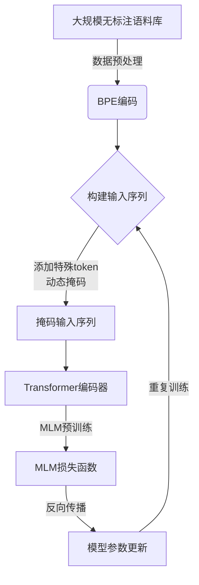
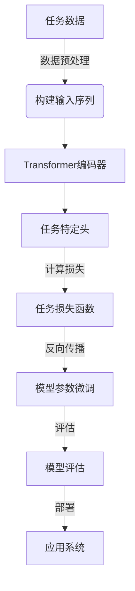

# RoBERTa原理与代码实例讲解

## 1.背景介绍

### 1.1 自然语言处理的重要性

在当今信息时代,自然语言处理(NLP)已经成为人工智能领域中最重要和最具挑战性的研究方向之一。它旨在使计算机能够理解和生成人类语言,实现人机自然交互。NLP技术广泛应用于机器翻译、智能问答、情感分析、文本摘要等诸多领域,对提高人机交互效率、挖掘海量文本数据中的有价值信息具有重要意义。

### 1.2 预训练语言模型的兴起

传统的NLP系统通常依赖于手工设计的特征工程,需要大量的领域知识和人力投入。而近年来,预训练语言模型(Pre-trained Language Model,PLM)的出现极大地推动了NLP技术的发展。PLM通过在大规模无标注语料库上进行自监督学习,捕捉语言的深层次语义和上下文信息,从而获得通用的语言表示能力。经过预训练后,PLM可以在下游NLP任务上进行微调(fine-tuning),显著提高了模型的性能和泛化能力。

### 1.3 BERT及其局限性

2018年,谷歌推出了BERT(Bidirectional Encoder Representations from Transformers)模型,它是第一个在预训练阶段使用Transformer编码器结构的PLM。BERT通过掩码语言模型(Masked Language Model,MLM)和下一句预测(Next Sentence Prediction,NSP)两个预训练任务,学习双向上下文表示,取得了突破性的进展。然而,BERT存在一些局限性:

1. 静态掩码导致预训练和微调之间存在不一致性。
2. 下一句预测任务的有效性受到质疑。
3. 输入长度受到限制(512个token)。

### 1.4 RoBERTa的提出

为了解决BERT的上述局限性,Facebook AI研究院在2019年提出了RoBERTa(Robustly Optimized BERT Pretraining Approach),一种改进和强化的BERT预训练方法。RoBERTa通过一些训练技巧的改进,在多个下游任务上超越了BERT的性能,成为新的SOTA(State-of-the-Art)模型。

## 2.核心概念与联系

### 2.1 Transformer编码器

Transformer编码器是RoBERTa的核心结构,它由多个相同的编码器层堆叠而成。每个编码器层包含两个子层:多头自注意力(Multi-Head Attention)和前馈神经网络(Feed-Forward Neural Network)。

1. **多头自注意力层**:通过计算输入序列中每个token与其他token的注意力权重,捕捉序列中token之间的依赖关系,生成序列的上下文表示。
2. **前馈神经网络层**:对每个token的表示进行非线性映射,捕捉更高层次的特征。

通过堆叠多个编码器层,Transformer编码器可以学习输入序列的深层次语义和上下文信息。

### 2.2 Byte-Pair Encoding (BPE)

RoBERTa采用BPE编码方式对输入文本进行子词切分(Subword Segmentation),将单词拆分为多个子词单元。这种方式可以有效减少词表的大小,并处理未见词(Out-of-Vocabulary,OOV)问题。

例如,单词"unaffable"可以被拆分为"un##aff##able",其中"##"表示该子词单元属于一个较长的词。通过BPE编码,RoBERTa可以更好地表示和理解复杂的词汇。

### 2.3 掩码语言模型(MLM)

MLM是RoBERTa的核心预训练任务之一。在预训练过程中,RoBERTa会随机掩码输入序列中的一些token,目标是基于其余token的上下文信息,正确预测被掩码token的原始值。

MLM任务可以促使RoBERTa学习双向上下文表示,捕捉token之间的深层次语义关系。与BERT的静态掩码不同,RoBERTa采用动态掩码策略,在每个训练步骤中重新生成掩码模式,从而增强了模型的泛化能力。

### 2.4 下一句预测(NSP)任务的移除

与BERT不同,RoBERTa移除了NSP任务。研究表明,NSP任务对下游任务的性能改善有限,甚至可能会引入不需要的噪声。通过去除NSP任务,RoBERTa可以将更多的计算资源集中在MLM任务上,提高预训练的效率和质量。

### 2.5 RoBERTa与BERT的关系

RoBERTa可以被视为BERT的改进和强化版本。它保留了BERT的核心结构(Transformer编码器和MLM任务),但通过一些训练技巧的改进,显著提高了模型的性能和泛化能力。RoBERTa与BERT的主要区别包括:

1. 动态掩码策略
2. 移除NSP任务
3. 更大的批量大小和学习率
4. 更长的训练步数
5. 更大的训练数据集

这些改进使得RoBERTa在多个NLP任务上超越了BERT,成为新的SOTA模型。

## 3.核心算法原理具体操作步骤 

### 3.1 RoBERTa预训练流程

RoBERTa的预训练过程包括以下主要步骤:

1. **数据预处理**:从大规模无标注语料库(如书籍、网页、维基百科等)中抽取文本数据,并使用BPE编码对文本进行子词切分。

2. **构建输入序列**:将切分后的子词序列作为输入,添加特殊token(如[CLS]和[SEP]),并执行动态掩码,随机替换一部分token为[MASK]标记。

3. **MLM预训练**:将构建好的输入序列输入Transformer编码器,目标是基于上下文信息正确预测被掩码token的原始值。通过最小化MLM损失函数,优化编码器的参数。

4. **模型更新**:使用优化算法(如Adam)更新Transformer编码器的参数,完成一个训练步骤。

5. **重复训练**:重复步骤2-4,持续训练数百万个步骤,直到模型收敛或达到预设的训练步数。

通过上述预训练过程,RoBERTa可以学习到通用的语言表示能力,为后续的下游任务微调奠定基础。

### 3.2 RoBERTa下游任务微调

经过预训练后,RoBERTa可以在各种下游NLP任务上进行微调(fine-tuning),以获得针对特定任务的最佳性能。微调过程通常包括以下步骤:

1. **任务数据准备**:收集并预处理特定任务的训练数据,如文本分类、机器阅读理解等。

2. **构建输入序列**:根据任务的要求,构建输入序列的格式,如为文本分类任务添加[CLS]标记。

3. **添加任务特定头**:在Transformer编码器的输出上添加一个小型的任务特定头(task-specific head),用于对输出进行进一步处理和预测。

4. **计算任务损失**:根据任务目标计算损失函数,如交叉熵损失(对于分类任务)或平方损失(对于回归任务)。

5. **微调模型参数**:使用任务数据和损失函数,通过梯度下降优化Transformer编码器和任务特定头的参数。

6. **模型评估**:在验证集或测试集上评估微调后模型的性能,如准确率、F1分数等指标。

7. **模型部署**:根据需求,将微调后的模型部署到实际的应用系统中。

通过微调过程,RoBERTa可以将通用的语言表示能力转移到特定的下游任务中,提高任务的性能和泛化能力。

## 4.数学模型和公式详细讲解举例说明

### 4.1 Transformer编码器

Transformer编码器是RoBERTa的核心结构,它由多个相同的编码器层堆叠而成。每个编码器层包含两个子层:多头自注意力和前馈神经网络。

#### 4.1.1 多头自注意力

多头自注意力层的目的是捕捉输入序列中token之间的依赖关系,生成序列的上下文表示。它的计算过程如下:

1. 将输入序列$X = (x_1, x_2, \dots, x_n)$映射到查询(Query)、键(Key)和值(Value)向量空间:

$$
Q = XW^Q, K = XW^K, V = XW^V
$$

其中$W^Q, W^K, W^V$是可学习的权重矩阵。

2. 计算查询和键之间的点积注意力权重:

$$
\text{Attention}(Q, K, V) = \text{softmax}\left(\frac{QK^T}{\sqrt{d_k}}\right)V
$$

其中$d_k$是缩放因子,用于防止点积值过大导致梯度消失。

3. 多头注意力通过将注意力计算过程独立运行$h$次(每次使用不同的权重矩阵),然后将结果拼接,从而捕捉不同的子空间表示:

$$
\text{MultiHead}(Q, K, V) = \text{Concat}(head_1, \dots, head_h)W^O
$$

$$
\text{where } head_i = \text{Attention}(QW_i^Q, KW_i^K, VW_i^V)
$$

其中$W_i^Q, W_i^K, W_i^V$是第$i$个注意力头的权重矩阵,$W^O$是可学习的输出权重矩阵。

通过多头自注意力,Transformer编码器可以捕捉输入序列中token之间的长程依赖关系,生成更加丰富的上下文表示。

#### 4.1.2 前馈神经网络

前馈神经网络层对每个token的表示进行非线性映射,捕捉更高层次的特征。它的计算过程如下:

$$
\text{FFN}(x) = \max(0, xW_1 + b_1)W_2 + b_2
$$

其中$W_1, W_2$是可学习的权重矩阵,$b_1, b_2$是可学习的偏置向量。$\max(0, \cdot)$是ReLU激活函数,引入非线性特征。

通过堆叠多个编码器层,Transformer编码器可以学习输入序列的深层次语义和上下文信息,为下游NLP任务提供强大的表示能力。

### 4.2 掩码语言模型(MLM)损失函数

RoBERTa的核心预训练任务是MLM,目标是基于上下文正确预测被掩码token的原始值。MLM损失函数可以表示为:

$$
\mathcal{L}_\text{MLM} = -\frac{1}{N}\sum_{i=1}^{N}\log P(x_i^\text{masked}|x_1, \dots, x_{i-1}, x_{i+1}, \dots, x_n)
$$

其中$N$是被掩码token的总数,$x_i^\text{masked}$是第$i$个被掩码token的原始值,$P(\cdot)$是Transformer编码器对$x_i^\text{masked}$的预测概率。

在实际计算中,我们通常将MLM损失函数转化为交叉熵损失的形式:

$$
\mathcal{L}_\text{MLM} = -\frac{1}{N}\sum_{i=1}^{N}\sum_{j=1}^{V}y_{ij}\log P(x_{ij}|x_1, \dots, x_{i-1}, x_{i+1}, \dots, x_n)
$$

其中$V$是词表大小,$y_{ij}$是one-hot编码,表示第$i$个被掩码token的原始值是否为词表中的第$j$个token。

通过最小化MLM损失函数,RoBERTa可以学习到捕捉上