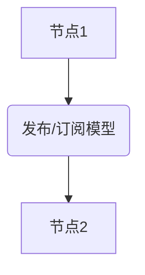
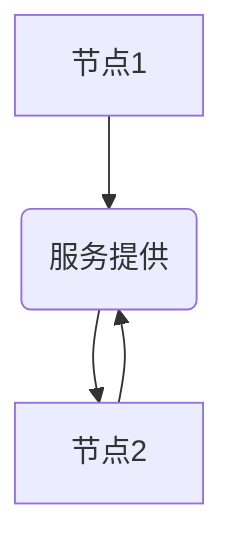

## 1.背景介绍

Robot Operating System (ROS) 是一个灵活的框架，用于编写机器人软件。它是一套操作系统的概念 —— 提供了硬件抽象、设备驱动、库函数、可视化工具、消息传递和软件包管理等服务。

ROS 于2007年由斯坦福大学和 Willow Garage 共同开发，并在2009年成为开源项目。ROS 的目标是提供一套丰富的工具和库，让机器人开发者能够在一个共享和协作的生态系统中构建和使用高级功能。

## 2.核心概念与联系

ROS 的设计理念是模块化，它支持各种各样的机器人硬件和软件。ROS 系统中的每个部分都是一个节点，节点间通过发布/订阅模型进行通信。这种模型允许数据在节点之间流动，而不需要进行复杂的接口和协议设计。



ROS 的另一个核心概念是服务(Service)，服务允许节点之间进行同步通信。一个节点可以提供服务，其他节点可以调用这个服务并等待响应。



## 3.核心算法原理具体操作步骤

ROS 的通信机制基于TCP/IP和UDP协议。在ROS中，节点间的通信可以通过两种方式进行：主题(Topic)和服务(Service)。

主题是一种发布/订阅模型，节点可以发布消息到主题，也可以从主题订阅消息。主题的通信是异步的，发布者和订阅者不需要同步。

服务则是同步的，一个节点（服务提供者）提供一个服务，其他节点（服务客户端）可以请求这个服务并等待响应。服务的请求和响应是一对一的，请求者会等待服务提供者处理完请求并返回响应。

## 4.数学模型和公式详细讲解举例说明

在ROS中，许多算法和模型都是基于线性代数和几何变换的。例如，机器人的位姿（位置和方向）通常用齐次坐标表示，可以用一个4x4的矩阵来描述。

假设我们有一个位姿矩阵$P$，它表示一个物体从原点（0,0,0）移动到点（x,y,z），并绕x、y、z轴旋转$\alpha$、$\beta$、$\gamma$度，那么$P$可以表示为：

$$
P = \begin{bmatrix}
    cos(\beta)cos(\gamma) & cos(\gamma)sin(\alpha)sin(\beta)-cos(\alpha)sin(\gamma) & sin(\alpha)sin(\gamma)+cos(\alpha)cos(\gamma)sin(\beta) & x \\
    cos(\beta)sin(\gamma) & cos(\alpha)cos(\gamma)+sin(\alpha)sin(\beta)sin(\gamma) & cos(\alpha)sin(\beta)sin(\gamma)-cos(\gamma)sin(\alpha) & y \\
    -sin(\beta) & cos(\beta)sin(\alpha) & cos(\alpha)cos(\beta) & z \\
    0 & 0 & 0 & 1
\end{bmatrix}
$$

## 5.项目实践：代码实例和详细解释说明

以下是一个简单的ROS节点代码示例，这个节点订阅名为"chatter"的主题，并打印接收到的消息。

```python
import rospy
from std_msgs.msg import String

def callback(data):
    rospy.loginfo(rospy.get_caller_id() + "I heard %s", data.data)

def listener():
    rospy.init_node('listener', anonymous=True)
    rospy.Subscriber("chatter", String, callback)
    rospy.spin()

if __name__ == '__main__':
    listener()
```

在这个例子中，我们首先导入了rospy模块和std_msgs.msg模块中的String消息类型。然后定义了一个回调函数`callback`，这个函数会在接收到消息时被调用。在`listener`函数中，我们初始化了一个节点，并订阅了名为"chatter"的主题。最后，调用`rospy.spin()`让程序持续运行，等待消息。

## 6.实际应用场景

ROS在许多实际应用中都发挥了重要作用，包括但不限于：

- 自动驾驶：ROS提供了一套完整的自动驾驶框架，包括感知、决策和控制等模块。
- 服务机器人：ROS支持各种类型的服务机器人，如清洁机器人、送餐机器人等。
- 工业机器人：ROS Industrial项目致力于将ROS引入工业环境，支持各种工业机器人和设备。

## 7.工具和资源推荐

- ROS Wiki：ROS的官方文档和教程，是学习ROS的最佳资源。
- RViz：ROS的可视化工具，可以用来查看机器人的状态和传感器数据。
- Gazebo：一个强大的机器人仿真工具，可以用来测试ROS代码。

## 8.总结：未来发展趋势与挑战

ROS的未来发展趋势是向更多的平台和设备扩展，包括嵌入式设备、移动设备和云平台。同时，ROS也面临一些挑战，如安全性、实时性和易用性等问题。

## 9.附录：常见问题与解答

Q: ROS支持哪些编程语言？

A: ROS主要支持C++和Python，也支持Lisp和Java。

Q: ROS可以在哪些操作系统上运行？

A: ROS主要在Ubuntu上运行，也支持其他Linux发行版、Mac OS和Windows。

Q: ROS 2.0和ROS 1.0有什么区别？

A: ROS 2.0是ROS的下一代版本，它在ROS 1.0的基础上做了许多改进，如支持多种通信中间件、改进的安全性和实时性等。

作者：禅与计算机程序设计艺术 / Zen and the Art of Computer Programming