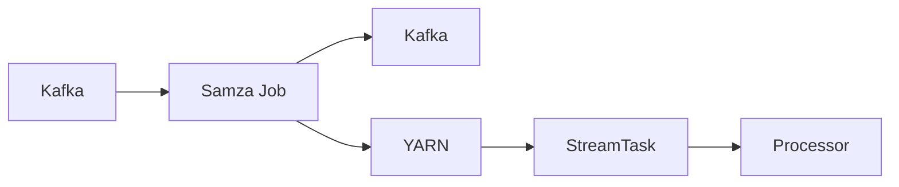

# Samza数据处理与数据质量控制

## 1. 背景介绍

### 1.1 大数据处理的挑战
在当今大数据时代,企业面临着海量数据的处理挑战。数据来源多样化、数据量呈指数级增长,对数据处理的实时性、准确性和可扩展性提出了更高的要求。传统的批处理模式已经无法满足实时数据处理的需求。

### 1.2 流式数据处理的兴起
流式数据处理以其低延迟、高吞吐的特点,成为应对大数据实时处理挑战的重要手段。与批处理不同,流式处理允许数据在产生的同时进行处理,从而实现了数据处理的实时性。

### 1.3 Samza的诞生
Samza是由LinkedIn开源的分布式流式处理框架,旨在提供一个可扩展、高性能、高容错的流式数据处理解决方案。Samza基于Kafka构建,充分利用了Kafka的消息持久化和高吞吐特性,同时采用了类似MapReduce的并行处理模型,实现了高效的流式数据处理。

## 2. 核心概念与联系

### 2.1 Samza的核心概念

#### 2.1.1 StreamTask
StreamTask是Samza的基本处理单元,每个StreamTask负责处理一个输入流分区。StreamTask从输入流读取消息,执行用户定义的处理逻辑,并将结果写入输出流。

#### 2.1.2 Job
Job是由一组StreamTask组成的逻辑单元,负责处理整个流处理管道。Job通过配置文件定义输入流、输出流以及处理逻辑。

#### 2.1.3 Processor
Processor是实现具体处理逻辑的接口,用户通过实现Processor接口来定义每个消息的处理逻辑。

### 2.2 Samza与Kafka的关系
Samza与Kafka有着紧密的联系。Samza使用Kafka作为输入源和输出目标。每个Samza Job订阅一个或多个Kafka Topic作为输入,并将处理结果写入一个或多个Kafka Topic。Samza利用Kafka的分区机制实现了数据的并行处理。

### 2.3 Samza架构图
下面是Samza的整体架构图,展示了Samza与Kafka、YARN等组件的关系:



## 3. 核心算法原理与操作步骤

### 3.1 数据流图模型
Samza采用数据流图模型来描述流式数据处理过程。数据流图由节点和边组成,节点表示数据处理操作,边表示数据流向。

### 3.2 并行处理模型
Samza将数据流图划分为多个StreamTask,每个StreamTask负责处理一个输入分区。StreamTask之间可以并行执行,从而实现高效的数据处理。

### 3.3 状态管理
Samza提供了状态管理功能,允许StreamTask在处理过程中维护和访问状态数据。状态数据可以是键值对、列表等形式,支持增量更新。Samza将状态数据保存在可配置的状态存储中,如RocksDB。

### 3.4 容错机制
Samza提供了多级容错机制来保证数据处理的可靠性。当StreamTask失败时,Samza会自动重启失败的StreamTask,并从上次处理的位置继续处理数据。Samza还支持Checkpoint机制,定期将StreamTask的状态数据持久化,以便在故障恢复时快速恢复状态。

### 3.5 数据质量控制
Samza提供了灵活的数据质量控制机制。用户可以通过实现Processor接口,在数据处理过程中进行数据校验、过滤、清洗等操作,保证数据的准确性和完整性。Samza还支持Dead Letter Queue(死信队列)机制,将无法处理的消息路由到特定的Kafka Topic中,方便后续的人工处理。

## 4. 数学模型与公式详解

### 4.1 数据流图模型
数据流图可以用有向无环图(DAG)来表示。假设数据流图为$G=(V,E)$,其中$V$表示节点集合,$E$表示有向边集合。对于每个节点$v_i \in V$,有:

$$
v_i = (I_i, O_i, P_i)
$$

其中,$I_i$表示节点的输入流集合,$O_i$表示节点的输出流集合,$P_i$表示节点的处理逻辑。

对于每条有向边$e_{ij} \in E$,有:

$$
e_{ij} = (v_i, v_j)
$$

表示数据从节点$v_i$流向节点$v_j$。

### 4.2 并行处理模型
假设有$N$个输入分区,Samza将数据流图划分为$N$个StreamTask。第$i$个StreamTask处理第$i$个输入分区的数据。假设第$i$个输入分区有$M_i$条消息,则第$i$个StreamTask的处理时间$T_i$为:

$$
T_i = \sum_{j=1}^{M_i} t_{ij}
$$

其中,$t_{ij}$表示处理第$j$条消息的时间。

假设有$K$个StreamTask并行执行,则总处理时间$T$为:

$$
T = \max_{i=1}^{K} T_i
$$

可见,并行处理可以显著减少数据处理的总时间。

## 5. 项目实践:代码实例与详解

下面是一个使用Samza进行数据处理和质量控制的示例代码:

```java
public class MyProcessor implements StreamProcessor {
    private static final Logger LOG = LoggerFactory.getLogger(MyProcessor.class);
    private static final String VALID_TOPIC = "valid-data";
    private static final String INVALID_TOPIC = "invalid-data";
    
    @Override
    public void process(IncomingMessageEnvelope envelope, MessageCollector collector, TaskCoordinator coordinator) {
        String message = (String) envelope.getMessage();
        
        // 数据校验
        if (isValid(message)) {
            // 数据转换
            String transformedMessage = transform(message);
            // 发送到有效数据主题
            collector.send(new OutgoingMessageEnvelope(new SystemStream("kafka", VALID_TOPIC), transformedMessage));
        } else {
            // 发送到无效数据主题
            collector.send(new OutgoingMessageEnvelope(new SystemStream("kafka", INVALID_TOPIC), message));
        }
    }
    
    private boolean isValid(String message) {
        // 数据校验逻辑
        // ...
    }
    
    private String transform(String message) {
        // 数据转换逻辑
        // ...
    }
}
```

在上述代码中,`MyProcessor`实现了`StreamProcessor`接口,定义了数据处理的逻辑。`process`方法接收输入消息,并根据数据校验的结果将消息发送到不同的输出主题。`isValid`方法实现了数据校验逻辑,`transform`方法实现了数据转换逻辑。

通过配置文件指定输入主题、输出主题以及处理器类:

```yaml
jobs:
  my-job:
    processor.class: com.example.MyProcessor
    input.topics:
      - input-topic
    output.topics:
      - valid-data
      - invalid-data
```

Samza会根据配置文件自动创建StreamTask,并行处理输入数据。有效数据经过转换后发送到`valid-data`主题,无效数据直接发送到`invalid-data`主题,实现了数据质量控制。

## 6. 实际应用场景

Samza在许多实际场景中得到了广泛应用,包括:

### 6.1 日志处理
Samza可以实时处理海量的日志数据,进行日志解析、异常检测、指标计算等操作,为系统监控和故障诊断提供支持。

### 6.2 实时推荐
在电商、社交等领域,Samza可以实时处理用户行为数据,更新用户画像,生成实时的个性化推荐结果。

### 6.3 欺诈检测
Samza可以实时分析交易数据,通过复杂的规则引擎和机器学习模型,实时识别可疑交易,防范金融欺诈。

### 6.4 数据管道
Samza可以作为数据管道的一部分,对数据进行清洗、转换、富化等操作,为下游的数据分析和机器学习任务提供高质量的数据。

## 7. 工具与资源推荐

### 7.1 Samza官方文档
Samza官方文档提供了详尽的使用指南和API参考,是学习和使用Samza的重要资源。

### 7.2 Kafka
Kafka是Samza的重要组件,深入了解Kafka的原理和使用方法对于开发Samza应用至关重要。

### 7.3 YARN
Samza可以运行在YARN上,了解YARN的架构和使用方法有助于更好地部署和管理Samza应用。

### 7.4 Samza示例项目
Samza官方提供了多个示例项目,展示了Samza的各种功能和使用方法,可以作为学习和参考的起点。

## 8. 总结:未来发展与挑战

### 8.1 Samza的优势
Samza凭借其简洁的编程模型、良好的可扩展性和容错性,以及与Kafka的无缝集成,已经成为流式数据处理领域的重要工具。Samza在实际应用中展现了出色的性能和可靠性。

### 8.2 未来发展方向
随着数据量的不断增长和业务需求的日益复杂,Samza还需要在以下方面进行改进和发展:
- 支持更多的数据源和数据汇
- 提供更灵活的状态管理机制
- 优化资源调度和自动扩缩容
- 增强监控和运维能力

### 8.3 面临的挑战
Samza在未来的发展中也面临着一些挑战:
- 与其他流式处理框架的竞争
- 适应不断变化的数据处理需求
- 保证大规模集群环境下的稳定性
- 简化应用开发和部署流程

## 9. 附录:常见问题与解答

### 9.1 Samza与Storm、Flink等流式处理框架有何区别?
Samza专注于简洁易用,与Kafka紧密集成;Storm采用tuple数据模型,支持更复杂的拓扑结构;Flink提供了更丰富的API和状态管理机制。

### 9.2 Samza是否支持exactly-once语义?
Samza支持at-least-once语义,通过Checkpoint机制和幂等处理可以实现exactly-once语义。

### 9.3 Samza如何实现动态扩容?
Samza通过调整并行度、重新分配分区等方式实现动态扩容。可以通过配置文件或API动态调整StreamTask的数量。

### 9.4 Samza的状态存储支持哪些选项?
Samza支持多种状态存储,包括RocksDB、Kafka、HDFS等。可以根据状态数据的大小、访问频率等特点选择合适的存储方式。

### 9.5 Samza如何保证消息的顺序性?
Samza通过将同一分区的消息分配给同一个StreamTask来保证分区内消息的顺序性。如果需要全局顺序,可以使用单分区或外部机制进行协调。

作者：禅与计算机程序设计艺术 / Zen and the Art of Computer Programming