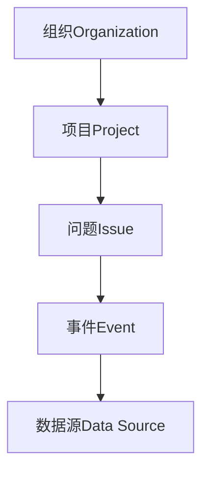

# Sentry原理与代码实例讲解

## 1.背景介绍

在现代软件开发中,应用程序的稳定性和可靠性是非常关键的。随着系统复杂度的增加和用户对高质量体验的期望,有效地监控和管理应用程序错误变得越来越重要。这就是Sentry的用武之地。Sentry是一个开源的错误跟踪系统,旨在帮助开发人员实时捕获、处理和解决应用程序中的异常和错误。

Sentry的核心理念是提供一个集中式的平台,让开发人员能够轻松地监控各种应用程序、服务和环境中发生的错误。它支持多种编程语言和框架,包括Python、JavaScript、Ruby、Java、.NET等,并且可以与各种流行的后端服务集成,如GitHub、Slack和PagerDuty。

通过Sentry,开发人员可以获得全面的错误报告,包括错误的堆栈跟踪、上下文数据、用户信息等,从而快速定位和修复问题。此外,Sentry还提供了强大的分析和报告功能,使团队能够更好地了解应用程序的健康状况,并优化错误管理流程。

## 2.核心概念与联系

### 2.1 事件(Event)

在Sentry中,每个捕获的错误或异常都被称为一个"事件"(Event)。事件包含了错误发生时的所有相关信息,如错误消息、堆栈跟踪、上下文数据等。Sentry会自动对事件进行分组和去重,以便更好地管理和分析错误。

### 2.2 问题(Issue)

一个"问题"(Issue)是指一组相关的事件,它们共享相同的根本原因或模式。Sentry会自动将相似的事件归类为同一个问题,从而简化错误管理流程。开发人员可以针对每个问题进行讨论、分配、解决等操作。

### 2.3 项目(Project)

"项目"(Project)是Sentry中的一个逻辑概念,用于组织和管理相关的应用程序或服务。每个项目都有一个唯一的密钥(DSN),用于将错误数据发送到Sentry服务器。一个Sentry实例可以包含多个项目,方便对不同的应用程序或环境进行独立管理。

### 2.4 组织(Organization)

"组织"(Organization)是Sentry中的最高级别的概念,用于管理多个项目和团队成员。组织可以设置访问控制、通知规则、工作流程等,并且支持与外部服务(如GitHub、Slack等)集成。

### 2.5 数据源(Data Source)

Sentry支持从多种数据源接收错误数据,包括应用程序代码、浏览器JavaScript、移动设备等。开发人员需要在应用程序中集成Sentry的SDK或客户端库,以便将错误数据发送到Sentry服务器。

这些核心概念相互关联,构成了Sentry的整体架构和工作流程。下面是一个简单的Mermaid流程图,展示了它们之间的关系:



## 3.核心算法原理具体操作步骤

Sentry的核心算法主要包括以下几个方面:

### 3.1 事件捕获和传输

当应用程序发生错误或异常时,Sentry的客户端SDK会捕获相关信息,包括错误消息、堆栈跟踪、上下文数据等。这些数据会被序列化为JSON格式,并通过HTTP POST请求发送到Sentry服务器。

Sentry服务器会对传入的事件数据进行初步处理和验证,包括检查数据完整性、过滤敏感信息等。然后,事件数据会被存储在后端数据库中,供后续的分析和处理。

### 3.2 事件分组和去重

Sentry的一个关键特性是能够自动将相似的事件归类为同一个问题。这个过程称为"事件分组"(Event Grouping)。Sentry使用一种基于指纹(Fingerprint)的算法来识别相似的事件。

指纹是一个唯一的字符串,用于标识事件的根本原因或模式。Sentry会根据事件的堆栈跟踪、错误消息等信息生成指纹。具有相同指纹的事件会被归类为同一个问题。

此外,Sentry还会对重复的事件进行去重处理,以减少数据冗余和存储开销。它会记录每个事件的发生次数和最后一次发生的时间,从而提供有关问题频率和持续时间的信息。

### 3.3 问题管理和通知

当新的问题被创建或现有问题发生变化时,Sentry会根据预定义的规则发送通知。通知可以通过多种渠道发送,如电子邮件、Slack、PagerDuty等。

开发人员可以在Sentry的Web界面或API中查看和管理问题。他们可以为每个问题分配所有者、添加注释、设置状态(如"未解决"、"已解决"等)等。这有助于团队协作和问题跟踪。

### 3.4 数据分析和报告

Sentry提供了丰富的数据分析和报告功能,帮助开发人员深入了解应用程序的错误情况。开发人员可以查看错误的发生频率、影响的用户数、地理分布等统计信息。

此外,Sentry还支持创建自定义的问题流程和工作流程,以满足特定的团队需求。例如,可以设置自动分配规则、问题升级策略等。

## 4.数学模型和公式详细讲解举例说明

在Sentry的事件分组算法中,使用了一种基于局部性敏感哈希(Locality Sensitive Hashing,LSH)的技术来生成事件的指纹。LSH是一种近似最近邻搜索的技术,它可以有效地将高维数据映射到低维空间,从而加快相似性计算的速度。

具体来说,Sentry使用了一种名为"SimHash"的LSH变体。SimHash算法的核心思想是将高维的特征向量映射到一个较低维度的空间,并使用哈希函数将其编码为一个固定长度的指纹。

假设我们有一个事件的堆栈跟踪,可以将其表示为一个高维的特征向量$\vec{v}$,其中每个维度对应于堆栈跟踪中的一个独特的单词或标记。我们可以使用一组随机生成的向量$\vec{r_1}, \vec{r_2}, \ldots, \vec{r_n}$,将$\vec{v}$投影到这些随机向量上,得到一个新的低维向量$\vec{u}$:

$$\vec{u} = (\vec{v} \cdot \vec{r_1}, \vec{v} \cdot \vec{r_2}, \ldots, \vec{v} \cdot \vec{r_n})$$

其中$\cdot$表示向量点积运算。

接下来,我们可以将$\vec{u}$中的每个元素映射到一个二进制值(0或1),根据它们是否大于0。这样,我们就得到了一个长度为$n$的二进制字符串,它就是事件的SimHash指纹。

两个事件的SimHash指纹之间的汉明距离(Hamming Distance)可以用来近似估计它们之间的相似度。如果两个事件的指纹之间的汉明距离较小,则表示它们很可能是相似的事件,应该被归类为同一个问题。

SimHash算法的一个优点是,它可以有效地处理高维稀疏数据,并且计算效率较高。此外,它还具有一定的鲁棒性,能够在一定程度上容忍数据中的噪声和变化。

下面是一个简单的Python代码示例,展示了如何计算两个字符串的SimHash指纹及其汉明距离:

```python
import hashlib

def simhash(text):
    # 将文本拆分为单词
    words = text.split()
    
    # 初始化一个全0的SimHash值
    hash_value = [0] * 64
    
    # 遍历每个单词
    for word in words:
        # 计算单词的哈希值
        word_hash = hashlib.md5(word.encode('utf-8')).digest()
        
        # 将哈希值映射到SimHash值
        for i in range(64):
            hash_value[i] += sum(byte & (1 << offset) for offset in range(8) for byte in word_hash[offset:offset+1])
    
    # 根据SimHash值的正负生成最终的二进制指纹
    fingerprint = ''.join(str(int(value >= 0)) for value in hash_value)
    
    return fingerprint

def hamming_distance(fingerprint1, fingerprint2):
    # 计算两个指纹之间的汉明距离
    distance = sum(c1 != c2 for c1, c2 in zip(fingerprint1, fingerprint2))
    return distance

# 示例用法
text1 = "This is a sample text for SimHash."
text2 = "This is another sample text for SimHash."

fingerprint1 = simhash(text1)
fingerprint2 = simhash(text2)

distance = hamming_distance(fingerprint1, fingerprint2)
print(f"Fingerprint 1: {fingerprint1}")
print(f"Fingerprint 2: {fingerprint2}")
print(f"Hamming Distance: {distance}")
```

在这个示例中,我们定义了两个函数:`simhash`和`hamming_distance`。`simhash`函数接受一个字符串作为输入,将其拆分为单词,计算每个单词的哈希值,并将这些哈希值映射到一个64位的SimHash值。最后,根据SimHash值的正负生成最终的二进制指纹。`hamming_distance`函数则计算两个指纹之间的汉明距离。

在示例用法中,我们计算了两个示例文本的SimHash指纹及其汉明距离。由于这两个文本非常相似,因此它们的指纹之间的汉明距离也相对较小。

需要注意的是,这只是一个简化的SimHash实现,在实际应用中,Sentry可能使用了更加复杂和优化的算法变体。但是,核心思想是相似的。

## 5.项目实践:代码实例和详细解释说明

在本节中,我们将通过一个简单的Python示例项目,演示如何在应用程序中集成Sentry进行错误跟踪和监控。

### 5.1 安装Sentry SDK

首先,我们需要安装Sentry的Python SDK。可以使用pip进行安装:

```bash
pip install sentry-sdk
```

### 5.2 初始化Sentry

在应用程序的入口点(通常是`main.py`或者`app.py`)中,我们需要初始化Sentry SDK并配置数据源(DSN)。DSN是一个唯一的标识符,用于将错误数据发送到正确的Sentry项目。

```python
import sentry_sdk
from sentry_sdk.integrations.flask import FlaskIntegration

sentry_sdk.init(
    dsn="YOUR_SENTRY_DSN",
    integrations=[
        FlaskIntegration(),
    ],
)
```

在上面的代码中,我们导入了`sentry_sdk`模块,并使用`init`函数进行初始化。`dsn`参数指定了Sentry项目的数据源标识符。如果你使用的是Flask Web框架,还需要导入`FlaskIntegration`并将其作为集成传递给`init`函数。

### 5.3 捕获错误

在应用程序的代码中,我们可以使用`capture_exception`函数来手动捕获并发送错误信息到Sentry。

```python
from flask import Flask, request
import sentry_sdk

app = Flask(__name__)

@app.route("/")
def index():
    try:
        x = 1 / 0  # 这将引发一个除零异常
    except Exception as e:
        sentry_sdk.capture_exception(e)
        return "An error occurred, but it has been reported to Sentry."

if __name__ == "__main__":
    app.run()
```

在上面的示例中,我们定义了一个简单的Flask路由`/`。在这个路由中,我们故意引发了一个除零异常,并使用`capture_exception`函数将异常信息发送到Sentry。

当用户访问`/`路由时,应用程序会抛出一个除零异常,但是这个异常会被捕获并报告给Sentry。用户将看到一条友好的错误消息:"An error occurred, but it has been reported to Sentry."。

### 5.4 Sentry Web界面

在Sentry的Web界面中,我们可以查看刚才报告的错误。Sentry会自动对错误进行分组,并提供详细的错误信息,包括堆栈跟踪、上下文数据等。


在上图中,我们可以看到报告的错