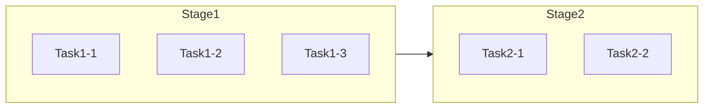
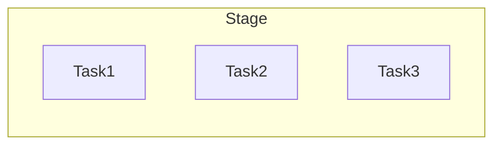
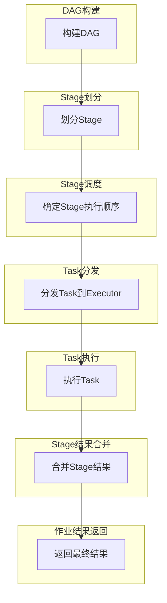

# Spark DAG原理与代码实例讲解

## 1. 背景介绍

Apache Spark是一个用于大数据处理的统一分析引擎，它提供了一种高效的数据处理模型,被广泛应用于各种大数据场景。Spark的核心设计理念是基于弹性分布式数据集(Resilient Distributed Dataset, RDD)和有向无环图(Directed Acyclic Graph, DAG)。

DAG是Spark作业执行的关键数据结构,它描述了Spark作业中各个任务之间的依赖关系。通过DAG,Spark可以高效地调度和执行各个任务,充分利用集群资源,从而实现高性能的数据处理。

## 2. 核心概念与联系

### 2.1 RDD (Resilient Distributed Dataset)

RDD是Spark的基础数据结构,它是一个不可变的、分区的记录集合。RDD提供了一种高度受限的共享内存模型,使得Spark可以高效地处理数据。每个RDD都包含了多个分区,这些分区被分布在不同的节点上,从而实现了数据的并行处理。

### 2.2 DAG (Directed Acyclic Graph)

DAG是Spark作业执行的关键数据结构,它描述了Spark作业中各个任务之间的依赖关系。DAG由多个Stage组成,每个Stage包含多个Task。Task是Spark作业的最小执行单元,它负责处理一个或多个RDD分区。

DAG的构建过程如下:

1. 当用户提交一个Spark作业时,Spark会根据作业中的操作构建一个DAG。
2. Spark会将DAG分解为多个Stage,每个Stage包含一个或多个Task。
3. Spark会根据Stage之间的依赖关系,确定Stage的执行顺序。
4. Spark会将每个Stage中的Task分发到不同的Executor上执行。

### 2.3 Stage

Stage是DAG中的一个执行单元,它包含了一组相互依赖的Task。Stage之间可能存在依赖关系,例如一个Stage的输出可能是另一个Stage的输入。Spark会根据Stage之间的依赖关系,确定Stage的执行顺序。

Stage可以分为两种类型:

1. **ShuffleMapStage**: 这种Stage会产生shuffle写操作,它的输出会被分区并分发到不同的节点上。
2. **ResultStage**: 这种Stage会将最终结果返回给Driver程序。



### 2.4 Task

Task是Spark作业的最小执行单元,它负责处理一个或多个RDD分区。Task可以分为两种类型:

1. **ShuffleMapTask**: 这种Task会产生shuffle写操作,它的输出会被分区并分发到不同的节点上。
2. **ResultTask**: 这种Task会将最终结果返回给Driver程序。



## 3. 核心算法原理具体操作步骤

Spark DAG的构建和执行过程可以分为以下几个步骤:

1. **DAG构建**

   当用户提交一个Spark作业时,Spark会根据作业中的操作构建一个DAG。DAG由多个Stage组成,每个Stage包含多个Task。

2. **Stage划分**

   Spark会将DAG分解为多个Stage,每个Stage包含一个或多个Task。Stage之间可能存在依赖关系,例如一个Stage的输出可能是另一个Stage的输入。

3. **Stage调度**

   Spark会根据Stage之间的依赖关系,确定Stage的执行顺序。对于没有依赖关系的Stage,Spark会并行执行它们。

4. **Task分发**

   Spark会将每个Stage中的Task分发到不同的Executor上执行。Task的分发策略取决于Task的类型和数据的分布情况。

5. **Task执行**

   Executor会执行分发到它上面的Task。Task会处理一个或多个RDD分区,并将结果写入内存或磁盘。

6. **Stage结果合并**

   当一个Stage中的所有Task都执行完毕后,Spark会将这个Stage的结果合并,并将合并后的结果作为下一个Stage的输入。

7. **作业结果返回**

   当最后一个Stage执行完毕后,Spark会将最终结果返回给Driver程序。



## 4. 数学模型和公式详细讲解举例说明

在Spark DAG的执行过程中,有一些重要的数学模型和公式,它们对于理解和优化Spark作业的执行效率非常重要。

### 4.1 数据分区

在Spark中,RDD被分为多个分区,这些分区被分布在不同的节点上。数据分区的目的是实现数据的并行处理,从而提高数据处理的效率。

假设我们有一个RDD,它包含N个记录,我们将它分为M个分区,每个分区包含$\frac{N}{M}$个记录。那么,对于一个需要处理所有记录的操作,我们可以将它并行化为M个Task,每个Task处理一个分区。

$$
T = \frac{N}{M} \times C
$$

其中,T是处理所有记录所需的时间,C是处理一个记录所需的时间。我们可以看到,当M越大时,T越小,这意味着并行度越高,处理效率越高。

但是,过高的并行度也会带来一些问题,例如:

- 任务调度和管理的开销会增加
- 数据传输和shuffle的开销会增加
- 资源利用率可能会降低

因此,在实际应用中,我们需要根据数据量、集群资源和任务特征,选择合适的并行度,以达到最佳的性能。

### 4.2 Stage划分

在Spark中,DAG被划分为多个Stage,每个Stage包含一个或多个Task。Stage之间可能存在依赖关系,例如一个Stage的输出可能是另一个Stage的输入。

Stage划分的目的是实现Task的并行执行,从而提高数据处理的效率。但是,过多的Stage也会带来一些问题,例如:

- Stage之间的依赖关系会增加,导致任务调度和管理的开销增加
- Stage之间的数据传输和shuffle的开销会增加
- 资源利用率可能会降低

因此,在实际应用中,我们需要根据作业的特征和数据的分布情况,选择合适的Stage划分策略,以达到最佳的性能。

### 4.3 Task调度

在Spark中,Task被分发到不同的Executor上执行。Task的调度策略对于作业的执行效率有很大影响。

假设我们有M个Executor,每个Executor可以并行执行N个Task。那么,对于一个包含K个Task的Stage,我们可以将它们分发到$\lceil\frac{K}{N}\rceil$个Executor上执行。

$$
T = \frac{K}{M \times N} \times C
$$

其中,T是执行所有Task所需的时间,C是执行一个Task所需的时间。我们可以看到,当M和N越大时,T越小,这意味着并行度越高,处理效率越高。

但是,过高的并行度也会带来一些问题,例如:

- 任务调度和管理的开销会增加
- 数据传输和shuffle的开销会增加
- 资源利用率可能会降低

因此,在实际应用中,我们需要根据集群资源和任务特征,选择合适的Task调度策略,以达到最佳的性能。

## 5. 项目实践: 代码实例和详细解释说明

为了更好地理解Spark DAG的原理和实现,我们将通过一个实际的代码示例来进行讲解。

### 5.1 示例介绍

在这个示例中,我们将使用Spark读取一个文本文件,对文件中的每一行进行单词统计,并将结果保存到另一个文件中。

### 5.2 代码实现

```scala
import org.apache.spark.sql.SparkSession

object WordCount {
  def main(args: Array[String]): Unit = {
    // 创建SparkSession
    val spark = SparkSession.builder()
      .appName("WordCount")
      .getOrCreate()

    // 读取输入文件
    val inputFile = args(0)
    val inputRDD = spark.sparkContext.textFile(inputFile)

    // 执行单词统计
    val wordCounts = inputRDD
      .flatMap(line => line.split(" "))
      .map(word => (word, 1))
      .reduceByKey(_ + _)

    // 保存结果到输出文件
    val outputFile = args(1)
    wordCounts.saveAsTextFile(outputFile)

    // 停止SparkSession
    spark.stop()
  }
}
```

### 5.3 代码解释

1. 首先,我们创建一个SparkSession对象,作为Spark应用程序的入口点。

2. 然后,我们使用`textFile`方法读取输入文件,将其转换为RDD。

3. 接下来,我们对输入RDD执行一系列转换操作:
   - `flatMap`: 将每一行拆分为单词
   - `map`: 将每个单词映射为一个(word, 1)的键值对
   - `reduceByKey`: 对具有相同键的值进行求和,得到每个单词的计数

4. 最后,我们使用`saveAsTextFile`方法将结果RDD保存到输出文件中。

5. 在执行过程中,Spark会自动构建DAG,并根据DAG执行相应的任务。

### 5.4 DAG可视化

为了更好地理解这个示例中的DAG,我们可以使用Spark Web UI来可视化DAG。在运行这个示例之后,我们可以在Spark Web UI中查看DAG的详细信息。


从这个可视化界面中,我们可以清晰地看到整个作业被划分为了多个Stage,每个Stage包含多个Task。同时,我们也可以看到Stage之间的依赖关系,以及每个Stage的执行时间和资源使用情况等详细信息。

通过这个示例,我们可以更好地理解Spark DAG的构建和执行过程,以及如何利用DAG来优化Spark作业的性能。

## 6. 实际应用场景

Spark DAG的原理和实现在实际的大数据处理场景中有着广泛的应用。以下是一些典型的应用场景:

### 6.1 批处理

在传统的批处理场景中,Spark可以高效地处理大规模的数据集。例如,在日志分析、网络流量分析等场景中,Spark可以通过构建DAG来并行执行数据处理任务,从而提高处理效率。

### 6.2 流处理

在实时流处理场景中,Spark Streaming可以通过构建DAG来处理持续不断的数据流。例如,在网络监控、实时推荐系统等场景中,Spark Streaming可以及时地处理数据,并及时地生成结果。

### 6.3 机器学习

在机器学习和数据挖掘场景中,Spark MLlib和Spark ML可以利用DAG来并行执行训练和预测任务。例如,在推荐系统、图像识别等场景中,Spark可以高效地训练和应用机器学习模型。

### 6.4 图计算

在图计算场景中,Spark GraphX可以利用DAG来并行执行图算法。例如,在社交网络分析、知识图谱构建等场景中,Spark GraphX可以高效地处理大规模的图数据。

## 7. 工具和资源推荐

为了更好地学习和使用Spark DAG,以下是一些推荐的工具和资源:

### 7.1 Spark Web UI

Spark Web UI是一个非常有用的工具,它可以让我们可视化Spark作业的执行情况,包括DAG的构建和执行过程。通过Spark Web UI,我们可以更好地理解和优化Spark作业的性能。

### 7.2 Spark官方文档

Spark官方文档是学习Spark的重要资源,它包含了Spark的概念、架构、API等详细信息。在学习和使用Spark DAG时,官方文档是一个非常好的参考资料。

### 7.3