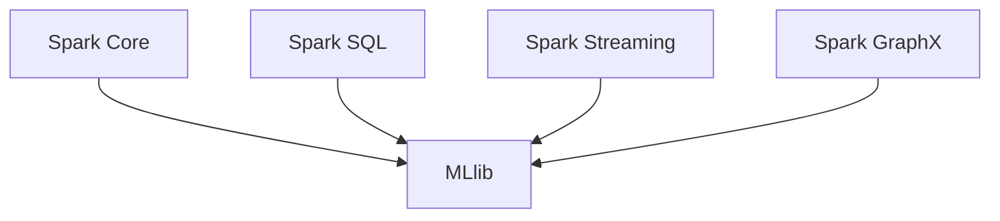

# Spark MLlib原理与代码实例讲解

## 1. 背景介绍

在当今的大数据时代,机器学习已经成为数据科学和人工智能领域中不可或缺的核心技术。Apache Spark是一个开源的大数据处理框架,它提供了MLlib(Machine Learning Library)机器学习库,支持多种常见的机器学习算法。Spark MLlib库旨在简化机器学习工作流程,提供高质量的算法,并支持海量数据集的分布式计算。

Spark MLlib的核心设计理念是通过统一的数据格式和API,将机器学习算法与Spark的分布式计算引擎无缝集成。它支持常见的监督学习、非监督学习、推荐系统、模型评估等机器学习任务,并提供了可扩展的机器学习管道(ML Pipeline),简化了数据处理、模型训练、评估和调优的过程。

## 2. 核心概念与联系

### 2.1 Spark MLlib架构

Spark MLlib的架构主要包括以下几个核心组件:

1. **数据类型(Data Types)**: MLlib定义了统一的数据格式,如`LabeledPoint`、`Vector`等,用于表示特征向量和标签。
2. **算法(Algorithms)**: MLlib实现了多种机器学习算法,包括分类、回归、聚类、协同过滤等。
3. **模型持久化(Model Persistence)**: MLlib支持将训练好的模型保存到磁盘,以便后续加载和使用。
4. **管道(Pipelines)**: MLlib提供了ML Pipeline,用于构建端到端的机器学习工作流。
5. **工具(Utilities)**: MLlib还包含了一些实用工具,如特征提取、特征转换等。

### 2.2 Spark MLlib与Spark生态系统的关系

Spark MLlib是Spark生态系统中的重要组成部分,它与Spark的其他组件密切相关:

1. **Spark Core**: MLlib依赖于Spark Core提供的分布式计算引擎和RDD(Resilient Distributed Dataset)数据结构。
2. **Spark SQL**: MLlib与Spark SQL集成,支持从结构化数据(如Hive表、Parquet文件等)中读取特征数据。
3. **Spark Streaming**: MLlib可以与Spark Streaming结合,实现流式机器学习。
4. **Spark GraphX**: MLlib与Spark GraphX结合,可以处理图形数据并应用于图机器学习任务。



## 3. 核心算法原理具体操作步骤

Spark MLlib提供了多种机器学习算法,包括监督学习、非监督学习和推荐系统等。以下是一些核心算法的原理和操作步骤:

### 3.1 逻辑回归(Logistic Regression)

逻辑回归是一种常用的分类算法,适用于二分类问题。它的基本原理是通过对数几率(log-odds)建模,将输入特征映射到0到1之间的概率值。

1. **原理**: 逻辑回归的目标是找到一个最优的决策边界,将数据分为两类。它通过对数几率函数将线性模型映射到概率空间,从而实现分类。
2. **算法步骤**:
   - 数据预处理:将特征数据转换为MLlib支持的`LabeledPoint`格式。
   - 构建逻辑回归模型:使用`LogisticRegressionWithLBFGS`或`LogisticRegressionWithSGD`算法训练模型。
   - 模型评估:使用测试数据集评估模型性能,计算指标如准确率、精确率、召回率等。
   - 模型调优:根据评估结果,调整超参数(如正则化系数)并重新训练模型。
   - 模型部署:将训练好的模型保存到磁盘,以便后续加载和使用。

### 3.2 K-Means聚类(K-Means Clustering)

K-Means是一种常用的无监督学习算法,用于将数据划分为K个簇。

1. **原理**: K-Means算法通过迭代优化,将数据划分为K个簇,每个数据点被分配到离它最近的簇中心。算法目标是最小化所有数据点到其所属簇中心的平方距离之和。
2. **算法步骤**:
   - 数据预处理:将特征数据转换为MLlib支持的`Vector`格式。
   - 初始化K个簇中心。
   - 迭代计算:
     - 将每个数据点分配到最近的簇中心。
     - 重新计算每个簇的新中心。
   - 重复上一步,直到簇中心不再发生变化或达到最大迭代次数。
   - 输出最终的簇分配结果。

### 3.3 协同过滤(Collaborative Filtering)

协同过滤是一种常用的推荐系统算法,通过分析用户对项目的评分数据,预测用户对未评分项目的偏好。

1. **原理**: 协同过滤算法基于这样一个假设:如果两个用户对某些项目有相似的评分,那么他们对其他项目的评分也可能相似。算法通过分析用户-项目评分矩阵,发现相似用户或相似项目,从而预测缺失的评分。
2. **算法步骤**:
   - 数据预处理:将用户-项目评分数据转换为MLlib支持的`RatingDataset`格式。
   - 选择协同过滤算法:MLlib提供了基于模型的协同过滤(ALS)和基于内存的协同过滤(FPGrowth)两种算法。
   - 训练模型:使用训练数据集训练协同过滤模型。
   - 模型评估:使用测试数据集评估模型性能,计算指标如均方根误差(RMSE)等。
   - 模型调优:根据评估结果,调整超参数(如正则化系数)并重新训练模型。
   - 模型部署:将训练好的模型保存到磁盘,以便后续加载和使用。

## 4. 数学模型和公式详细讲解举例说明

Spark MLlib中的许多算法都基于数学模型和公式,以下是一些核心算法的数学模型和公式详解。

### 4.1 逻辑回归(Logistic Regression)

逻辑回归的数学模型如下:

$$
P(Y=1|X) = \frac{1}{1 + e^{-(\beta_0 + \beta_1X_1 + \beta_2X_2 + ... + \beta_nX_n)}}
$$

其中:

- $P(Y=1|X)$表示给定特征向量$X$时,标签$Y$为1的概率。
- $\beta_0$是偏置项(bias term)。
- $\beta_1, \beta_2, ..., \beta_n$是特征权重。
- $X_1, X_2, ..., X_n$是特征向量的各个特征值。

逻辑回归的目标是找到最优的$\beta$参数,使得模型在训练数据上的对数似然函数最大化:

$$
\max_\beta \sum_{i=1}^N \left[ y^{(i)}\log P(Y=1|X^{(i)}) + (1-y^{(i)})\log(1-P(Y=1|X^{(i)})) \right] - \lambda R(\beta)
$$

其中:

- $N$是训练样本数量。
- $y^{(i)}$是第$i$个样本的标签值(0或1)。
- $X^{(i)}$是第$i$个样本的特征向量。
- $\lambda$是正则化系数,用于控制模型复杂度。
- $R(\beta)$是正则化项,通常使用L1或L2范数。

MLlib使用LBFGS或SGD等优化算法来求解上述优化问题,从而获得最优的$\beta$参数。

### 4.2 K-Means聚类(K-Means Clustering)

K-Means聚类的目标是最小化所有数据点到其所属簇中心的平方距离之和,即:

$$
\min_{\mu_1, \mu_2, ..., \mu_K} \sum_{i=1}^N \min_{1 \leq j \leq K} \left\lVert x_i - \mu_j \right\rVert^2
$$

其中:

- $N$是数据集中的样本数量。
- $K$是簇的数量。
- $x_i$是第$i$个数据点的特征向量。
- $\mu_j$是第$j$个簇的中心向量。

K-Means算法通过迭代优化的方式求解上述优化问题:

1. 初始化$K$个簇中心$\mu_1, \mu_2, ..., \mu_K$。
2. 对于每个数据点$x_i$,计算它与每个簇中心的距离$\left\lVert x_i - \mu_j \right\rVert$,将$x_i$分配到距离最近的簇$c_i$。
3. 对于每个簇$j$,重新计算簇中心$\mu_j$为该簇中所有数据点的均值。
4. 重复步骤2和3,直到簇分配不再发生变化或达到最大迭代次数。

MLlib实现了K-Means++初始化算法,以获得更好的初始簇中心,从而提高聚类质量。

## 5. 项目实践:代码实例和详细解释说明

以下是使用Spark MLlib进行逻辑回归和K-Means聚类的代码示例,并对关键步骤进行详细解释。

### 5.1 逻辑回归示例

```scala
import org.apache.spark.ml.classification.LogisticRegression
import org.apache.spark.ml.linalg.Vectors
import org.apache.spark.ml.evaluation.BinaryClassificationEvaluator

// 加载训练数据
val training = spark.createDataFrame(Seq(
  (1.0, Vectors.dense(0.0, 1.1, 0.1)),
  (0.0, Vectors.dense(2.0, 1.0, -1.0)),
  (0.0, Vectors.dense(2.0, 1.3, 1.0)),
  (1.0, Vectors.dense(0.0, 1.2, -0.5))
)).toDF("label", "features")

// 创建逻辑回归模型
val lr = new LogisticRegression()
  .setMaxIter(10)
  .setRegParam(0.3)
  .setElasticNetParam(0.8)

// 训练模型
val lrModel = lr.fit(training)

// 打印模型参数
println(s"Coefficients: ${lrModel.coefficients} Intercept: ${lrModel.intercept}")

// 对新数据进行预测
val predictions = lrModel.transform(testing)

// 评估模型性能
val evaluator = new BinaryClassificationEvaluator()
  .setLabelCol("label")
  .setRawPredictionCol("prediction")
  .setMetricName("areaUnderROC")
val accuracy = evaluator.evaluate(predictions)
println(s"Area under ROC: $accuracy")
```

1. 首先加载训练数据,将其转换为`LabeledPoint`格式。
2. 创建`LogisticRegression`模型,并设置超参数(如最大迭代次数、正则化参数等)。
3. 使用`fit`方法在训练数据上训练逻辑回归模型。
4. 打印模型参数(系数和偏置项)。
5. 对测试数据进行预测,得到预测结果。
6. 使用`BinaryClassificationEvaluator`评估模型性能,计算ROC曲线下面积(AUC)。

### 5.2 K-Means聚类示例

```scala
import org.apache.spark.ml.clustering.KMeans
import org.apache.spark.ml.linalg.Vectors

// 加载数据
val dataset = spark.createDataFrame(Seq(
  (0, Vectors.dense(1.0, 1.0)),
  (1, Vectors.dense(0.0, 0.0)),
  (2, Vectors.dense(3.0, 3.0)),
  (3, Vectors.dense(4.0, 4.0))
)).toDF("id", "features")

// 训练K-Means模型
val kmeans = new KMeans().setK(2).setSeed(1L)
val model = kmeans.fit(dataset)

// 评估聚类结果
val predictions = model.transform(dataset)
predictions.show()

// 打印簇中心
val centers = model.clusterCenters
centers.foreach(println)
```

1. 首先加载数据,将其转换为`Vector`格式。
2. 创建`KMeans`模型,并设置簇的数量`K`和随机种子。
3. 使用`fit`方法在数据集上训练K-Means模型。
4. 对数据集进行聚类预测,得到每个数据点的簇分配结果。
5. 打印每个簇的中心向量。

## 6. 实际应用场景

Spark MLlib在各个领域都有广泛的应用场景,以下是一些常见的应用示例:

1. **推荐系统**: 使用协同过滤算法为用户推荐感兴趣的