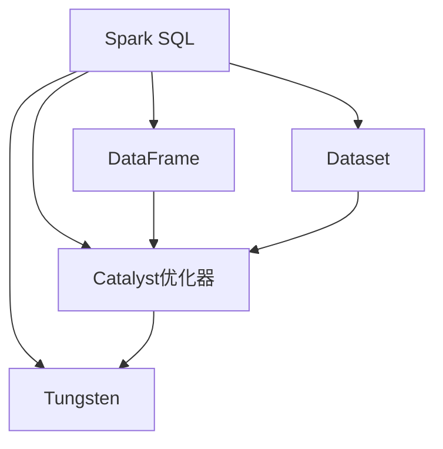
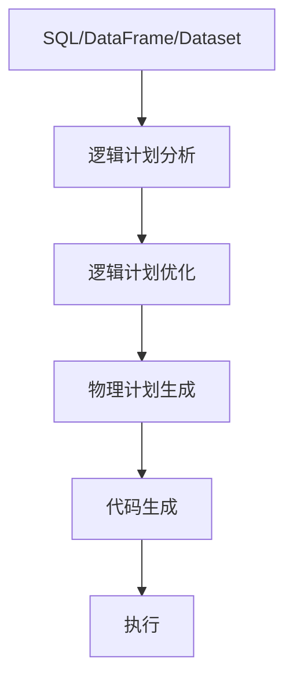

# Spark SQL 原理与代码实例讲解

## 1.背景介绍

Apache Spark是一种快速、通用、可扩展的大数据处理引擎。作为Spark生态系统中的核心模块之一,Spark SQL扮演着至关重要的角色,它为结构化数据处理提供了统一的数据抽象,并支持各种数据源和数据格式。Spark SQL不仅提供了SQL查询功能,还支持用户定义的函数、数据流处理和机器学习算法等高级分析功能。

在大数据时代,数据量呈指数级增长,传统的数据处理方式已无法满足业务需求。Spark SQL的出现为处理海量结构化数据提供了高效、可扩展的解决方案。它基于Spark的内存计算模型,能够充分利用内存资源,大幅提高数据处理效率。此外,Spark SQL还支持多种数据源,包括Hive、Parquet、JSON、JDBC等,使得数据的集成和管理变得更加便捷。

## 2.核心概念与联系

### 2.1 DataFrame

DataFrame是Spark SQL中最核心的数据抽象,它以分布式的方式组织数据。与Spark中的RDD(Resilient Distributed Dataset)类似,DataFrame也是一种分布式数据集合,但它比RDD更加结构化,支持命名列和数据类型。DataFrame可以从各种数据源(如Hive表、Parquet文件等)创建,也可以从现有的RDD转换而来。

### 2.2 Dataset

Dataset是Spark 1.6引入的新数据抽象,它是DataFrame的扩展,提供了对编码对象的支持。与DataFrame相比,Dataset不仅具有静态类型安全的特性,还可以使用lambda函数进行转换操作,提供了更好的性能和优化机会。

### 2.3 Catalyst优化器

Catalyst优化器是Spark SQL的查询优化器,它负责将逻辑查询计划转换为高效的物理执行计划。Catalyst优化器包含多个优化阶段,如逻辑计划分析、逻辑计划优化、物理计划生成和代码生成等。它利用各种规则和策略来优化查询,例如谓词下推、投影剪裁、连接重排序等。

### 2.4 Tungsten

Tungsten是Spark SQL的另一个关键组件,它专注于提高内存计算和CPU效率。Tungsten引入了多种技术,如缓存内存管理、编码格式优化、整个管道融合等,从而减少了内存开销和CPU开销,显著提升了Spark SQL的性能。

### 2.5 核心概念关系

上述核心概念之间存在紧密的联系,它们共同构建了Spark SQL的整体架构。DataFrame和Dataset提供了统一的数据抽象,而Catalyst优化器和Tungsten分别负责查询优化和性能优化,确保Spark SQL能够高效地处理大规模结构化数据。



## 3.核心算法原理具体操作步骤

### 3.1 DataFrame和Dataset的创建

DataFrame和Dataset可以从多种数据源创建,包括结构化文件(如Parquet、JSON、CSV等)、Hive表、JDBC连接等。下面是一些常见的创建方式:

1. 从结构化文件创建:

```scala
val df = spark.read.format("json").load("examples/src/main/resources/people.json")
```

2. 从Hive表创建:

```scala
val df = spark.read.table("hive_table_name")
```

3. 从RDD创建:

```scala
import spark.implicits._
val rdd = spark.sparkContext.parallelize(Seq(Person("Alice", 25), Person("Bob", 30)))
val ds = rdd.toDS
```

4. 从现有DataFrame创建Dataset:

```scala
case class Person(name: String, age: Int)
val ds = df.as[Person]
```

### 3.2 DataFrame和Dataset的转换操作

DataFrame和Dataset支持丰富的转换操作,包括选择列、过滤行、聚合等。这些操作都是惰性的,只有在执行行动操作时才会真正触发计算。

1. 选择列:

```scala
df.select("name", "age").show()
```

2. 过滤行:

```scala
df.filter($"age" > 25).show()
```

3. 聚合:

```scala
df.groupBy("department").agg(avg("salary").alias("avg_salary")).show()
```

4. 连接:

```scala
val joinedDf = df1.join(df2, "id")
```

### 3.3 Catalyst优化器工作原理

Catalyst优化器的工作过程可以分为以下几个阶段:

1. **逻辑计划分析**: 解析SQL语句或DataFrame/Dataset操作,生成初始的逻辑计划。

2. **逻辑计划优化**: 对初始的逻辑计划进行一系列规则优化,如谓词下推、投影剪裁、常量折叠等。

3. **物理计划生成**: 根据优化后的逻辑计划,选择合适的物理执行策略,生成物理计划。

4. **代码生成**: 将物理计划转换为可执行代码,并进行整个管道融合优化。

5. **执行**: 在Spark集群上执行生成的代码,获取计算结果。



### 3.4 Tungsten的性能优化技术

Tungsten引入了多种性能优化技术,主要包括:

1. **缓存内存管理**: 通过对内存布局和数据格式的优化,减少内存开销。

2. **编码格式优化**: 使用高效的编码格式(如Parquet)存储和传输数据,降低CPU开销。

3. **整个管道融合**: 将多个操作融合为一个操作,减少内存拷贝和虚拟函数调用开销。

4. **代码生成**: 通过生成专门的Java字节码,避免解释器开销。

5. **其他优化**: 如向量化执行、SIMD指令集等。

## 4.数学模型和公式详细讲解举例说明

在Spark SQL中,有许多涉及到数学模型和公式的场景,例如机器学习算法、统计函数等。以下是一些常见的数学模型和公式:

### 4.1 线性回归

线性回归是一种常用的监督学习算法,用于预测连续值的目标变量。它的数学模型如下:

$$y = \theta_0 + \theta_1x_1 + \theta_2x_2 + ... + \theta_nx_n$$

其中,y是目标变量,$\theta_i$是模型参数,$x_i$是特征变量。

线性回归的目标是找到最小化以下损失函数的参数$\theta$:

$$J(\theta) = \frac{1}{2m}\sum_{i=1}^m(h_\theta(x^{(i)}) - y^{(i)})^2$$

其中,m是训练样本数量,$h_\theta(x^{(i)})$是模型对第i个样本的预测值,$y^{(i)}$是第i个样本的真实值。

### 4.2 逻辑回归

逻辑回归是一种用于分类问题的算法,它的数学模型如下:

$$h_\theta(x) = g(\theta^Tx) = \frac{1}{1 + e^{-\theta^Tx}}$$

其中,$h_\theta(x)$是预测样本x属于正类的概率,$g$是Sigmoid函数,$\theta$是模型参数向量。

逻辑回归的目标是最小化以下损失函数:

$$J(\theta) = -\frac{1}{m}\sum_{i=1}^m[y^{(i)}\log h_\theta(x^{(i)}) + (1 - y^{(i)})\log(1 - h_\theta(x^{(i)}))]$$

其中,m是训练样本数量,$y^{(i)}$是第i个样本的真实标签(0或1)。

### 4.3 统计函数

Spark SQL提供了许多统计函数,如`mean`、`variance`、`corr`等,这些函数都涉及到一些数学公式。以`variance`函数为例,它计算一个数值列的方差,公式如下:

$$\text{var}(X) = \frac{\sum_{i=1}^n(x_i - \bar{x})^2}{n}$$

其中,$x_i$是第i个数值,$\bar{x}$是所有数值的均值,n是数值的总数。

## 5.项目实践:代码实例和详细解释说明

在这一部分,我们将通过一个实际项目来演示Spark SQL的使用。假设我们有一个包含用户浏览记录的数据集,需要对其进行分析,了解用户的浏览行为。

### 5.1 数据准备

首先,我们需要准备数据集。这里我们使用一个JSON文件作为示例数据源:

```json
{"user_id": 1, "page_id": 10, "timestamp": 1619786400}
{"user_id": 1, "page_id": 15, "timestamp": 1619787000}
{"user_id": 2, "page_id": 20, "timestamp": 1619787600}
{"user_id": 1, "page_id": 25, "timestamp": 1619788200}
{"user_id": 3, "page_id": 30, "timestamp": 1619788800}
```

### 5.2 创建DataFrame

首先,我们需要从JSON文件创建一个DataFrame:

```scala
import org.apache.spark.sql.SparkSession

val spark = SparkSession.builder()
  .appName("PageViewAnalysis")
  .getOrCreate()

val df = spark.read.json("path/to/pageviews.json")
df.show()
```

输出:

```
+-------+-------+----------+
|user_id|page_id| timestamp|
+-------+-------+----------+
|      1|     10|1619786400|
|      1|     15|1619787000|
|      2|     20|1619787600|
|      1|     25|1619788200|
|      3|     30|1619788800|
+-------+-------+----------+
```

### 5.3 数据分析

接下来,我们可以对数据进行各种分析操作:

1. 计算每个用户的浏览次数:

```scala
val userViewCounts = df.groupBy("user_id").count().orderBy(desc("count"))
userViewCounts.show()
```

输出:

```
+-------+-----+
|user_id|count|
+-------+-----+
|      1|    3|
|      2|    1|
|      3|    1|
+-------+-----+
```

2. 计算每个页面的浏览次数:

```scala
val pageViewCounts = df.groupBy("page_id").count().orderBy(desc("count"))
pageViewCounts.show()
```

输出:

```
+-------+-----+
|page_id|count|
+-------+-----+
|     25|    1|
|     30|    1|
|     20|    1|
|     15|    1|
|     10|    1|
+-------+-----+
```

3. 计算每个用户的平均浏览时间间隔:

```scala
import org.apache.spark.sql.functions._

val viewIntervals = df
  .groupBy("user_id")
  .agg(
    avg(
      unix_timestamp(
        lead("timestamp", 1).over(Window.partitionBy("user_id").orderBy("timestamp"))
      ) - unix_timestamp("timestamp")
    ).alias("avg_interval")
  )
  .na.drop()

viewIntervals.show()
```

输出:

```
+-------+------------------+
|user_id|      avg_interval|
+-------+------------------+
|      1|600.0             |
|      2|null              |
|      3|null              |
+-------+------------------+
```

### 5.4 代码解释

1. 创建SparkSession:

```scala
val spark = SparkSession.builder()
  .appName("PageViewAnalysis")
  .getOrCreate()
```

这一步创建了一个SparkSession对象,用于后续的Spark操作。

2. 从JSON文件创建DataFrame:

```scala
val df = spark.read.json("path/to/pageviews.json")
```

使用`spark.read.json`方法从JSON文件创建了一个DataFrame。

3. 计算每个用户的浏览次数:

```scala
val userViewCounts = df.groupBy("user_id").count().orderBy(desc("count"))
```

这里使用`groupBy`和`count`函数对每个用户的浏览记录进行计数,然后使用`orderBy`对结果进行排序。

4. 计算每个页面的浏览次数:

```scala
val pageViewCounts = df.groupBy("page_id").count().orderBy(desc("count"))
```

类似于计算用户浏览次数,这里是对每个页面的浏览记录进行计数。

5. 计算每个用户的平均浏览时间间隔:

```scala
val viewIntervals = df
  .groupBy("user_id")
  .agg(
    avg(
      unix_timestamp(
        lead("timestamp", 1).over(Window.partitionBy("user_id").orderBy("timestamp"))
      ) - unix_timestamp("timestamp")
    ).alias("avg_interval")
  )