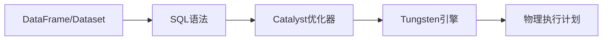

# Spark SQL原理与代码实例讲解

## 1. 背景介绍
### 1.1 大数据处理的挑战
随着数据量的不断增长,传统的数据处理方式已经无法满足实时性、高吞吐量的需求。MapReduce等批处理框架虽然能够处理海量数据,但是延迟较高,无法满足实时计算的场景。

### 1.2 Spark的诞生 
Spark作为内存计算框架应运而生,其RDD数据模型和DAG执行引擎,大大提升了数据处理的效率。Spark生态系统中的Spark SQL项目,进一步提供了类SQL交互式查询能力,降低了使用门槛。

### 1.3 Spark SQL的优势
Spark SQL集成了关系型数据库和Hive的优点,支持SQL查询和Dataframe/Dataset API编程,对于熟悉SQL和Python/Java/Scala开发人员非常友好。同时Spark SQL的查询优化器、列式存储等,使其性能比Hive有数量级的提升。

## 2. 核心概念与联系
### 2.1 DataFrame/Dataset
- DataFrame是一种以RDD为基础的分布式数据集,类似传统数据库中的二维表格,具有Schema元信息
- Dataset是DataFrame的一个特例,是强类型的。可以在编译时检查类型
- 二者都提供了类似SQL的查询能力和优化

### 2.2 SQL语法
Spark SQL支持HiveQL语法,包括:
- 数据定义语句:CREATE、ALTER、DROP等
- 数据操纵语句:SELECT、INSERT、UPDATE、DELETE等
- 数据控制语句:GRANT、REVOKE等

### 2.3 Catalyst优化器
Catalyst是Spark SQL的核心,负责将SQL语句解析成逻辑执行计划,并对执行计划进行优化,生成物理执行计划。优化手段包括:
- 谓词下推:将过滤条件提前到数据源处执行
- 列剪裁:去掉查询中未使用到的列
- 常量折叠:将常量表达式预先计算 

### 2.4 Tungsten引擎
Tungsten是Spark的第二代内存管理机制,提供了超快的内存计算能力。主要技术点包括:
- 二进制数据存储:使用自定义的二进制格式存储数据,节省空间
- 内存管理与调优:使用内存池、内存整理等技术,降低GC开销
- 代码生成:使用Java字节码生成技术,针对特定查询生成定制代码,提高执行效率

Spark SQL的核心概念与联系如下图:



## 3. 核心算法原理具体操作步骤
### 3.1 SQL解析
1. 词法分析:将SQL语句转换成Token流
2. 语法分析:根据语法规则将Token流组装成抽象语法树AST
3. 语义分析:检查AST中的表名、列名是否存在,数据类型是否匹配等

### 3.2 生成逻辑计划
1. 将AST转换为逻辑算子树
2. 逻辑算子包括Project、Filter、Join等,与SQL语句中的子句一一对应
3. 此时的逻辑计划是未优化的

### 3.3 逻辑计划优化
使用RBO(基于规则)和CBO(基于代价)相结合的优化策略:
1. RBO阶段利用各种等价变换规则对逻辑计划进行优化,如谓词下推、列剪裁等
2. CBO阶段根据数据的统计信息,估算各个子计划的代价,选择代价最小的
3. 多轮迭代上述优化过程,直到得到最优的逻辑执行计划

### 3.4 生成物理计划
1. 将逻辑算子映射为物理算子,如TableScan、SortMergeJoin等
2. 物理算子要考虑数据的物理分布、并行度等因素
3. 对于复杂的逻辑算子,还要生成Codegen代码

### 3.5 执行物理计划
1. 生成DAG(有向无环图),将算子组装成流水线
2. 每个Stage包含一系列宽依赖的算子,由多个Task并行执行
3. 每个Task在一个线程内执行,通过Exchange算子与其他Stage交换数据

## 4. 数学模型和公式详细讲解举例说明
### 4.1 TF-IDF
TF-IDF是一种用于文本挖掘的统计方法,用于评估一个词语对于一个文件集或一个语料库中的其中一份文件的重要程度。定义如下:

$$
tfidf(t,d,D) = tf(t,d) \times idf(t,D)
$$

其中:
- $tf(t,d)$表示词语$t$在文档$d$中出现的频率
- $idf(t,D)$表示逆向文件频率,用总文档数除以包含该词语的文档数,再取对数

```scala
// 使用Spark SQL计算TF-IDF
val df = spark.read.text("documents")
val tf = df.withColumn("docId", monotonically_increasing_id())
  .select(explode(split($"value", "\\s+")).as("word"), $"docId")
  .groupBy("docId", "word").count()
  .withColumnRenamed("count", "tf")
  
val idf = tf.groupBy("word").agg(countDistinct($"docId").as("df"))
  .withColumn("idf", log(lit(df.count) / $"df"))
  
val tfidf = tf.join(idf, "word")
  .withColumn("tfidf", $"tf" * $"idf")
```

### 4.2 ALS推荐算法
ALS是交替最小二乘法的简称,常用于协同过滤的推荐系统中。其核心思想是将用户和物品映射到同一个隐语义空间,用latent factor模型用户的偏好。

用户$u$对物品$i$的评分预测值为:

$$
\hat{r}_{ui} = q_i^T p_u
$$

其中:
- $q_i$是物品$i$的latent factor向量
- $p_u$是用户$u$的latent factor向量
- $\hat{r}_{ui}$是用户$u$对物品$i$的评分预测值

训练时交替固定$p$和$q$,优化目标函数:

$$
\underset{q*, p*}{\mathrm{argmin}} \sum_{r_{ui} \in R_{train}} \left(r_{ui} - q_i^Tp_u \right)^2 + \lambda (\left\| q_i \right\|^2 + \left\| p_u \right\|^2)
$$

```scala
// 使用Spark MLlib实现ALS
val ratings = spark.read.textFile("ratings.txt")
  .map(_.split(",")).map(arr => Rating(arr(0).toInt, arr(1).toInt, arr(2).toDouble))
  .toDF()
  
val als = new ALS()
  .setMaxIter(5)
  .setRegParam(0.01)
  .setUserCol("userId")
  .setItemCol("movieId") 
  .setRatingCol("rating")
  
val model = als.fit(ratings)

// 为每个用户生成Top-N推荐
val userRecs = model.recommendForAllUsers(10)
```

## 5. 项目实践:代码实例和详细解释说明
下面通过一个具体的项目实践,来演示Spark SQL的使用。该项目的目标是分析Stack Overflow的调查数据,挖掘出数据中的有趣信息。

### 5.1 数据准备
数据来源于Stack Overflow 2018年的开发者调查,包含了对近10万名开发者的调查结果。原始数据为CSV格式,部分字段信息如下:

| 列名                | 说明                 |
|--------------------|----------------------|
| Respondent         | 回答者ID              |
| Professional       | 是否为专业开发者        |
| ProgramHobby       | 是否将编程作为兴趣爱好   |
| Country            | 国家                  |
| University         | 是否受过高等教育        |
| EmploymentStatus   | 就业状况              |
| FormalEducation    | 正式教育程度           |
| MajorUndergrad     | 本科专业              |
| HomeRemote         | 是否远程办公           |
| CompanySize        | 公司规模              |
| CompanyType        | 公司类型              |
| YearsProgram       | 编程年限              |
| YearsCodedJob      | 从事编程工作年限        |
| YearsCodedJobPast  | 过去一年从事编程工作时长 |
| DevType            | 开发者类型             |
| OrgSize            | 团队规模              |
| CareerSatisfaction | 职业满意度            |
| JobSatisfaction    | 工作满意度            |
| ExCoderReturn      | 是否考虑转行           |
| ExCoderNotForMe    | 认为编程不适合自己      |
| ExCoderBalance     | 难以平衡工作与生活      |
| ExCoder10Years     | 认为10年后还会从事编程   |
| ExCoderBelonged    | 认为自己属于开发者群体   |
| ExCoderSkills      | 认为自己的技能正在落后   |
| ExCoderWillNotCode | 不想学习新技术         |
| ExCoderActive      | 保持活跃参与开源项目     |

### 5.2 数据加载与预处理

```scala
// 加载数据
val df = spark.read.option("header", "true")
  .option("inferSchema", "true") 
  .csv("survey_results_public.csv")

// 缓存数据  
df.cache()

// 数据预处理
val cleanDF = df.na.fill("", Seq("Professional", "ProgramHobby", "HomeRemote")) // 填充空值
  .na.fill("Missing", Seq("University", "EmploymentStatus", "FormalEducation")) // 填充缺失值
  .filter($"Country".isNotNull && $"EmploymentStatus" =!= "Missing") // 去除无效数据
```

### 5.3 统计分析
1. 统计回答者的国家分布

```scala
cleanDF.groupBy("Country") 
  .count()
  .orderBy($"count".desc)
  .show()
```

2. 统计就业状况

```scala
cleanDF.groupBy("EmploymentStatus")
  .count()
  .orderBy($"count".desc) 
  .show()
```

3. 统计专业开发者的比例

```scala
cleanDF.groupBy("Professional")
  .count()
  .orderBy($"count".desc)
  .show()
```

4. 统计将编程作为兴趣爱好的比例

```scala
cleanDF.groupBy("ProgramHobby")
  .count()
  .orderBy($"count".desc)
  .show()
```

5. 统计受过高等教育和正式教育的比例

```scala
cleanDF.groupBy("University", "FormalEducation") 
  .count()
  .orderBy($"count".desc)
  .show()
```

6. 统计远程工作的比例

```scala
cleanDF.groupBy("HomeRemote")
  .count()  
  .orderBy($"count".desc)
  .show()
```

### 5.4 数据可视化
使用Spark SQL结合Python的matplotlib等可视化库,可以生成各种图表,直观展现数据中的规律。例如:

1. 各国家开发者人数TOP10柱状图

```python
# 将统计结果转换为Pandas DataFrame
country_df = cleanDF.groupBy("Country") \
  .count() \
  .orderBy($"count".desc) \
  .limit(10) \
  .toPandas()
  
# 绘制柱状图  
plt.figure(figsize=(10, 6))
plt.bar(country_df['Country'], country_df['count'])
plt.xticks(rotation=45)
plt.xlabel('Country')
plt.ylabel('Number of Respondents')
plt.title('Top 10 Countries with Most Respondents')
plt.show()
```

2. 就业状况饼图

```python
# 将统计结果转换为Pandas DataFrame
emp_df = cleanDF.groupBy("EmploymentStatus") \
  .count() \
  .orderBy($"count".desc) \
  .toPandas()

# 绘制饼图  
plt.figure(figsize=(8, 8))  
plt.pie(emp_df['count'], labels=emp_df['EmploymentStatus'], autopct='%1.1f%%')
plt.title('Employment Status Distribution')
plt.show()
```

## 6. 实际应用场景
Spark SQL在实际生产环境中有非常广泛的应用,主要场景包括:

### 6.1 ETL
使用Spark SQL从各种数据源(如Hive、HBase、RDBMS等)中提取数据,经过转换、清洗,最终加载到目标数据仓库或数据库中。Spark SQL提供了标准的JDBC/ODBC连接,支持读写关系型数据库。

### 6.2 即席查询
数据分析师、数据科学家使用Spark SQL对海量数据进行交互式查询分析,快速验证假设,发现数据中的规律和趋势。Spark SQL提供了友好的Dataframe/Dataset API以及Spark原生的分布式计算能力。

### 6.3 数据湖分析
对于非结构化、半结