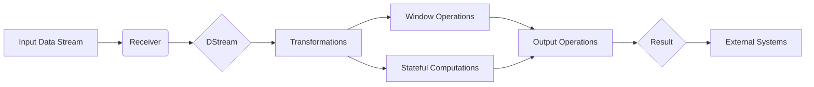

# Spark Streaming原理与代码实例讲解

## 1. 背景介绍

### 1.1 大数据流处理的重要性
在当今大数据时代,海量数据以流的形式实时产生,传统的批处理模式已无法满足实时性要求。流处理作为处理实时数据的重要手段,在互联网、物联网、金融等领域得到广泛应用。

### 1.2 Spark Streaming概述
Spark Streaming是Apache Spark生态系统中的重要组件,提供了可扩展、高吞吐、容错的实时流数据处理能力。它支持从Kafka、Flume、HDFS等多种数据源读取数据流,并进行实时计算。

### 1.3 Spark Streaming的优势
相比Storm等其他流处理框架,Spark Streaming具有统一的API、强大的容错机制、与Spark生态的无缝集成等优势,已成为流处理领域的主流选择之一。

## 2. 核心概念与联系

### 2.1 DStream
DStream(Discretized Stream)是Spark Streaming的核心抽象,代表持续不断的数据流。DStream由一系列连续的RDD(弹性分布式数据集)组成,每个RDD包含一个时间间隔内的数据。

### 2.2 输入DStream与Receiver
输入DStream表示从外部数据源获取的输入数据流。系统通过Receiver接收器不断接收数据并封装成DStream。常见的数据源包括:
- Kafka
- Flume 
- HDFS/S3
- Socket套接字

### 2.3 转换操作
DStream支持多种转换操作,用于对数据流进行处理,例如:
- map/flatMap/filter: 对DStream中的每个元素进行转换/过滤
- reduceByKey/groupByKey: 对DStream按Key进行聚合
- join/cogroup: 多个DStream之间的关联
- window: 滑动窗口操作

### 2.4 输出操作  
输出操作用于将转换后的数据流输出到外部系统,例如:
- print: 打印DStream中的数据
- saveAsTextFiles: 保存为文本文件 
- foreachRDD: 对DStream中的每个RDD执行自定义操作

### 2.5 检查点与状态管理
Spark Streaming提供了检查点机制和状态管理,用于容错恢复和保存中间结果。通过checkpoint和updateStateByKey等API,可以实现带状态的流式计算。

## 3. 核心算法原理与操作步骤

### 3.1 DStream原理
DStream的内部原理如下:
1. 将输入数据源按照指定的时间间隔(如1秒)切分成一系列批次。
2. Spark将每个批次数据封装成一个RDD。
3. 对RDD应用转换操作,生成新的RDD。
4. 将转换后的结果输出到外部系统。

### 3.2 窗口操作
窗口操作是Spark Streaming常用的一种转换,用于在滑动窗口上执行计算。窗口操作的步骤如下:
1. 指定窗口大小(windowDuration)和滑动间隔(slideDuration)。
2. 使用window()函数对DStream进行窗口转换。
3. 对窗口化的DStream执行reduceByWindow()等聚合操作。

### 3.3 状态管理
Spark Streaming支持带状态的计算,常用的状态管理API包括:
- updateStateByKey(): 根据key对数据进行状态更新。需提供状态更新函数。
- mapWithState(): 对每个key维护任意的状态数据,并根据状态和新数据计算输出。

状态管理的一般步骤为:
1. 定义状态更新函数,指定如何根据新数据更新状态。
2. 使用updateStateByKey()或mapWithState()进行带状态转换。
3. 处理更新后的状态数据。

## 4. 数学模型与公式

### 4.1 滑动窗口模型
滑动窗口是Spark Streaming常用的一种处理模型,可用数学公式表示为:

$window(D, w, s)$

其中,$D$表示DStream, $w$为窗口大小, $s$为滑动步长。窗口大小和步长通常以时间为单位,如`"10 seconds"`。

例如,对DStream $D$应用大小为10秒、滑动步长为5秒的窗口操作:

$window(D, "10 seconds", "5 seconds")$

### 4.2 状态更新模型
状态更新模型可抽象表示为:

$state_{t+1} = f(state_t, input_t)$

其中,$state_t$为时间$t$的状态,$input_t$为$t$时刻的新输入数据,$f$为状态更新函数。

以单词计数为例,设$state_t$为单词$w$在$t$时刻的计数,新输入$input_t$中$w$出现的次数为$n$,则状态更新公式为:

$state_{t+1}(w) = state_t(w) + n$ 

## 5. 项目实践:代码实例

下面以使用Spark Streaming进行实时单词计数为例,给出Scala代码实现:

```scala
val conf = new SparkConf().setAppName("WordCount")
val ssc = new StreamingContext(conf, Seconds(1))

// 从Socket接收数据
val lines = ssc.socketTextStream("localhost", 9999)

val words = lines.flatMap(_.split(" "))
val pairs = words.map(word => (word, 1))
val wordCounts = pairs.reduceByKey(_ + _)

wordCounts.print()

ssc.start()
ssc.awaitTermination()
```

代码说明:
1. 创建SparkConf和StreamingContext,指定批次间隔为1秒。
2. 通过socketTextStream建立Socket连接,接收数据。
3. 对输入数据进行切分,转换成(word, 1)键值对。
4. 使用reduceByKey对单词进行计数。
5. 打印每个批次的计数结果。
6. 启动流计算并等待终止。

## 6. 实际应用场景

Spark Streaming可应用于多种实时场景,例如:

### 6.1 实时日志分析
将服务器日志实时传输到Spark Streaming,进行实时的统计分析,如统计PV/UV、错误率等指标,实现实时监控。

### 6.2 实时推荐系统
利用Spark Streaming实时处理用户行为数据,如浏览、点击等,结合机器学习算法,动态更新用户画像和推荐结果。

### 6.3 实时异常检测
通过Spark Streaming分析传感器、设备产生的实时数据,构建异常检测模型,及时发现异常情况并触发报警。

### 6.4 实时金融风控
对交易数据流进行实时处理,结合规则引擎和机器学习算法,实现欺诈检测、反洗钱等金融风控场景。

## 7. 工具和资源推荐

### 7.1 集成开发工具
- IntelliJ IDEA: Scala语言首选的IDE,提供了强大的开发和调试功能。
- Jupyter Notebook: 交互式的开发工具,支持Scala, 适合数据分析和原型开发。

### 7.2 资源推荐  
- 官方文档: Spark官网提供了详尽的[Streaming Programming Guide](http://spark.apache.org/docs/latest/streaming-programming-guide.html)。
- 《Spark Streaming源码解析》: 对Spark Streaming实现原理进行了深入分析,适合进阶学习。
- Spark Streaming示例项目: Github上有很多Spark Streaming的示例项目,如[Spark-Streaming-Examples](https://github.com/apache/spark/tree/master/examples/src/main/scala/org/apache/spark/examples/streaming)。

## 8. 总结:未来发展与挑战

### 8.1 Structured Streaming的兴起
Spark 2.0引入了Structured Streaming,提供了更高层次的流处理抽象,未来结构化流处理将成为主流。

### 8.2 流批一体化趋势
流处理与批处理的界限正在模糊,统一的流批处理引擎和API将成为大数据处理的发展方向。

### 8.3 实时机器学习的挑战
如何将机器学习算法应用于实时流数据,并持续优化模型,是流处理领域面临的挑战之一。

### 8.4 流处理的标准化
当前流处理领域尚缺乏统一的标准和规范,未来有望在API、语义等方面实现标准化。

## 9. 附录:常见问题解答

### Q1: Spark Streaming与Storm的区别?
A1: Spark Streaming基于微批次,而Storm是纯实时,在延迟性上Storm更优。但Spark Streaming在吞吐量、容错性、生态集成等方面具有优势。

### Q2: Spark Streaming如何处理无序数据?
A2: 可通过设置数据接收的最大延迟时间和水印机制,保证在一定时间范围内数据的完整性和正确性。

### Q3: Spark Streaming支持exactly-once语义吗?
A3: 在数据输入和输出端,可通过WAL预写日志、事务机制、幂等写入等方式,结合checkpoint机制,实现端到端的exactly-once语义。

### Q4: 如何监控Spark Streaming应用?
A4: 可利用Spark UI、Metrics系统、Graphite等工具,对Streaming应用的延迟、吞吐量、资源利用率等指标进行监控和报警。



作者：禅与计算机程序设计艺术 / Zen and the Art of Computer Programming