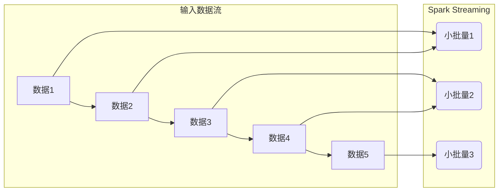
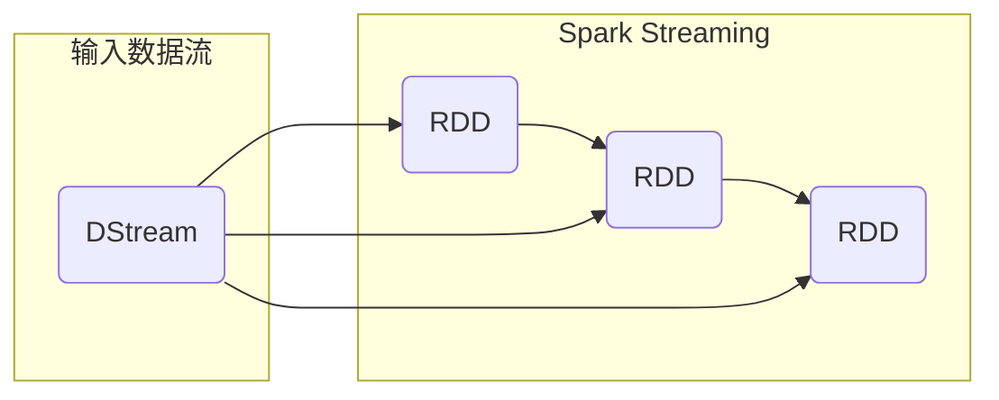
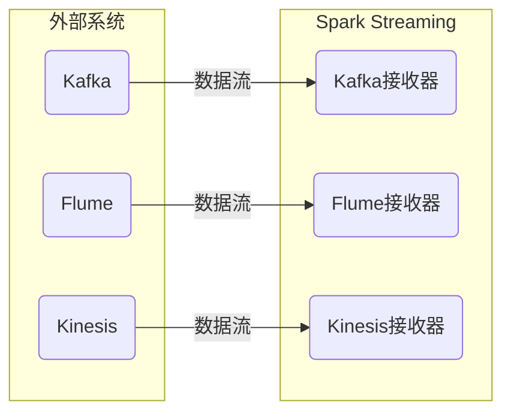
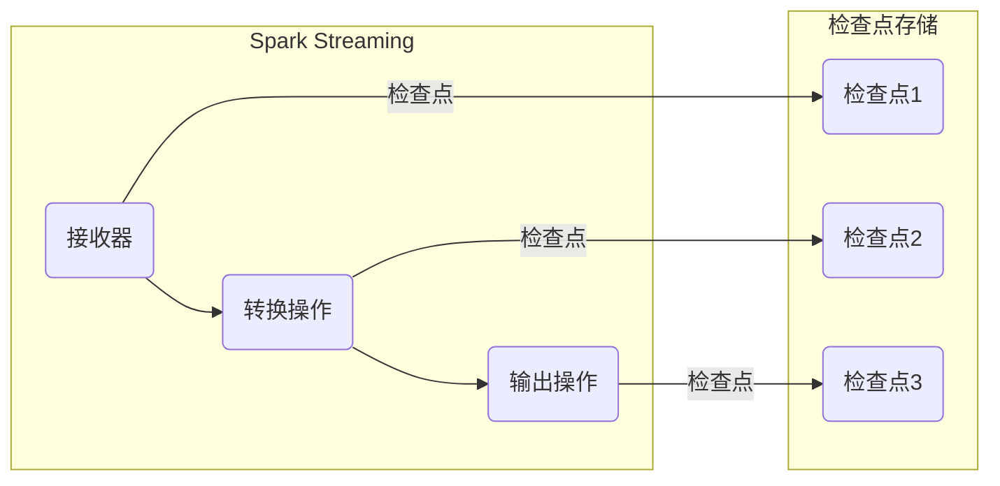
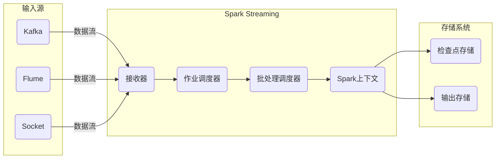
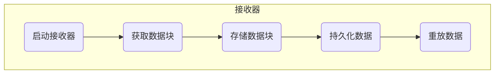
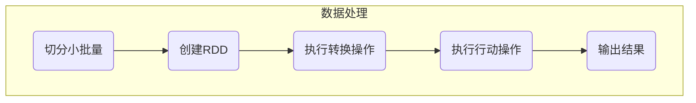
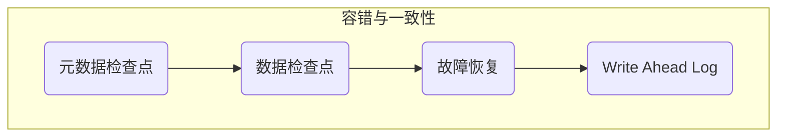

# Spark Streaming原理与代码实例讲解

## 1.背景介绍

### 1.1 大数据时代的数据处理需求

在当今大数据时代，海量的数据不断产生和涌现,如网络日志、社交媒体信息、物联网设备数据等。这些数据通常具有以下几个特点:

- **大量**:数据量巨大,以TB、PB为单位
- **多样**:数据类型多种多样,包括结构化、半结构化和非结构化数据
- **实时**:数据是持续不断产生的数据流

传统的基于磁盘的批处理系统(如Hadoop MapReduce)已经无法满足对这些实时数据流的处理需求。因此,我们需要一种新的大数据处理范式,能够高效、可靠、实时地处理不断产生的数据流。

### 1.2 流式计算的兴起

为了应对这一需求,**流式计算**应运而生。流式计算是一种新兴的大数据处理范式,它将计算过程建模为持续的数据流,并对流数据进行实时处理和分析。与传统的批处理范式不同,流式计算具有以下优势:

- **实时性**:能够在数据产生时就对其进行处理,实现秒级或毫秒级的低延迟
- **持续性**:可以持续不断地处理数据流,而不是一次性处理有限的数据集
- **可伸缩性**:能够通过添加更多计算资源来处理更大规模的数据流

流式计算已广泛应用于各种场景,如实时监控、在线机器学习、复杂事件处理、实时决策等。

### 1.3 Spark Streaming简介

[Spark Streaming](https://spark.apache.org/streaming/)是Apache Spark的一个核心模块,用于构建可伸缩、高吞吐量、高容错的流式应用程序。它基于Spark核心的快速批处理引擎,将流数据切分为一系列的小批量(micro-batches),并使用Spark引擎对这些小批量进行高效处理。

Spark Streaming具有以下主要特点:

- **易于使用**:提供类似于Spark RDD的高级API,支持Java、Scala、Python等多种语言
- **容错性**:通过checkpoint和Write Ahead Log实现了端到端的精确一次语义
- **集成性**:与Spark生态圈无缝集成,可以复用Spark的丰富库(如Spark SQL、MLlib等)
- **统一性**:流式计算和批处理使用同一个API,方便统一管理

本文将深入探讨Spark Streaming的核心原理、关键算法和实现细节,并通过代码示例讲解其使用方法。

## 2.核心概念与联系

在深入讨论Spark Streaming的原理之前,我们需要先了解一些核心概念及其相互关系。

### 2.1 Discretized Stream (离散化流)

Spark Streaming将输入的实时数据流离散化为一系列的小批量(micro-batches)。每个小批量都包含一段时间内(如1秒)收集到的数据,并由Spark引擎进行处理。

通过离散化,Spark Streaming能够利用Spark的批处理引擎高效地处理数据流。同时,它还提供了一些特性,如数据重放(replay data)、预测执行(speculative execution)等,进一步提高了流式计算的性能和容错能力。

### 2.2 DStream (离散化流)

在Spark Streaming中,一个稳定的输入数据流被表示为一个DStream(Discretized Stream)对象。DStream是一个不可变、有序的记录流,其中的记录是由底层Spark RDD表示的。

DStream支持常用的数据转换操作,如`map`、`flatMap`、`filter`、`reduceByKey`等,以及基于窗口(window)的聚合操作。通过对DStream进行转换,我们可以构建复杂的实时数据处理管道。

### 2.3 输入源与接收器

Spark Streaming支持多种输入源,如Kafka、Flume、Kinesis等,用于从外部系统获取实时数据流。对于每个输入源,Spark Streaming都会创建一个专用的接收器(Receiver),负责从源头可靠地获取数据,并将数据存储在Spark的内存中以供后续处理。

接收器负责从源头可靠地获取数据,并将数据存储在Spark的内存中以供后续处理。接收器是容错且可重新启动的,能够从故障中恢复并保证数据的完整性。

### 2.4 检查点机制

为了实现端到端的精确一次语义,Spark Streaming提供了检查点(Checkpoint)机制。通过定期将数据持久化到可靠存储(如HDFS)中,Spark Streaming能够在发生故障时从最近的检查点恢复,避免数据丢失或重复计算。

检查点机制确保了Spark Streaming的容错性和一致性,使其能够在出现故障时自动恢复,并保证计算结果的正确性。

## 3.核心算法原理具体操作步骤

### 3.1 Spark Streaming架构概览

Spark Streaming的架构由以下几个关键组件组成:

1. **接收器(Receiver)**:从外部数据源获取实时数据流,并将其存储在Spark内存中。
2. **作业调度器(Job Scheduler)**:根据批处理间隔,将数据流切分为一系列小批量,并将每个小批量提交给Spark引擎进行处理。
3. **批处理调度器(Batching Scheduler)**:负责调度和执行Spark作业,并管理Spark应用程序的生命周期。
4. **Spark上下文(Spark Context)**:Spark应用程序的主要入口点,用于创建RDD、执行转换操作和行动操作。
5. **检查点存储(Checkpoint Storage)**:用于持久化数据流和元数据,实现容错和一致性。
6. **输出存储(Output Storage)**:用于存储最终的计算结果,如HDFS、数据库等。

接下来,我们将详细探讨Spark Streaming的核心算法原理和具体操作步骤。

### 3.2 数据接收

Spark Streaming通过接收器(Receiver)从外部数据源获取实时数据流。接收器是一个长期运行的任务,它负责可靠地从源头获取数据,并将数据存储在Spark内存中以供后续处理。

接收器的工作流程如下:

1. **启动接收器**:根据指定的输入源创建相应的接收器实例,并启动接收器。
2. **获取数据块**:接收器从数据源获取一个数据块(例如,从Kafka获取一批消息)。
3. **存储数据块**:将获取到的数据块存储在Spark内存中的接收队列(Receiver Queue)中。
4. **持久化数据**:定期将接收队列中的数据持久化到检查点存储中,以实现容错恢复。
5. **重放数据**:如果发生故障,接收器可以从检查点存储中重放数据,确保数据的完整性。

接收器的设计确保了数据的可靠性和容错性。即使发生故障,Spark Streaming也能够从最近的检查点恢复,避免数据丢失或重复计算。

### 3.3 数据处理

在获取到实时数据流后,Spark Streaming会将其切分为一系列小批量(micro-batches),并使用Spark引擎对这些小批量进行高效处理。

数据处理的具体步骤如下:

1. **切分小批量**:作业调度器根据指定的批处理间隔(如1秒),将接收队列中的数据切分为一系列小批量。
2. **创建RDD**:对于每个小批量,Spark Streaming会创建一个RDD,将小批量中的数据封装在RDD中。
3. **执行转换操作**:用户可以对RDD执行各种转换操作,如`map`、`flatMap`、`filter`、`reduceByKey`等,构建出复杂的数据处理管道。
4. **执行行动操作**:最后,用户需要触发一个行动操作(如`foreachRDD`)来启动实际的计算过程。
5. **输出结果**:计算结果可以输出到各种外部系统,如HDFS、数据库等。

通过将流式计算建模为小批量的RDD转换操作,Spark Streaming能够充分利用Spark强大的批处理引擎,实现高效、可伸缩的流式计算。同时,Spark Streaming还提供了一些特性,如数据重放、预测执行等,进一步提高了性能和容错能力。

### 3.4 容错与一致性

为了确保端到端的精确一次语义,Spark Streaming采用了检查点(Checkpoint)机制来实现容错和一致性。

容错与一致性的具体步骤如下:

1. **元数据检查点**:Spark Streaming会定期将元数据信息(如接收器的配置、已处理的数据块等)持久化到检查点存储中。
2. **数据检查点**:Spark Streaming会定期将接收队列中的数据持久化到检查点存储中。
3. **故障恢复**:如果发生故障,Spark Streaming可以从最近的检查点重新启动接收器和作业,并从检查点存储中重放数据,确保数据的完整性。
4. **Write Ahead Log**:对于输出操作,Spark Streaming会先将计算结果写入到Write Ahead Log中,然后再将结果存储到外部系统中。这样可以避免数据丢失或重复计算。

通过检查点机制和Write Ahead Log,Spark Streaming能够在发生故障时自动恢复,并确保计算结果的正确性和一致性。这使得Spark Streaming成为一个可靠、高容错的流式计算系统。

## 4.数学模型和公式详细讲解举例说明

在Spark Streaming中,一