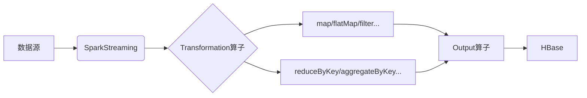

# SparkStreaming与HBase离线数据处理实例

## 1. 背景介绍

在当今大数据时代,海量数据的实时处理和分析变得越来越重要。SparkStreaming作为Apache Spark生态系统中的流式数据处理组件,能够对实时数据流进行高吞吐、可扩展的处理。而HBase作为一种分布式、可扩展的NoSQL数据库,非常适合存储大规模的结构化和半结构化数据。将SparkStreaming与HBase结合使用,可以实现实时数据流的高效处理和持久化存储。

本文将深入探讨SparkStreaming与HBase在离线数据处理场景下的应用实例。我们将介绍SparkStreaming和HBase的核心概念,分析它们在数据处理流程中的作用和联系。通过详细讲解核心算法原理和操作步骤,并结合具体的代码实例,帮助读者全面理解SparkStreaming和HBase的使用方法。此外,本文还将介绍常见的应用场景、推荐实用的工具和资源,并展望SparkStreaming和HBase技术的未来发展趋势与面临的挑战。

## 2. 核心概念与联系

### 2.1 SparkStreaming核心概念

#### 2.1.1 DStream

DStream(Discretized Stream)是SparkStreaming的核心抽象,代表一个连续的数据流。DStream由一系列连续的RDD(弹性分布式数据集)组成,每个RDD包含一个时间区间内的数据。DStream支持多种数据源,如Kafka、Flume、HDFS等。

#### 2.1.2 Transformation算子

SparkStreaming提供了丰富的Transformation算子,用于对DStream进行各种转换操作,如map、flatMap、filter、reduceByKey等。这些算子可以方便地对流式数据进行过滤、映射、聚合等处理。

#### 2.1.3 Output算子 

Output算子用于将DStream中的数据输出到外部系统,如将处理结果写入文件系统、数据库等。常用的Output算子包括saveAsTextFiles、foreachRDD等。

### 2.2 HBase核心概念

#### 2.2.1 RowKey

在HBase中,数据按照RowKey进行组织和存储。RowKey是表中每一行数据的唯一标识符,支持快速查找和访问。设计合适的RowKey对于HBase的查询性能至关重要。

#### 2.2.2 Column Family 

HBase采用列族(Column Family)的概念来组织数据。每个列族可以包含多个列,列族需要在创建表时预先定义。不同列族的数据存储在不同的文件中,可以根据访问模式单独设置压缩、版本等属性。

#### 2.2.3 Timestamp

HBase中的每个单元格(cell)都带有一个时间戳(Timestamp),用于标识数据的版本。可以通过时间戳来访问数据的不同历史版本。

### 2.3 SparkStreaming与HBase的联系

SparkStreaming可以将实时数据流高效地处理后写入HBase进行持久化存储。通过SparkStreaming的Transformation算子对数据进行清洗、转换和聚合,然后使用Output算子将结果数据写入HBase表中。

在数据写入HBase时,需要根据业务需求设计合适的RowKey,将数据按照某种规则散列到不同的Region,避免热点问题。同时,要合理设计Column Family的结构,根据数据的访问模式划分列族。

下图展示了SparkStreaming与HBase在数据处理流程中的联系:



## 3. 核心算法原理与操作步骤

### 3.1 SparkStreaming数据处理流程

SparkStreaming的数据处理流程可以分为以下几个步骤:

1. 数据摄取:从数据源(如Kafka)中读取实时数据流,并将其转换为DStream。

2. 数据处理:对DStream应用各种Transformation算子进行数据转换和聚合操作,如过滤、映射、归约等。

3. 数据输出:使用Output算子将处理后的数据写入外部存储系统,如HBase。

4. 结果处理:对写入的结果数据进行后续的分析和应用。

### 3.2 数据写入HBase的步骤

将SparkStreaming处理后的数据写入HBase通常包括以下步骤:

1. 建立HBase连接:使用HBase的Java API建立与HBase集群的连接。

2. 创建HBase表:如果目标表不存在,则创建相应的表结构。

3. 构建Put对象:将每行数据转换为HBase的Put对象,设置RowKey、Column Family、Column Qualifier和Value。

4. 批量写入数据:将多个Put对象批量写入HBase表中,提高写入效率。

5. 关闭HBase连接:数据写入完成后,关闭与HBase的连接,释放资源。

## 4. 数学模型与公式

在SparkStreaming和HBase的数据处理过程中,涉及到一些常用的数学模型和公式,如下所示:

### 4.1 数据流滑动窗口模型

SparkStreaming支持基于滑动窗口的数据处理模型。设窗口长度为$L$,滑动间隔为$I$,则第$n$个窗口的起始时间$t_n$和结束时间$t_{n+1}$可表示为:

$$
t_n = n * I
$$

$$
t_{n+1} = t_n + L
$$

### 4.2 数据聚合公式

在对数据进行聚合操作时,常用的聚合公式包括:

1. 求和:$\sum_{i=1}^{n} x_i$

2. 平均值:$\bar{x} = \frac{1}{n} \sum_{i=1}^{n} x_i$

3. 最大值:$max(x_1, x_2, ..., x_n)$

4. 最小值:$min(x_1, x_2, ..., x_n)$

### 4.3 数据压缩率计算

在HBase中,数据以压缩形式存储,压缩率的计算公式为:

$$
压缩率 = \frac{原始数据大小}{压缩后数据大小}
$$

压缩率越高,存储空间利用率越高,但压缩和解压缩的计算开销也会增加。

## 5. 项目实践:代码实例与详细解释

下面通过一个具体的代码实例,演示如何使用SparkStreaming处理实时数据并写入HBase。

```scala
import org.apache.spark.SparkConf
import org.apache.spark.streaming.{Seconds, StreamingContext}
import org.apache.spark.streaming.kafka.KafkaUtils
import org.apache.hadoop.hbase.HBaseConfiguration
import org.apache.hadoop.hbase.client.Put
import org.apache.hadoop.hbase.util.Bytes
import org.apache.hadoop.hbase.TableName

object SparkStreamingHBaseExample {
  def main(args: Array[String]): Unit = {
    // 创建SparkConf对象
    val sparkConf = new SparkConf().setAppName("SparkStreamingHBaseExample")
    
    // 创建StreamingContext,批处理间隔为5秒
    val ssc = new StreamingContext(sparkConf, Seconds(5))
    
    // Kafka配置参数
    val kafkaParams = Map[String, Object](
      "bootstrap.servers" -> "localhost:9092",
      "key.deserializer" -> classOf[StringDeserializer],
      "value.deserializer" -> classOf[StringDeserializer],
      "group.id" -> "test-group",
      "auto.offset.reset" -> "latest",
      "enable.auto.commit" -> (false: java.lang.Boolean)
    )
    
    // 订阅Kafka主题
    val topics = Array("test-topic")
    val stream = KafkaUtils.createDirectStream[String, String](
      ssc,
      PreferConsistent,
      Subscribe[String, String](topics, kafkaParams)
    )
    
    // 数据处理逻辑
    val processedStream = stream.map(record => (record.key, record.value))
      .filter(_._ 2.startsWith("prefix"))
      .map(kv => (kv._1, kv._2.split(",")))
    
    // 将数据写入HBase
    processedStream.foreachRDD { rdd =>
      rdd.foreachPartition { iter =>
        val hbaseConf = HBaseConfiguration.create()
        val tableName = TableName.valueOf("test_table")
        val connection = ConnectionFactory.createConnection(hbaseConf)
        val table = connection.getTable(tableName)
        
        iter.foreach { case (key, values) =>
          val put = new Put(Bytes.toBytes(key))
          put.addColumn(Bytes.toBytes("cf"), Bytes.toBytes("col1"), Bytes.toBytes(values(0)))
          put.addColumn(Bytes.toBytes("cf"), Bytes.toBytes("col2"), Bytes.toBytes(values(1)))
          table.put(put)
        }
        
        table.close()
        connection.close()
      }
    }
    
    // 启动流式处理
    ssc.start()
    ssc.awaitTermination()
  }
}
```

代码说明:

1. 首先创建SparkConf对象和StreamingContext,设置批处理间隔为5秒。

2. 配置Kafka参数,包括Kafka服务器地址、反序列化器、消费者组等。

3. 订阅Kafka主题,创建KafkaDirectStream。

4. 对数据流进行处理,如过滤、映射等操作。

5. 在foreachRDD算子中,将处理后的数据写入HBase。

6. 在每个分区内,创建HBase连接,获取目标表。

7. 遍历分区内的数据,将每行数据转换为Put对象,设置RowKey和列值。

8. 将Put对象写入HBase表。

9. 关闭HBase连接,释放资源。

10. 启动流式处理,等待终止。

通过以上代码,实现了使用SparkStreaming处理Kafka数据流,并将处理结果写入HBase的功能。

## 6. 实际应用场景

SparkStreaming与HBase的结合在实际应用中有广泛的应用场景,如:

1. 日志分析:将应用程序产生的实时日志数据通过SparkStreaming进行解析和统计分析,并将结果写入HBase进行持久化存储和查询。

2. 实时推荐:根据用户的实时行为数据,使用SparkStreaming进行实时的用户画像和推荐计算,将推荐结果存储到HBase中,供推荐系统快速查询。

3. 监控告警:对系统的实时监控数据进行处理和分析,当检测到异常情况时触发告警,并将告警信息写入HBase,方便后续的问题排查和追踪。

4. 车联网数据分析:汽车传感器产生的海量实时数据通过SparkStreaming进行清洗、转换和聚合分析,将结果数据存储到HBase中,用于车辆状态监控、故障诊断等。

5. 电商实时订单分析:对电商平台的实时订单数据进行分析,如订单量统计、金额统计等,并将分析结果写入HBase,供业务系统实时查询和决策。

## 7. 工具与资源推荐

以下是一些实用的工具和资源,帮助您更好地使用SparkStreaming和HBase进行数据处理:

1. Apache Spark官方文档:提供了SparkStreaming的详细使用指南和API参考。

2. HBase官方文档:介绍了HBase的架构、数据模型和Java API的使用方法。

3. Hortonworks Data Platform(HDP):提供了一站式的大数据平台,集成了Spark和HBase等组件,便于快速搭建开发环境。

4. Cloudera Distribution Hadoop(CDH):另一个广泛使用的大数据发行版,同样集成了Spark和HBase。

5. Spark Summit:Spark领域的顶级会议,分享了许多优秀的实践案例和技术演讲。

6. HBase Con:专注于HBase的技术会议,介绍HBase的最新进展和实际应用。

7. GitHub:拥有大量的SparkStreaming和HBase相关的开源项目和示例代码,可以作为学习和参考资源。

## 8. 总结:未来发展趋势与挑战

SparkStreaming与HBase的结合为实时数据处理和持久化存储提供了高效、可扩展的解决方案。未来,随着数据量的不断增长和实时处理需求的提高,SparkStreaming和HBase还将不断发展和优化。

一些值得关注的发展趋势包括:

1. 流批一体化:SparkStreaming与Spark SQL、Structured Streaming等组件的进一步集成,实现流批一体化处理,简化开发和运维。

2. 低延迟优化:通过算法优化和架构改进,进一步降低数据处理的端到端延迟,满足更苛刻的实时性要求。

3. 云原生支持:与Kubernetes等云原生技术深度集成,提供自动化