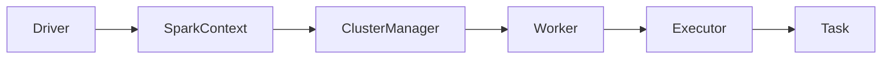
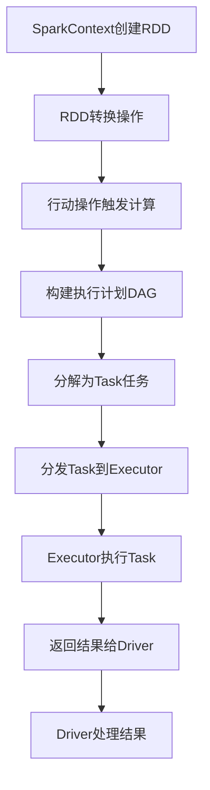

# Spark原理与代码实例讲解

## 1.背景介绍

Apache Spark是一种快速、通用的大数据处理引擎,可用于批处理、流处理、机器学习和图计算等多种应用场景。它最初是在加州大学伯克利分校的AMPLab中开发的,旨在克服Hadoop MapReduce框架中的一些缺陷,如数据处理效率低下、对迭代计算支持不足等。

Spark基于内存计算模型,能够高效地利用集群中的内存资源,从而大幅提高数据处理速度。与MapReduce框架相比,Spark在处理迭代计算和交互式查询时表现出色,尤其适合机器学习和流式计算等需要多次迭代的应用场景。

Spark采用了RDD(Resilient Distributed Dataset,弹性分布式数据集)的数据抽象,使得数据可以在集群中高效地进行分区、缓存和并行计算。RDD不仅支持Map和Reduce等常见操作,还提供了更丰富的数据转换和操作API,极大地简化了数据处理流程。

此外,Spark还具有良好的容错性和可伸缩性。它可以通过自动恢复丢失的分区数据,从而保证计算的可靠性。同时,Spark能够根据集群资源的变化动态调整计算资源的分配,实现高效的资源利用和线性扩展。

总的来说,Spark凭借其高效的内存计算模型、丰富的数据处理API、良好的容错性和可伸缩性,已成为大数据处理领域的主流技术之一,广泛应用于各种数据密集型应用场景。

## 2.核心概念与联系

### 2.1 RDD(Resilient Distributed Dataset)

RDD是Spark最核心的数据抽象,表示一个不可变、分区的记录集合。RDD可以从HDFS、HBase等数据源创建,也可以通过现有RDD进行转换得到新的RDD。

RDD有以下主要特点:

- **不可变性(Immutable)**: RDD本身是不可变的,对RDD的任何修改都会生成一个新的RDD。这种设计使得RDD天然支持并行计算,也便于实现容错机制。

- **分区(Partitioned)**: RDD中的数据会被划分为多个分区,分布在集群的不同节点上,实现数据的并行处理。

- **有血统(Lineage)**: RDD通过记录其创建过程(血统),可以在需要时重新计算丢失的分区数据,从而实现容错。

- **延迟计算(Lazy Evaluation)**: RDD的转换操作是延迟计算的,只有遇到行动操作时,才会触发实际的计算过程。这种设计可以减少不必要的计算,提高效率。

### 2.2 RDD操作

RDD提供了丰富的转换操作(Transformation)和行动操作(Action)。

- **转换操作**:对RDD进行无副作用的转换,生成新的RDD,如map、filter、flatMap、union等。

- **行动操作**:触发RDD的计算,并返回结果或将结果写入外部数据源,如reduce、collect、count等。

转换操作是延迟计算的,只有遇到行动操作时,Spark才会根据RDD的血统信息构建出执行计划(DAG),并按照计划进行实际计算。

### 2.3 Spark运行架构

Spark采用了主从式的集群架构,包括以下几个核心组件:

- **Driver**:运行Application的主入口,负责整个应用的执行过程。

- **ClusterManager**:集群资源管理器,如YARN、Mesos等,负责资源的分配和调度。

- **Worker**:工作节点,运行具体的Task任务,并将结果返回给Driver。

- **Executor**:运行在Worker节点上的进程,负责执行Task任务,管理计算资源。

- **SparkContext**:Spark应用的入口,用于创建RDD并设置应用的运行配置。



## 3.核心算法原理具体操作步骤

### 3.1 RDD的创建

RDD可以通过两种方式创建:

1. **从外部数据源创建**

   Spark支持从HDFS、HBase、Cassandra等外部存储系统创建RDD。以从HDFS创建RDD为例:

   ```scala
   val textFile = sc.textFile("hdfs://path/to/file")
   ```

2. **从驱动程序中的集合创建**

   也可以从Scala或Java的集合(Array、List等)创建RDD:

   ```scala
   val numbers = sc.parallelize(List(1, 2, 3, 4, 5))
   ```

### 3.2 RDD转换操作

RDD提供了丰富的转换操作,用于对数据进行各种转换和处理。以下是一些常见的转换操作:

- **map**:对RDD中的每个元素应用指定的函数,生成新的RDD。

  ```scala
  val squares = numbers.map(x => x * x)
  ```

- **filter**:返回RDD中满足指定条件的元素,生成新的RDD。

  ```scala
  val evenNumbers = numbers.filter(x => x % 2 == 0)
  ```

- **flatMap**:对RDD中的每个元素应用指定的函数,并将结果"扁平化"为单个RDD。

  ```scala
  val words = lines.flatMap(line => line.split(" "))
  ```

- **union**:将两个RDD合并为一个新的RDD。

  ```scala
  val combined = rdd1.union(rdd2)
  ```

- **join**:根据键值对的键进行连接操作,生成新的RDD。

  ```scala
  val joined = rdd1.join(rdd2)
  ```

### 3.3 RDD行动操作

行动操作会触发RDD的实际计算,并返回结果或将结果写入外部数据源。以下是一些常见的行动操作:

- **reduce**:使用指定的函数对RDD中的元素进行聚合,返回最终的结果。

  ```scala
  val sum = numbers.reduce((x, y) => x + y)
  ```

- **collect**:将RDD中的所有元素收集到驱动程序中,形成一个数组。

  ```scala
  val result = numbers.collect()
  ```

- **count**:返回RDD中元素的个数。

  ```scala
  val count = numbers.count()
  ```

- **saveAsTextFile**:将RDD中的元素以文本文件的形式保存到HDFS或其他存储系统中。

  ```scala
  numbers.saveAsTextFile("hdfs://path/to/output")
  ```

### 3.4 Spark执行流程

Spark应用的执行流程如下:

1. 通过SparkContext创建RDD。

2. 对RDD执行一系列转换操作,生成新的RDD。

3. 遇到行动操作时,Spark根据RDD的血统信息构建执行计划(DAG)。

4. 将执行计划分解为多个Task任务,并分发到Executor进程中执行。

5. Executor执行Task任务,并将结果返回给Driver。

6. Driver收集并处理Executor返回的结果,或将结果写入外部数据源。



## 4.数学模型和公式详细讲解举例说明

在Spark中,一些核心算法和模型都涉及到数学公式和理论。以下是一些常见的数学模型和公式:

### 4.1 RDD分区策略

为了实现数据的并行处理,Spark会将RDD划分为多个分区(Partition)。分区的数量对性能有重大影响,分区过少会导致并行度不足,分区过多又会增加管理开销。

Spark采用以下公式来确定RDD的分区数量:

$$
N = \max(\min(2, \frac{totalSize}{blockSize}), \sqrt{numCores})
$$

其中:

- $N$表示分区数量
- $totalSize$表示RDD的总大小(字节)
- $blockSize$表示HDFS块大小(默认128MB)
- $numCores$表示集群中的总核心数

这个公式综合考虑了数据大小、块大小和集群资源,旨在确定一个合理的分区数量,以实现良好的并行度和性能。

### 4.2 PageRank算法

PageRank是一种著名的链接分析算法,用于计算网页的重要性排名。它的核心思想是,一个网页的重要性取决于指向它的其他网页的重要性和链接数量。

PageRank算法的数学模型如下:

$$
PR(p_i) = \frac{1-d}{N} + d \sum_{p_j \in M(p_i)} \frac{PR(p_j)}{L(p_j)}
$$

其中:

- $PR(p_i)$表示网页$p_i$的PageRank值
- $N$表示网络中所有网页的总数
- $M(p_i)$表示链接到网页$p_i$的所有网页集合
- $L(p_j)$表示网页$p_j$的出链接数量
- $d$是一个阻尼系数,通常取值0.85

PageRank算法可以使用迭代方法来计算,每次迭代都会更新所有网页的PageRank值,直到收敛为止。

在Spark中,可以使用GraphX库来实现PageRank算法,并利用RDD的并行计算能力加速计算过程。

### 4.3 逻辑回归模型

逻辑回归是一种广泛应用于分类问题的机器学习模型。它的目标是根据输入特征$X$预测目标变量$Y$属于某个类别的概率。

对于二元逻辑回归模型,其数学公式如下:

$$
P(Y=1|X) = \frac{1}{1 + e^{-(\beta_0 + \beta_1X_1 + \beta_2X_2 + \cdots + \beta_nX_n)}}
$$

其中:

- $P(Y=1|X)$表示给定特征$X$时,目标变量$Y$取值为1的概率
- $\beta_0$是常数项(偏置项)
- $\beta_1, \beta_2, \cdots, \beta_n$是特征对应的系数(权重)
- $X_1, X_2, \cdots, X_n$是输入特征

逻辑回归模型的训练过程是通过最大似然估计或梯度下降等优化算法,来求解最优的参数$\beta$,使得模型在训练数据上的预测准确率最高。

在Spark中,可以使用MLlib库中的LogisticRegression算法来训练和应用逻辑回归模型。

## 5.项目实践:代码实例和详细解释说明

### 5.1 WordCount示例

WordCount是一个经典的大数据处理示例,用于统计文本文件中每个单词出现的次数。以下是使用Spark实现WordCount的代码示例:

```scala
import org.apache.spark.SparkContext
import org.apache.spark.SparkConf

object WordCount {
  def main(args: Array[String]): Unit = {
    // 创建SparkConf对象
    val conf = new SparkConf().setAppName("WordCount")
    // 创建SparkContext对象
    val sc = new SparkContext(conf)

    // 从HDFS读取文本文件
    val textFile = sc.textFile("hdfs://path/to/file.txt")

    // 将文本文件拆分为单词
    val words = textFile.flatMap(line => line.split(" "))

    // 将单词映射为(word, 1)的键值对
    val pairs = words.map(word => (word, 1))

    // 按照键(word)进行聚合,统计每个单词出现的次数
    val counts = pairs.reduceByKey((a, b) => a + b)

    // 收集结果并打印
    val output = counts.collect()
    output.foreach(println)

    // 停止SparkContext
    sc.stop()
  }
}
```

代码解释:

1. 创建SparkConf和SparkContext对象,用于配置和初始化Spark应用。

2. 使用`sc.textFile()`从HDFS读取文本文件,生成一个RDD。

3. 对RDD执行`flatMap()`操作,将每一行文本拆分为单词,生成一个新的RDD。

4. 使用`map()`操作,将每个单词映射为一个(word, 1)的键值对,生成一个新的RDD。

5. 使用`reduceByKey()`操作,按照键(word)进行聚合,统计每个单词出现的次数,生成一个新的RDD。

6. 使用`collect()`行动操作,将结果收集到Driver端,并打印输出。

7. 最后调用`sc.stop()`停止SparkContext。

### 5.