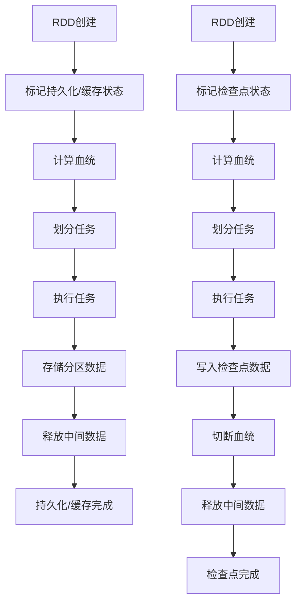

# 《Spark数据持久化与缓存》

## 1. 背景介绍

在大数据处理领域，Apache Spark已经成为事实上的标准。作为一种快速、通用的计算引擎,Spark支持多种编程语言,并提供了丰富的高级API,使得开发人员能够轻松地构建可扩展的数据密集型应用程序。然而,对于迭代式算法和交互式数据分析等场景,频繁地从磁盘或其他存储系统重新加载数据会导致性能低下。为了解决这个问题,Spark引入了数据持久化和缓存机制,可以显著提高这类应用程序的性能。

### 1.1 Spark数据持久化和缓存的必要性

在传统的MapReduce模型中,每个作业的输入数据都需要从磁盘或其他存储系统读取,中间计算结果也需要写回磁盘,以供后续作业使用。这种"一次写入,多次读取"的模式会导致大量的I/O开销,降低整体性能。

相比之下,Spark采用了基于内存的计算模型,中间结果可以保留在内存中,供后续操作直接使用,从而避免了不必要的I/O开销。但是,如果数据集比较大,无法完全放入内存,或者需要在多个作业之间共享数据,仍然需要将数据写入磁盘或其他存储系统。

为了解决这个问题,Spark提供了数据持久化和缓存机制,允许开发人员选择性地将中间结果保存到内存或磁盘中,以供后续操作重用。这种机制不仅可以提高迭代式算法和交互式数据分析的性能,还能够支持有向无环图(DAG)执行模型,实现更高效的任务调度和容错机制。

### 1.2 Spark数据持久化和缓存的优势

相比于传统的MapReduce模型,Spark数据持久化和缓存机制具有以下几个主要优势:

1. **提高性能**: 通过将中间结果保存在内存或磁盘中,可以避免重复计算,从而显著提高迭代式算法和交互式数据分析的性能。

2. **支持有向无环图(DAG)执行模型**: Spark基于RDD(Resilient Distributed Dataset)的有向无环图执行模型,数据持久化和缓存机制为这种模型提供了关键支持,使得Spark能够高效地调度任务和实现容错机制。

3. **节省资源**: 由于中间结果可以重用,因此可以减少不必要的计算和I/O开销,从而节省计算资源和存储资源。

4. **简化编程模型**: 开发人员无需关心底层的数据存储和管理细节,只需专注于算法逻辑即可,从而简化了编程模型。

5. **支持多种存储级别**: Spark提供了多种存储级别选项,包括内存存储、磁盘存储、序列化和压缩等,开发人员可以根据实际需求进行灵活配置。

总的来说,Spark数据持久化和缓存机制为大数据处理应用程序带来了显著的性能提升,同时也简化了编程模型,提高了资源利用率。

## 2. 核心概念与联系

为了充分理解Spark数据持久化和缓存机制,我们需要先了解几个核心概念及其相互关系。

### 2.1 RDD (Resilient Distributed Dataset)

RDD是Spark中最基本的数据抽象,表示一个不可变、分区的记录集合。RDD可以从文件系统、HDFS、HBase或通过并行化驱动程序中的集合来创建。RDD支持两种操作:转换(transformation)和动作(action)。转换操作会创建一个新的RDD,而动作操作会对RDD进行计算并返回结果。

RDD是Spark数据持久化和缓存机制的基础,持久化和缓存的对象实际上就是RDD。

### 2.2 持久化(Persistence)

持久化是指将RDD的数据保存到内存或磁盘中,以便后续操作可以重用。Spark提供了多种持久化级别,包括:

- `MEMORY_ONLY`: 将RDD的数据保存在JVM的内存中,如果内存不足,部分分区将不会被缓存。
- `MEMORY_AND_DISK`: 将RDD的数据保存在JVM的内存和磁盘中,如果内存不足,将使用磁盘存储。
- `DISK_ONLY`: 将RDD的数据保存在磁盘中。
- `MEMORY_ONLY_SER`和`MEMORY_AND_DISK_SER`: 与前两个级别类似,但会对RDD的数据进行序列化,以减少内存占用。
- `DISK_ONLY_SER`: 与`DISK_ONLY`类似,但会对RDD的数据进行序列化。

持久化操作是懒加载的,也就是说,RDD的数据只有在被计算时才会真正被持久化。

### 2.3 缓存(Caching)

缓存是指将RDD的数据保存在内存中,以便后续操作可以快速访问。缓存实际上是持久化级别为`MEMORY_ONLY`的一种特例。

缓存操作也是懒加载的,RDD的数据只有在被计算时才会真正被缓存。

### 2.4 检查点(Checkpointing)

检查点是指将RDD的数据保存到可靠的存储系统(如HDFS)中,以便在发生故障时可以恢复计算。检查点操作会切断RDD的依赖关系,从而减少了恢复时的开销。

检查点操作是严格的,也就是说,RDD的数据会立即被写入存储系统。

### 2.5 核心概念之间的关系

持久化、缓存和检查点都是为了提高Spark应用程序的性能和容错能力,但它们之间存在一些区别和联系:

- 持久化是一个更广泛的概念,包括了缓存和检查点。
- 缓存是持久化级别为`MEMORY_ONLY`的一种特例,专门用于将RDD的数据保存在内存中。
- 检查点是一种特殊的持久化操作,用于将RDD的数据保存到可靠的存储系统中,以便在发生故障时可以恢复计算。
- 持久化和缓存操作都是懒加载的,而检查点操作是严格的。
- 持久化和缓存可以提高迭代式算法和交互式数据分析的性能,而检查点主要用于容错和恢复。

总的来说,这三个概念相互关联、相互补充,共同构建了Spark数据持久化和缓存机制的核心。

## 3. 核心算法原理具体操作步骤

### 3.1 RDD的血统(Lineage)

在了解Spark数据持久化和缓存机制的核心算法原理之前,我们需要先了解RDD的血统(Lineage)概念。

RDD的血统是指RDD的创建过程,包括了它是如何从其他RDD或数据源衍生而来的。Spark会自动记录RDD的血统,以便在发生故障时可以重新计算丢失的RDD分区。

例如,假设我们从HDFS中读取一个文本文件,并对其进行过滤和映射操作,形成一个新的RDD:

```scala
val textFile = sc.textFile("hdfs://...")
val filteredRDD = textFile.filter(line => line.contains("hello"))
val mappedRDD = filteredRDD.map(line => (line.split(" ")(0), 1))
```

在这个例子中,`mappedRDD`的血统包括了从HDFS读取文件、过滤操作和映射操作。如果`mappedRDD`的某个分区丢失,Spark可以根据它的血统重新计算该分区。

### 3.2 RDD的持久化和缓存算法

当我们调用`persist`或`cache`方法时,Spark会执行以下步骤来持久化或缓存RDD的数据:

1. **标记RDD为持久化或缓存**: Spark会在RDD的元数据中标记它为持久化或缓存状态,并记录所选择的持久化级别。

2. **计算RDD的血统**: Spark会根据RDD的转换操作计算出它的血统,以便在发生故障时可以重新计算丢失的分区。

3. **划分任务**: Spark会将RDD划分为多个任务,每个任务负责计算一部分分区。

4. **执行任务**: Spark会按照血统依次执行每个任务,计算出RDD的分区数据。

5. **存储分区数据**: 根据所选择的持久化级别,Spark会将计算出的分区数据存储在内存、磁盘或其他存储系统中。

6. **释放中间数据**: 为了节省内存,Spark会释放计算过程中产生的中间数据。

需要注意的是,持久化和缓存操作都是懒加载的,也就是说,RDD的数据只有在被计算时才会真正被持久化或缓存。这种设计可以避免不必要的计算和存储开销。

### 3.3 RDD的检查点算法

当我们调用`checkpoint`方法时,Spark会执行以下步骤来为RDD创建检查点:

1. **标记RDD为检查点状态**: Spark会在RDD的元数据中标记它为检查点状态。

2. **计算RDD的血统**: Spark会根据RDD的转换操作计算出它的血统。

3. **划分任务**: Spark会将RDD划分为多个任务,每个任务负责计算一部分分区。

4. **执行任务**: Spark会按照血统依次执行每个任务,计算出RDD的分区数据。

5. **写入检查点数据**: Spark会将计算出的分区数据写入指定的可靠存储系统(如HDFS)中,作为检查点数据。

6. **切断血统**: Spark会切断RDD与其父RDD之间的血统依赖关系,从而减少了恢复时的开销。

7. **释放中间数据**: 为了节省内存,Spark会释放计算过程中产生的中间数据。

与持久化和缓存操作不同,检查点操作是严格的,也就是说,RDD的数据会立即被写入存储系统,而不是等到被计算时才进行。这种设计可以提高容错能力,但也会增加一些开销。

### 3.4 Mermaid流程图

为了更好地理解Spark数据持久化和缓存机制的核心算法原理,我们使用Mermaid流程图进行可视化表示:



在这个流程图中,我们可以清晰地看到持久化/缓存和检查点算法的主要步骤及其差异。持久化/缓存算法是懒加载的,只有在RDD被计算时才会真正执行,而检查点算法是严格的,会立即将RDD的数据写入存储系统。

## 4. 数学模型和公式详细讲解举例说明

在Spark数据持久化和缓存机制中,并没有直接涉及复杂的数学模型和公式。不过,为了更好地理解内存管理和数据分区等概念,我们可以借助一些简单的数学模型和公式进行说明。

### 4.1 内存管理模型

Spark采用了统一的内存管理模型,用于管理各种类型的内存存储,包括执行内存、存储内存和元数据内存。这个模型可以用以下公式表示:

$$
M_{\text{total}} = M_{\text{execution}} + M_{\text{storage}} + M_{\text{metadata}}
$$

其中:

- $M_{\text{total}}$ 表示Spark应用程序可用的总内存大小。
- $M_{\text{execution}}$ 表示用于执行计算任务的内存大小。
- $M_{\text{storage}}$ 表示用于存储RDD数据和广播变量的内存大小。
- $M_{\text{metadata}}$ 表示用于存储RDD元数据和任务元数据的内存大小。

在实际应用中,我们可以根据具体需求调整这些内存区域的大小,以达到最佳的性能和资源利用率。

### 4.2 数据分区模型

Spark将RDD的数据划分