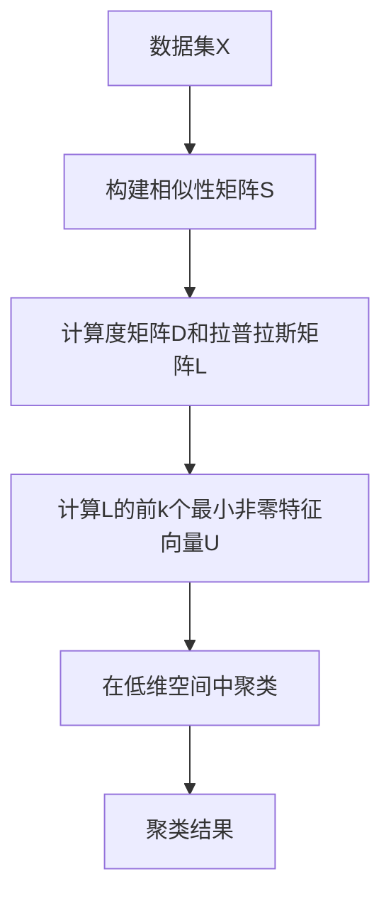

# SpectralClusteringforEnvironmentalImpactAssessment

## 1.背景介绍

随着环境问题日益严峻,环境影响评估(Environmental Impact Assessment, EIA)已成为规划和决策过程中不可或缺的一部分。EIA旨在识别、预测、评估和缓解项目活动对环境的潜在影响。传统的EIA方法通常依赖专家判断和定性分析,这可能会受到主观性和不确定性的影响。近年来,数据驱动的方法越来越受到重视,其中谱聚类(Spectral Clustering)作为一种有效的无监督学习技术,在EIA中的应用前景广阔。

## 2.核心概念与联系

### 2.1 环境影响评估(EIA)

环境影响评估是一种系统的过程,用于评估拟议项目或活动对环境的潜在影响。它包括以下关键步骤:

1. 界定研究范围和基线条件
2. 识别潜在影响
3. 预测和评估影响的重要性
4. 制定缓解措施
5. 制定环境管理和监测计划

### 2.2 谱聚类(Spectral Clustering)

谱聚类是一种基于图论的聚类算法,它利用数据的拉普拉斯矩阵的特征向量来对数据进行聚类。与传统的聚类算法(如K-Means)相比,谱聚类能够更好地处理非凸形状的数据集,并且对初始条件不太敏感。

谱聚类的基本思想是将数据表示为一个加权无向图,其中节点表示数据点,边的权重表示数据点之间的相似性。然后,通过计算拉普拉斯矩阵的特征值和特征向量,将数据点映射到一个低维空间,在该空间中,相似的数据点会聚集在一起。最后,在低维空间中使用传统的聚类算法(如K-Means)对数据进行聚类。

### 2.3 谱聚类在EIA中的应用

在EIA中,谱聚类可以用于以下几个方面:

1. **环境数据聚类**: 对环境数据(如空气质量、水质、噪音等)进行聚类,识别具有相似特征的区域或时间段,有助于发现潜在的环境问题和影响模式。

2. **影响评估**: 通过对环境影响数据进行聚类,可以识别出具有相似影响特征的项目或活动,从而为制定缓解措施和管理策略提供依据。

3. **敏感区域识别**: 根据生态系统、物种分布等数据,利用谱聚类识别出环境敏感区域,为项目选址和路线规划提供参考。

4. **公众参与**: 通过对公众意见和关切进行聚类分析,可以更好地了解不同利益相关方的需求和期望,从而优化决策过程。

## 3.核心算法原理具体操作步骤

谱聚类算法的具体步骤如下:

1. **构建相似性矩阵**

给定一个数据集$X = \{x_1, x_2, \ldots, x_n\}$,首先需要构建一个$n \times n$的相似性矩阵$S$,其中$S_{ij}$表示数据点$x_i$和$x_j$之间的相似性。常用的相似性度量包括高斯相似核、$\epsilon$-邻域相似核等。

2. **计算度矩阵和拉普拉斯矩阵**

度矩阵$D$是一个对角矩阵,其中$D_{ii} = \sum_{j} S_{ij}$。

拉普拉斯矩阵$L$定义为$L = D - S$。

3. **计算拉普拉斯矩阵的特征值和特征向量**

计算拉普拉斯矩阵$L$的前$k$个最小非零特征值对应的特征向量$u_1, u_2, \ldots, u_k$,构成矩阵$U = [u_1, u_2, \ldots, u_k] \in \mathbb{R}^{n \times k}$。

4. **在低维空间中聚类**

对矩阵$U$的行向量进行聚类,即将原始数据$X$映射到由$U$的行向量构成的$k$维空间中,然后在该空间中使用传统的聚类算法(如K-Means)进行聚类。

5. **分配原始数据的聚类标签**

根据第4步的聚类结果,为原始数据$X$中的每个点分配相应的聚类标签。

以下是谱聚类算法的Mermaid流程图:



## 4.数学模型和公式详细讲解举例说明

### 4.1 相似性矩阵

相似性矩阵$S$是一个$n \times n$的对称矩阵,用于描述数据点之间的相似性。常用的相似性度量包括:

1. **高斯相似核**

$$S_{ij} = \exp\left(-\frac{\|x_i - x_j\|^2}{2\sigma^2}\right)$$

其中$\sigma$是带宽参数,控制相似性的衰减速度。

2. **$\epsilon$-邻域相似核**

$$S_{ij} = \begin{cases}
1, & \text{if } \|x_i - x_j\| < \epsilon \\
0, & \text{otherwise}
\end{cases}$$

其中$\epsilon$是邻域半径参数。

### 4.2 拉普拉斯矩阵

拉普拉斯矩阵$L$是一个半正定矩阵,定义为:

$$L = D - S$$

其中$D$是度矩阵,是一个对角矩阵,其对角元素为:

$$D_{ii} = \sum_{j} S_{ij}$$

拉普拉斯矩阵的特征值和特征向量反映了数据的聚类结构。具体来说,对于一个理想的聚类,拉普拉斯矩阵应该具有$k$个0特征值(其中$k$是聚类数),对应的特征向量是簇指示向量。

### 4.3 谱聚类目标函数

谱聚类算法可以被看作是在求解以下目标函数的最小值:

$$\min_{U^TU=I} \operatorname{tr}(U^TLU)$$

其中$U \in \mathbb{R}^{n \times k}$是由拉普拉斯矩阵$L$的前$k$个最小非零特征向量构成的矩阵。

这个目标函数可以被理解为:在保持聚类内部相似性的同时,最小化聚类之间的相似性。

### 4.4 示例:使用谱聚类对空气质量数据进行聚类

假设我们有一个包含多个监测站点的空气质量数据集,每个监测站点有多个指标(如PM2.5、PM10、SO2等)。我们希望根据这些数据,识别出具有相似空气质量模式的区域,以便制定针对性的治理措施。

1. **构建相似性矩阵**

我们可以使用高斯相似核来构建监测站点之间的相似性矩阵$S$:

$$S_{ij} = \exp\left(-\frac{\|x_i - x_j\|^2}{2\sigma^2}\right)$$

其中$x_i$和$x_j$分别表示第$i$个和第$j$个监测站点的空气质量数据向量,$\sigma$是带宽参数。

2. **计算拉普拉斯矩阵和特征向量**

根据相似性矩阵$S$,计算度矩阵$D$和拉普拉斯矩阵$L$,然后求解$L$的前$k$个最小非零特征向量$U$。

3. **在低维空间中聚类**

将监测站点的数据映射到由$U$构成的$k$维空间中,然后使用K-Means算法对这些低维数据进行聚类。

4. **分析聚类结果**

根据聚类结果,我们可以识别出具有相似空气质量模式的区域,并分析每个聚类的特征和潜在原因。这为制定区域性的空气污染治理策略提供了依据。

## 5.项目实践:代码实例和详细解释说明

以下是使用Python中的scikit-learn库实现谱聚类的示例代码:

```python
import numpy as np
from sklearn.cluster import SpectralClustering
from sklearn.datasets import make_blobs

# 生成示例数据
X, y = make_blobs(n_samples=1000, n_features=2, centers=5, cluster_std=0.6, random_state=0)

# 构建相似性矩阵
similarity = np.exp(-np.square(np.sqrt(((X[:, None, :] - X) ** 2).sum(-1))) / (2 * (0.5 ** 2)))

# 执行谱聚类
n_clusters = 5
spectral_clustering = SpectralClustering(n_clusters=n_clusters, affinity='precomputed').fit(similarity)
labels = spectral_clustering.labels_

# 输出结果
print(f"聚类数量: {len(np.unique(labels))}")
print(f"每个聚类的样本数量: {np.bincount(labels)}")
```

代码解释:

1. 首先,我们使用`make_blobs`函数生成一个包含5个聚类的示例数据集`X`和真实标签`y`。

2. 然后,我们构建一个基于高斯相似核的相似性矩阵`similarity`。这里我们使用了NumPy的向量化操作,以提高计算效率。

3. 接下来,我们创建一个`SpectralClustering`对象,并将相似性矩阵`similarity`作为`affinity`参数传递给它。`n_clusters`参数指定了期望的聚类数量。

4. 调用`fit`方法执行谱聚类算法,并获取聚类标签`labels`。

5. 最后,我们输出聚类数量和每个聚类的样本数量。

需要注意的是,在实际应用中,我们通常需要对数据进行预处理(如标准化、缺失值处理等),并根据具体问题选择合适的相似性度量和参数。此外,还需要评估聚类结果的质量,并根据需要调整参数或算法。

## 6.实际应用场景

谱聚类在环境影响评估中有广泛的应用前景,以下是一些具体的应用场景:

1. **空气质量评估**:通过对空气质量监测数据进行谱聚类,可以识别出具有相似空气污染模式的区域,为制定区域性的治理措施提供依据。

2. **水质评估**:对水质监测数据进行谱聚类,可以发现具有相似水质特征的水体,有助于识别污染源和制定水环境保护策略。

3. **噪音评估**:利用谱聚类对噪音监测数据进行分析,可以识别出噪音污染严重的区域,为噪音控制和城市规划提供参考。

4. **生态系统评估**:基于生物多样性数据和环境因子,使用谱聚类可以划分出具有相似生态特征的区域,为保护区选址和管理提供支持。

5. **土地利用评估**:通过对土地利用数据进行谱聚类,可以发现具有相似土地利用模式的区域,为土地规划和管理提供决策依据。

6. **公众参与**:对公众意见和关切进行聚类分析,有助于识别不同利益相关方的需求,优化决策过程。

7. **环境风险评估**:利用谱聚类对环境风险数据进行分析,可以发现高风险区域,为风险管控和应急预案制定提供参考。

总的来说,谱聚类作为一种数据驱动的无监督学习技术,能够帮助我们从复杂的环境数据中发现隐藏的模式和结构,为环境影响评估和决策提供有价值的见解。

## 7.工具和资源推荐

在实际应用谱聚类算法时,我们可以利用一些现有的工具和资源:

1. **Python库**:
   - `scikit-learn`: 这个流行的机器学习库提供了`SpectralClustering`类,可以方便地实现谱聚类算法。
   - `scipy`: 这个科学计算库提供了一些用于计算拉普拉斯矩阵特征值和特征向量的函数。
   - `networkx`: 这个图论和复杂网络库可以用于构建和操作相似性图。

2.