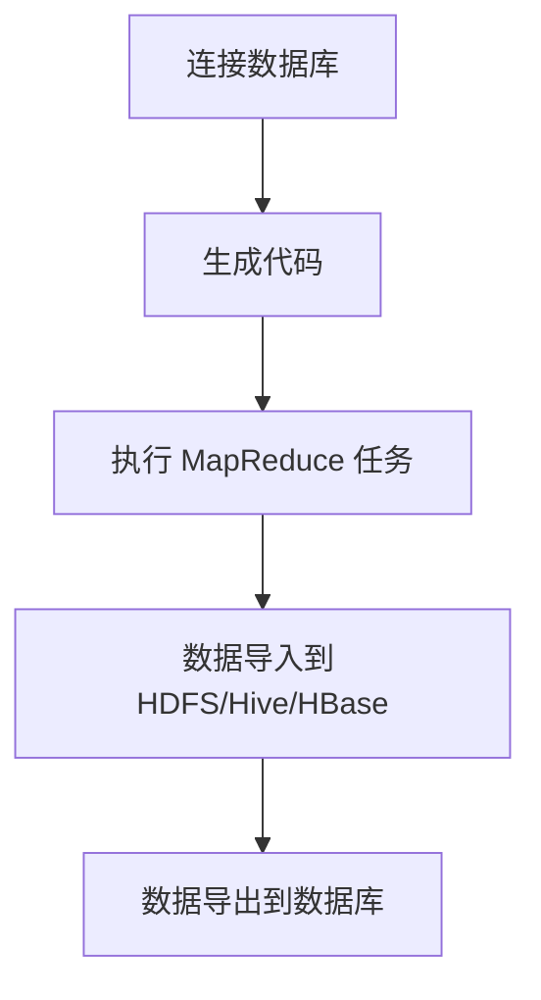

# Sqoop导入导出原理与代码实例讲解

## 1.背景介绍

Apache Sqoop 是一个用于在 Hadoop 和关系型数据库之间高效传输数据的工具。它的名字来源于 "SQL-to-Hadoop" 的缩写。Sqoop 主要用于将数据从关系型数据库（如 MySQL、PostgreSQL、Oracle 等）导入到 Hadoop 的 HDFS、Hive 或 HBase 中，或者将数据从 Hadoop 导出到关系型数据库中。Sqoop 的出现解决了大数据处理中的数据传输瓶颈问题，使得数据在不同存储系统之间的迁移变得更加高效和便捷。

## 2.核心概念与联系

### 2.1 Sqoop 的基本架构

Sqoop 的架构主要包括以下几个核心组件：

- **Connector**：用于连接不同类型的数据库。Sqoop 提供了多种数据库连接器，支持主流的关系型数据库。
- **Manager**：负责管理数据库连接和数据传输的具体实现。
- **Job**：Sqoop 的数据传输任务。每个 Job 包含了数据源、数据目标、数据传输方式等信息。
- **Mapper**：在数据导入导出过程中，Sqoop 使用 MapReduce 框架来并行处理数据。Mapper 负责将数据从数据库中读取并写入到 HDFS 或者从 HDFS 读取并写入到数据库。

### 2.2 数据导入与导出

- **导入（Import）**：将关系型数据库中的数据导入到 Hadoop 的 HDFS、Hive 或 HBase 中。
- **导出（Export）**：将 Hadoop 的 HDFS、Hive 或 HBase 中的数据导出到关系型数据库中。

### 2.3 Sqoop 与其他大数据工具的联系

Sqoop 通常与其他大数据工具（如 Hadoop、Hive、HBase、Pig 等）结合使用，以实现数据的高效处理和分析。它在整个大数据生态系统中扮演着数据传输桥梁的角色。

## 3.核心算法原理具体操作步骤

### 3.1 数据导入的操作步骤

1. **连接数据库**：使用 Sqoop 提供的连接器连接到目标数据库。
2. **生成代码**：Sqoop 自动生成用于数据传输的 Java 类。
3. **执行 MapReduce 任务**：Sqoop 使用 MapReduce 框架并行处理数据，将数据从数据库中读取并写入到 HDFS、Hive 或 HBase 中。

### 3.2 数据导出的操作步骤

1. **读取 HDFS 数据**：Sqoop 从 HDFS 中读取数据。
2. **执行 MapReduce 任务**：Sqoop 使用 MapReduce 框架并行处理数据，将数据写入到目标数据库中。

以下是 Sqoop 数据导入导出的流程图：



## 4.数学模型和公式详细讲解举例说明

在 Sqoop 的数据传输过程中，数据的分片和并行处理是其高效性的关键。Sqoop 使用 MapReduce 框架来实现数据的并行处理。以下是 Sqoop 数据传输的数学模型和公式：

### 4.1 数据分片

Sqoop 在导入数据时，会将数据分成多个分片（split），每个分片由一个 Mapper 处理。假设总数据量为 $N$，分片数为 $M$，则每个分片的数据量为：

$$
\text{Data per split} = \frac{N}{M}
$$

### 4.2 并行处理

Sqoop 使用 MapReduce 框架并行处理数据。假设每个 Mapper 的处理速度为 $S$，则总处理时间 $T$ 为：

$$
T = \frac{N}{M \times S}
$$

### 4.3 数据导入示例

假设我们有一个包含 1000 万条记录的数据库表，我们使用 10 个 Mapper 并行导入数据，每个 Mapper 的处理速度为 1000 条记录/秒，则总处理时间为：

$$
T = \frac{10000000}{10 \times 1000} = 100 \text{秒}
$$

## 5.项目实践：代码实例和详细解释说明

### 5.1 数据导入实例

以下是一个将 MySQL 数据库中的数据导入到 HDFS 的 Sqoop 命令示例：

```bash
sqoop import \
--connect jdbc:mysql://localhost:3306/mydatabase \
--username myuser \
--password mypassword \
--table mytable \
--target-dir /user/hadoop/mytable \
--num-mappers 4
```

#### 解释说明

- `--connect`：指定数据库连接 URL。
- `--username` 和 `--password`：指定数据库用户名和密码。
- `--table`：指定要导入的数据库表。
- `--target-dir`：指定导入数据的 HDFS 目标目录。
- `--num-mappers`：指定并行处理的 Mapper 数量。

### 5.2 数据导出实例

以下是一个将 HDFS 中的数据导出到 MySQL 数据库的 Sqoop 命令示例：

```bash
sqoop export \
--connect jdbc:mysql://localhost:3306/mydatabase \
--username myuser \
--password mypassword \
--table mytable \
--export-dir /user/hadoop/mytable \
--num-mappers 4
```

#### 解释说明

- `--connect`：指定数据库连接 URL。
- `--username` 和 `--password`：指定数据库用户名和密码。
- `--table`：指定要导出的数据库表。
- `--export-dir`：指定导出数据的 HDFS 目录。
- `--num-mappers`：指定并行处理的 Mapper 数量。

## 6.实际应用场景

### 6.1 数据仓库构建

Sqoop 常用于将关系型数据库中的数据导入到 Hadoop 数据仓库中，以便进行大规模数据分析。例如，将电商平台的交易数据从 MySQL 导入到 Hive 中，进行用户行为分析和销售预测。

### 6.2 数据备份与恢复

Sqoop 可以用于数据库的备份与恢复。通过将数据库中的数据导入到 HDFS 中进行备份，或者从 HDFS 中导出数据恢复到数据库中。

### 6.3 数据迁移

在企业数据迁移过程中，Sqoop 可以用于将数据从一个数据库迁移到另一个数据库。例如，将数据从 Oracle 数据库迁移到 MySQL 数据库。

## 7.工具和资源推荐

### 7.1 Sqoop 官方文档

Sqoop 的官方文档是学习和使用 Sqoop 的最佳资源，提供了详细的使用指南和示例。

### 7.2 Hadoop 官方文档

了解 Hadoop 的基本概念和使用方法，有助于更好地理解和使用 Sqoop。

### 7.3 数据库连接器

Sqoop 支持多种数据库连接器，推荐使用官方提供的连接器，以确保兼容性和稳定性。

## 8.总结：未来发展趋势与挑战

随着大数据技术的不断发展，数据传输的需求也在不断增加。Sqoop 作为一种高效的数据传输工具，在未来仍将扮演重要角色。然而，随着云计算和分布式数据库的普及，Sqoop 也面临着新的挑战。未来，Sqoop 需要进一步提升性能，支持更多的数据源和目标，并与云计算平台更好地集成。

## 9.附录：常见问题与解答

### 9.1 如何解决 Sqoop 导入数据时的性能问题？

- 增加 Mapper 数量：通过增加 Mapper 数量，可以提高数据导入的并行处理能力。
- 优化数据库查询：确保数据库查询的效率，避免全表扫描。
- 调整 Hadoop 集群配置：优化 Hadoop 集群的配置，提高数据处理性能。

### 9.2 Sqoop 是否支持增量导入？

是的，Sqoop 支持增量导入。可以使用 `--incremental` 参数指定增量导入的模式（append 或 lastmodified），并使用 `--check-column` 参数指定用于检查增量的列。

### 9.3 如何处理 Sqoop 导入导出过程中的数据类型转换问题？

Sqoop 会自动进行数据类型转换，但在某些情况下，可能需要手动指定数据类型映射。可以使用 `--map-column-java` 参数指定 Java 数据类型，使用 `--map-column-hive` 参数指定 Hive 数据类型。

---

作者：禅与计算机程序设计艺术 / Zen and the Art of Computer Programming