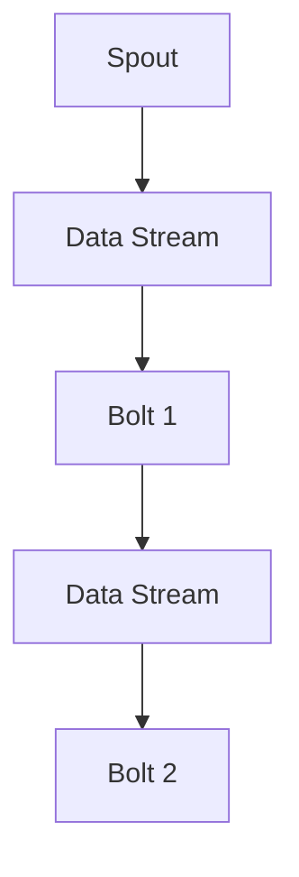

# Storm Spout原理与代码实例讲解

## 1.背景介绍

Apache Storm 是一个分布式实时计算系统，能够处理大量的数据流。它的核心组件之一是 Spout，负责从外部数据源读取数据并将其发送到 Storm 的处理管道中。Spout 的设计和实现直接影响到整个 Storm 拓扑的性能和可靠性。因此，深入理解 Spout 的原理和实现方法，对于构建高效的实时计算系统至关重要。

## 2.核心概念与联系

### 2.1 什么是 Spout

Spout 是 Storm 中的一个接口，负责从外部数据源读取数据并将其转换为 Storm 可以处理的元组（Tuple）。Spout 可以是可靠的（Reliable）或不可靠的（Unreliable），这取决于它是否支持消息的确认和重发机制。

### 2.2 Spout 与 Bolt 的关系

在 Storm 中，Spout 和 Bolt 是两种基本的处理单元。Spout 负责数据的输入，而 Bolt 负责数据的处理和输出。一个典型的 Storm 拓扑由多个 Spout 和 Bolt 组成，它们通过数据流（Stream）连接在一起。

### 2.3 数据流与元组

数据流是 Storm 中的数据传输通道，元组是数据流中的基本单位。每个元组由多个字段组成，字段可以是任何类型的数据。Spout 生成元组并将其发送到数据流中，Bolt 从数据流中读取元组并进行处理。

## 3.核心算法原理具体操作步骤

### 3.1 Spout 的生命周期

Spout 的生命周期包括以下几个阶段：

1. **初始化**：在这个阶段，Spout 的 `open` 方法被调用，用于初始化资源，例如连接外部数据源。
2. **数据读取**：在这个阶段，Spout 的 `nextTuple` 方法被调用，用于从外部数据源读取数据并生成元组。
3. **消息确认**：在这个阶段，Spout 的 `ack` 和 `fail` 方法被调用，用于处理消息的确认和重发。

### 3.2 Spout 的实现步骤

1. **实现 `ISpout` 接口**：所有的 Spout 都必须实现 `ISpout` 接口。
2. **定义元组模式**：确定元组的字段和数据类型。
3. **实现 `open` 方法**：初始化资源，例如连接外部数据源。
4. **实现 `nextTuple` 方法**：从外部数据源读取数据并生成元组。
5. **实现 `ack` 和 `fail` 方法**：处理消息的确认和重发。

### 3.3 数据流的处理

Spout 生成的元组通过数据流传输到 Bolt，Bolt 对元组进行处理并生成新的元组。这个过程可以通过 Mermaid 流程图来表示：



## 4.数学模型和公式详细讲解举例说明

### 4.1 数据流模型

Storm 中的数据流可以用有向无环图（DAG）来表示。每个节点表示一个处理单元（Spout 或 Bolt），每条边表示数据流的传输路径。假设有一个包含 $n$ 个节点的拓扑，节点之间的关系可以用邻接矩阵 $A$ 表示，其中 $A_{ij} = 1$ 表示节点 $i$ 到节点 $j$ 有一条边，$A_{ij} = 0$ 表示没有边。

### 4.2 元组处理时间

假设每个节点处理一个元组的时间为 $t_i$，则整个拓扑的处理时间可以表示为：

$$
T = \sum_{i=1}^{n} t_i
$$

### 4.3 数据流的吞吐量

数据流的吞吐量可以用每秒处理的元组数来表示。假设每个节点的吞吐量为 $\lambda_i$，则整个拓扑的吞吐量为：

$$
\Lambda = \min(\lambda_1, \lambda_2, \ldots, \lambda_n)
$$

### 4.4 可靠性模型

对于可靠的 Spout，每个元组都有一个唯一的消息 ID，用于跟踪消息的处理状态。假设消息的确认概率为 $p$，则消息的重发次数 $N$ 服从几何分布：

$$
P(N = k) = (1 - p)^{k-1} p
$$

## 5.项目实践：代码实例和详细解释说明

### 5.1 实现一个简单的 Spout

以下是一个简单的 Spout 实现示例，从一个固定的字符串列表中读取数据：

```java
import org.apache.storm.spout.SpoutOutputCollector;
import org.apache.storm.task.TopologyContext;
import org.apache.storm.topology.OutputFieldsDeclarer;
import org.apache.storm.topology.base.BaseRichSpout;
import org.apache.storm.tuple.Fields;
import org.apache.storm.tuple.Values;

import java.util.Map;

public class SimpleSpout extends BaseRichSpout {
    private SpoutOutputCollector collector;
    private String[] sentences = {
        "Storm is a distributed real-time computation system",
        "Spout is a source of streams in Storm",
        "Bolt processes the tuples in Storm"
    };
    private int index = 0;

    @Override
    public void open(Map conf, TopologyContext context, SpoutOutputCollector collector) {
        this.collector = collector;
    }

    @Override
    public void nextTuple() {
        if (index < sentences.length) {
            this.collector.emit(new Values(sentences[index]));
            index++;
        }
    }

    @Override
    public void declareOutputFields(OutputFieldsDeclarer declarer) {
        declarer.declare(new Fields("sentence"));
    }
}
```

### 5.2 代码解释

1. **open 方法**：初始化 SpoutOutputCollector，用于发送元组。
2. **nextTuple 方法**：从字符串列表中读取数据并生成元组。
3. **declareOutputFields 方法**：定义元组的字段。

### 5.3 运行示例

要运行这个 Spout，需要将其添加到一个 Storm 拓扑中，并提交拓扑：

```java
import org.apache.storm.Config;
import org.apache.storm.LocalCluster;
import org.apache.storm.topology.TopologyBuilder;

public class SimpleTopology {
    public static void main(String[] args) {
        TopologyBuilder builder = new TopologyBuilder();
        builder.setSpout("simple-spout", new SimpleSpout());

        Config conf = new Config();
        conf.setDebug(true);

        LocalCluster cluster = new LocalCluster();
        cluster.submitTopology("simple-topology", conf, builder.createTopology());

        try {
            Thread.sleep(10000);
        } catch (InterruptedException e) {
            e.printStackTrace();
        }

        cluster.shutdown();
    }
}
```

## 6.实际应用场景

### 6.1 实时数据处理

Spout 可以用于从各种实时数据源读取数据，例如消息队列（Kafka）、数据库（MySQL）、文件系统（HDFS）等。通过将 Spout 与 Bolt 结合，可以构建复杂的实时数据处理管道。

### 6.2 数据流分析

在数据流分析中，Spout 可以用于从传感器、日志文件、社交媒体等数据源读取数据，并将其发送到分析模块进行处理。例如，在物联网（IoT）应用中，Spout 可以从传感器读取数据，并将其发送到 Storm 拓扑进行实时分析和处理。

### 6.3 实时监控

Spout 可以用于从监控系统读取数据，并将其发送到 Storm 拓扑进行实时监控和报警。例如，在网络监控中，Spout 可以从网络设备读取数据，并将其发送到 Storm 拓扑进行实时分析和报警。

## 7.工具和资源推荐

### 7.1 开发工具

- **IntelliJ IDEA**：一款功能强大的 Java 开发工具，支持 Storm 开发。
- **Eclipse**：另一款流行的 Java 开发工具，支持 Storm 开发。

### 7.2 资源推荐

- **Apache Storm 官方文档**：详细介绍了 Storm 的各个组件和使用方法。
- **《Storm: Distributed Real-time Computation》**：一本深入介绍 Storm 的书籍，适合进阶学习。
- **GitHub**：上面有很多开源的 Storm 项目，可以参考和学习。

## 8.总结：未来发展趋势与挑战

### 8.1 未来发展趋势

随着大数据和实时计算需求的不断增长，Storm 作为一种高效的实时计算框架，将会在更多的应用场景中得到广泛应用。未来，Storm 可能会在以下几个方面有所发展：

1. **性能优化**：进一步优化 Storm 的性能，提高数据处理的吞吐量和延迟。
2. **易用性提升**：简化 Storm 的配置和使用，使其更加易于上手。
3. **集成更多数据源**：支持更多类型的数据源，例如 NoSQL 数据库、流媒体等。

### 8.2 面临的挑战

尽管 Storm 有很多优点，但在实际应用中也面临一些挑战：

1. **复杂性**：Storm 的配置和使用相对复杂，需要一定的学习成本。
2. **资源消耗**：Storm 的运行需要消耗大量的计算资源，可能会对系统性能产生影响。
3. **可靠性**：在高并发和大数据量的情况下，如何保证数据处理的可靠性和一致性，是一个需要解决的问题。

## 9.附录：常见问题与解答

### 9.1 如何处理 Spout 的消息丢失问题？

可以通过实现可靠的 Spout，使用消息确认和重发机制来处理消息丢失问题。具体方法是实现 `ack` 和 `fail` 方法，在消息处理成功时调用 `ack` 方法，在消息处理失败时调用 `fail` 方法。

### 9.2 如何提高 Spout 的性能？

可以通过以下几种方法提高 Spout 的性能：

1. **批量读取数据**：一次读取多个数据，减少 I/O 操作的开销。
2. **多线程处理**：使用多线程并行处理数据，提高数据处理的吞吐量。
3. **优化数据源**：选择高效的数据源，例如使用内存数据库或缓存系统。

### 9.3 如何调试 Spout？

可以通过以下几种方法调试 Spout：

1. **日志记录**：在 Spout 中添加日志记录，跟踪数据的读取和处理过程。
2. **单元测试**：编写单元测试，验证 Spout 的功能和性能。
3. **本地运行**：在本地环境中运行 Storm 拓扑，进行调试和测试。

---

作者：禅与计算机程序设计艺术 / Zen and the Art of Computer Programming