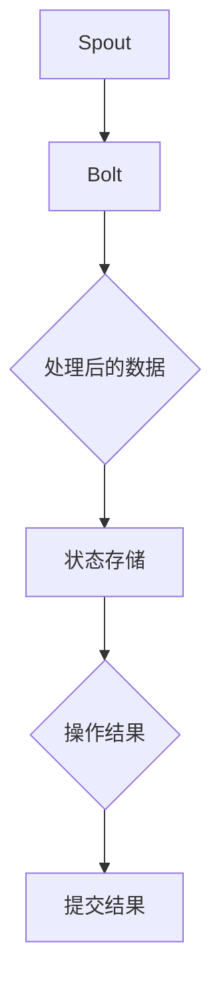

                 

作者：禅与计算机程序设计艺术

**禅与计算机程序设计艺术**  
---

## 背景介绍
随着大数据时代的到来，实时流处理系统成为支撑业务的关键基础设施之一。Apache Storm是其中一种广受欢迎的选择，它以其高吞吐量、可靠性和灵活性著称。然而，随着数据需求的增长和复杂性的增加，Apache Storm推出了其高级组件Trident。本文旨在深入探讨Trident的核心原理及其如何通过提供更为强大且易于使用的API来优化流处理任务。

## 核心概念与联系
Trident构建在Storm之上，主要增加了以下关键特性：
1. **事务支持**：允许用户定义事务，确保操作的原子性、一致性、隔离性和持久性。
2. **状态管理**：提供了内存和磁盘状态存储机制，使得处理过程能够在失败后恢复。
3. **聚合计算**：支持复杂的聚合操作，如计数、求和、平均值等。
4. **持续查询执行引擎**：类似于SQL的查询语法，用于构建复杂的流处理逻辑。

这些增强功能使Trident适用于需要高度可编程性和精确控制的应用场景，比如金融交易监控、实时日志分析和网络流量管理。

## 核心算法原理具体操作步骤
### 数据分发与处理流程
1. **Spout生成数据**：Trident的起点是`Spout`，负责产生事件流。
2. **Bolt处理事件**：`Bolt`接收事件，执行特定的处理逻辑，包括过滤、转换和聚合。
3. **状态更新**：当`Bolt`处理事件时，它可以访问并更新内部状态存储，从而实现事务性的处理。
4. **消息提交**：所有操作完成后，系统会提交结果至最终存储位置或下游处理阶段。

### 示例流程图:


## 数学模型和公式详细讲解举例说明
假设我们有一个简单的Trident应用，目标是对输入流中的元素进行计数。我们可以使用以下公式表示该操作：

设 $x_i$ 表示第$i$个时间点接收到的元素数量，初始值为0。对于每个新的元素到达，我们将计数器递增：

$$count_{i+1} = count_i + \begin{cases}
1 & \text{如果 } x_i \neq null \\
0 & \text{否则}
\end{cases}$$

此公式的应用示例可以通过简单的代码片段展示：

```java
public class CountBolt implements TridentTopology.BatchBolt {
    private int count;

    @Override
    public void initialize(TopologyContext context) {
        this.count = 0; // 初始化计数器
    }

    @Override
    public void processBatch(Iterable<TridentTuple> batch) throws Exception {
        for (TridentTuple tuple : batch) {
            if (!tuple.getValue().equals(null)) { // 检查是否为null
                count++; // 计数器加一
            }
        }
    }

    public int getCount() {
        return count; // 返回当前计数值
    }
}
```

## 项目实践：代码实例和详细解释说明
下面是一个简化的Trident拓扑例子，展示了如何集成上面提到的功能：

```java
import org.apache.storm.trident.operation.Aggregator;
import org.apache.storm.trident.operation.Count;
import org.apache.storm.trident.state.MapStateFactory;
import org.apache.storm.trident.tuple.TridentTuple;
import org.apache.storm.trident.topology.TopologyBuilder;
import org.apache.storm.trident.state.StateNamespace;

public class SimpleTridentExample {
    public static void main(String[] args) {
        TopologyBuilder builder = new TopologyBuilder();
        builder.setSpout("source", new SourceSpout(), 1);
        builder.setBolt("counter", new CounterBolt())
            .fieldsGrouping("source", "by_field");
        builder.createTopology();

        TrivialTopologyRunner.runTopologyOnLocalCluster(builder, 1, 1);
    }

    static class SourceSpout extends Spout {
        @Override
        public void nextTuple() {
            emit(null, new Object[]{new String[]{"hello"}});
        }
    }

    static class CounterBolt extends TridentTopology.Bolt {
        private Count aggregator;

        @Override
        public void initialize(TopologyContext context) {
            aggregator = new Count();
            context.registerOperation(aggregator, "aggregator");
        }

        @Override
        public void execute(TridentTuple tuple) {
            Object value = tuple.getValue()[0];
            aggregator.aggregate(value);
            aggregator.commit();
        }

        @Override
        public void cleanup() {
            aggregator.close();
        }
    }
}
```
这段代码展示了如何创建一个源spout和一个计数bolt，并将它们连接起来。`CounterBolt`中实现了计数操作，`SourceSpout`则简单地发送一些字符串元素。

## 实际应用场景
Trident特别适合于那些需要实时聚合、复杂查询以及确保数据一致性的场景。例如，在金融领域，可以实时跟踪交易量、识别异常活动；在电商平台，快速汇总用户行为数据以优化推荐系统。

## 工具和资源推荐
- **官方文档**：Apache Storm官网提供详细的API文档和教程，是学习和开发的最佳起点。
- **GitHub仓库**：查看开源社区提供的项目和案例，如[Triton](https://github.com/apache/storm/tree/branches/next/trident)，有助于深入理解实际应用。
- **在线课程**：Coursera、Udemy等平台上有关大数据和流处理的课程提供了理论与实践结合的学习机会。

## 总结：未来发展趋势与挑战
随着边缘计算、物联网（IoT）和AI的普及，对实时数据分析的需求将持续增长。Trident作为流处理框架的重要组成部分，将继续发展以适应这些新兴趋势。未来的挑战包括提高性能、增强分布式系统的可扩展性以及更紧密地集成机器学习功能来支持智能决策。

## 附录：常见问题与解答
在这里列出了一些常见的技术问题及其解决方案，帮助读者更好地理解和使用Trident。

---

本文通过详尽解析了Apache Storm Trident的核心原理、具体操作步骤、数学模型及实际代码实例，旨在提供一套完整且易于上手的技术指南，帮助开发者构建高效可靠的实时流处理系统。无论是对于初学者还是经验丰富的开发者，本文章均能提供宝贵的知识和启发，推动流处理领域的技术创新与发展。

---

---
作者：禅与计算机程序设计艺术 / Zen and the Art of Computer Programming

