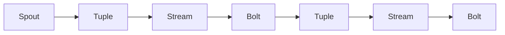

## 1.背景介绍

在大数据时代，实时计算框架的出现，让我们能够快速处理和分析海量数据。Storm是其中一种出色的实时计算框架，它被广泛应用于实时分析、在线机器学习、连续计算、分布式RPC、ETL等场景。本文将详细解析Storm的原理，并通过代码实例让你更好地理解和使用Storm。

## 2.核心概念与联系

Storm的核心概念包括四个部分：Tuple、Stream、Spout和Bolt。这四个部分相互关联，共同构成了Storm的基本运行框架。

- Tuple：是Storm数据处理的最基本单元，它是一个有序列表，包含一系列的元素。
- Stream：是由Tuple组成的一个无界序列，是Storm中数据流动的主要通道。
- Spout：是数据源，它可以发射多个Stream的Tuple到Topology（Storm的计算图）中。
- Bolt：负责数据处理和转发，它可以接收多个Stream的Tuple，处理后再发射给其他Bolt或者输出结果。

## 3.核心算法原理具体操作步骤

Storm的运行主要分为三个步骤：数据发射、数据处理和数据输出。

1.