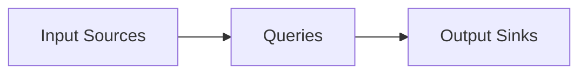

# Structured Streaming原理与代码实例讲解

## 1. 背景介绍

### 1.1 大数据流处理的发展历程
#### 1.1.1 批处理时代
#### 1.1.2 流处理的兴起
#### 1.1.3 流批一体化趋势

### 1.2 Structured Streaming 的诞生
#### 1.2.1 Spark Streaming 的局限性
#### 1.2.2 Structured Streaming 的设计理念
#### 1.2.3 Structured Streaming 的优势

## 2. 核心概念与联系

### 2.1 Structured Streaming 数据模型
#### 2.1.1 无界表(Unbounded Table)
#### 2.1.2 事件时间(Event Time)与处理时间(Processing Time)  
#### 2.1.3 Watermark

### 2.2 Structured Streaming 编程模型
#### 2.2.1 输入源(Input Sources)
#### 2.2.2 查询(Queries) 
#### 2.2.3 输出接收器(Output Sinks)

### 2.3 Structured Streaming 执行模型  
#### 2.3.1 微批处理(Micro-Batch Processing)
#### 2.3.2 连续处理(Continuous Processing)
#### 2.3.3 端到端 Exactly-Once 保证



## 3. 核心算法原理具体操作步骤

### 3.1 基于 Watermark 的窗口聚合
#### 3.1.1 滑动窗口(Sliding Window)
#### 3.1.2 滚动窗口(Tumbling Window) 
#### 3.1.3 会话窗口(Session Window)

### 3.2 状态存储与管理
#### 3.2.1 检查点(Checkpoint)机制
#### 3.2.2 状态存储后端
#### 3.2.3 状态恢复与迁移

### 3.3 Trigger 触发机制
#### 3.3.1 ProcessingTime Trigger
#### 3.3.2 EventTime Trigger
#### 3.3.3 OneTime Trigger

## 4. 数学模型和公式详细讲解举例说明

### 4.1 滑动窗口模型
- 滑动窗口可以表示为 $w = (l, r]$，其中 $l$ 和 $r$ 分别表示窗口的左右边界。
- 窗口长度为 $|w| = r - l$，滑动步长为 $s$。
- 对于时间 $t$，其所属窗口为 $w_t = (t - |w|, t]$。

### 4.2 Watermark 计算公式
- Watermark 定义为 $WM_t = t - \alpha$，其中 $\alpha$ 为最大允许的延迟时间。
- 对于窗口 $w = (l, r]$，如果 $WM_t > r$，则可以触发窗口的计算。

### 4.3 状态存储容错模型
- 状态存储可以抽象为一个 Key-Value 存储：$S = \{(k_1, v_1), (k_2, v_2), ...\}$。
- 检查点机制定期将状态持久化：$S_t \rightarrow S_{t+1}$。
- 发生故障时，可以从最近的检查点恢复状态：$S_{t-1} \rightarrow S_t$。

## 5. 项目实践：代码实例和详细解释说明

### 5.1 WordCount 示例
```scala
val lines = spark.readStream
  .format("socket")
  .option("host", "localhost")
  .option("port", 9999)
  .load()

val words = lines.as[String].flatMap(_.split(" "))

val wordCounts = words.groupBy("value").count()

val query = wordCounts.writeStream
  .outputMode("complete")
  .format("console")
  .start()

query.awaitTermination()
```
- 通过 `readStream` 从 Socket 源读取数据。
- 使用 `flatMap` 将每行数据拆分成单词。
- 使用 `groupBy` 和 `count` 对单词进行计数聚合。
- 通过 `writeStream` 将结果输出到控制台。

### 5.2 窗口聚合示例
```scala
val events = spark.readStream
  .format("kafka")
  .option("kafka.bootstrap.servers", "localhost:9092")
  .option("subscribe", "events")
  .load()
  .selectExpr("CAST(value AS STRING) as json")
  .select(from_json(col("json"), schema).as("data"))
  .select("data.*")

val windowedCounts = events
  .withWatermark("timestamp", "10 minutes")
  .groupBy(
    window($"timestamp", "10 minutes", "5 minutes"),
    $"type"
  )
  .count()

val query = windowedCounts.writeStream
  .outputMode("complete")
  .format("console")
  .start()

query.awaitTermination()
```
- 从 Kafka 源读取 JSON 格式的事件数据。
- 使用 `withWatermark` 定义 Watermark，允许最大延迟10分钟。
- 使用 `window` 函数定义滑动窗口，窗口长度为10分钟，滑动步长为5分钟。
- 按照窗口和事件类型进行分组计数。
- 将聚合结果输出到控制台。

## 6. 实际应用场景

### 6.1 实时日志分析
- 收集应用程序、服务器产生的日志数据。
- 对日志进行实时解析、过滤、聚合分析。
- 实时监控系统健康状态，及时发现和告警异常。

### 6.2 实时推荐系统
- 收集用户行为数据，如浏览、点击、购买等。
- 对用户行为数据进行实时分析，更新用户画像。
- 基于用户画像和商品特征，实时生成个性化推荐。

### 6.3 实时欺诈检测
- 收集交易、登录等实时数据。
- 对实时数据进行特征提取、模式识别。
- 实时识别异常交易、登录行为，防范欺诈风险。

## 7. 工具和资源推荐

### 7.1 官方文档
- [Structured Streaming Programming Guide](http://spark.apache.org/docs/latest/structured-streaming-programming-guide.html)
- [Structured Streaming Kafka Integration Guide](http://spark.apache.org/docs/latest/structured-streaming-kafka-integration.html)

### 7.2 学习资源
- [Databricks Structured Streaming 系列博客](https://databricks.com/blog/category/engineering/spark/structured-streaming)
- [Structured Streaming 源码解析](https://github.com/lw-lin/CoolplaySpark/tree/master/Structured%20Streaming)

### 7.3 开源项目
- [Spark Structured Streaming Examples](https://github.com/apache/spark/tree/master/examples/src/main/scala/org/apache/spark/examples/sql/streaming)
- [Structured Streaming 实战项目](https://github.com/phatak-dev/spark2.0-structured-streaming)

## 8. 总结：未来发展趋势与挑战

### 8.1 流批一体化趋势
- 统一的 API 和编程模型。
- 流批任务的无缝转换与集成。

### 8.2 端到端的 Exactly-Once 保证
- 跨系统、跨框架的端到端一致性。
- 支持更多的 Source 和 Sink。

### 8.3 低延迟的连续处理
- 毫秒级别的端到端延迟。
- 更细粒度的增量处理。

### 8.4 挑战与机遇
- 大状态的高效管理。
- 动态扩容与负载均衡。
- SQL 化与 AI 的深度融合。

## 9. 附录：常见问题与解答

### 9.1 Structured Streaming 与 Spark Streaming 的区别？
- Structured Streaming 是基于 Spark SQL 引擎构建的，而 Spark Streaming 是独立的流处理引擎。
- Structured Streaming 使用声明式的 DataFrame/Dataset API，Spark Streaming 使用底层的 DStream API。
- Structured Streaming 支持基于 Event Time 的窗口聚合和 Watermark 机制，Spark Streaming 仅支持基于 Processing Time 的窗口。

### 9.2 如何保证 Exactly-Once 语义？
- 在数据源端，需要支持重放和幂等写入。
- 在 Structured Streaming 内部，通过 Checkpoint 和 WAL 机制来保证状态的一致性。
- 在数据输出端，需要支持事务性写入或幂等写入。

### 9.3 Structured Streaming 支持哪些数据源和数据接收器？
- 支持的数据源包括：Kafka、HDFS/S3、Socket 等。
- 支持的数据接收器包括：Kafka、HDFS/S3、File、Console、Memory 等。
- 还支持自定义的数据源和数据接收器。

作者：禅与计算机程序设计艺术 / Zen and the Art of Computer Programming