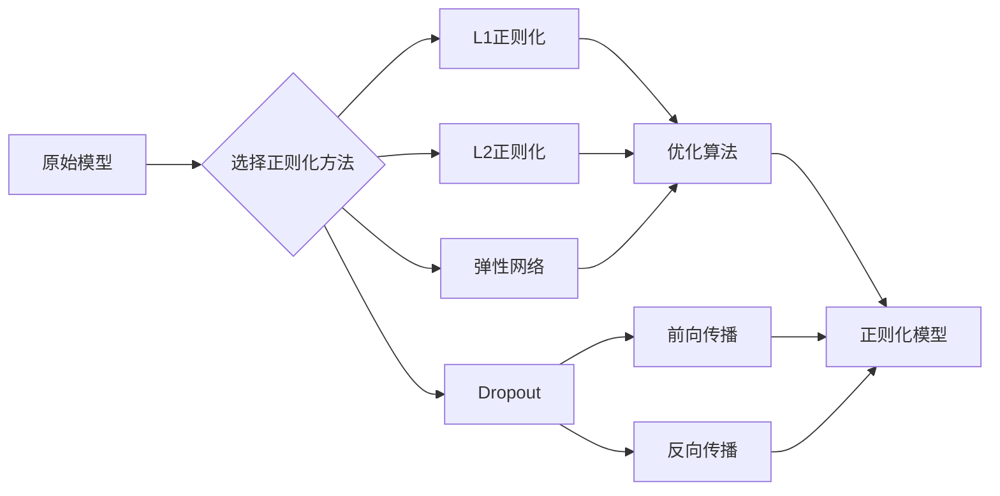

# Supervised Learning: Regularization Techniques

## 1. 背景介绍
### 1.1 监督学习概述
### 1.2 过拟合问题
#### 1.2.1 过拟合的定义
#### 1.2.2 过拟合的危害
#### 1.2.3 如何判断过拟合
### 1.3 正则化技术的必要性

## 2. 核心概念与联系
### 2.1 正则化的定义
### 2.2 正则化与过拟合的关系
### 2.3 常见的正则化技术
#### 2.3.1 L1正则化(Lasso)
#### 2.3.2 L2正则化(Ridge)
#### 2.3.3 弹性网络(Elastic Net)
#### 2.3.4 Dropout
### 2.4 正则化技术之间的联系与区别

## 3. 核心算法原理与具体操作步骤
### 3.1 L1正则化(Lasso)
#### 3.1.1 L1正则化的数学表达式
#### 3.1.2 L1正则化的几何解释
#### 3.1.3 L1正则化的优化算法
### 3.2 L2正则化(Ridge) 
#### 3.2.1 L2正则化的数学表达式
#### 3.2.2 L2正则化的几何解释
#### 3.2.3 L2正则化的优化算法
### 3.3 弹性网络(Elastic Net)
#### 3.3.1 弹性网络的数学表达式
#### 3.3.2 弹性网络的优化算法
### 3.4 Dropout
#### 3.4.1 Dropout的基本原理
#### 3.4.2 Dropout的前向传播
#### 3.4.3 Dropout的反向传播

## 4. 数学模型和公式详细讲解举例说明
### 4.1 L1正则化的数学模型与推导
### 4.2 L2正则化的数学模型与推导
### 4.3 弹性网络的数学模型与推导
### 4.4 Dropout的数学模型与推导

## 5. 项目实践：代码实例和详细解释说明
### 5.1 使用L1正则化的Logistic回归
### 5.2 使用L2正则化的线性回归
### 5.3 使用弹性网络的线性回归
### 5.4 在神经网络中使用Dropout

## 6. 实际应用场景
### 6.1 生物信息学中的基因选择
### 6.2 自然语言处理中的文本分类
### 6.3 计算机视觉中的图像识别
### 6.4 推荐系统中的特征选择

## 7. 工具和资源推荐
### 7.1 Scikit-learn
### 7.2 TensorFlow/Keras
### 7.3 PyTorch
### 7.4 正则化技术相关论文与书籍

## 8. 总结：未来发展趋势与挑战
### 8.1 正则化技术的研究现状
### 8.2 正则化技术面临的挑战
### 8.3 正则化技术的未来发展方向

## 9. 附录：常见问题与解答
### 9.1 如何选择合适的正则化方法？
### 9.2 正则化强度(λ)如何调节？
### 9.3 正则化技术能否结合使用？
### 9.4 正则化技术的局限性有哪些？

作者：禅与计算机程序设计艺术 / Zen and the Art of Computer Programming