# Swin Transformer原理与代码实例讲解

## 1.背景介绍

### 1.1 计算机视觉任务概述

计算机视觉是人工智能领域的一个重要分支,旨在使机器能够像人类一样理解和分析数字图像或视频。常见的计算机视觉任务包括图像分类、目标检测、语义分割、实例分割、人脸识别等。近年来,随着深度学习技术的不断发展,计算机视觉取得了令人瞩目的进展。

### 1.2 卷积神经网络的局限性

传统的卷积神经网络(CNN)在处理图像任务时表现出色,但也存在一些固有的局限性。CNN主要关注局部区域的特征提取,对于全局信息的捕获能力较弱。此外,CNN的计算效率也受到了一定的限制,特别是在处理高分辨率图像时,计算量和内存消耗都会急剧增加。

### 1.3 Transformer在视觉任务中的应用

Transformer最初被提出用于自然语言处理(NLP)任务,它采用了自注意力(Self-Attention)机制,能够有效地捕获长距离依赖关系。由于自注意力机制的优势,研究人员开始尝试将Transformer应用于计算机视觉任务。Vision Transformer(ViT)是将Transformer直接应用于图像的一种方式,它将图像分割为多个小块(Patch),并将每个小块线性映射为一个向量,作为Transformer的输入。

### 1.4 Swin Transformer的提出

尽管ViT取得了不错的性能,但它存在一些缺陷,例如计算复杂度高、对位移等变换不够鲁棒等。为了解决这些问题,微软亚洲研究院的研究人员提出了Swin Transformer,它在ViT的基础上引入了一种新的层次化注意力机制,能够在保持高效计算的同时,有效地捕获图像的局部和全局信息。

## 2.核心概念与联系

### 2.1 Transformer的自注意力机制

Transformer的核心是自注意力(Self-Attention)机制。自注意力机制允许输入序列中的每个元素都与其他元素进行交互,捕获它们之间的长距离依赖关系。这种机制不同于CNN中的局部卷积操作,能够更好地捕获全局信息。

在自注意力机制中,每个输入元素都会生成一个查询(Query)向量、一个键(Key)向量和一个值(Value)向量。查询向量会与所有键向量计算相似度得分,这些得分会经过softmax操作转换为注意力权重。然后,注意力权重会与对应的值向量相乘并求和,得到该输入元素的注意力表示。

### 2.2 Swin Transformer的层次化注意力机制

Swin Transformer在ViT的基础上引入了一种层次化的注意力机制,将图像分为多个窗口(Window),在窗口内计算自注意力,同时也在窗口之间计算注意力,从而捕获局部和全局信息。

具体来说,Swin Transformer将图像分割为多个非重叠的窗口,在每个窗口内计算自注意力,捕获局部特征。然后,它会在所有窗口之间计算注意力,捕获全局信息。为了提高计算效率,Swin Transformer采用了层次化的注意力机制,将注意力计算分为几个阶段进行,每个阶段只需要关注部分窗口之间的交互。

此外,Swin Transformer还引入了移位窗口(Shifted Window)的机制,通过在不同层之间移动窗口的位置,能够在一定程度上弥补窗口划分带来的信息丢失。

### 2.3 Swin Transformer的其他关键组件

除了层次化注意力机制,Swin Transformer还包含了一些其他关键组件,如下所示:

1. **Patch Merging(Patch合并)**: 用于减小特征图的分辨率,提高计算效率。
2. **Patch Splitting(Patch分割)**: 与Patch Merging相反,用于恢复特征图的分辨率。
3. **Patch Embedding(Patch嵌入)**: 将图像分割为多个Patch,并将每个Patch线性映射为一个向量。
4. **Relative Position Bias(相对位置偏置)**: 用于编码Patch之间的相对位置信息。
5. **MLP(多层感知机)**: 用于提供非线性映射,增强网络的表达能力。

这些组件与层次化注意力机制相结合,构成了Swin Transformer的完整架构。

## 3.核心算法原理具体操作步骤

### 3.1 Swin Transformer的整体架构

Swin Transformer的整体架构如下图所示:

```mermaid
graph TD
    subgraph SwinTransformer
        Input[输入图像] --> PatchEmbed[Patch Embedding]
        PatchEmbed --> SwinTransformerBlock1[Swin Transformer Block 1]
        SwinTransformerBlock1 --> PatchMerge1[Patch Merging]
        PatchMerge1 --> SwinTransformerBlock2[Swin Transformer Block 2]
        SwinTransformerBlock2 --> PatchMerge2[Patch Merging]
        PatchMerge2 --> SwinTransformerBlock3[Swin Transformer Block 3]
        SwinTransformerBlock3 --> PatchMerge3[Patch Merging]
        PatchMerge3 --> SwinTransformerBlock4[Swin Transformer Block 4]
        SwinTransformerBlock4 --> PatchSplit1[Patch Splitting]
        PatchSplit1 --> SwinTransformerBlock5[Swin Transformer Block 5]
        SwinTransformerBlock5 --> PatchSplit2[Patch Splitting]
        PatchSplit2 --> SwinTransformerBlock6[Swin Transformer Block 6]
        SwinTransformerBlock6 --> PatchSplit3[Patch Splitting]
        PatchSplit3 --> Output[输出特征图]
    end
```

上图展示了Swin Transformer的整体架构。首先,输入图像经过Patch Embedding模块,将图像分割为多个Patch,并将每个Patch线性映射为一个向量。然后,这些向量会依次通过多个Swin Transformer Block,每个Block包含层次化注意力机制和MLP模块。

在前几个Swin Transformer Block之后,会进行Patch Merging操作,将相邻的Patch合并,从而减小特征图的分辨率,提高计算效率。在后几个Swin Transformer Block之前,会进行Patch Splitting操作,将合并后的Patch分割开,恢复特征图的分辨率。

最终,经过多个Swin Transformer Block的处理,输出一个高维的特征图,可用于各种计算机视觉任务,如分类、检测、分割等。

### 3.2 层次化注意力机制的具体操作步骤

层次化注意力机制是Swin Transformer的核心,它分为以下几个步骤:

1. **窗口划分**: 将输入特征图分割为多个非重叠的窗口(Window)。

2. **窗口内自注意力**: 对于每个窗口,计算窗口内所有Patch之间的自注意力,捕获局部特征。具体操作如下:

   - 将每个Patch线性映射为查询(Query)向量、键(Key)向量和值(Value)向量。
   - 计算查询向量与所有键向量之间的相似度得分,并通过softmax操作转换为注意力权重。
   - 将注意力权重与对应的值向量相乘并求和,得到该Patch的注意力表示。

3. **窗口间注意力**: 在所有窗口之间计算注意力,捕获全局信息。为了提高计算效率,Swin Transformer采用了层次化的注意力机制,将注意力计算分为几个阶段进行。

   - 第一阶段,计算相邻窗口之间的注意力。
   - 第二阶段,计算每个窗口与其对角线方向的窗口之间的注意力。
   - 第三阶段,计算所有窗口之间的注意力。

   在每个阶段,注意力计算的步骤与窗口内自注意力类似,只是计算的对象变为了不同的窗口之间。

4. **移位窗口**: 为了进一步增强模型的表达能力,Swin Transformer在不同层之间采用了移位窗口(Shifted Window)的机制。具体来说,在奇数层,窗口的位置会相对于偶数层进行移位,从而弥补窗口划分带来的信息丢失。

通过上述步骤,Swin Transformer能够有效地捕获图像的局部和全局信息,同时保持较高的计算效率。

## 4.数学模型和公式详细讲解举例说明

### 4.1 自注意力机制的数学表示

自注意力机制是Transformer的核心,它能够捕获输入序列中元素之间的长距离依赖关系。对于一个长度为N的输入序列$X = (x_1, x_2, \dots, x_N)$,自注意力的计算过程可以表示为:

$$
\begin{aligned}
Q &= XW^Q \\
K &= XW^K \\
V &= XW^V \\
\text{Attention}(Q, K, V) &= \text{softmax}\left(\frac{QK^T}{\sqrt{d_k}}\right)V
\end{aligned}
$$

其中,

- $W^Q, W^K, W^V$分别是查询(Query)、键(Key)和值(Value)的线性映射矩阵。
- $d_k$是缩放因子,用于防止内积值过大导致softmax函数的梯度较小。
- $\text{softmax}(\cdot)$是softmax函数,用于将相似度得分归一化为概率分布。

在Swin Transformer中,自注意力机制被应用于每个窗口内部,以及窗口之间的交互。

### 4.2 相对位置编码

由于自注意力机制本身并不能捕获元素之间的位置信息,因此Swin Transformer引入了相对位置编码(Relative Position Bias)的机制。具体来说,对于每对Patch之间的相对位置$(i, j)$,定义一个相对位置编码向量$R_{i,j}$,将其添加到对应的注意力得分中:

$$
\text{Attention}(Q, K, V) = \text{softmax}\left(\frac{QK^T}{\sqrt{d_k}} + B\right)V
$$

其中,$B$是相对位置编码矩阵,其中$B_{i,j} = R_{i,j}$。这种方式能够有效地编码Patch之间的相对位置信息,提高模型的表达能力。

### 4.3 移位窗口的数学表示

为了弥补窗口划分带来的信息丢失,Swin Transformer在不同层之间采用了移位窗口(Shifted Window)的机制。具体来说,在奇数层,窗口的位置会相对于偶数层进行移位。

设$H, W$分别为特征图的高度和宽度,$M, N$为窗口的高度和宽度,那么在奇数层,窗口的移位量可以表示为:

$$
\begin{aligned}
\Delta_h &= \frac{M}{2} \\
\Delta_w &= \frac{N}{2}
\end{aligned}
$$

在偶数层,窗口的位置保持不变。通过这种方式,Swin Transformer能够在一定程度上弥补窗口划分带来的信息丢失,提高模型的表达能力。

### 4.4 层次化注意力机制的数学表示

层次化注意力机制是Swin Transformer的核心创新之一,它将注意力计算分为几个阶段进行,从而提高了计算效率。具体来说,对于一个$H \times W$的特征图,被划分为$M \times N$个窗口,层次化注意力机制的计算过程可以表示为:

1. **窗口内自注意力**:

   对于每个窗口$w_{i,j}$,计算窗口内所有Patch之间的自注意力,得到注意力表示$A_{i,j}$。

2. **窗口间注意力**:

   - 第一阶段,计算相邻窗口之间的注意力:

     $$
     A'_{i,j} = \text{Attention}\left(A_{i,j}, \bigcup_{(k,l) \in \mathcal{N}(i,j)} A_{k,l}, \bigcup_{(k,l) \in \mathcal{N}(i,j)} A_{k,l}\right)
     $$

     其中,$\mathcal{N}(i,j)$表示窗口$(i,j)$的相邻窗口集合。

   - 第二阶段,计算每个窗口与其对角线方向的窗口之间的注意力:

     $$
     A''_{i,j} = \text{Attention}\left(A'_{i,j}, \bigcup_{(k,l) \in \mathcal{D}(i,j)} A'_{k,l}, \