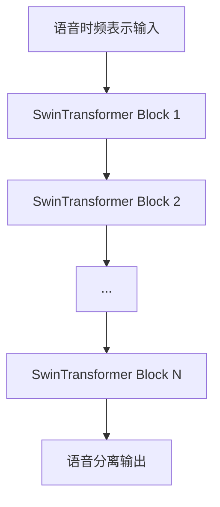

# SwinTransformer在语音分隔任务中的应用

## 1.背景介绍

### 1.1 语音分隔的重要性

在日常生活和专业领域中,语音信号通常是混合的,包含多个声源的语音。语音分隔旨在从混合语音信号中分离出每个独立的语音源。语音分隔技术在各个领域都有广泛的应用,例如:

- 会议录音分析:分离出每个与会者的发言
- 手机语音助手:在嘈杂环境中准确识别用户语音
- 机器人交互:分离人类语音和环境噪音
- 音频编辑:从混音中分离出独立的声部

传统的语音分隔方法主要基于盲源分离(BSS)和掩蔽,但这些方法在处理复杂混合语音时存在局限性。近年来,基于深度学习的语音分隔方法取得了突破性进展,展现出强大的分离能力。

### 1.2 Transformer在语音分隔中的作用  

Transformer是一种全新的基于注意力机制的神经网络架构,最初被提出用于自然语言处理任务。由于其出色的长期依赖性建模能力,Transformer很快被引入到语音处理领域。语音分隔任务中,Transformer可以更好地捕捉语音信号的长期时间依赖关系,从而提高分离质量。

然而,标准的Transformer架构是为序列数据设计的,无法直接处理二维的语音时频表示。为了解决这个问题,研究人员提出了各种改进的Transformer变体,旨在更好地处理二维时频表示,其中SwinTransformer就是一种创新方法。

## 2.核心概念与联系

### 2.1 SwinTransformer概述

SwinTransformer是2021年提出的一种新型Transformer架构,旨在高效处理二维图像数据。它的核心思想是将图像划分为若干个窗口(Window),在每个窗口内计算自注意力,然后通过窗口间的位移注意力(Shifted Window Attention)来建模跨窗口的长程依赖关系。

SwinTransformer借鉴了CNN中的层次化思想,将图像分层处理。在较低层次,模型关注局部窗口内的细节;在较高层次,模型通过位移注意力来整合全局信息。这种分而治之的策略使SwinTransformer在保持全局建模能力的同时,大幅降低了计算复杂度。

### 2.2 SwinTransformer在语音分隔中的应用

虽然SwinTransformer最初是为计算机视觉任务设计的,但它同样适用于二维的语音时频表示。将语音信号转换为二维时频图后,就可以将SwinTransformer应用于语音分隔任务。

具体来说,SwinTransformer可以更好地捕捉语音信号中的长期时间依赖关系和频率模式,从而提高语音分离的质量和稳健性。与标准Transformer相比,SwinTransformer的层次化注意力机制使其能够更高效地处理长时间序列,同时降低了计算开销。

此外,SwinTransformer具有平移不变性,这对于处理语音信号非常重要。因为语音信号在时间和频率上都可能发生平移,而SwinTransformer可以很好地应对这种平移变化。

### 2.3 SwinTransformer与其他语音分隔方法的关系

除了SwinTransformer,还有其他一些基于Transformer的语音分隔方法,如Dual-Path Transformer、Conv-Transformer等。它们都试图通过改进Transformer架构来更好地处理二维时频表示。

与这些方法相比,SwinTransformer的优势在于其层次化注意力机制和计算高效性。层次化注意力有助于捕捉不同尺度的依赖关系,而高效的计算则使SwinTransformer能够应用于实时语音分隔任务。

另一方面,一些基于卷积神经网络(CNN)的语音分隔方法(如ConvTasNet)也取得了不错的成绩。CNN擅长捕捉局部模式,而Transformer则擅长建模长期依赖关系。因此,将CNN和Transformer相结合有望进一步提升语音分隔性能。

## 3.核心算法原理具体操作步骤

### 3.1 SwinTransformer架构概览

SwinTransformer的整体架构如下图所示:

SwinTransformer由多个SwinTransformer Block组成,每个Block包含以下几个主要模块:

1. **窗口划分(Window Partitioning)**:将输入的二维时频表示划分为多个窗口。
2. **窗口注意力(Window Attention)**:在每个窗口内计算自注意力,捕捉局部依赖关系。
3. **位移窗口注意力(Shifted Window Attention)**:通过窗口位移来建模跨窗口的长程依赖关系。
4. **窗口合并(Window Reverse)**:将处理后的窗口合并为完整的时频表示。

下面我们详细介绍每个模块的工作原理和具体操作步骤。

### 3.2 窗口划分(Window Partitioning)

窗口划分是SwinTransformer的基础操作。它将输入的二维时频表示$X \in \mathbb{R}^{F \times T}$划分为多个不重叠的窗口,每个窗口大小为$M \times M$。具体操作步骤如下:

1. 计算窗口数量:$H = \lfloor \frac{F}{M} \rfloor, W = \lfloor \frac{T}{M} \rfloor$
2. 将$X$分割为$H \times W$个窗口,记为$\{x_{h,w} \in \mathbb{R}^{M \times M}\}_{h=1,w=1}^{H,W}$

通过窗口划分,SwinTransformer可以在每个窗口内计算自注意力,从而高效地捕捉局部依赖关系。

### 3.3 窗口注意力(Window Attention)

在每个窗口内,SwinTransformer计算自注意力以捕捉局部依赖关系。具体操作步骤如下:

1. 对每个窗口$x_{h,w}$进行投影,得到查询(Query)、键(Key)和值(Value):
   $$
   q_{h,w} = x_{h,w} W_q, k_{h,w} = x_{h,w} W_k, v_{h,w} = x_{h,w} W_v
   $$
   其中$W_q, W_k, W_v$是可学习的投影矩阵。

2. 计算每个窗口内的自注意力:
   $$
   \text{Attention}(q_{h,w}, k_{h,w}, v_{h,w}) = \text{Softmax}(\frac{q_{h,w} k_{h,w}^T}{\sqrt{d}})v_{h,w}
   $$
   其中$d$是特征维度,用于缩放点积注意力。

3. 将注意力结果与输入$x_{h,w}$相加,得到每个窗口的更新表示$\hat{x}_{h,w}$。

通过窗口注意力,SwinTransformer可以捕捉每个窗口内的局部依赖关系,为后续的跨窗口建模奠定基础。

### 3.4 位移窗口注意力(Shifted Window Attention)

为了建模跨窗口的长程依赖关系,SwinTransformer引入了位移窗口注意力机制。具体操作步骤如下:

1. 对窗口进行位移:将每个窗口$x_{h,w}$沿水平和垂直方向分别移动$\lfloor \frac{M}{2} \rfloor$个位置,得到位移后的窗口$\tilde{x}_{h,w}$。
2. 在位移后的窗口上计算注意力,方法与窗口注意力相同:
   $$
   \tilde{q}_{h,w} = \tilde{x}_{h,w} W_q, \tilde{k}_{h,w} = \tilde{x}_{h,w} W_k, \tilde{v}_{h,w} = \tilde{x}_{h,w} W_v \\
   \text{Attention}(\tilde{q}_{h,w}, \tilde{k}_{h,w}, \tilde{v}_{h,w}) = \text{Softmax}(\frac{\tilde{q}_{h,w} \tilde{k}_{h,w}^T}{\sqrt{d}})\tilde{v}_{h,w}
   $$
3. 将位移窗口注意力的结果与原始窗口表示$x_{h,w}$相加,得到更新后的窗口表示$\hat{x}_{h,w}^{\prime}$。

通过位移窗口注意力,SwinTransformer可以建模跨窗口的长程依赖关系,从而捕捉语音信号中的全局模式。位移操作使得每个窗口都能够关注其他窗口的信息,实现了有效的信息整合。

### 3.5 窗口合并(Window Reverse)

经过窗口注意力和位移窗口注意力的处理后,SwinTransformer需要将分散的窗口表示合并为完整的时频表示。具体操作步骤如下:

1. 将所有窗口的更新表示$\{\hat{x}_{h,w}^{\prime}\}$拼接为一个完整的时频表示$\hat{X}^{\prime}$。
2. 对$\hat{X}^{\prime}$进行逐元素求和,得到最终的输出表示$Y$。

通过窗口合并,SwinTransformer可以将分散的局部信息和全局信息整合为一个完整的时频表示,为后续的语音分隔任务提供有力支持。

## 4.数学模型和公式详细讲解举例说明

在上一节中,我们介绍了SwinTransformer的核心算法原理和具体操作步骤。现在,我们将更加深入地探讨SwinTransformer的数学模型和公式,并通过具体示例来加深理解。

### 4.1 注意力机制(Attention Mechanism)

注意力机制是Transformer的核心,也是SwinTransformer的基础。它允许模型动态地聚焦于输入序列的不同部分,并根据当前任务的需求分配不同的注意力权重。

在SwinTransformer中,注意力机制的计算公式如下:

$$
\text{Attention}(Q, K, V) = \text{Softmax}(\frac{QK^T}{\sqrt{d_k}})V
$$

其中:

- $Q$是查询(Query)矩阵,表示当前需要关注的部分。
- $K$是键(Key)矩阵,表示输入序列的不同部分。
- $V$是值(Value)矩阵,表示输入序列的实际值。
- $d_k$是缩放因子,用于防止较深层次的点积注意力过大或过小。

注意力权重$\text{Softmax}(\frac{QK^T}{\sqrt{d_k}})$表示查询$Q$与每个键$K$的相关性,通过Softmax函数归一化为概率分布。然后,注意力权重与值$V$相乘,得到加权求和的注意力输出。

让我们通过一个简单的示例来说明注意力机制的工作原理。假设我们有一个长度为5的输入序列$X = [x_1, x_2, x_3, x_4, x_5]$,其中每个$x_i$是一个向量。我们希望根据查询向量$q$来计算注意力输出。

1. 首先,我们需要将输入序列$X$投影到查询、键和值空间,得到$Q, K, V$:

   $$
   Q = q W_q, K = XW_k, V = XW_v
   $$

   其中$W_q, W_k, W_v$是可学习的投影矩阵。

2. 接下来,我们计算查询$Q$与每个键$K$的点积,并除以缩放因子$\sqrt{d_k}$:

   $$
   \text{scores} = \frac{QK^T}{\sqrt{d_k}} = \begin{bmatrix}
   q \cdot k_1 & q \cdot k_2 & q \cdot k_3 & q \cdot k_4 & q \cdot k_5
   \end{bmatrix}^T
   $$

   其中$\cdot$表示向量点积运算。

3. 对scores应用Softmax函数,得到注意力权重:

   $$
   \text{weights} = \text{Softmax}(\text{scores}) = \begin{bmatrix}
   w_1 & w_2 & w_3 & w_4 & w_5
   \end{bmatrix}
   $$

   其中